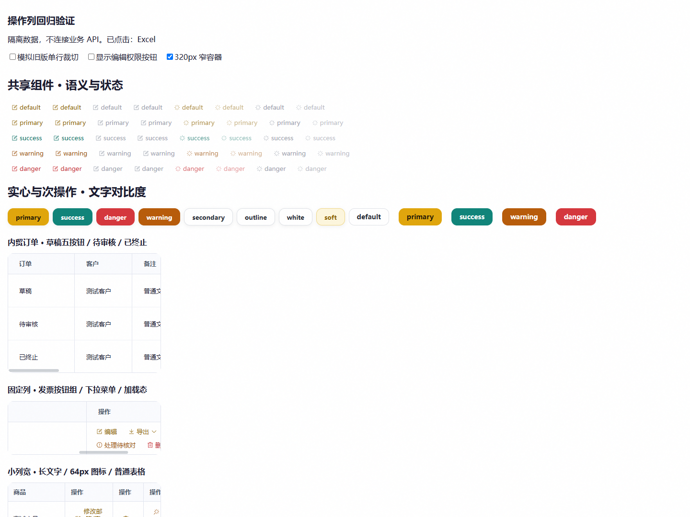
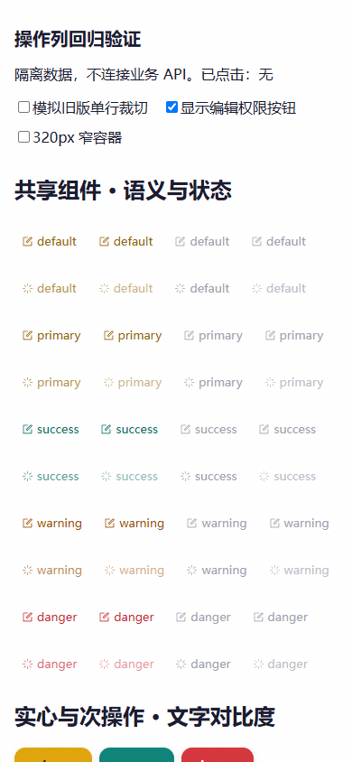

# 操作列与按钮统一修复验收

日期：2026-10-02。分支：`codex/action-button-consistency`，基点：`6d815065`。

## 结论

已更新 [DESIGN.md](../../DESIGN.md) 和 [按钮设计契约](../requirements/2026-10-02-action-button-design.md)，并修复上轮巡检发现的操作列与共享按钮问题。本报告记录修复与本地验收；应用已合并推送并生产发布，实际版本、目标及核验见[生产发布记录](2026-10-02-action-button-release.md)。

## 覆盖与改动

- 源码全量扫描主站364个Vue文件，识别119个标准操作/处理列、89个页面/组件模板、272个直接按钮（203 GlassButton、69 Element Plus）和3处 CommissionExportMenu。32个业务数据/备注/操作记录字段不当作操作列改造。PM任务表另行核对。
- 补齐64个缺失图标；3处操作列实心/描边改为link，展开卡片的分类打印也改为link；物流删除去掉内联颜色，接入danger tone。
- 支持 GlassButton warning；28处明确动作的语义色对齐（启停、通过、驳回、发布、终止、查看进度等）。业务条件、事件和权限保持原样。
- 主站与PM统一按钮token；link默认深金、成功青碧、提醒杏橙、危险绯红；13px文字、24px桌面最小高度、44px触屏目标、0圆角/边框、无阴影/按压缩放。
- 实心主操作改为亮金底深墨字；成功/危险/警告底色加深至正常、hover、active文字对比度≥4.5:1。次操作与soft的hover/active改用深色文字。
- EP通用实心focus/active规则排除link/text，解决点击后保留实心强调和active颜色优先级；加载隐藏原slot前缀图标，只保留旋转图标，显式disabled优先。

## 验证证据

| 验证 | 实际结果 |
|---|---|
| 修复前静态负例 | 64缺图标、3非link、1内联色，回归检查确实失败 |
| `node --test frontend/tests/tableActions.test.mjs frontend/tests/sharedUi.test.mjs` | 7/7通过；119列/272直接按钮+复用导出触发器；token parity、对比度、点击/禁用/加载 |
| 全量源模板提取的隔离浏览器审计 | 289案例（动态tone展开及3导出触发器）；384计算样式观察；所有来源按钮13px、0圆角、无阴影、最小24px；GB/EP四语义及默认各状态一致；PM danger与主站一致；无页面脚本错误 |
| `python frontend/tests/actionButtons.browser.py --url http://127.0.0.1:4333/layout.html --screenshots tmp/action-column-audit` | 139状态/对比度观察通过；真实图标、单个加载图标、disabled+loading、键盘轮廓、点击后移出、普通/窄容器、390px触屏、权限切换、导出菜单选择通过 |
| 改前/改后Vue AST与脚本比对 | 43个修改的业务模板：脚本、事件、权限、v-if/v-for、loading/disabled绑定不变（忽略换行格式） |
| 主站 `npm run build` | 通过，113导航入口；既有动态/静态混用导入及大chunk提示仍在 |
| PM `npm run build` | 通过；锁文件安装独立依赖后构建，未改依赖声明/锁文件 |
| `python scripts/check_conventions.py` | 增量无违规，UI债务基线不变 |
| `git diff --check` | 通过 |
| `python scripts/git_sweep.py --no-fetch` | 执行完成，本地快照；其他工作树、stash、无upstream旧分支保留 |
| 独立agent审查 | 指出的EP focus残留、次按钮浅底文字对比度已修复并复核通过 |

浏览器使用实际组件、CSS与源模板参数，在隔离页面运行；动态行文案部分使用占位文字，未登入逐页操作生产数据，也未触发业务API写请求。权限/下拉等交互使用独立验证夹具；不把组件验证称为所有业务页面端到端验证。

## 预览与可复验材料

- [完整按钮源清单](assets/2026-10-02-action-button-inventory.csv)
- [浏览器回归脚本](../../frontend/tests/actionButtons.browser.py)，夹具：[TableActions.vue](../../frontend/tests/fixtures/table-actions/TableActions.vue)、[ButtonStates.vue](../../frontend/tests/fixtures/table-actions/ButtonStates.vue)。在Vite服务下访问 `/tests/fixtures/table-actions/`，不连接业务API。
- 全量提取清单、计算样式JSON、构建日志和巡检快照保留于本工作树 `tmp/action-column-audit/`；一次性修改脚本已清理。

### 桌面

### 390px触屏

