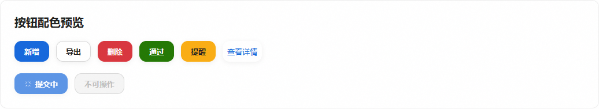

# 中后台按钮配色调整

状态：应用提交 `98eb7c1828d37f5f8004f659513daecf03dfbc8b` 已合并推送 main，并完成办公室与云端统一发布。

## 结果与依据

共享 GlassButton、Element Plus、PM `.btn-*` 与中后台独立操作按钮统一采用蓝色主操作、白底灰边次操作及语义色。参考 [Ant Design Button](https://ant.design/components/button) 与 [Ant Design Pro 默认主题](https://github.com/ant-design/ant-design-pro/blob/master/config/defaultSettings.ts) 的蓝色方向。Ant 默认 `#1677ff` 与白字约 4.10:1；项目按钮字号通常 13px，因此采用更深蓝色 `#1668dc`，白字约 5.19:1。

| 调整前 | 调整后 | 原因及对用户的影响 |
| --- | --- | --- |
| 主操作金色渐变，主站、登录、聊天与 PM 各自配色 | 蓝色实心白字；hover/active 同色族 | 主操作识别一致，弱化装饰性渐变与彩色外发光 |
| 次操作透明白、金色 hover 边框 | 白底灰边，蓝色交互反馈 | 主次层级清楚 |
| 操作列文字为金色 | 常规蓝字；危险红字、成功绿字 | 行内操作和工具栏表达一致 |
| 危险/成功/提醒/信息多套渐变 | 红、绿、琥珀、蓝实心 | 语义稳定；琥珀按钮用深色文字保证对比度 |
| 禁用通过降透明度/去色；部分 hover 恢复旧色 | 灰底灰字灰边；文字/ghost 保持透明 | 禁用态稳定，加载保留原变体及重复点击保护 |

## 覆盖与边界

- 主站：11 个 GlassButton 变体与 link tones；Element Plus 的 solid/plain/text/link、空默认 type、focus/disabled/loading；登录与欢迎、聊天、图片工作室加载更多、物流/发货、任务创建、售后、知识工具栏、收藏/点赞及工作台重试等独立操作。
- PM：共享默认/primary/accent/ghost/danger 按钮、入口提交、评论回复/删除/重试。
- 主站与 PM 分别在自己的 `tokens.css` 中维护 `--button-*`，不增加运行时依赖；保留尺寸、圆角、权限和点击业务接口。
- 品牌金、状态标签、表单及导航色独立保留；展会 kiosk、外部客户门户与生产大屏的专属场景按已有规范保持。没有把状态/菜单/内容选择控件统一当作操作按钮处理。

## 实际验证

- 主站最终 `npm run build` 通过，3364 模块、113 项导航；现有大 chunk 与 auth store 导入提示保留，未扩展到无关打包重构。
- PM `npm run build` 通过。最后的 ghost 禁用 hover 修复又单独重建 PM。
- `node --test frontend/tests/sharedUi.test.mjs frontend/tests/tableActions.test.mjs`：4/4，通过状态字典、响应式详情、颜色对比度与 119 个操作列约束。既有对比度测试扩展覆盖蓝/红/绿实心三状态及琥珀深字，未弱化旧断言。
- 实际 Chrome：317 项 computed-style 观测，覆盖桌面/390px、基础/hover/active/键盘 focus、禁用/加载、语义 link、真实登录与 PM 入口。Space 无 hover 按压确认蓝色 active 生效；减少动态效果下无位移，全局 transition 为 0.00001s（小于 1ms）。GlassButton 正常点击有效，disabled/loading 不发出 click。
- 独立审查发现并修复 Element Plus selector 优先级、空默认 type、焦点回退金色、GlassButton 仅 active 配色、PM ghost 禁用 hover 及局部覆盖问题；最后 PM 20 项浏览器复核确认所有禁用按钮的底色、文字和边框不受 hover 改变。
- 严格约定检查、UI 门禁、`git diff --check` 通过。UI 债务基线仅降低本次清除的裸色计数。
- `git_sweep.py --no-fetch` 作为本地快照巡检，不执行远端写入或清理其他代理分支。

浏览器访问的 `/api/` 请求均由离线拦截处理，未提交登录或业务写入；这里验证按钮呈现与既有前端点击保护，不代表生产登录/API 集成测试。详细 JSON、矩阵截图、审查与构建日志在分支交付后保留于主目录 `.deploy_state/button-colors-delivery/evidence/`。

## 生产发布

统一 `deploy/deploy.bat` 固定应用提交 `98eb7c1828d37f5f8004f659513daecf03dfbc8b`，先准备再正式发布，退出0；`release_id=9a04e62e81fd4995aa75c60e7cb95ca8`，范围 `office-and-cloud`，`deferred=[]`。办公室、北京后端、两地主站与已登记 PM/客户素材静态目标完成验证；数据库仍 `173_task_center`，无迁移。出库回执 `verified`，调度保持原状态。额外 24 次 HTTPS 检查确认两地主站及 `pm.leshine.work` 的入口、主脚本/CSS及登录页资源逐项匹配候选 SHA256；三站按钮 token 已验证，两地主站及办公室 health 为 `ok/connected`。

主目录原有15个无关文件指纹及交接文档其他内容保持一致；详细发布、公开资源核验与恢复材料保存在 `.deploy_state/button-colors-delivery/`。本段为发布后的文档记录，未作为新的应用版本发布。
