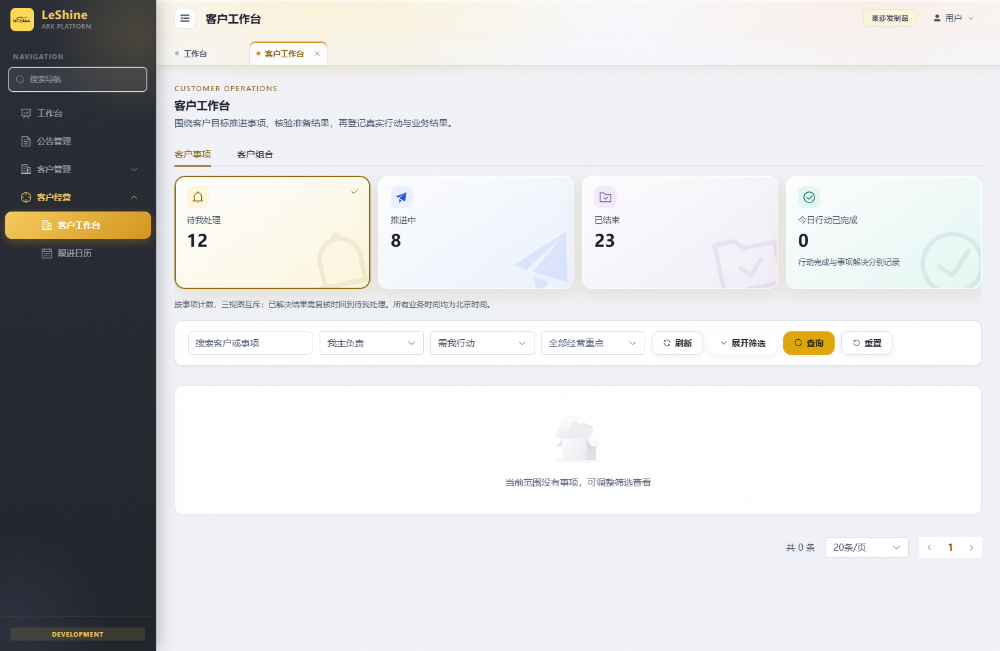
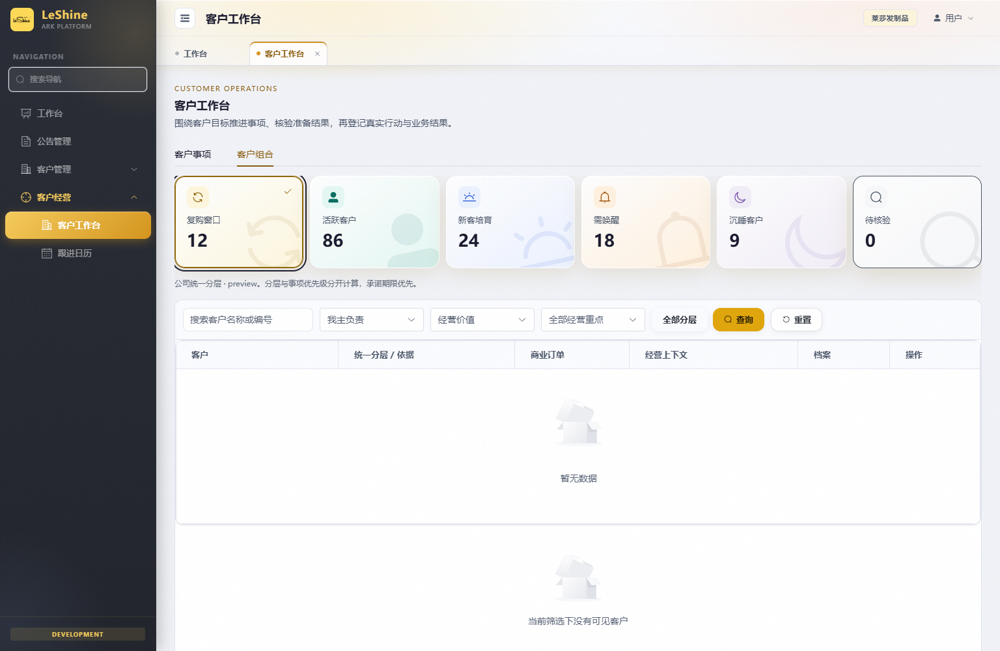
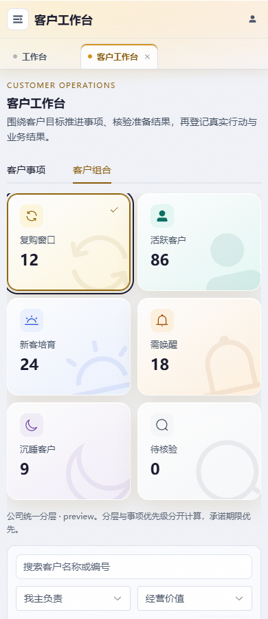

# 客户工作台看板卡片样式验收（2026-10-02）

## 交付范围

- 分支 `codex/customer-board-style`，基点 `b84dc534`；独立工作树 `C:/Users/windb/.codex/worktrees/customer-board-style/commission-system`。2026-10-02 完成验收，2026-10-03 根据授权将应用提交 `059302c3` 无冲突合入 main；本次未部署。
- 客户事项 4 卡、客户组合 6 卡统一使用 `OverviewMetricCard.vue`，对齐订单发票页的浅色渐变、语义 SVG 图标和右下淡水印。可筛选卡保留 button、原点击事件和 `aria-pressed`，新增同色选中边框与勾选标记；今日行动已完成保持纯统计展示。
- 卡片图层隔离、装饰对辅助技术隐藏、水印不捕获点击；6 卡在中等屏幕改为 3 列，手机 2 列。没有更改 API、计数口径、权限、事项状态或数据模型。
- `DESIGN.md` 的「看板概览卡片」新增全局样式要求、语义映射、交互与响应式验收，替换旧的笼统 Metric card 描述。

## 验证证据

- `npm run build`：通过，3366 模块、113 条导航；保留现有大 chunk / 混合静动态 import 提示。首次发现主目录依赖缺少 `.bin` 与 `@babel/parser`，已解除本任务依赖链接，在任务工作树执行锁文件 `npm ci --no-audit --no-fund` 后通过，未修改主目录依赖或锁文件。
- `node --test frontend/tests/customerWorkbenchV2.test.mjs`：13/13 通过。
- Chrome 实际页面：9 组渲染检查 + 独立触屏上下文通过；桌面 1536px、中屏 900px、手机 390px / 320px；每卡独立渐变、SVG 图片、水印透明度 / 裁切 / 指针穿透核对通过。所有 API 都拦截为隔离样例数据，无真实业务请求、无写操作，JS 异常为 0。
- 行为：9 个筛选按钮保留请求参数；Enter / Space 激活、单选标记、键盘焦点、清除分层筛选、0 / 缺失值 / 15 位数字均通过。静态统计卡仍为 div。普通动效、减少动态、触屏 tap 均无位移。
- `python scripts/check_conventions.py`：增量约定与 UI 门禁通过；`git diff --check` 通过。`python scripts/git_sweep.py --no-fetch` 为本地快照，未 fetch / push / 合并 / 清理他人分支。
- 独立一轮自查：对照模板、脚本和样式 diff，核验计算表达式、监听器、权限及 API 原样保留；重复图标装饰不进入读屏名称。水印按设计越过卡片边缘后裁切，因此溢出检查针对可读文字边界和网格宽度，不把装饰图形的 scrollWidth 当作页面横向溢出。

## 合并验证（2026-10-03）

- 合并前 fetch origin，main 与 origin/main 同步；在主目录 fast-forward 合入本任务提交，未改动其他分支。
- 合并后前端源码与 DESIGN.md 和验收分支完全一致，复用已通过的构建与浏览器证据；事项 Node 测试重新执行 13/13 通过，`python scripts/check_conventions.py --base b84dc534` 覆盖本次完整差异并通过。
- 主目录原有 23 个工作文件建立 SHA-256 快照；交接文档先单文件暂存以避开其他未提交内容，合并后恢复。推送目标为 origin/main，未执行生产部署。

## 预览（隔离样例数据）

