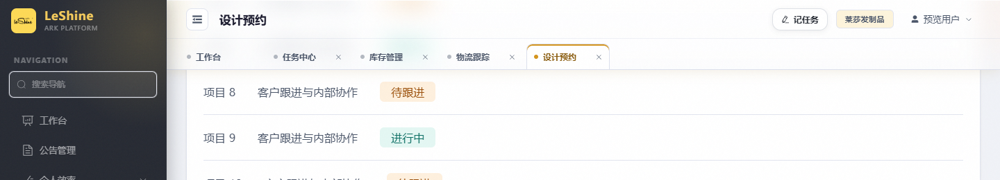
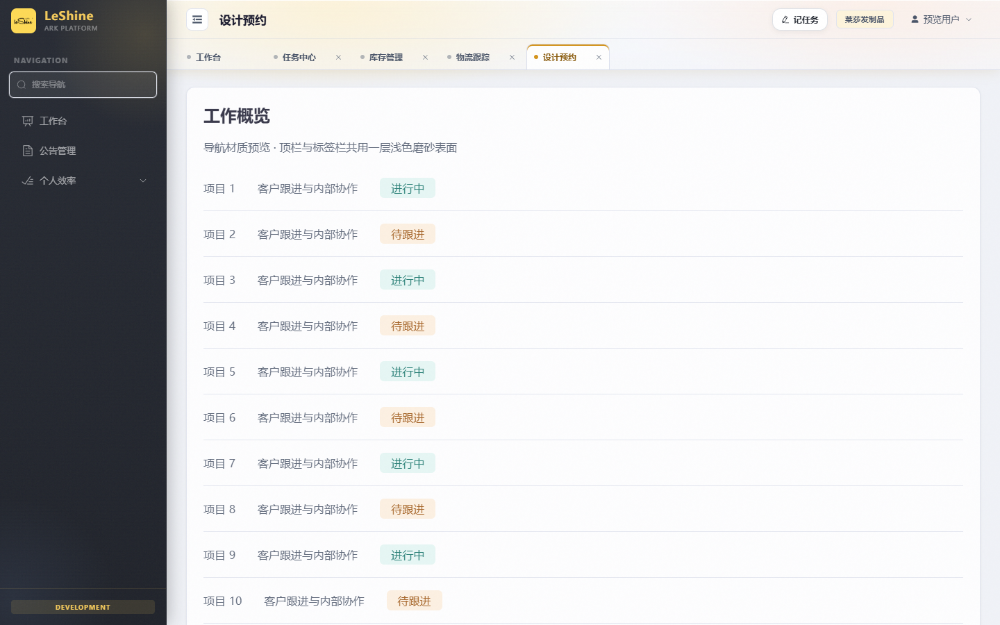
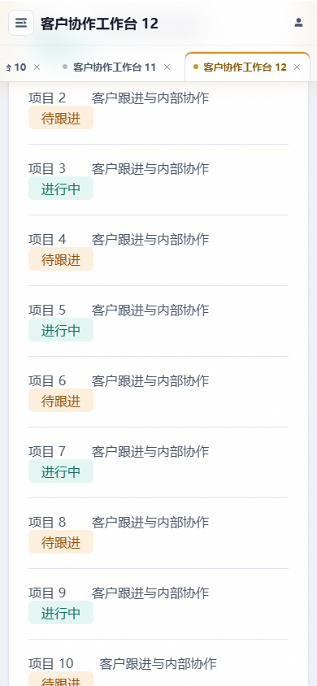

# 顶栏与标签栏毛玻璃验收

## 结果与范围

已在 `codex/navigation-glass` 完成实现，原开发基点 `217b11bb`，整合到最新 main `398a8e62` 后提交 `1c6130853beda46b20390276c8e9bc323f906fc3`，已合并、推送并部署。详见[发布记录](2026-10-02-navigation-glass-release.md)。

参考 [shadcn-admin Header 源码](https://github.com/satnaing/shadcn-admin/blob/main/src/components/layout/header.tsx)：该项目固定顶栏在滚动超过阈值后叠加半透明底色、背景模糊与阴影。借鉴材质做法，保留本项目 Vue / Element Plus、品牌金与导航结构。

- 顶栏与标签栏共用单一玻璃外层：白色 0.58 → 0.38 渐变、16px 模糊、1.4 饱和度、淡分隔线及轻阴影。
- 首版背景过淡且正文滚动区与导航分离，模糊实际只有静态 wash 可采样，用户反馈看不出效果。已改为导航覆盖正文滚动区，让内容实际从玻璃后方滚过，降低白底不透明度并增强静态浅金 / 蜜桃底色；没有滚动监听、持续动画、卡片或表格模糊。
- 正文首屏 padding / scroll-padding 扣出 101px 导航高度；共享独立工具栏、提成标签头、回款同步卡、素材筛选 / 工具栏、概念章节导航的根滚动 sticky 同步偏移，fullscreen 内导航高度归零。
- 活跃标签保留金色顶线与深金文字；选中标签和窗口缩窄时立即露出整枚标签（包含关闭按钮）。新增 ResizeObserver 随组件卸载断开。
- 不支持模糊或系统选择减少透明时用实色底；设计令牌与 DESIGN.md 的 Navigation Chrome Spec 已同步。

## 实际验证

- `node --test frontend/tests/navigationLayout.test.mjs frontend/tests/mainLayoutMobile.test.mjs`：10/10。
- `npm run build`：通过，113 条导航；保留已有动态 / 静态 import 及大 chunk 警告。
- `python scripts/check_conventions.py`：增量无违规，既有 UI 债务基线不变。
- `git diff --check`：通过。
- Chrome 实际挂载 MainLayout、NavigationTabs、SidebarNavigation 与 QuickTaskPopover 的隔离预览：所有业务 API 使用内存适配器，浏览器另外拦截网络请求，业务网络请求和页面 JS 异常均为 0。
- 桌面 1440×900、窄屏 390×844 与 320×640 无页面横向溢出；正文独立滚动而两栏位置不动。实际导航模糊层为 1，合并表面高 101px，顶栏高 56px。
- 滚动后真实正文与导航采样区域重叠；同一 DOM 开 / 关模糊的导航截图平均 RGB 像素差为 3.44，确认背景模糊实际改变画面。滚动效果截图单独保存。
- 浏览器挂载真实 PaymentSync 和实际素材样式，确认吸顶控件停在导航下方；素材 fullscreen 模式高度偏移为 0。
- 用户菜单、个人设置跳转、记任务浮层层级 / 输入焦点 / 关闭焦点恢复、标签方向键与 Home / End、关闭当前标签、长标签栏横向滚动、侧栏收起、移动导航抽屉及 Escape 均通过。
- CDP 模拟减少透明偏好后，实际 `backdrop-filter: none`、背景 `rgb(250, 251, 254)`；减少动态模式下标签立即定位。
- 手动视觉与性能复核：颜色只引用 token；只有导航外层使用实时模糊；未给模糊、阴影或底色添加持续动画；菜单 / 任务浮层挂载 body，避免滤镜形成的层叠边界裁切。
- 跨模块滚动契约独立 agent 审查：发现共享独立 `.toolbar top:0` 遮挡风险，已修复；实际 scrollIntoView 桌面目标 y≈125、手机 y≈113，均在 101px 导航下方。其余顶部 sticky 属于独立滚动容器 / 独立壳，AI Chat 百分比正文高度保持等价，无剩余实证问题。键盘 focus 进入原先位于导航后方的业务控件时，浏览器也将它露到导航下方。
- `python scripts/git_sweep.py --no-fetch`：main 与 origin/main 在本地快照同步；其他代理的工作树和已有未提交文件保留。

## 预览与证据

开发期本地预览（发布后会话清理，截图保留）：`http://127.0.0.1:4334/tmp/navigation-glass/index.html?glass-demo=1`（打开即展示已滚动状态，可上下滚动观察磨砂透色）。预览内容为样例数据，导航组件使用生产源代码；临时预览及验证脚本位于该工作树的 `frontend/tmp/navigation-glass/` 与 `tmp/navigation-glass-check.py`，不进入发布制品。

