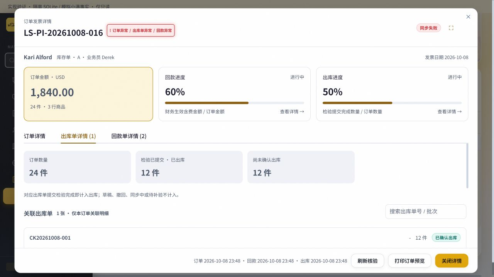

# 订单详情加载优化验收

2026-10-08，`codex/invoice-detail-speed`，基于 `3c81d687`。本轮修改尚未提交、合并、推送或部署；上轮详情发布记录不代表本轮优化已上线。

## 修改与原因

- 回款首次读取现有完整后台核验快照，不等待远端订单和回款扫描；校验摘要、来源、版本及 watermark，两分钟外不发布金额汇总。页面显示快照时间和当前保存订单金额口径。手动刷新继续严格实时核验，资金写入路径不使用此快捷读取。
- 出库只读查询按精确订单与行身份访问本地镜像，批量读取检验、同步事件、结算行和预售关联单据，去除远端全量扫描及常规逐单查询。
- 按用户要求，当前有效检验提交完成即计入已出库。检验撤回、待补验、同步未确认不计；镜像数量与已核验修改证据冲突或权限不足时隐藏进度。原单状态与结算规则不变。
- 三个数据源继续并行加载；刷新保留单据，旧金额汇总暂时隐藏。关闭、切换订单和账号权限变化仍隔离旧响应。

## 验证证据

- 后端受影响套件：`test_invoice_detail_speed.py test_invoice_related_detail.py test_receipt_index.py test_receipt_management.py test_invoice_scope.py test_presale_settlement.py test_shipping_outbound_queue.py`，219 项通过（41.86 秒；14 条既有 JWT UTC 弃用警告）。
- 后续增加缺失快照时的预售运费保护，再运行两个详情套件：47 项通过（7.57 秒）。包括过期/未来/损坏快照、回款手续费与去重、权限、撤回及补验、重复/删除镜像、同秒修改证据、预售冻结数量等。
- 性能回归验证首屏不调用远端；关联出库单从 1 张到 25 张时常规 SQL 查询次数不增加。该证据是调用结构验证，未将隔离环境响应时间冒充生产性能指标。
- 前端 `node --test tests/invoiceRelatedDetail.test.mjs`：3 项通过；`npm run build`：3409 模块，19.21 秒，保留既有大包和 auth 动静态导入告警。
- 隔离 SQLite + 模拟远端服务挂载真实组件。浏览器打开订单即时显示回款 60%、出库 50%，三页签明细一致；为实时核验模拟 6 秒延迟，点击刷新后回款单仍显示，旧金额与进度隐藏，完成后恢复 60% 且从快照文案切换为实时口径。出库明确显示“检验已提交 · 已出库”12 / 24 件。
- 独立 agent 审查后修复：隐藏检验范围的补验角标泄漏、相同时间戳但内容未同步的旧镜像、缺失快照的独立运费汇总。没有连接或写入真实业务数据库、小满服务。

- 最终 `python scripts/check_conventions.py` 增量及 UI 门禁通过，`git diff --check` 通过；`python scripts/git_sweep.py --no-fetch` 已执行，仅为本地远端引用快照。主目录仍为原有 24 项改动。

## 界面证据

下图为隔离演示数据，刷新完成后的出库详情。

## 适用边界

首屏回款为最多两分钟前后台已核验结果，不表示打开时重新核对远端订单；后台快照异常时本地单据仍可查看，金额等待实时刷新。出库展示依赖既有镜像更新时点，疑似滞后数量不贸然汇总。此次不新增迁移或后台同步任务。
