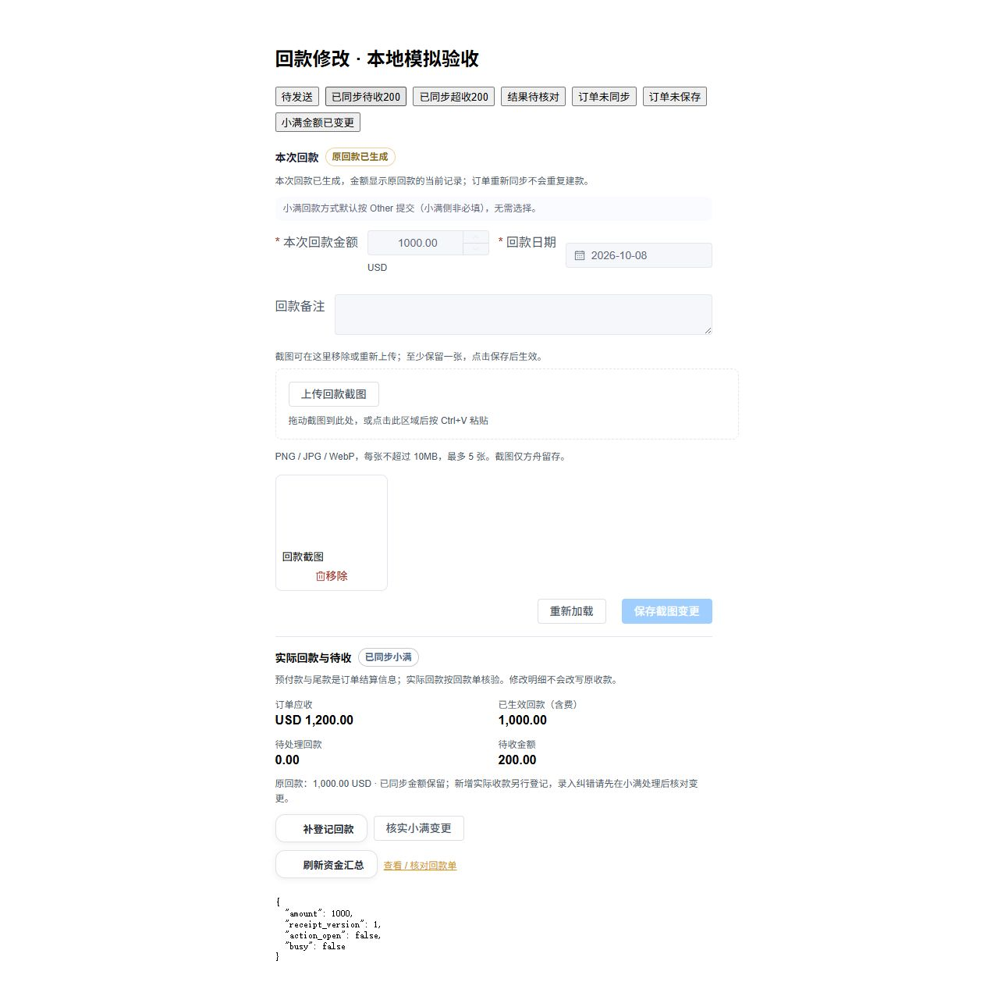

# 订单改单后的回款修正

实现分支为 `codex/invoice-receipt-correction`。本记录描述开发验收；后续合并与发布状态见交接及发布记录。无数据库迁移，开发验收未修改真实资金或生产数据。

## 行为

1. 将订单约定的预付款与实际回款分开。库存回款草稿只在金额为空或仍等于原预付款时跟随预付款，独立录入的金额与预售定金保留。
2. 订单编辑页新增“实际回款与待收”。明细金额变化后，显示已生效、待处理、待收或超收；未保存时为预览。未同步时资金只读，完成保存及关联同步后才能执行普通资金写入。
3. 未发送或明确失败、无远端 ID 的普通回款支持独立修正，保留原单 ID、版本及凭证；自动手续费按新金额分摊并排除原单，保存后明确重试。同步中、未知结果、已同步、预售定金及批次回款沿用各自处理边界。
4. 已同步回款保留，新增实际收款通过“补登记回款”。小满录入纠错用管理员既有核对流程。余额被冻结时仍显示原回款和核对入口。
5. 发票显示和冻结校验使用真实回款当前值，保留生成意图为 converted，避免旧金额阻止改单保存或重复生成。截图版本随资金修正刷新；多凭证返回顺序按原记录保存，避免只读刷新造成保存误判。

## 验证证据

- 缺陷回归先失败后通过，覆盖当前金额回显与保存、低于原手续费的金额修正、手续费重新分摊、并发版本、权限与归属、未知/缺失/被修改的远端结果，以及多凭证反序回显。
- 后端联合回归 202 项通过（30.54 秒），仅使用隔离 SQLite 与模拟小满读取，覆盖发票关联同步、生命周期、回款管理、传输协议、预检及批次。命令：`python -m pytest tests/test_invoice_receipt_correction.py tests/test_receipt_management.py tests/test_invoice_linked_sync.py tests/test_invoice_lifecycle.py tests/test_receipt_protocol.py tests/test_receipt_preflight_fields.py tests/test_receipt_batches.py -q -p no:cacheprovider`（backend 目录）。
- 前端 43 项定向 Node 回归通过，涵盖金额跟随、差额计算、状态刷新、旧版入口、结算及远端核对的阻断保护。命令：`node --test tests/invoiceReceiptCorrection.test.mjs tests/invoiceReceiptPayment.test.mjs tests/invoiceLinkedSync.test.mjs tests/invoiceLifecycle.test.mjs tests/invoiceSyncGuard.test.mjs tests/invoiceLegacyEntry.test.mjs tests/invoiceSettlement.test.mjs`（frontend 目录）。
- `npm run build` 成功（22.28 秒），保留既有 chunk 大小和认证导入提示。
- 本地模拟页面实际验证 500 → 20 金额修正、提交自动手续费 0 由服务端分摊、版本回填、截图重新加载与重试；验证应收 1200/已收 1000/待收 200、应收 800/已收 1000/超收 200、补登记弹窗、未保存/未同步禁用普通写入，以及余额冻结仍能打开小满变更预览。没有调用真实业务 API。
- 390px 窄屏资金区无横向溢出；无新增自定义动效。`check_conventions.py`、`git diff --check` 通过；`git_sweep.py --no-fetch` 为本地快照。
- 独立 agent 审查发现并修复状态回填、手续费旧值、截图版本、旧版金额跟随、余额异常恢复入口和凭证排序问题；最终复核无剩余阻断。

本地模拟验收截图（非生产订单）：

## 发布

前后端需一起通过项目统一部署入口发布。开发验收没有小满资金提交、退款或生产迁移；发布后仍以只读方式核验。
