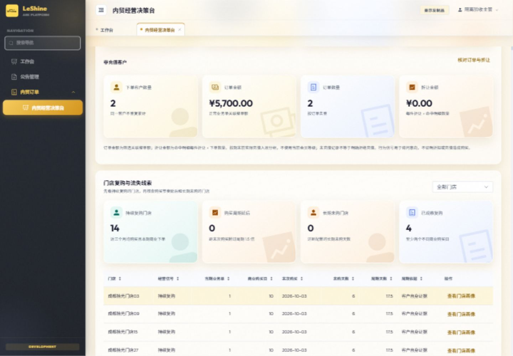
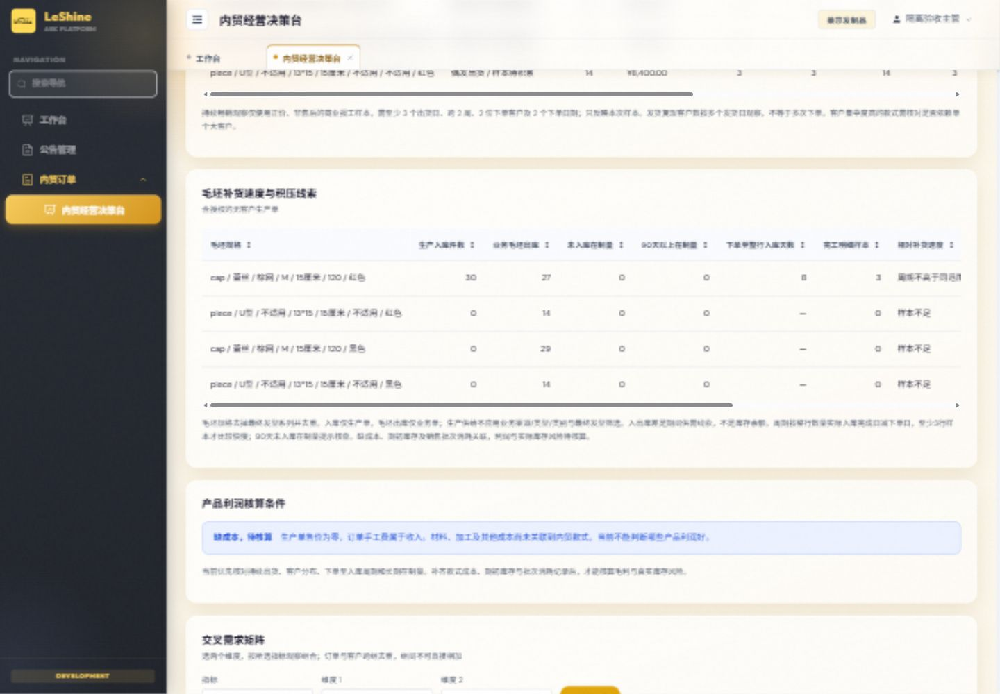
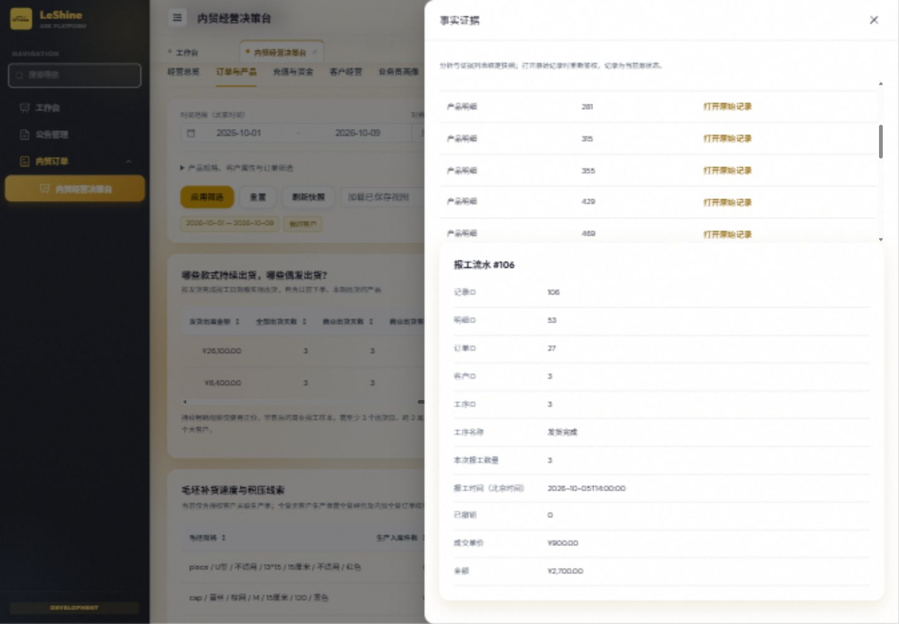
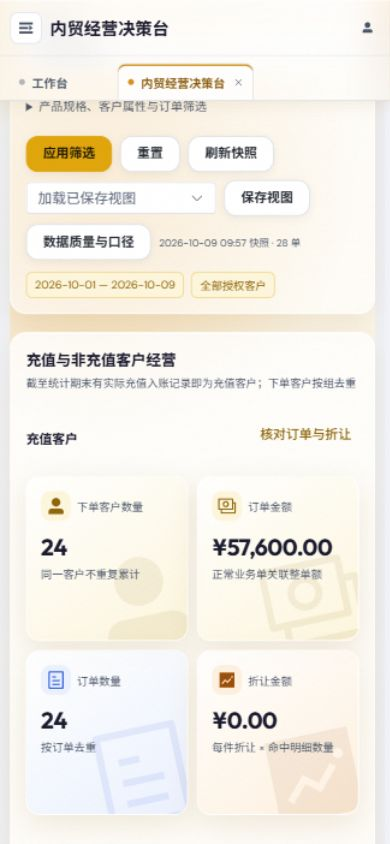

# 内贸经营决策台指标与经营分析优化验收

日期：2026-10-09。状态：本地实现与验收完成，未提交、合并、推送或部署。

工作树：`C:/Users/windb/.codex/worktrees/domestic-decision-metrics/commission-system`；分支：`codex/domestic-decision-metrics`；基点：`7852719f`。主目录及其他任务改动保持不动。本次不变更持久表结构，不需要数据库迁移。

## 业务口径

| 能力 | 本次实现 |
| --- | --- |
| 业务下单金额 | 统计期内下单的正常业务单关联整单金额；排除草稿、待审核、已终止、已驳回和已删除单据。产品筛选命中一行时，整单额仍包含其他行。 |
| 发货出库金额 | 正常业务单的有效、正数量、未撤销“发货完成”报工，按北京时间报工日期归属期间；报工数量乘成交单价，包括历史下单、本期发货。 |
| 客户充值金额 | 期间实际正向充值入账流水，不含申请、初始化、调整或订单扣款。沿用客户范围，默认忽略产品筛选；明确启用相关客户资金模式后分别按各期间关联客户计算。无资金权限时不显示金额。 |
| 下单客户个数 | 本期正常业务单客户去重，同一客户多单只计一次。 |
| 充值与非充值客户 | 截至期末曾有实际充值入账即归充值组；两组分别展示去重下单客户、关联整单额、去重订单数、命中行每件折让乘数量。 |
| 充值意向观察 | 展示待审充值、曾充值并有折让、未充值原价下单等实际行为及原始证据。真实意向显示待跟进确认，不推断折扣导致购买或客户拒绝充值。 |
| 门店复购与流失 | 持续复购要求截至期末近三个自然月均有商业购买，且本期商业下单；周期延后超过参考周期1.5倍；长期未购沿用配置阈值。零价/售后不构成商业复购，观察信号不直接认定客户流失。 |
| 款式持续出货 | 商业报工至少3个出货日、跨2周、2个客户、2个下单日期，才标记持续畅销观察；否则展示偶发/待积累、仅售后零价、本期尚未出货。提供客户集中度及对照期数量。 |
| 补货与积压 | 毛坯规格排除最终发型并去重；生产入库与业务毛坯出库分开。补货周期以整行累计入库完成日期减下单日期计算，至少3行完工样本才做相对比较；保留未入库在制量、90天以上在制量和期间供需线索。 |

## 数据与权限边界

- 无客户生产单仅在未缩小客户/负责人/客户属性的全量查询下，并同时拥有 `domestic_decision:read_all`、`domestic:read_all` 时参与。权限撤销后，含此数据的已保存快照也拒绝读取。
- 报工、价格、折让、充值与工序来源进入快照版本；改动或撤销报工使旧分析失效。旧指标版本快照要求重新分析。证据打开时重新鉴权；报工下钻不支持无法对应的维度条件，明确返回422。
- 当前缺少可关联款式的材料、加工及其他成本；利润保持未知，显示“缺成本，待核算”。亮哥已确认先完成销量、补货和供需分析。生产单零售价和业务单手工费均不当作成本。
- 缺期初库存与销售批次消耗关联，真实库存保持未知；期间入库大于毛坯出库只作为核查积压的线索。生产供给不套用业务渠道/类型/类别与最终发型筛选，页面明确说明。

## 实际验证

| 检查 | 结果 |
| --- | --- |
| `python -m pytest tests/test_domestic_decision_operations.py tests/test_domestic_decision_analytics.py tests/test_domestic_decision_finance.py tests/test_domestic_decision_state.py tests/test_domestic_decision_ai.py -q --disable-warnings`（backend） | 111 passed，24.10s；隔离 SQLite。 |
| `node --test frontend/tests/domesticDecisionState.test.mjs frontend/tests/tableSort.test.mjs` | 11 passed；包括报工证据可达、去重与资金权限过滤回归。 |
| `npm run build`（frontend） | 退出0，20.94s，114个导航项。既有分包体积与auth导入告警保留。 |
| `python scripts/check_conventions.py` | 增量改动无违规，UI表格约定通过。 |
| `git diff --check` | 通过。 |
| `python scripts/git_sweep.py --no-fetch` | 退出0；本地远端引用快照，未操作其他分支、stash或工作树。 |
| 独立agent风险审查 | 状态、金额粒度、权限、跨款毛坯去重、整行完工日期、商业样本、快照失效及证据契约通过；页面发现的父组件报工白名单遗漏已修复并复审。 |

新增后端测试覆盖：历史单当期分次出货、无效状态/撤销/越权、北京时间零点与外部UTC换算、历史充值分组、每件折让累加、无财务权限、门店复购、同毛坯多发型去重、部分入库完工日期、零价与售后样本、相关客户两期资金对照、旧版本快照及报工HTTP证据。

## 页面验收

浏览器仅连接 `127.0.0.1:8791` 隔离验收服务，使用合成客户、订单、生产单、报工和充值数据；未读取或写入生产数据库。临时服务已停止，合成SQLite文件已清理。复现入口为 `docs/requirements/domestic-decision-evidence/qa_server.py`，构建后启动该脚本即可。

- 桌面1440×1000：总览四卡、充值两组指标、14个持续复购门店、款式出货表、全量生产入库30件/业务毛坯出库27件/整行周期8天/3个完工样本展示正常（均为合成数据）。
- 报工证据实际打开“发货完成”记录，显示北京时间、数量3、成交单价900元、金额2700元。客户分组证据实际打开产品明细，展示原价快照及每件折让。
- 手机390×844：卡片按两列排列；客户与产品页文档宽度/滚动宽度均为390，无整页横向溢出；长表在自身容器中横向查看。浏览器error日志为空。
- 沿用已有组件、颜色token和动效；无新增动画。截图中的金额与客户仅用于界面验收，不代表生产经营结果。

功能验证未覆盖真实MySQL和生产规模性能。后续接入成本、期初库存及批次消耗后才能进一步核算利润和真实库存风险。
