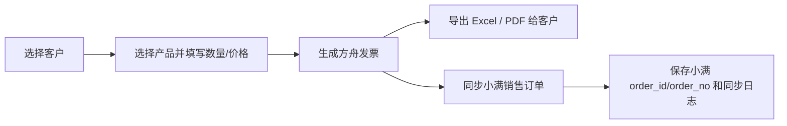
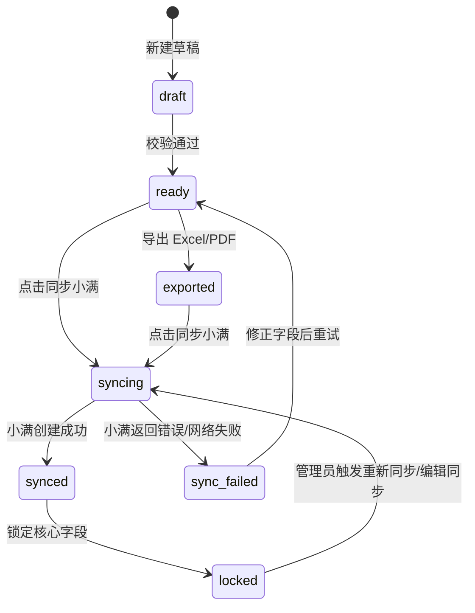
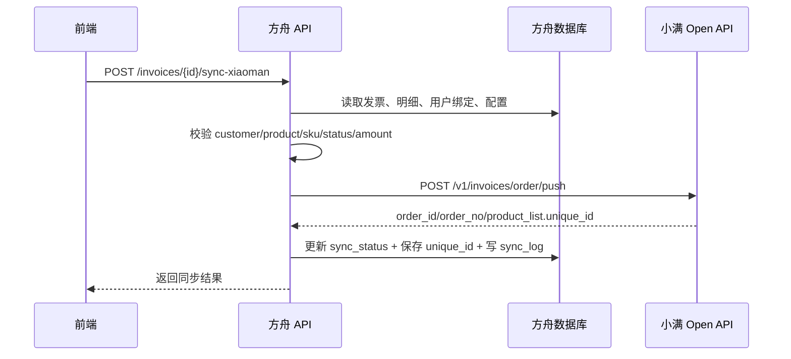

# 订单发票管理功能需求设计开发文档

> 日期：2026-07-02  
> 范围：莱莎方舟平台新增「订单发票管理」模块  
> 参考模板：`C:\Users\windb\Desktop\尹德魁发票+Samantha Harrison+6.22.xlsx`  
> 小满接口参考：<https://open.xiaoman.cn/api-3478252>

## 1. 结论

可行，建议做成「先创建方舟发票，再同步小满订单」的业务闭环，而不是简单的 Excel 生成器。

原因：

- 当前方舟已经具备 FastAPI + Vue 3 + Element Plus + MySQL + 跨库读取 `customer_info` / `okki_products` 的基础能力。
- 发票模板字段结构清晰，可以用后端模板渲染导出 Excel，并通过 LibreOffice / Playwright / weasyprint 类方案导出 PDF。
- 小满销售订单接口支持新建/编辑订单，接口为 `POST /v1/invoices/order/push`。
- 主要风险在小满订单同步，不在页面。小满接口要求使用小满内部 ID：`company_id`、`customer_id`、`product_id`、`sku_id`、用户 ID、部门 ID、订单状态 ID 等；其中 `sku_id` 可通过 `okki_inventory` 关联产品获取。产品明细金额小计 `cost_amount` 不会自动计算，需要方舟侧计算后传入。

建议分两期：

- MVP：发票创建、列表、详情、Excel/PDF 导出、手动同步小满、同步日志。
- 二期：字段映射配置、订单状态回查、回款/尾款提醒、发票模板多版本、批量同步。

## 2. 现状与核心问题

### 2.1 当前业务流程

业务员现在的顺序：

1. 在 Excel 里按模板创建给客户的发票。
2. 对照发票，在 OKKI / 小满 CRM 中手工创建订单。
3. 后续回款、提成、发货信息分散在 Excel 和 CRM 中。

### 2.2 要解决的本质问题

不是“导出一张 Excel”，而是消除重复录入和减少订单数据错误。

系统需要把发票变成订单的前置业务单据：



### 2.3 用户价值

- 业务员少录一次订单，降低人工复制错误。
- 主管和财务能看到发票、订单、回款状态的一致链路。
- 发票模板统一，减少格式漂移。
- 后续可以把提成、发货、回款对齐到同一张业务单据。

## 3. 数据源与模板分析

### 3.1 现有 Excel 模板字段

模板主表为 `Sheet1`，有效区域约 `B6:J41`，核心字段如下：

| 区域 | 模板字段 | 示例 | 方舟字段建议 |
|---|---|---|---|
| 客户信息 | To | Samantha Harrison | customer_contact_name |
| 客户信息 | TEL/Fax | +61 0407590277 | customer_phone |
| 客户信息 | E-mail | hello@shextensions.com.au | customer_email |
| 客户信息 | Delivery address | 13 Jenyor Street... | delivery_address |
| 我方信息 | From | Derek | sales_user_name |
| 我方信息 | TEL | 86 166 7869 6582 | sales_user_phone |
| 我方信息 | E-mail | derek@leshinehair.com | sales_user_email |
| 发票日期 | Date | 2026.6.17 | invoice_date |
| 明细 | Product | 22" Invisible Weft / K Tip | product_display |
| 明细 | Net Weight | Super Double Drawn Invisible Weft | net_weight_grams / unit |
| 明细 | Curl | Straight | curl |
| 明细 | Color | M4/10 | color |
| 明细 | Length | 22 | size |
| 明细 | Quantity /100grams | 5 | quantity |
| 明细 | Unit Price | 192.4 | price_per_piece |
| 明细 | Total Price | =数量*单价 | total_price |
| 汇总 | Hair Price | SUM 明细金额 | product_amount |
| 汇总 | Shipping Cost | 0 | shipping_cost |
| 汇总 | Total | 商品 + 运费 | total_amount |
| 支付 | Payment term | TT 20% $2032.8 | payment_term |
| 备注 | Remark + 银行信息 | 固定说明 | invoice_remark / bank_info |
| 内部 | 付款方式/折扣/配件/到账/尾款/提成 | 中文内部字段 | internal_settlement |

### 3.2 当前可用数据库

项目已有跨库读取模式：

- `settings.BUSINESS_DB_NAME` 默认指向业务库，如 `lsordertest`。
- `okki_products` 已在生产/备货模块中被读取。订单发票模块最终要匹配到唯一的 `okki_products.product_name`，并使用 `model`、`color`、`size`、`unit` 四个维度做快速筛选。
- `customer_info` 已在客户归属和历史数据初始化测试中使用，至少包含 `company_id`、`company_name`。

需要补充确认：

- `customer_info` 是否有联系人、邮箱、电话、收货地址字段。如果没有，需要本模块建立发票联系人快照表。
- `sku_id` 可通过 `okki_inventory` 关联 `okki_products.product_id` 获取。产品选择器需要同时展示可用库存规格；若同一产品存在多个 `sku_id`，必须让业务员选择具体规格，不能默认猜测。
- 方舟当前业务库是只读策略，新增发票数据应写入方舟主库，不写回小满/OKKI业务库。

### 3.3 产品明细快速匹配规则

目标：让业务员通过 4 个下拉框快速收敛到唯一产品，而不是手工搜索产品名。

匹配目标：

- 最终锁定字段：`okki_products.product_name`。
- 过滤维度：`model`、`color`、`size`、`unit`。
- `sku_id` 来源：通过 `okki_inventory` 按 `product_id` 关联获取。

级联规则：

- 四个下拉框都从后端返回候选值，不在前端缓存全量产品。
- 每选择一个维度，其余三个维度的候选值必须基于当前已选条件同步缩小。
- 当 4 个维度全部选择后，若只匹配到 1 条产品，自动填充 `product_name`。
- 若 4 个维度全部选择后仍匹配多条产品，页面必须展示冲突列表，让业务员二选一，不能默认取第一条。
- 若任一维度无候选值，提示“没有匹配产品”，并保留当前已选条件方便回退。

产品明细页面字段：

| 字段 | 来源/规则 | 编辑规则 | 校验 |
|---|---|---|---|
| Product_name | 4 个维度唯一匹配后的 `okki_products.product_name` | 自动填充，不可编辑 | 必填 |
| Product | 从 `product_name` 提取第一个 `/` 前面的内容；无 `/` 时取完整 `product_name` | 自动填充，不可编辑 | 必填 |
| Net Weight Grams | 对应 `unit` | 必填 | 必填 |
| Curl | 系统字典维护，下拉选择 | 可编辑 | 选填 |
| Model | 对应 `model` | 下拉选择 | 必填 |
| Color | 对应 `color` | 下拉选择 | 必填 |
| Length | 对应 `size` | 下拉选择 | 必填 |
| Quantity | 用户录入 | 可编辑 | 大于 0 的正整数，必填 |
| Price/Piece | 优先从小满接口获取；获取不到留空 | 可编辑 | 大于 0 的正数，必填 |
| TotalPrice | `Quantity * Price/Piece` | 自动填充，不可编辑 | 必填 |

价格规则：

- 选择到唯一产品后，后端尝试从小满接口读取该产品/规格的默认单价。
- 小满接口获取不到价格时，`Price/Piece` 留空并标红，业务员手工填写。
- 手工填写的价格只保存到当前发票明细，不反写小满产品库。

## 4. 小满接口可行性

### 4.1 必用接口

| 用途 | 小满接口 |
|---|---|
| 新建/编辑销售订单 | `POST /v1/invoices/order/push` |
| 销售订单枚举 | `GET /v1/invoices/order/orderEnums` |
| 销售订单字段 | `GET /v1/invoices/order/field` |
| 产品库列表 | `GET /v1/product/list` |
| 客户列表 | `GET /v1/company/list` |

### 4.2 同步订单字段映射

| 方舟发票字段 | 小满字段 | 说明 |
|---|---|---|
| invoice_no | order_no / name | 建议小满订单名用 `方舟发票号 + 客户名`；是否传 `order_no` 需按小满规则验证 |
| invoice_date | account_date | 发票日期 |
| customer.company_id | company_id | 小满公司 ID |
| contact.customer_id | customer_id | 如果本地有联系人 ID，则传 |
| currency | currency | 默认 USD |
| sales_user.xiaoman_user_id | users[].user_id / create_user / handler | 需要方舟用户绑定小满用户 ID |
| department.xiaoman_department_id | departments[].department_id | 可选，需配置 |
| line.product_id | product_list[].product_id | 由唯一 `product_name` 对应产品确定 |
| line.sku_id | product_list[].sku_id | 从 `okki_inventory` 关联获取；同产品多规格时由业务员选择 |
| line.quantity | product_list[].count | `Quantity`，正整数 |
| line.price_per_piece | product_list[].unit_price | `Price/Piece`，优先从小满接口获取，可人工覆盖 |
| line.total_price | product_list[].cost_amount | `Quantity * Price/Piece`，方舟侧计算后传入 |
| shipping_cost | cost_list 或 remark | 需确认小满费用字段口径 |
| bank_info/payment_term | remark / 自定义字段 | 建议首期写入 remark |
| sync_status | 本地字段 | 不传小满，用于方舟状态 |

### 4.3 关键接口风险

1. 产品明细不会自动创建。发票选择的产品必须能映射到小满产品库 `product_id` 和 `sku_id`，`sku_id` 优先从 `okki_inventory` 关联获取。
2. 同规格多行产品需要保存小满返回的 `unique_id`，否则再次编辑同步时小满可能按 `product_id + sku_id` 去重。
3. 小满订单状态 `status` 不是固定枚举，必须从本企业的订单枚举接口获取，不可硬编码。
4. 汇率字段存在乘 100 规则。若后续传 `exchange_rate` / `exchange_rate_usd`，方舟必须明确计算逻辑。
5. 小满鉴权 token、refresh token 需要后端统一托管，不能暴露给前端。

## 5. 产品方案

### 5.1 功能边界

MVP 做：

- 发票列表：查询、状态筛选、客户/业务员/日期筛选。
- 新建/编辑发票：客户选择、产品级联筛选、明细编辑、自动计算金额。
- 发票详情：预览客户版发票、查看内部结算字段、同步记录。
- 导出：Excel、PDF。
- 同步小满：手动点击同步，展示同步前校验结果，成功后保存小满 `order_id/order_no`。
- 同步日志：每次请求 payload 摘要、响应结果、错误信息、操作人、时间。

MVP 不做：

- 不自动创建小满客户或产品。
- 不自动同步回款单。
- 不做复杂审批流。
- 不做多模板设计器，只支持当前模板的版本化配置。

### 5.2 状态机



字段建议：

- `draft`：可编辑，未完成校验。
- `ready`：关键字段完整，可导出/同步。
- `exported`：已生成客户文件。
- `syncing`：同步中，按钮禁用。
- `synced`：已同步小满。
- `sync_failed`：同步失败，可重试。
- `voided`：作废，不再同步。

### 5.3 页面信息架构

建议菜单放在「提成管理」或单独「订单管理」下。

更推荐新建菜单组「订单管理」：

- 订单发票
- 同步日志
- 模板配置（二期）

如果为了少改权限体系，MVP 可先挂在「提成管理」下，权限为：

- `invoice:read`
- `invoice:write`
- `invoice:sync`
- `invoice:admin`

## 6. 页面原型

静态 HTML 原型见：

`docs/requirements/2026-07-02-order-invoice-management-prototype.html`

### 6.1 发票列表

目标：让业务员快速知道哪些发票还没同步、哪些同步失败需要处理。

核心元素：

- 顶部指标：草稿、待同步、已同步、同步失败。
- 筛选：客户、业务员、日期、状态、关键词。
- 表格列：发票号、客户、金额、币种、发票日期、小满订单号、状态、最近同步、操作。
- 行操作：查看、编辑、导出 Excel、导出 PDF、同步小满。

### 6.2 新建/编辑发票

目标：一屏完成发票创建，不让业务员在客户、产品、价格之间来回跳。

布局：

- 左侧主编辑区：客户信息、产品明细、金额汇总、付款与备注。
- 右侧固定预览区：客户版发票预览、同步前检查、操作按钮。

关键交互：

- 选择客户后自动带出联系人、电话、邮箱、收货地址。
- 产品明细通过 `model/color/size/unit` 四个级联下拉框快速锁定唯一 `product_name`，锁定后自动填充 Product_name、Product、Net Weight Grams、Model、Color、Length。
- `Price/Piece` 优先从小满接口获取；获取不到时留空，由业务员手工补齐。
- 数量和单价变更时自动计算行金额和总额。
- 保存前校验缺失字段；同步前校验小满必填 ID。
- 已同步后核心字段默认锁定，管理员可解锁并形成重同步日志。

### 6.3 同步确认抽屉

目标：在请求小满前让用户看懂“能不能同步，为什么不能”。

内容：

- 客户映射：company_id / customer_id 是否存在。
- 产品映射：每行 product_id / sku_id 是否存在。
- 订单状态：是否从小满枚举选择。
- 金额校验：明细合计、运费、总额是否一致。
- 发送摘要：订单名、客户、币种、金额、产品行数。

## 7. 后端设计

### 7.1 模块结构

采用领域模块结构：

```text
backend/app/invoice/
  router.py
  models.py
  schemas.py
  service.py
  export_service.py
  xiaoman_client.py
  sync_service.py
  template_service.py
  templates/
    customer_invoice.xlsx
    customer_invoice.html
```

路由挂载：

```python
app.include_router(invoice_router, prefix="/api/invoice", tags=["订单发票"])
```

### 7.2 数据表

#### `ark_invoices`

| 字段 | 类型 | 说明 |
|---|---|---|
| id | bigint unsigned PK | 主键 |
| invoice_no | varchar(40) unique | 方舟发票号，建议 `INV20260702-001` |
| customer_company_id | bigint | 小满/OKKI 公司 ID |
| customer_name | varchar(255) | 客户快照 |
| contact_name | varchar(255) | 联系人快照 |
| contact_phone | varchar(100) | 电话快照 |
| contact_email | varchar(255) | 邮箱快照 |
| delivery_address | text | 收货地址 |
| sales_user_id | bigint unsigned | 方舟用户 ID |
| sales_user_name | varchar(100) | 业务员快照 |
| invoice_date | date | 发票日期 |
| currency | varchar(10) | 默认 USD |
| product_amount | decimal(18,2) | 商品金额 |
| shipping_cost | decimal(18,2) | 运费 |
| discount_amount | decimal(18,2) | 折扣 |
| accessory_amount | decimal(18,2) | 配件 |
| total_amount | decimal(18,2) | 总金额 |
| payment_term | varchar(255) | 付款条款 |
| invoice_remark | text | 客户备注 |
| bank_info | text | 银行信息 |
| internal_note | text | 内部备注 |
| status | varchar(30) | draft/ready/exported/synced/sync_failed/voided |
| xiaoman_order_id | varchar(64) | 小满订单 ID |
| xiaoman_order_no | varchar(100) | 小满订单号 |
| xiaoman_status | varchar(100) | 小满状态 |
| last_synced_at | datetime | 最近同步时间 |
| created_by | bigint unsigned | 创建人 |
| updated_by | bigint unsigned | 更新人 |
| created_at / updated_at | datetime | 时间戳 |

#### `ark_invoice_items`

| 字段 | 类型 | 说明 |
|---|---|---|
| id | bigint unsigned PK | 主键 |
| invoice_id | bigint unsigned FK | 发票 |
| line_no | int | 行号 |
| product_id | bigint | 小满/OKKI product_id |
| sku_id | bigint nullable | 小满 sku_id，从 `okki_inventory` 关联获取，首期同步建议必填 |
| product_no | varchar(100) | 产品编号快照 |
| product_name | varchar(255) | 产品名快照 |
| product_display | varchar(255) | 从 `product_name` 提取 `/` 前面的内容 |
| model | varchar(255) | 型号快照 |
| net_weight_grams | varchar(100) | Net Weight Grams，对应 `unit` |
| curl | varchar(100) | Curl |
| color | varchar(100) | Color |
| size | varchar(50) | Length，对应 `size` |
| quantity | decimal(18,4) | 数量 |
| price_per_piece | decimal(18,4) | Price/Piece，优先从小满接口获取，可人工覆盖 |
| total_price | decimal(18,2) | Quantity * Price/Piece |
| xiaoman_unique_id | varchar(64) | 小满明细唯一 ID，编辑同步时使用 |
| sort_order | int | 排序 |

#### `ark_invoice_sync_logs`

| 字段 | 类型 | 说明 |
|---|---|---|
| id | bigint unsigned PK | 主键 |
| invoice_id | bigint unsigned FK | 发票 |
| action | varchar(30) | create/update/retry |
| request_digest | json | 脱敏后的请求摘要 |
| response_body | json/text | 响应 |
| success | tinyint | 是否成功 |
| error_message | text | 错误 |
| operator_id | bigint unsigned | 操作人 |
| created_at | datetime | 时间 |

#### `ark_xiaoman_settings`

| 字段 | 类型 | 说明 |
|---|---|---|
| id | bigint unsigned PK | 主键 |
| access_token_encrypted | text | 加密 token |
| refresh_token_encrypted | text | 加密 refresh token |
| token_expires_at | datetime | 过期时间 |
| default_order_status | varchar(64) | 默认订单状态 code |
| default_price_contract | varchar(30) | 如 FOB/EXW |
| default_currency | varchar(10) | USD |

### 7.3 API 草案

| 方法 | 路径 | 用途 |
|---|---|---|
| GET | `/api/invoice/invoices` | 发票列表 |
| POST | `/api/invoice/invoices` | 创建发票 |
| GET | `/api/invoice/invoices/{id}` | 发票详情 |
| PUT | `/api/invoice/invoices/{id}` | 更新发票 |
| POST | `/api/invoice/invoices/{id}/validate` | 同步前校验 |
| POST | `/api/invoice/invoices/{id}/export/excel` | 导出 Excel |
| POST | `/api/invoice/invoices/{id}/export/pdf` | 导出 PDF |
| POST | `/api/invoice/invoices/{id}/sync-xiaoman` | 同步小满订单 |
| GET | `/api/invoice/invoices/{id}/sync-logs` | 同步日志 |
| GET | `/api/invoice/customers/search` | 搜索客户 |
| GET | `/api/invoice/products/filter-options` | 产品级联筛选选项，参数为当前已选 `model/color/size/unit` |
| GET | `/api/invoice/products/match` | 4 个维度匹配唯一产品，返回 `product_name/product_id/sku_id/price` |
| GET | `/api/invoice/xiaoman/enums` | 获取/缓存小满订单枚举 |

### 7.4 导出方案

Excel：

- 用 `openpyxl` 复制当前模板。
- 写入客户、业务员、日期、明细、合计、付款条款、备注和银行信息。
- 保留模板公式或在后端写入公式。
- 导出前用 LibreOffice 重算并检查公式错误。

PDF：

- 首选：基于同一份 HTML 发票模板生成 PDF，确保 Web 预览与 PDF 一致。
- 备选：Excel 通过 LibreOffice 转 PDF，但服务端样式可控性较弱。

建议首期用 HTML 模板生成 PDF，Excel 仅承担客户可编辑版本。

### 7.5 小满同步服务

`sync_service.py` 流程：



必要设计：

- 所有同步请求必须有幂等约束：同一发票重复点击不会创建多个小满订单。
- 如果已存在 `xiaoman_order_id`，走编辑同步而不是新建。
- 失败必须保存日志，前端展示可读错误。
- token 自动刷新，刷新失败提示管理员重新授权。
- 请求日志脱敏，不保存 token。

## 8. 前端设计

### 8.1 文件结构

```text
frontend/src/api/invoice.js
frontend/src/views/invoice/
  InvoiceList.vue
  InvoiceEditor.vue
  InvoiceDetail.vue
  components/
    InvoicePreview.vue
    InvoiceItemTable.vue
    SyncCheckDrawer.vue
    CustomerPicker.vue
    ProductPicker.vue
    ProductCascadePicker.vue
```

### 8.2 设计规范

沿用 `DESIGN.md`：

- 列表页使用 `.table-card` + `el-table border class="list-table"`。
- 不使用 `stripe`。
- 表格列使用 `min-width` + `max-width`，文本列加 `show-overflow-tooltip`。
- 操作按钮使用图标 + 文本。
- 主色使用 LeShine Gold `#D4941C`。

### 8.3 核心交互规则

- 新建发票默认进入编辑页，不弹复杂向导。
- 客户选择是第一步；未选择客户时产品区可编辑但导出/同步禁用。
- 同步按钮永远显示，但不可同步时点击打开校验结果，而不是直接报错。
- 导出 Excel/PDF 不要求同步成功；客户文件和小满订单是两个独立动作。
- 已同步发票显示小满订单号和最近同步时间。
- 产品级联筛选必须做到“选一个条件，其他条件随即收窄”，减少业务员思考成本。

## 9. 权限与安全

权限：

- `invoice:read`：查看列表和详情。
- `invoice:write`：创建、编辑、导出。
- `invoice:sync`：同步小满。
- `invoice:admin`：配置小满 token、状态枚举、解锁已同步发票。

安全：

- 小满 token 只保存在后端，加密存储。
- 前端不接触小满 Authorization。
- 同步日志脱敏。
- 客户邮箱、电话、地址属于业务敏感信息，遵循现有登录态和 RBAC。

## 10. 开发计划

### Phase 0：接口验证与字段确认

验收：

- 使用测试 token 调通订单枚举、产品列表、客户列表、订单 push。
- 明确 `customer_info` 本地字段是否包含同步所需客户/联系人 ID。
- 验证 `okki_inventory` 与 `okki_products` 的关联字段、可用库存规格筛选条件，以及 `model/color/size/unit` 是否能稳定收敛到唯一 `product_name`。
- 调通小满产品价格接口；确认无法获取价格时允许业务员手工录入 `Price/Piece`。

### Phase 1：本地发票闭环

工作：

- Alembic 建表。
- 后端发票 CRUD。
- 客户/产品搜索。
- 前端列表、编辑、详情。
- Excel/PDF 导出。

验收：

- 业务员可以不打开 Excel 创建一张客户发票。
- 导出的 Excel 与现有模板字段一致。
- PDF 可直接发客户预览。

### Phase 2：小满同步

工作：

- 小满 client。
- token 配置和刷新。
- 同步前校验。
- 同步订单 push。
- 保存 `order_id/order_no/product_list.unique_id`。
- 同步日志。

验收：

- 同一发票重复点击不会创建重复订单。
- 字段缺失时前端能明确指出缺什么。
- 小满成功后方舟显示订单号和同步时间。

### Phase 3：运营增强

工作：

- 同步状态回查。
- 批量同步。
- 模板版本管理。
- 与回款/提成/物流模块打通。

## 11. 验收标准

MVP 必须满足：

- 发票字段覆盖当前 Excel 模板客户信息、产品明细、金额、支付条款、银行备注和内部结算字段。
- 产品选择通过 `model/color/size/unit` 级联筛选最终匹配到唯一 `okki_products.product_name`。
- 客户选择直接来自 `customer_info`。
- Excel 导出结果和现有模板布局基本一致。
- PDF 导出结果能直接发客户。
- 小满同步前能校验所有必填映射。
- 小满同步成功后保存 `order_id/order_no`。
- 小满同步失败时不丢失发票数据，失败原因可追踪。

## 12. 待确认问题

上线前必须确认：

1. 小满开放平台 token 获取方式和授权账号是谁。
2. `okki_inventory` 中 `sku_id` 与 `product_id` 的关联字段、禁用/库存筛选条件是什么。
3. `okki_products.product_name` 是否为真实字段名；如果当前库字段为 `name`，后端需统一 alias 为 `product_name`。
4. `model/color/size/unit` 四个维度是否总能收敛到唯一产品；不能时还需要哪个字段兜底。
5. 小满产品价格接口返回的是规格价、产品价还是客户等级价。
6. 小满客户 `company_id/customer_id` 与本地 `customer_info` 字段是否一一对应。
7. 发票数量单位到底是 `100grams`、`Gram` 还是小满里的自定义单位。
8. 运费是作为订单费用 `cost_list` 传入，还是只写到备注。
9. 已同步订单是否允许业务员编辑；如果允许，哪些字段编辑后需要重同步。
10. 发票号是否要和小满订单号保持一致。
