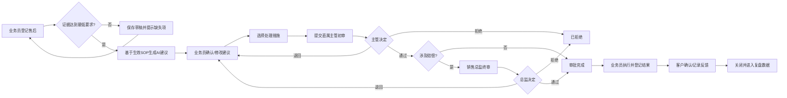

# 客户售后管理功能需求设计

> 文档状态：已确认方案，可进入技术评审
> 产品：LeShine Ark Platform（莱莎方舟平台）
> 模块代号：`aftersales`
> 版本：V1.0
> 日期：2026-07-10
> 视觉方向：单据工作台（方案 1）

## 1. 结论

首期建设一个独立的“客户售后管理”领域模块，把售后从聊天记录和人工判断转为一张可追溯的业务单据：

1. 业务员从现有客户、订单和产品数据中选择基础信息，补充批次、问题、数量、货值与证据。
2. 系统依据生效版本的《售后问题解决 SOP》检查证据完整度，并调用大模型生成结构化建议。
3. 业务员必须主动确认或修改 AI 建议，再选择实际处理措施；AI 不能替人承诺赔偿。
4. 所有单据都先由直属主管审核；不涉及赔偿时主管审批即为最终审批，涉及赔偿时再由销售总监终审。
5. 待审和审批结果通过钉钉点对点工作通知送达，通知失败不阻断业务，但必须可重试、可追踪。
6. 单据保留客户/订单/产品快照、证据、SOP 版本、AI 输入输出、人工修改、审批意见和执行结果，形成完整审计链。

首期不做通用工作流引擎，不让大模型自动决定赔偿，不把审批搬到钉钉审批实例中；审批仍在方舟完成，钉钉只负责通知和跳转。这样最直接，且与现有权限、主管关系和通知能力一致。

## 2. 问题本质与成功标准

### 2.1 当前问题

- 售后信息分散在邮件、即时通讯、图片和视频中，证据口径不统一。
- 不同业务员对同类问题的判责和承诺不同，容易过度赔偿或回应失当。
- SOP 存在于 Word 文档中，处理时依赖个人记忆，不能证明建议依据的是哪个版本、哪条规则。
- 主管和销售总监无法快速看清事实、SOP 依据、客户价值和赔偿成本。
- 审批结果靠人工转述，业务员不知道当前卡在哪个人、下一步是什么。
- 历史售后无法结构化复盘，难以识别批次问题、产品高发问题和赔偿成本。

### 2.2 产品目标

- 业务员在 5 分钟内完成一张信息充分的售后登记单。
- 常见问题能够基于 SOP 给出可引用、可编辑、可审核的处理建议。
- 任一单据都能回答：发生了什么、证据是否完整、依据什么判责、谁选择了什么措施、谁批准了什么、最终如何关闭。
- 审批人打开页面后无需查聊天记录，即可完成判断。
- 赔偿类措施无法绕过销售总监终审。

### 2.3 量化指标

上线 30 天后观察：

| 指标 | 目标 |
|---|---:|
| 登记后首次生成 AI 建议的中位耗时 | ≤ 3 分钟 |
| 首次提交时证据完整率 | ≥ 80% |
| 主管首次审核无需退回补充的比例 | ≥ 75% |
| 审批结果钉钉通知成功率 | ≥ 98% |
| 已审批单据的 SOP 引用覆盖率 | 100% |
| 赔偿单据销售总监终审覆盖率 | 100% |

## 3. 用户与职责

| 角色 | 核心目标 | 主要权限 |
|---|---|---|
| 业务员 | 快速登记、得到可执行建议、推进客户问题解决 | 新建/编辑自己的草稿、生成 AI 建议、选择措施、提交、执行、关闭 |
| 直属主管 | 核实事实、证据、判责和处理措施 | 查看下属单据、通过、退回补充、拒绝；无赔偿时做最终审批 |
| 销售总监 | 控制赔偿责任与金额 | 查看主管已通过的赔偿单、终审通过、退回或拒绝 |
| 售后管理员 | 维护问题字典、SOP 版本、兜底处理异常 | 查看全部、维护配置、重试 AI/通知、作废异常单据 |
| 管理层/分析用户 | 复盘问题趋势和赔偿成本 | 只读全量数据和报表 |

### 3.1 审批人确定规则

- 直属主管优先读取当前业务员在 `supervisor_relation_history` 中的有效一级主管关系。
- 销售总监从方舟角色中配置，建议角色 code 固定为 `sales_director`。MVP 在售后设置中指定唯一默认销售总监；后续若按事业部配置，则每个业务员必须只匹配到一个有效总监。出现零人或多人歧义时阻止提交，不允许系统猜测。
- 提交前若找不到直属主管、销售总监或审批人未绑定钉钉 ID，页面必须明确阻止提交并给出处理入口；不允许把单据提交到“无人负责”的状态。
- 审批人快照在提交时固化；组织关系后续变化不自动改写在途单据，管理员可执行“转交审批”，并留下审计记录。

## 4. 业务范围

### 4.1 MVP 范围

- 售后单列表、搜索、筛选、分页与详情。
- 业务员新建、编辑草稿、复制基础信息、提交和撤回未审核单据。
- 客户、订单、标准产品联动选择；定制产品及规格支持手填。
- 图片、视频和文件证据上传、预览、删除、完整度检查。
- SOP 文档版本管理、启用、停用、结构化解析结果查看。
- 结构化 AI 建议生成、重试、人工修改与修改原因记录。
- 业务员选择处理措施、填写赔偿明细和客户回复草稿。
- 直属主管初审、销售总监条件终审、退回补充、拒绝。
- 钉钉待审与结果通知，发送状态和重试记录。
- 执行结果登记、客户反馈登记、关闭和重新打开。
- 基础统计：问题类型、责任判定、客户等级、产品、批次、赔偿金额、处理时长。

### 4.2 首期不做

- 不构建通用 BPM/工作流引擎。
- 不让大模型直接发送客户消息、自动承认责任或自动批准赔偿。
- 不在首期创建钉钉审批实例；钉钉仅发工作通知并跳转方舟详情。
- 不自动扣库存、生成出库单、创建财务付款单或改写 OKKI 订单。
- 不做客户自助提交入口。
- 不做完整 RAG 平台；首期只服务一份统一售后 SOP 的版本化结构解析。
- 不自动从图片中识别批次号作为唯一真相；OCR 结果只能辅助填写，业务员必须确认。

## 5. 核心概念与口径

### 5.1 两套分级必须分开显示

| 名称 | 范围 | 含义 | 来源 |
|---|---|---|---|
| 客户等级 | A / B / C / D / E | 客户价值和支持策略 | 业务员登记，保存快照 |
| 责任判定 | A / B / C / D | 生产问题、正常范围、客户原因、暂不明确 | SOP + AI 建议，业务员确认 |

界面、接口和数据字段不得只使用 `level` 或“等级”这类模糊名称。统一使用 `customer_grade` 与 `responsibility_class`。

### 5.2 赔偿定义

以下任一措施被选中时，系统自动将 `has_compensation=true`，业务员不能手工关闭：

- 免费换货或重做。
- 免费补发。
- 现金退款。
- 折扣、优惠券、下单抵扣或信用额。
- 运费补贴或由公司承担返程/重发运费。
- 公司承担付费二次处理成本。
- 赠品或其他可量化的价值补偿。

纯解释、护理建议、免费检测但不承担物流费用、客户自费返厂处理、内部复盘等不属于赔偿。

赔偿审批依据是措施的经济实质，不依据按钮名称。所有非现金补偿都要填写估算成本，以便销售总监看到统一的 `estimated_compensation_usd`。

### 5.3 涉及问题产品货值

- 业务员必须填写 `affected_goods_value` 和币种。
- 订单有可靠明细单价时可自动计算，业务员确认；无法自动计算时手填。
- 货值表示受影响产品原始价值，不等于赔偿金额。
- 赔偿比例 = 预计赔偿成本 / 涉及问题产品货值，仅用于审核参考，不自动决定是否批准。

## 6. 端到端流程



### 6.1 状态机

| 状态 code | 中文 | 允许操作人 | 主要动作 |
|---|---|---|---|
| `draft` | 草稿 | 创建人 | 编辑、删除、发起 AI 分析 |
| `ai_analyzing` | AI 分析中 | 系统 | 等待、失败后重试 |
| `ai_failed` | AI 分析失败 | 创建人/管理员 | 重试、改为人工建议 |
| `awaiting_sales_decision` | 待业务选择措施 | 创建人 | 修改建议、选择措施、提交 |
| `awaiting_supervisor` | 待直属主管初审 | 指定主管 | 通过、退回、拒绝 |
| `awaiting_director` | 待销售总监终审 | 指定总监 | 通过、退回、拒绝 |
| `returned` | 已退回补充 | 创建人 | 补充信息、重新生成或保留建议、再次提交 |
| `rejected` | 已拒绝 | 创建人只读/管理员 | 查看原因、管理员作废或重新打开 |
| `approved` | 审批完成 | 创建人 | 执行处理措施 |
| `processing` | 处理中 | 创建人 | 登记执行进度和结果 |
| `closed` | 已关闭 | 只读 | 查看、复盘；管理员可重新打开 |
| `cancelled` | 已作废 | 只读 | 查看作废原因 |

关键约束：

- `awaiting_supervisor` 后业务字段锁定；需要修改必须由审批人“退回补充”。
- 主管通过时由服务端重新计算 `has_compensation`，不能信任前端提交值。
- 不赔偿单：主管通过后直接进入 `approved`。
- 赔偿单：主管通过后只能进入 `awaiting_director`。
- 销售总监通过后进入 `approved`。
- 退回后保留历史 AI 结果和审批意见；新一轮提交生成新的审核轮次。

## 7. 登记信息设计

### 7.1 客户与订单

| 字段 | 必填 | 交互与规则 |
|---|---:|---|
| 客户名称 | 是 | 远程搜索 `customer_info.company_id/company_name`，保存 ID 和名称快照 |
| 客户等级 | 是 | A/B/C/D/E 单选；保存当时快照，不随客户后续等级变更回写 |
| 订单号 | 是 | 选择客户后，仅搜索该客户的 `okki_orders`；展示订单号、名称、下单日期、金额、状态 |
| 购买日期 | 是 | 默认取 `okki_orders.account_date`，允许修正并记录来源 |
| 反馈日期 | 是 | 默认当天 2026-07-10，可改但不得早于购买日期 |
| 反馈渠道 | 否 | 邮件、WhatsApp、钉钉、电话、其他 |
| 是否影响终端客户使用/销售 | 是 | 是/否/未知 |

客户选择后订单选择器必须按 `company_id` 过滤，避免跨客户错绑订单。业务库只读，方舟只保存售后单和业务数据快照，不回写 `lsordertest`。

### 7.2 产品与问题

| 字段 | 必填 | 交互与规则 |
|---|---:|---|
| 产品库存批次号 | 否 | 手填；没有批次时允许填“未知”但会降低证据完整度 |
| 产品型号 | 是 | 搜索产品库 `product.name` 的统一 API 别名；提供“定制产品”选项，选中后手填 |
| 颜色 | 是 | 标准值选择 + “定制”手填 |
| 长度 | 是 | 标准值选择 + “定制”手填 |
| 克重 | 是 | 标准值选择 + “定制”手填；保存数值和单位 |
| 数量 | 是 | 大于 0；允许整数或业务允许的小数单位 |
| 问题类型 | 是 | 见 7.3；单选主问题，可添加多个次要问题 |
| 问题描述 | 是 | 至少 20 字，要求描述出现时间、范围和影响 |
| 出现时间 | 是 | 刚收到、安装后、使用几天、1–3 个月、超过 3 个月、其他 |
| 涉及问题产品货值 | 是 | 金额 > 0，默认 USD，可选订单币种 |

标准产品选择保存产品 ID、名称和关键规格快照；定制产品保存 `is_custom_product=true` 和手填文本。标准值与“定制值”互斥，不能同时提交。

### 7.3 问题类型字典

一级问题固定为：

1. 断发
2. 褪色
3. 色差
4. 头发太直
5. 脱发
6. 分叉
7. 发干打结
8. 头发油
9. 贴发胶
10. 克重不够
11. 产品做工

“产品做工”二级类型：贴发/天才发帘抹胶厚薄不匀、包装细节出错、其他做工问题。

SOP 中“褪色 / 变色”统一映射到产品字典“褪色”；AI 输出可进一步标记 `fading` 或 `color_changing`。

### 7.4 证据

| 证据项 | 必填规则 | 说明 |
|---|---|---|
| 问题全景图 | 至少 1 张 | 证明问题范围 |
| 问题近景图 | 至少 1 张 | 证明细节 |
| 视频 | 条件必填 | 断发、脱发、打结、做工动态问题建议必填；无法提供需说明 |
| 包装/批次标签 | 有批次时必填 | 用于批次追溯 |
| 安装/护理/存储说明 | 必填 | 文本至少 20 字，可附图片/视频 |
| 订单凭证 | 系统已关联订单时免传 | 关联订单本身即凭证 |
| 其他文件 | 可选 | PDF、Word、截图等 |

支持格式：JPG、PNG、WEBP、MP4、MOV、PDF、DOC、DOCX。图片单文件最大 20 MB，视频最大 200 MB，其他文件最大 20 MB；首期每单总文件不超过 1 GB。

“客户证据是否完整”采用双轨记录：

- 系统根据问题类型和最低证据规则计算 `evidence_completeness_score`、缺失项列表和系统判定。
- 业务员登记 `sales_evidence_confirmed`（完整/不完整）并可补充说明。
- 两者不一致时，页面显示差异并要求业务员说明；最终提交门槛由服务端规则决定。
- 证据不足时可保存草稿和生成“初步建议”，但不得提交审批，除非主管以“证据暂无法取得”方式代签豁免；豁免必须填写原因。

## 8. SOP 与 AI 建议

### 8.1 SOP 来源

首版知识源：

`C:/Users/windb/Desktop/售后问题解决SOP_评估与优化版.docx`

文档包含统一处理流程、A/B/C/D 责任判定、客户分级原则、12 类问题处理卡和英文客户话术。系统不得只把整份 Word 作为一段提示词；必须解析为可定位的章节和条款。

### 8.2 SOP 版本管理

| 能力 | 规则 |
|---|---|
| 上传 | 管理员上传 DOCX/PDF，填写版本号、变更说明和生效日期 |
| 解析 | 提取标题层级、段落、表格、问题类型、证据要求、判责规则、措施和话术 |
| 预览 | 管理员检查解析结果和问题类型映射 |
| 生效 | 任一时间只能有一个生效版本 |
| 追溯 | 售后单保存 `sop_version_id` 和引用条款快照 |
| 更新 | 新版本只影响后续生成；历史单据不自动重算 |
| 回滚 | 管理员可重新启用旧版本，操作写入审计日志 |

### 8.3 AI 调用约束

- 统一通过 `from app.ai.service import chat` 调用。
- 预设建议命名为 `aftersales_solution_advice`，模型、系统提示词和参数由 AI 管理后台配置。
- 输入只包含完成判断所需的售后字段、证据摘要和相关 SOP 条款；不向模型发送无关客户隐私。
- 首期图片可作为多模态输入，视频先上传并由业务员填写摘要；不承诺模型直接理解整段视频。
- AI 失败不阻断人工处理，业务员可填写人工建议，但仍必须引用 SOP 条款或说明“无适用条款”。
- AI 结果始终标注“辅助建议，需业务员确认”；不得自动提交审核、自动发送客户或自动设置赔偿金额。

### 8.4 结构化输出

AI 必须返回可校验 JSON，而非只有自然语言：

```json
{
  "evidence": {
    "score": 80,
    "is_sufficient": true,
    "missing_items": ["洗护产品成分或照片"],
    "conflicts": []
  },
  "responsibility": {
    "class": "D",
    "label": "责任暂不明确",
    "confidence": 0.72,
    "reasoning": ["高风险色号 #2B", "尚未排除洗护或高温影响"]
  },
  "sop_citations": [
    {
      "section": "褪色 / 变色问题",
      "clause": "处理原则",
      "quote_digest": "区分 fading 与 color changing"
    }
  ],
  "recommended_actions": [
    {
      "code": "return_inspection",
      "title": "返厂检测后决定责任",
      "has_compensation": false,
      "rationale": "当前证据不足以确认生产责任"
    }
  ],
  "customer_reply_draft": {
    "language": "en",
    "content": "Thank you for letting us know..."
  },
  "internal_follow_up": ["检查同批次是否有其他反馈"]
}
```

后端校验责任分类、引用存在性、建议措施 code、赔偿标记和字段长度；校验失败自动重试一次，仍失败则进入 `ai_failed`。

### 8.5 业务员确认

业务员可：

- 接受 AI 责任判定。
- 修改责任判定，但必须填写修改原因。
- 选择一个或组合多个建议措施。
- 新增自定义措施。
- 查看并修改 AI 基于 SOP 生成的英文客户回复草稿；切换处理措施时同步刷新话术。
- 重新生成 AI 建议；每次结果形成新版本，旧版本不覆盖。

英文回复草稿在提交审批后锁定；涉及赔偿时必须包含“subject to final internal approval”等未批准提示。最终审批通过前页面不得提供一键复制，避免业务员把未获批准的补偿承诺提前发给客户。

审批人看到 AI 原始建议、业务员最终选择和差异摘要，避免把人工决定误认为模型决定。

## 9. 处理措施

### 9.1 措施字典

| code | 名称 | 默认赔偿 | 必填补充字段 |
|---|---|---:|---|
| `explanation` | 原因解释/预期管理 | 否 | 客户回复 |
| `care_guidance` | 护理建议 | 否 | 护理方案 |
| `return_inspection` | 返厂检测 | 视运费承担方 | 退回地址、运费承担方、预计完成日 |
| `paid_rework` | 客户付费二次处理 | 否 | 处理费、运费承担方 |
| `free_rework` | 公司承担二次处理 | 是 | 估算成本、运费 |
| `replacement` | 免费换货/重做 | 是 | 数量、产品、成本、交期 |
| `resend` | 免费补发 | 是 | 数量、产品、成本、运费、交期 |
| `cash_refund` | 现金退款 | 是 | 金额、币种 |
| `discount` | 折扣支持 | 是 | 折扣比例或金额、适用订单 |
| `order_credit` | 下单抵扣 | 是 | 抵扣金额、有效期 |
| `freight_subsidy` | 运费补贴 | 是 | 金额、币种 |
| `custom` | 其他 | 服务端按价值判断 | 描述、是否产生公司成本、估算成本 |

### 9.2 赔偿明细

赔偿单必须显示：

- 赔偿方式与每项金额。
- 非现金补偿估算成本。
- 公司承担运费。
- 预计总赔偿成本（统一换算 USD）。
- 涉及问题产品货值。
- 赔偿比例。
- 是否要求客户退回问题货。
- 预计交付日期。
- 客户回复中的承诺内容。

## 10. 审批规则

### 10.1 直属主管初审

主管必须检查：

- 客户、订单、产品和数量是否匹配。
- 证据是否达到当前问题类型要求。
- 责任判定和 SOP 引用是否合理。
- 处理措施是否与责任、客户等级和影响相称。
- 赔偿明细是否完整，金额是否与客户承诺一致。

动作：

- 通过：无赔偿直接审批完成；有赔偿送销售总监。
- 退回补充：必填原因，可勾选需要补充的字段或证据。
- 拒绝：必填原因，单据进入已拒绝。

### 10.2 销售总监终审

总监聚焦：

- 是否应由公司承担价值补偿。
- 补偿金额、方式和客户价值是否合理。
- 是否存在批次风险、重复索赔或先例风险。
- 客户承诺是否超出批准范围。

总监不得直接修改业务员的赔偿方案；需要变更时应退回并写明建议，保持责任边界清晰。

### 10.3 并发与幂等

- 审批请求带 `version` 或 `updated_at` 乐观锁；页面过期时阻止覆盖并刷新最新状态。
- 同一审核轮次同一角色只能产生一个有效决定。
- 重复点击提交/通过必须通过幂等 key 返回同一结果，不得创建重复审核记录或重复通知。
- 服务端在事务内完成状态变更和审核记录写入；钉钉通知在事务提交后异步发送。

## 11. 钉钉通知

复用现有企业内部应用工作通知能力和 `ArkUser.dingtalk_id` 绑定。

| 触发 | 接收人 | 核心内容 |
|---|---|---|
| 提交主管初审 | 指定直属主管 | 单号、客户、问题、责任判定、是否赔偿、金额、等待时长、详情链接 |
| 主管通过且需终审 | 指定销售总监 | 主管意见、客户等级、货值、赔偿明细、详情链接 |
| 主管/总监退回 | 创建人 | 退回人、原因、需补充项、详情链接 |
| 主管/总监拒绝 | 创建人 | 拒绝人、原因、详情链接 |
| 最终审批通过 | 创建人 | 获批措施、批准金额、下一步执行要求、详情链接 |
| 转交审批 | 原审批人、新审批人、创建人 | 转交原因和新负责人 |

通知规则：

- 通知失败不回滚已经成功的业务事务。
- 每次发送写入通知日志，状态为 pending/success/failed，记录接收人、模板、业务事件、重试次数和错误摘要。
- 自动重试 3 次，指数退避；仍失败时管理员可手工重试。
- 同一业务事件和接收人使用唯一键，避免重复发送。
- 通知只展示必要业务信息，不直接嵌入完整证据和敏感客户信息。

## 12. 页面与交互设计

### 12.1 导航

建议新菜单组“售后管理”：

- 售后单
- 待我审核（有待办数量徽标）
- SOP 管理（仅管理员）
- 售后分析（首期基础版）

路由和菜单仅在 `frontend/src/config/navigation.js` 登记。

### 12.2 售后单列表

目标：快速发现待补充、待审核、处理中和超时单据。

筛选：关键词、状态、问题类型、客户等级、责任判定、是否赔偿、业务员、审批人、日期范围。

表格列：单号、客户、订单号、问题类型、产品、证据完整度、责任判定、处理措施、赔偿成本、当前状态、当前责任人、等待时长、操作。

默认“我的售后单”；拥有 `aftersales:read_all` 数据权限的用户可切换“全部”。列表遵循 `DESIGN.md` List Page Spec。

### 12.3 单据工作台

采用已选方案 1：

- 顶部：返回、单号、状态、等待时长、保存草稿/提交审核。
- 状态条：草稿 → AI 分析 → 待业务选择 → 主管审核 → 总监审核 → 已关闭；无赔偿时总监节点显示“无需终审”。
- 左侧主区：客户与订单、产品与问题、证据材料。
- 右侧决策区：证据完整度、责任判定、风险、SOP 引用、建议措施、客户回复草稿、审批路线。
- AI 建议区与业务员最终选择并排展示差异，不使用聊天式界面。
- 底部主要操作始终可见，但仅一个主按钮。

### 12.4 审核模式

同一详情页根据角色进入只读审核模式：

- 默认折叠次要登记字段，优先展示证据、SOP 依据、人工修改、处理措施和赔偿明细。
- 审批操作固定在底部：退回补充、拒绝、通过。
- 退回/拒绝弹窗必须填写原因；通过赔偿方案前显示赔偿总额二次确认。
- 支持查看完整审计时间线。

### 12.5 SOP 管理

- 版本列表：版本号、文件名、上传人、解析状态、生效状态、生效时间、引用单据数。
- 上传后先解析并预览，不直接生效。
- 生效前必须确认问题类型映射和条款数量。
- 已被单据引用的版本不可物理删除，只能停用。

### 12.6 关键反馈

- AI 分析：显示阶段进度“检查证据 → 匹配 SOP → 生成建议”，可离开页面，完成后站内提示。
- AI 失败：明确原因和“重试/改为人工建议”，不丢失已填数据。
- 提交成功：显示下一审批人姓名和“已发送钉钉通知/通知待重试”。
- 无审批人：提示缺失关系并给管理员处理入口，不只显示“提交失败”。
- 页面离开时存在未保存修改：提示保存草稿。

## 13. 数据设计草案

### 13.1 主表 `ark_aftersales_cases`

主要字段：

- `id` BIGINT UNSIGNED PK
- `case_no` VARCHAR(40) UNIQUE，格式 `AS-YYYYMMDD-NNN`
- `creator_user_id`、`creator_name_snapshot`
- `customer_id`、`customer_name_snapshot`、`customer_grade`
- `order_id`、`order_no_snapshot`、`purchase_date`
- `product_id` nullable、`product_name_snapshot`、`is_custom_product`
- `batch_no` nullable
- `color_value`、`length_value`、`weight_value`、`weight_unit`、`quantity`
- `primary_issue_type`、`secondary_issue_types_json`
- `problem_description`、`occurred_stage`、`feedback_date`、`feedback_channel`
- `affects_end_customer`、`affected_goods_value`、`affected_goods_currency`
- `sales_evidence_confirmed`、`sales_evidence_note`
- `evidence_score`、`evidence_is_sufficient`
- `responsibility_class`、`responsibility_reason`
- `selected_actions_json`、`has_compensation`
- `estimated_compensation_usd`、`requires_return`
- `customer_reply_draft`、`execution_result`、`customer_feedback`
- `sop_version_id`
- `current_status`、`current_owner_user_id`
- `supervisor_user_id_snapshot`、`director_user_id_snapshot`
- `workflow_round`、`version`
- `approved_at`、`closed_at`、`created_at`、`updated_at`、`deleted_at`

金额字段使用 DECIMAL，不使用 float。所有引用 `ark_users.id` 的 FK 使用 `mysql.INTEGER(unsigned=True)`，与目标列完全一致。

### 13.2 附属表

| 表 | 用途 |
|---|---|
| `ark_aftersales_evidence` | 文件元数据、类型、路径、摘要、上传人、校验状态 |
| `ark_aftersales_ai_runs` | 每次 AI 输入摘要、输出 JSON、状态、模型/预设、耗时、错误、SOP 版本 |
| `ark_aftersales_reviews` | 审核轮次、角色、审核人快照、决定、意见、赔偿快照、时间 |
| `ark_aftersales_events` | 不可变业务审计事件：创建、修改、提交、退回、转交、通过、关闭等 |
| `ark_aftersales_sop_versions` | SOP 文件、版本、解析结构、状态、生效时间、变更说明 |
| `ark_aftersales_notification_logs` | 通知事件、接收人、模板、状态、重试和错误 |

ORM relationship 默认 `noload`，详情查询按需 `selectinload` 证据、AI 记录、审核和事件。

## 14. API 草案

所有端点使用 `Depends(require_permission/require_any_permission)` 和 `ok()` 统一信封。

### 14.1 业务端点

| 方法 | 路径 | 权限 | 用途 |
|---|---|---|---|
| GET | `/api/aftersales/cases` | `aftersales:read` | 列表与筛选 |
| POST | `/api/aftersales/cases` | `aftersales:write` | 创建草稿 |
| GET | `/api/aftersales/cases/{id}` | `aftersales:read` | 详情 |
| PUT | `/api/aftersales/cases/{id}` | `aftersales:write` | 更新可编辑单据 |
| DELETE | `/api/aftersales/cases/{id}` | `aftersales:write` | 删除本人草稿（软删） |
| POST | `/api/aftersales/cases/{id}/evidence` | `aftersales:write` | 上传证据 |
| DELETE | `/api/aftersales/cases/{id}/evidence/{evidence_id}` | `aftersales:write` | 删除可编辑证据 |
| POST | `/api/aftersales/cases/{id}/analyze` | `aftersales:write` | 发起 AI 建议 |
| POST | `/api/aftersales/cases/{id}/decision` | `aftersales:write` | 保存业务员选择 |
| POST | `/api/aftersales/cases/{id}/submit` | `aftersales:write` | 提交直属主管 |
| POST | `/api/aftersales/cases/{id}/withdraw` | `aftersales:write` | 主管未处理前撤回 |
| POST | `/api/aftersales/cases/{id}/review` | `aftersales:write` | 当前审批人审核；服务端校验身份 |
| POST | `/api/aftersales/cases/{id}/execute` | `aftersales:write` | 登记执行结果 |
| POST | `/api/aftersales/cases/{id}/close` | `aftersales:write` | 关闭 |
| GET | `/api/aftersales/cases/{id}/timeline` | `aftersales:read` | 审计时间线 |

审批身份不能只依赖 `aftersales:admin`；服务端必须同时验证当前用户等于该单据快照的主管或总监。`super_admin` 的绕过只用于故障处理，执行时必须强制填写代理原因并记录事件。

### 14.2 选择器与配置

| 方法 | 路径 | 用途 |
|---|---|---|
| GET | `/api/aftersales/customers/search` | 搜索客户，可复用发票模块的客户查询逻辑但不能跨域 import 路由 |
| GET | `/api/aftersales/orders/search` | 按客户搜索订单 |
| GET | `/api/aftersales/products/search` | 搜索标准产品与规格候选 |
| GET | `/api/aftersales/options` | 问题类型、措施、证据规则等 |
| GET | `/api/aftersales/sop/versions` | SOP 版本列表 |
| POST | `/api/aftersales/sop/versions` | 上传并解析 SOP |
| POST | `/api/aftersales/sop/versions/{id}/activate` | 启用版本 |
| POST | `/api/aftersales/notifications/{id}/retry` | 重试失败通知 |

## 15. 权限与数据范围

新增权限：

- `aftersales:read`：查看授权范围内售后单。
- `aftersales:write`：新建、编辑、生成建议、提交、执行和关闭自己的售后单；被快照为当前审批人时可审核该单据。
- `aftersales:admin`：SOP/字典配置、转交、通知重试和异常处理，不作为普通主管或总监的审批前提。
- `aftersales:read_all`：kind=data，查看全部售后单，不控制菜单显隐。

菜单使用 `aftersales:read`；按钮使用全局 `v-permission` / `v-any-permission`。权限写入 `auth/service.py` 的 `seed_role_permissions`，重启后端后在角色管理页分配。

## 16. 异常与降级

| 场景 | 系统行为 | 用户反馈 |
|---|---|---|
| 业务库客户/订单查询失败 | 保留已选快照，禁止新选择 | “业务数据暂不可用，已填写内容已保存，可稍后重试” |
| AI 超时/失败 | 记录失败，允许重试或人工建议 | 显示失败原因和下一步，不丢草稿 |
| AI 返回无效 JSON | 自动纠正重试一次 | 重试仍失败则进入人工模式 |
| 证据上传中断 | 单文件失败不影响已成功文件 | 显示失败文件和重新上传按钮 |
| 提交时主管关系缺失 | 阻止提交 | 显示缺失人员和联系管理员入口 |
| 钉钉通知失败 | 业务状态正常推进，记录失败并重试 | 页面显示“审批已提交，钉钉通知待重试” |
| 并发审批 | 乐观锁拒绝旧页面操作 | 展示最新审批结果并刷新 |
| SOP 无生效版本 | 阻止 AI 分析，允许人工建议 | 提示管理员先启用 SOP 版本 |

异常日志不允许无声吞掉；通知和异步 AI 失败至少 `logger.warning` 加 `print(..., flush=True)`，便于 NSSM 日志发现。

## 17. 非功能要求

- 性能：列表接口 P95 < 800 ms；详情 P95 < 1.2 s（不含文件下载和 AI）。
- AI：分析任务异步执行，接口 2 秒内返回任务状态；页面轮询或事件更新。
- 安全：证据文件鉴权访问，不暴露真实磁盘路径；文件名随机化；限制 MIME、扩展名和大小。
- 隐私：AI 输入最小化，通知不含完整证据；日志脱敏。
- 审计：审批、赔偿、SOP 生效、管理员代理操作不可物理删除。
- 可访问性：键盘可完成表单和审核；焦点清晰；状态不只靠颜色；支持 `prefers-reduced-motion`。
- 响应式：主站桌面优先；窄屏下右侧建议区移到主内容下方。不新增 `/m/` 路由。
- 文件备份：证据目录必须纳入备份方案，不能继续依赖单机单盘无备份存储。

## 18. 验收标准

### 18.1 登记

- 业务员能从 `customer_info` 选择客户，并只能看到该客户的订单候选。
- 标准产品可选；选择“定制”后产品、颜色、长度、克重均可手填。
- 11 个一级问题类型可用，“产品做工”有二级类型。
- 购买日期不得晚于反馈日期；数量和货值必须大于 0。
- 图片/视频上传后可预览，证据完整度和缺失项可见。

### 18.2 AI 与 SOP

- 每次 AI 建议保存 SOP 版本和可点击的条款引用。
- AI 输出包含证据、责任判定、原因、措施、客户回复和内部跟进。
- 业务员修改 AI 责任判定时必须填写原因，审批人能看到差异。
- AI 失败时仍可完成人工处理，不丢失已有数据。
- AI 分析区展示可编辑的英文客户回复话术；切换赔偿/不赔偿措施时话术同步更新，最终审批通过后才允许复制。

### 18.3 审批

- 所有单据必须经过直属主管初审。
- 无赔偿：主管通过后直接审批完成，销售总监节点显示无需终审。
- 有赔偿：主管通过后进入销售总监终审，未终审不能执行赔偿。
- 所有价值型措施自动触发赔偿路径，前端篡改 `has_compensation=false` 无效。
- 退回、拒绝和通过都有审核人、时间和意见记录。
- 并发重复点击不会产生重复审核、状态跃迁或通知。

### 18.4 通知与关闭

- 主管和总监收到带详情链接的待审通知。
- 业务员收到退回、拒绝和最终通过通知。
- 通知失败不回滚审批，但可见、可自动重试、可手动重试。
- 审批通过后业务员可登记执行结果和客户反馈并关闭。
- 关闭后主要字段只读，管理员重新打开必须填写原因。

## 19. 原型范围与文件约定

可点击原型目录：

`docs/requirements/customer-after-sales-prototype/`

目录仅放本需求的独立演示原型，约定如下：

- `src/`：原型界面与交互代码，不接生产 API。
- `public/`：原型专属图片资产，文件名使用小写英文和连字符。
- `README.md`：演示路径、支持交互和运行方式。
- 不在此目录存放生产实现、真实客户数据、密钥或 SOP 原文件。
- 原型验证完成后保留，作为开发与验收的视觉基准；需求废弃时整目录清理。

原型必须演示：

1. 售后列表进入示例单据。
2. 编辑客户/订单/产品与证据。
3. 触发 AI 分析并查看 SOP 引用。
4. 切换“不赔偿措施”和“赔偿措施”，审批路线实时变化。
5. 提交直属主管审核。
6. 模拟主管通过：无赔偿直接完成，有赔偿进入销售总监。
7. 模拟销售总监通过并显示钉钉结果通知。

## 20. 上线分期

### Phase 1：登记、SOP 与 AI 建议

- 建表、客户/订单/产品选择、证据上传、SOP 版本、AI 建议、业务员选择措施。
- 验收：业务员可形成一张完整、可引用 SOP 的待审售后单。

### Phase 2：审批与钉钉通知

- 主管关系、销售总监配置、双层条件审批、审核日志、工作通知和重试。
- 验收：无赔偿/赔偿两条路径均能闭环，且不能绕过终审。

### Phase 3：执行关闭与分析

- 执行记录、客户反馈、关闭、基础报表、批次和赔偿趋势。
- 验收：管理层能按问题/产品/批次/客户等级复盘售后成本与处理时长。

## 21. 风险与决策

| 风险 | 决策 |
|---|---|
| AI 把客户等级 A–E 与责任 A–D 混淆 | 字段、文案、提示词和输出 schema 全程使用完整名称 |
| SOP 更新导致历史结论漂移 | 单据快照 SOP 版本和引用条款，新版本不重算历史 |
| 业务员用自定义措施规避赔偿审批 | 服务端根据价值成本重新计算赔偿标记 |
| 图片很多但无法判断证据是否充分 | 按问题类型配置最低证据清单，AI 只辅助补充缺口 |
| 通知成功被误认为审批成功 | 审批状态以数据库事务为准，通知是可重试的派生事件 |
| 主管/总监关系变更导致在途单无人处理 | 提交时快照审批人，管理员可审计转交 |
| 证据文件丢失 | 售后证据目录纳入正式备份和恢复演练 |
| 赔偿承诺与批准金额不一致 | 审批页同时展示措施、成本明细和客户回复草稿，修改后需重新审批 |

## 22. 参考依据

- 《售后问题解决 SOP 评估与优化版》：统一流程、A/B/C/D 判责、客户分级原则、12 类问题卡和英文话术。
- `DESIGN.md`：方舟 Luxury/Utilitarian 设计语言、列表页和按钮规范。
- `backend/app/models/business.py`：`customer_info`、`okki_orders` 业务库只读映射。
- `backend/app/models/employee.py`：业务员—直属主管关系历史。
- `backend/app/dingtalk/work_notify.py`、`backend/app/dingtalk/events.py`：点对点工作通知能力。
- `backend/app/ai/service.py`：统一 AI 调用入口。
