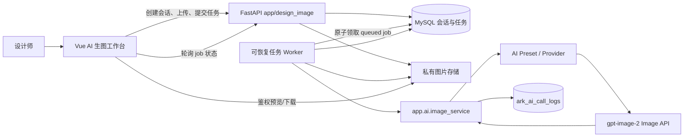

# 设计部 AI 生图工作台 · 产品与开发方案

> 日期：2026-08-05
>
> 状态：Phase 0–1 已完成，Phase 2 待实施
>
> 目标版本：V1
> 目标模型：`gpt-image-2`

Phase 0 的真实 Provider 证据与冻结结论见
[`2026-08-05-design-image-studio-phase0.md`](./2026-08-05-design-image-studio-phase0.md)。

## 1. 结论

方舟新增“设计中心 → AI 生图工作台”，前端采用类似 GPT 的会话列表、消息流、参考图上传和底部输入框；后端使用 **Image API + 方舟自建会话状态**，不使用 Responses API 保存完整上下文。

这不是复制 ChatGPT，而是解决设计师的核心任务：

1. 用自然语言生成第一版图片；
2. 选定任意历史版本继续修改；
3. 保留必要设计约束，但不重复发送全部聊天和历史图片；
4. 每次生成都有版本、用量、失败原因和审计记录；
5. 刷新页面或切换会话后，仍能看到正在生成的任务和历史结果。

核心技术决策：

| 决策 | 选择 | 为什么 | 对用户的影响 |
|---|---|---|---|
| 生图接口 | Image API：`/v1/images/generations` + `/v1/images/edits` | 可明确锁定 `gpt-image-2` | 模型一致，成本和效果可验证 |
| 上下文 | 方舟保存会话，调用时只发送“当前基准图 + 本轮要求 + 必要参考图” | 避免完整历史反复计费 | 连续改图仍然自然，成本增长更接近生成次数 |
| 长任务 | 数据库任务队列 + 可恢复 worker + 前端轮询 | 生图需几十秒到数分钟，进程重启不能丢任务 | 可以离开页面；刷新后状态不丢 |
| 文件 | 私有目录 + 鉴权预览/下载 | 现有 `/uploads` 是公开静态目录 | 内部设计素材不会因 URL 泄露 |
| 权限 | 独立 `design_image:*` 权限 | 不能把设计师提升为 `ai:admin` | 只获得生图能力，不获得模型/密钥管理权 |
| 成本控制 | 单用户并发、日额度、幂等请求、用量统计 | 防双击、重试和高频试图造成失控 | 用户能看到剩余额度，管理员可追踪用量 |

## 2. 第一性原理与成功标准

### 2.1 真正要解决的问题

设计师缺少的不是一个参数更多的“模型控制台”，而是一个低思考成本的迭代工作台：上传参考图、说出想法、看到结果、基于某一版继续修改。

因此 V1 不向用户暴露 Provider、模型名、Token、API 端点等技术概念。系统承担模型配置、参数合法性、文件预处理、任务恢复和成本治理。

### 2.2 V1 成功标准

- 设计师可在 30 秒内理解页面并发起第一次生成，无需阅读说明书。
- 支持纯文本首次生成，以及“基于此图继续修改”。
- 支持从任意历史结果继续修改，而不是永远默认最后一张。
- 同一会话连续完成至少 5 轮修改，刷新页面后历史和运行中状态不丢失。
- 客户端重复提交同一个 `request_id` 时只创建一个任务。
- 用户只能访问自己的会话和文件；管理员可查看部门用量，不默认浏览用户原图。
- 生成失败有可行动提示，不出现只有开发人员能理解的上游错误。
- 每次调用可追溯到用户、会话、任务、Preset、模型、耗时和用量。
- `pytest`、前端 Node 测试、`npm run build`、约定检查全部通过。

### 2.3 本方案的默认假设

- V1 会话默认仅创建人可见；`design_image:admin` 可查看用量与处理异常。
- 设计师不共享编辑同一会话；团队共享与协作留到后续版本。
- V1 每轮只生成 1 张图，避免一次请求多图造成成本不透明。
- 首期使用轮询，不引入 WebSocket/SSE。
- V1 保留会话历史，不提供删除/归档管理；保留策略和归档进入 V1.1。
- 页面属于主站，不做 `/expo/kiosk` 式全屏独立路由。

## 3. V1 范围

### 3.1 V1 包含

- 新对话、最近会话列表和分页加载；
- 文本生成图片；
- 上传参考图生成或编辑；
- 基于任意历史结果继续修改；
- 正方形、竖版、横版三种经过验证的尺寸；
- 生成中、成功、失败、重试状态；
- 原图灯箱、鉴权下载；
- 每日剩余额度和后台可查询用量；
- Provider/Preset、调用日志、超时、重试和快照脱敏复用现有 AI 基础设施。

### 3.2 V1.1 候选

- 会话搜索、重命名、归档、恢复和保留期清理；
- 质量档位；
- 可编辑的“固定约束”；
- 管理员图形化成本看板和按用户额度；
- 一键发布到素材中台。

### 3.3 不包含

- Responses API 原生对话链；
- Mask 局部涂抹与精确修补；
- 多人共享会话和实时协作；
- 一次生成多张候选图；
- 流式 partial image；
- 自动提示词优化模型；
- 公开分享链接；
- 视频生成；
- 自动发布到素材中台。

这些能力只有在 V1 真实使用数据证明必要后再进入 V2，避免先造复杂系统再找需求。

## 4. 官方接口边界与 Phase 0 验证

官方文档：

- 图像生成与编辑：<https://developers.openai.com/api/docs/guides/image-generation>
- `gpt-image-2` 模型：<https://developers.openai.com/api/docs/models/gpt-image-2>
- 当前定价：<https://developers.openai.com/api/docs/pricing>

### 4.1 允许使用的接口

| 场景 | 端点 | 主要字段 |
|---|---|---|
| 首次纯文本生成 | `POST /v1/images/generations` | `model`, `prompt`, `size`, `quality`, `output_format`, `output_compression` |
| 基于图片修改/参考图生成 | `POST /v1/images/edits` | multipart `model`, `prompt`, repeated `image`, `size`, `quality`, `output_format` |

服务端固定从 AI Preset 读取 `model=gpt-image-2`，客户端不能提交 model/provider/api_key。

`gpt-image-2` 的官方约束必须写入参数校验：

- `quality`: `low | medium | high | auto`；
- 常用尺寸先支持 `1024x1024`、`1024x1536`、`1536x1024`；
- 自定义尺寸必须满足边长不超过 3840、两边为 16 的倍数、宽高比不超过 3:1、总像素范围合法；
- 输出默认 PNG，也可用 JPEG/WebP；
- `gpt-image-2` 官方图片输入始终高保真。新 Preset 不配置 `input_fidelity`；不得为了本页面按模型名全局改写现有 Expo Preset 的参数行为；
- 响应中的 base64 必须落本地私有文件，不能存进业务表或调用日志。

### 4.2 实施前能力探针

现网 Provider 是 OpenAI-compatible 中转，不能把“官方支持”当成“中转一定支持”。编码前先用独立 Preset `design_image_generation` 完成以下探针：

1. `/images/generations` 是否支持 `gpt-image-2`；
2. `/images/edits` 是否支持多张重复 `image`；
3. `low/medium/high` 是否真实改变用量、耗时或输出；
4. 三种标准尺寸是否都有效；
5. 返回是 `b64_json` 还是 URL；
6. `usage` 返回哪些细分字段；
7. 400、429、502、503、504、ReadTimeout 的实际错误体；
8. 目标 Provider 的真实计价是否与 OpenAI 官方价格一致；
9. V1 固定拓扑是否可用：所有 `/api/design-image/*` 请求、Worker 和私有文件必须落在同一主实例。若入口无法按路径固定路由，则必须先改为共享 SMB/对象存储，不能上线“共享数据库 + 各实例本地磁盘”。

探针结果必须保存为脱敏测试记录。若质量参数未生效，V1 隐藏质量选择器，不能给用户一个“看起来可选、实际无效”的控制。

**2026-08-05 实测结论：** TeamRouter 同时支持 generation 与 repeated-image edit；三种标准尺寸有效；`low/medium/high` 会显著改变 image output tokens 和耗时，证明参数未被完全忽略，但本轮未保存画面做盲评，不能宣称视觉质量必然提高；响应为 `b64_json`；usage 含文本/图像输入输出细分。V1 可保留三档并默认 `medium`，灰度期补设计师盲评。429、502、503、504 与 ReadTimeout 未在本轮自然出现，未通过压测或故障注入刻意制造；生产首次观察到时继续补充脱敏错误体。TeamRouter 未公开可核验价格，不能把 OpenAI 官方价格当作供应商账单。

## 5. 用户体验方案

### 5.1 信息架构

导航调整：

- 将现有“设计预约”分组标题改为“设计中心”；
- 新增 `/design/image-studio`，页面名“AI 生图工作台”；
- 原预约、甘特图、统计等入口保持位置和权限不变。

桌面页面采用两栏结构：

```text
┌──────────────┬───────────────────────────────────────────┐
│ 新对话        │ 当前会话                       今日剩余  │
│ 最近会话      ├───────────────────────────────────────────┤
│              │ 用户要求                                  │
│ 今天         │ [参考图]                                  │
│ 昨天         │                                           │
│ 更早         │ [生成中 / 结果图 / 失败卡片]               │
│              │  下载  查看大图  基于这张图修改            │
│              ├───────────────────────────────────────────┤
│              │ [附件缩略图] 输入你想生成或修改的内容...  │
│              │ 比例：竖版                         发送   │
└──────────────┴───────────────────────────────────────────┘
```

窄屏时左上角提供“会话”按钮打开抽屉；选择会话后自动关闭。页面只允许消息区滚动，Composer 固定在内容区底部并避开软键盘安全区，禁止页面和消息区双滚动。V1 仍以 1366px 以上设计部门桌面场景为主。

### 5.2 核心交互

#### 第一次生成

1. 用户输入描述，可选上传 1～4 张参考图；
2. 选择比例；
3. 点击发送后立即出现用户消息和“排队中”结果卡；
4. 页面保持可操作，用户可以切换会话或离开；
5. 完成后卡片自动展示结果并提供下载、查看大图、继续修改。

#### 连续修改

1. 用户点击某张结果的“基于此图继续修改”；
2. 输入框上方显示所选图片缩略图和“基于这张图修改”，支持一键清除；不向用户暴露版本号或数据库资产概念；
3. 本轮请求只发送该基准图、本轮要求和额外参考图；
4. 新结果在后台记录 `source_asset_id`，用户只看到自然的对话结果。

#### 上下文记忆

V1 不增加需要设计师维护的“固定约束”面板。最终请求由服务端组装：

```text
[当前基准图说明，仅编辑时]
[本轮用户要求]
[保持未提及部分不变]
```

最新基准图承载可见设计状态，完整历史消息仅用于页面展示，不逐轮发送给图片接口。品牌名称、包装文字等高风险文字必须在结果卡提示“AI 文字可能出错，正式物料使用前必须校对”；需要绝对准确的文字应在后续排版环节叠加，而不是承诺图片模型一次写对。

### 5.3 反馈与错误文案

| 状态 | 页面反馈 |
|---|---|
| queued | “已进入队列，可以离开页面，完成后会保留在这里” |
| running | “正在生成，通常需要几十秒到数分钟” |
| 429 | “当前生成任务较多，请稍后手动重试” |
| moderation blocked | 指出需要调整提示词或参考图，不自动原样重试 |
| timeout | “模型本次响应超时，本轮已停止；可以修改要求后重试” |
| provider unavailable | “生图服务暂时不可用，任务已保留，请稍后重试” |
| quota exceeded | “今日额度已用完；如为紧急设计任务，请联系管理员调整” |

不能把 `HTTPStatusError`、Provider 域名或代理错误原样显示给设计师；完整错误保留在管理员日志。

### 5.4 动效规范

动效只服务于状态理解和反馈：

- 生成结果出现：opacity + `scale(0.97→1)`，160～200ms，自定义 ease-out；
- 发送按钮按压：`scale(0.97)`，100～160ms；
- 生成中：小面积 Skeleton/Shimmer，只展示真实状态 `queued/running`，不虚构模型内部阶段；
- 灯箱/抽屉：200～250ms；
- 不给消息列表和高频切换增加装饰性入场动画；
- 只动画 `transform` 和 `opacity`，禁止 `transition: all`；
- 支持 `prefers-reduced-motion`，移动位移降为淡入；
- 大图片列表不使用 `backdrop-filter`，缩略图懒加载，原图在灯箱或下载时读取。

## 6. 系统架构



### 6.1 模块边界

新增领域 `backend/app/design_image/`，不塞进现有设计预约模块，也不把业务接口挂进需要 `ai:admin` 的 `/api/ai`。

```text
backend/app/design_image/
├── __init__.py
├── models.py          # 会话、消息、资产、任务、任务资产关联
├── schemas.py         # API 输入输出与枚举
├── service.py         # 所有权、会话、上下文、状态流、额度
├── router.py          # 权限、参数接收、统一 ok() 信封
├── file_service.py    # 私有文件验证、归一化、落盘、下载
└── worker.py          # 任务领取、调用、落图、恢复、失败回写
```

共享 AI 层只补通用图片能力：

- `app.ai.image_service.generate_image()`；
- `edit_image()` 保持兼容；
- 从 `app.ai.service` 统一 re-export，业务域从 facade 调用；
- 保留现有超时、502/503 快速重试、代理和日志机制；
- 新 `design_image_generation` Preset 不配置 `input_fidelity`；现有 Expo edit 行为保持不变；
- usage 原始细节写入 `AiCallLog.usage_detail`，响应快照继续去除 base64。

在改代码前先更新 `CLAUDE.md` 的 AI 调用规则：文本调用仍从 `app.ai.service.chat` 进入，业务图片调用允许从同一 facade 导入 `generate_image/edit_image`。规则先于实践修改。

### 6.2 数据模型

#### `ark_design_image_sessions`

| 字段 | 说明 |
|---|---|
| `id` | BIGINT 主键 |
| `owner_user_id` | 创建人，所有查询强制过滤 |
| `title` | 首轮提示词自动截取，允许用户改名 |
| `status` | V1 固定 `active`，为后续归档保留 |
| `created_at/updated_at` | 审计字段 |

#### `ark_design_image_messages`

| 字段 | 说明 |
|---|---|
| `id/session_id` | 消息及所属会话 |
| `role` | `user/assistant/system` |
| `content` | 用户要求、成功说明或可行动失败提示 |
| `status` | `normal/pending/succeeded/failed` |
| `created_at` | 展示排序 |

#### `ark_design_image_assets`

| 字段 | 说明 |
|---|---|
| `id/session_id/message_id` | 资产归属 |
| `asset_type` | `upload/generated/thumbnail` |
| `storage_path` | 相对私有根目录的路径 |
| `mime_type/file_size/width/height/sha256` | 文件元数据 |
| `source_asset_id` | 基于哪一张图生成，后台可追溯 |
| `status/expires_at` | 上传图状态为 `draft/attached`；未发送草稿 24 小时后可清理。列名遵守项目命名宪法，不使用禁用词 `state` |
| `created_by/created_at/deleted_at` | 审计与软删除 |

#### `ark_design_image_jobs`

| 字段 | 说明 |
|---|---|
| `id/owner_user_id/session_id/request_message_id` | 任务归属；owner 冗余用于数据库幂等唯一约束 |
| `base_asset_id` | 编辑基准图；首次生成为空 |
| `mode` | `generate/edit`，由服务端确定 |
| `status` | `queued/running/succeeded/failed` |
| `prompt_snapshot/parameters` | 实际发送的文字和参数快照 |
| `preset_name/model` | 调用配置快照 |
| `ai_call_log_id` | 关联共享调用日志 |
| `idempotency_key` | `UNIQUE(owner_user_id,idempotency_key)`，防重复任务 |
| `output_asset_id/response_message_id` | 成功产物和助手消息 |
| `retry_of_job_id` | 用户手动重试链 |
| `claimed_by/lease_token/lease_expires_at` | Worker 租约，防迟到回写 |
| `claim_count/provider_attempt_count` | Worker 领取次数与实际 HTTP 发送次数分开记录 |
| `error_code/error_message/billing_certainty` | 故障与费用是否可确认 |
| `input/output/total_tokens` | 用量快照 |
| `estimated_cost_microusd/pricing_snapshot` | 可选估算，价格规则可追溯 |
| `started_at/finished_at/created_at` | 队列与耗时分析 |

#### `ark_design_image_job_assets`

| 字段 | 说明 |
|---|---|
| `job_id/asset_id` | 任务与额外参考资产 FK；基准图只存 jobs.base_asset_id，避免双真相 |
| `role` | V1 固定 `reference`，为未来 mask 等角色保留 |
| `position` | 保持额外参考图发送顺序；调用时服务端把 base_asset_id 放在第一张 |

资产被任务引用后 FK 使用 `RESTRICT`，避免“任务创建与删除资产”竞态。用量不建第二张聚合真相表：提交任务时先锁当前 `ark_users` 用户行，再根据带索引的 jobs 查询当天 accepted 数和 queued/running 数；统计从 jobs 与 `AiCallLog` 派生。时区统一使用 `Asia/Shanghai`。

### 6.3 状态机

```text
queued ──claim──> running ──success──> succeeded
   │                  │
   └──validation────> failed <──timeout/provider/moderation──┘
```

- `queued` 写入数据库后才向前端返回 202；
- Worker claim 时写入 `lease_token/lease_expires_at/claimed_by`；所有成功或失败回写必须同时匹配 `status=running AND lease_token=<本次租约>`；
- 进程重启后 queued 仍可继续；
- stale recovery 先使租约失效再终结任务；阈值必须大于 Provider timeout + URL 落图 + 缓冲；迟到 Worker 只能记录 orphan response，不能发布资产或覆盖终态；
- V1 不承诺真正取消 running 请求，因为上游调用开始后费用可能已产生；
- “重试”创建新 job，并关联原 job，不能原地重置导致审计丢失。

### 6.4 私有文件策略

- 新增 Settings：`DESIGN_IMAGE_STORAGE_ROOT`，默认部署值建议 `D:\\WORKSOURCE\\design-image`；
- 不使用公开 `/uploads`；
- 仅接受 JPEG/PNG/WebP；前后端限制以服务端为准；
- 用户可选择最大 20MB 的原图、最多 4 张额外参考图、解码后像素不超过 60MP；浏览器发送前必须自动归一化，使单次 multipart 请求不超过 4MB，以落在主站 Nginx 5MB 上限内；
- Pillow 检查真实格式、尺寸和解码炸弹，修正 EXIF 方向并剥离元数据；
- 输入归一化最长边建议 2048px，是否进一步压缩由能力探针和成本实测决定；
- 生成结果落本地后再把任务改为 succeeded，避免数据库成功但文件不存在；
- 存储路径使用 UUID 和相对路径，下载前调用 `resolve()` 检查仍位于私有根目录；
- 私有根及其父目录只允许生图服务账号写入，禁止符号链接和 junction/reparse point；进程内文件写入和删除必须串行化。代码负责拒绝路径越界与 reparse point，部署巡检负责验证 ACL。拥有该服务账号或宿主机文件系统写权限的主体不属于 V1 应用层文件隔离威胁模型；
- 预览/下载端点必须同时验证权限与 owner，跨用户统一返回 404，避免泄露资源是否存在。
- V1 优先强制 Provider 返回 `b64_json`。如必须支持远程 URL：只允许 HTTPS 和 Provider 配置的显式下载域名；逐跳校验重定向及 DNS 结果，拒绝 loopback、RFC1918、link-local、metadata 和 IPv6 私网；流式限量下载，不转发 Authorization，并覆盖 DNS rebinding/302 跳内网测试。

## 7. API 契约

统一前缀：`/api/design-image`；统一信封：`{"code","message","data"}`。

| 方法 | 路径 | 权限 | 说明 |
|---|---|---|---|
| `GET` | `/config` | `design_image:read` | 返回可用尺寸/质量、附件限制、今日剩余额度；不返回密钥和 Provider |
| `POST` | `/sessions` | `design_image:write` | 新对话；首轮发送时也可隐式创建 |
| `GET` | `/sessions` | `design_image:read` | 当前用户最近会话，游标分页 |
| `GET` | `/sessions/{id}` | `design_image:read` | 会话、消息、资产和运行中任务 |
| `POST` | `/sessions/{id}/assets` | `design_image:write` | multipart 预上传草稿参考图，24 小时未发送自动过期 |
| `DELETE` | `/assets/{id}` | `design_image:write` | 删除尚未被任务引用的上传图 |
| `POST` | `/sessions/{id}/turns` | `design_image:write` | 创建用户消息和 queued job，返回 202 |
| `GET` | `/jobs/{id}` | `design_image:read` | 轮询任务；无全局 loading |
| `GET` | `/jobs/active` | `design_image:read` | 返回当前用户 active job 及所属会话，供切换/刷新恢复 |
| `POST` | `/jobs/{id}/retry` | `design_image:write` | 复制原始输入创建新任务 |
| `GET` | `/assets/{id}/content` | `design_image:read` | 鉴权预览或下载 |
| `GET` | `/usage` | `design_image:admin` | V1 后台查询：按用户/日期/状态统计用量 |

创建 turn 请求示例：

```json
{
  "request_id": "uuid-from-client",
  "prompt": "把背景换成高端门店，人物和发型保持不变",
  "base_asset_id": 123,
  "reference_asset_ids": [456],
  "size": "1024x1536",
  "quality": "medium"
}
```

规则：

- 有 `base_asset_id` → edit；没有 → generate；
- 前端不能提交 `mode=auto` 让模型猜，也不能提交 model；选中的“基于这张图修改”缩略图就是本轮唯一 `base_asset_id`；
- `base_asset_id` 和所有 reference ID 必须属于当前用户、当前会话；
- 同一用户相同 `request_id` 返回原任务，不重复扣额度；
- 先查幂等，再锁用户行并检查额度；唯一键冲突时整笔事务回滚，再按 owner + request_id 返回原任务；
- 参数白名单由服务端返回的 `/config` 决定，非法值 422；
- 所有列表接口限定 owner；管理员跨用户查询走独立 usage API，不绕过资产权限；
- HTTP 状态使用 202，但 `ok()` 信封业务 `code` 保持 200，兼容现有前端拦截器。

图片不能直接把鉴权 URL放进 ``：Bearer Token 不会自动附加。前端 `designImage.js` 必须提供 `getAssetBlob(id)`，通过现有 API Client 使用 `responseType:'blob'`，再创建 Object URL；消息切换、资源替换和组件卸载时调用 `URL.revokeObjectURL()`。下载同样走鉴权 blob。

草稿附件规则：上传成功即属于当前会话并标记 `draft`；会话详情返回未过期 draft，刷新可恢复；发送 turn 时事务内关联 job 并转为 `attached`；用户清除附件即 DELETE；定时任务只清理未引用且已过期的 draft。

## 8. 成本与用量治理

### 8.1 成本公式

单轮成本由以下部分构成：

```text
文字输入 Token
+ 编辑时的图片输入 Token
+ 图片输出 Token
+ 中转 Provider 可能存在的服务加价
```

连续对话不会自动把每轮调用变成多次调用，但每生成或编辑一张图都会产生一次新的图片输出成本。编辑还会增加基准图和参考图的输入成本。

### 8.2 V1 控制策略

- 单用户同时最多 1 个 queued/running 任务；提交时锁 `ark_users` 用户行后查询 jobs，不维护 `active_jobs` 聚合计数器；
- 全局 Worker 并发建议从 3 开始，依据 Provider rate limit 调整；
- 建议试点日额度 20 次/人，通过 Settings 或数据库配置，不写死在前端；
- 额度按“已接受任务”计数，失败也保留审计，因为上游失败不代表一定未产生费用；
- 发送按钮在上传或提交中禁用，服务端 `idempotency_key` 再兜底；
- 不发送全部历史图片，只发送基准图和本轮必要参考图；
- 默认使用经过实测的标准尺寸；4K 属实验性输出，不在 V1 暴露；
- 质量档位只有在中转实测生效后开放；
- 429 不自动重试，统一引导用户稍后手动重试；
- V1 `/usage` 返回任务数、成功率、P50/P95 耗时、输入/输出 Token、失败类型、按用户用量和估算费用；图形化管理员看板进入 V1.1；
- 价格表不硬编码官方当前价格。估算使用可配置 rate card，并在每个 job 保存 pricing snapshot。
- `claim_count`、`provider_attempt_count`、`retry_of_job_id` 分开；无 usage 的请求标记 `billing_certainty=unknown`，不能展示为“零成本”。

### 8.3 试点期决策指标

一周试点后依据实际数据决定额度和默认档位：

- 每位设计师日均/峰值生成次数；
- 首次可用图比例；
- 平均每个任务的迭代轮数；
- 失败率与主要错误；
- P50/P95 耗时；
- 单张与单会话平均估算成本；
- 用户是否频繁需要多图、局部蒙版或素材中台发布。

## 9. 权限、隐私与安全

### 9.1 权限

新增：

- `design_image:read`：进入页面、查看自己的会话和文件；
- `design_image:write`：上传、生成、编辑和重试；
- `design_image:admin`：查看用量和处理异常。V1 日额度为全局配置，不承诺页面内按用户调整。

`super_admin` 延续现有自动绕过。权限在 `auth/service.py` seed upsert 后重启后端，再在角色管理页给设计部角色分配。

### 9.2 安全边界

- API Key 继续加密存储在 `ark_ai_providers`，不进入代码、日志或前端；
- 设计师只调用业务路由，不拥有 `ai:admin`；
- 文件 URL 必须鉴权，禁止公开静态路径；
- 不信任扩展名、MIME、文件名和客户端 width/height；
- Prompt 和参考图会发送给当前配置的第三方 AI Provider，页面首次使用时需明确提示；
- `AiCallLog` 可保存 Prompt 快照，但必须继续脱敏 base64；
- 日志详情只对 AI 管理员开放；
- moderation 的用户可修正错误不自动原样重试；
- `_send_with_retry()` 必须把实际 HTTP 发送次数返回给 job；承认“上游已生成但响应丢失”可能造成重复计费，不能对用户承诺 exactly-once 外部调用。

## 10. 前端工程方案

```text
frontend/src/
├── api/
│   └── designImage.js
├── views/design/image-studio/
│   ├── ImageStudio.vue
│   ├── composables/useImageStudio.js
│   ├── components/ConversationSidebar.vue
│   ├── components/MessageThread.vue
│   ├── components/PromptComposer.vue
│   ├── components/GenerationCard.vue
│   └── state.js
```

复用规则：

- API Client 在 `api/clients.js` 登记，禁止新建 axios；
- 导航只改 `config/navigation.js`，不在 router/MainLayout 重复注册；
- 上传使用 `AppUpload`，但采用 `show-list=false + composable 自管数组`，避免并发上传快照丢附件；
- 轮询复制 `useTryOnFlow.js` 的 `pollBusy + pollGen + stopPolling` 模式；
- 页面级 active-job registry 持续跟踪当前用户唯一 active job；会话列表显示所属会话状态，切换/刷新通过 `/jobs/active` 恢复，不只轮询当前打开会话；
- 鉴权图片统一由 `getAssetBlob()` 加载，集中管理 Object URL 创建与释放；
- 会话布局参考 `WhatsAppConnector.vue`，不复制其中的裸色值；
- 长任务 API 使用 `showLoading:false`、轮询使用 `suppressToast:true`，状态反馈放进结果卡；
- 按钮使用 `GlassButton`，颜色只用 `tokens.css`；
- 主 Vue 文件保持薄壳，单文件超过 500 行必须拆 composable/组件；
- 纯状态转换放进 `state.js`，用现有 Node test 验证，不为一期单独引入 Vitest/Playwright。

## 11. 具体文件清单

| 动作 | 文件 | 职责 |
|---|---|---|
| 修改 | `CLAUDE.md` | 先明确业务图片调用 facade 规则 |
| 新建 | `backend/app/design_image/{models,schemas,service,router,file_service,worker}.py` | 新领域 |
| 修改 | `backend/app/ai/image_service.py` | 增加 generation、usage detail、gpt-image-2 参数约束 |
| 修改 | `backend/app/ai/service.py` | re-export 图片调用 facade |
| 修改 | `backend/app/ai/models.py` | 新增 nullable `AiCallLog.usage_detail`，即使 Provider 不返回细分也保持 schema 稳定 |
| 修改 | `backend/app/core/config.py` | 私有根目录、额度、worker 参数 |
| 修改 | `backend/app/auth/service.py` | 三个权限码 |
| 修改 | `backend/app/routers.py` | 注册 `/api/design-image` |
| 修改 | `backend/app/schedulers/registry.py` | 注册可恢复 worker 与 stale recovery |
| 新建 | `backend/alembic/versions/<next>_design_image_studio.py` | 表、索引、FK、usage detail |
| 新建 | `backend/tests/test_design_image_*.py` | 领域、API、worker、权限、文件测试 |
| 修改 | `backend/tests/test_ai_image_service.py` | generations 与 usage 测试 |
| 新建 | `frontend/src/api/designImage.js` | 业务 API |
| 修改 | `frontend/src/api/clients.js` | client 登记 |
| 修改 | `frontend/src/config/navigation.js` | 设计中心与页面入口 |
| 新建 | `frontend/src/views/design/image-studio/*` | 页面、组件、composable、纯状态 |
| 新建 | `frontend/tests/designImageState.test.mjs` | 轮询、状态、基准图、附件测试 |
| 修改 | `docs/api-reference.md` | 新端点 |
| 修改 | `docs/database.md` | 新表 |
| 修改 | `docs/architecture.md` | 新领域与任务流 |
| 修改 | `docs/module-notes.md` | Provider 能力和运行教训 |
| 修改 | `docs/runbook.md` | Preset、存储、worker、故障排查 |

## 12. 分阶段实施计划

### Phase 0：文档与 Provider 能力冻结（已完成）

实施：

- 完成第 4.2 节探针；
- 在 AI 后台创建独立 `design_image_generation` Preset，model 必须为 `gpt-image-2`；
- 确认 Nginx multipart body 上限；V1 固定 `/api/design-image/*` 到唯一主实例，该实例同时运行 worker 并持有私有存储。若当前入口无法固定路由，则先落共享存储方案；
- 把实际支持的尺寸、质量、usage 字段和价格来源写入能力记录。

验证：

- 用一张非敏感测试图完成 generation 和 edit；
- 验证新 Preset 未发送 `input_fidelity`，并验证 Expo 既有链路行为未改变；
- 保存 request ID、耗时、usage 和脱敏响应，不保存密钥/base64。

禁止：

- 不根据 OpenAI 官方能力猜测中转能力；
- 不复用或改写 `expo_wig_composite` Preset；
- 不在前端硬编码质量档位。

完成证据：[`2026-08-05-design-image-studio-phase0.md`](./2026-08-05-design-image-studio-phase0.md) 与
[`evidence/2026-08-05-design-image-provider-probe.json`](./evidence/2026-08-05-design-image-provider-probe.json)。

### Phase 1：迁移、模型、权限与配置（已完成）

实施：

- 先执行 `git log --all --oneline -- backend/alembic/versions/`，确认所有分支无迁移撞号；
- 先更新 `CLAUDE.md` 的图片调用 facade 规则；
- 新增数据表、索引、外键、租约字段、任务资产关联表和用户范围幂等唯一约束；
- 新增领域四件套骨架与配置；
- 新增 `design_image:read/write/admin`；
- 所有 relationship 默认 `noload`。

验证：

- `alembic upgrade head`；
- `alembic heads` 只有一个 head；
- 权限重启后存在且元数据正确；
- SQLite 测试 metadata 能创建新表。

禁止：

- revision ID 不超过 32 字符；
- 不把迁移交给未经审查的 autogenerate；
- 不把业务模型放进冻结的共享 models 目录。

完成证据：提交 `5ffce35` 与 `52cb243`；共享 MySQL 已升级至唯一 head
`089_design_image_studio`，目标回归 32 项通过，规格与代码质量两轮独立审查均批准。

### Phase 2：共享图片调用与私有文件

实施：

- 在现有 `image_service.py` 增加 `generate_image()`；
- generation/edit 共用 provider、headers、重试、usage、日志和响应解析；
- `design_image_generation` 不配置 `input_fidelity`，不按模型名全局删除现有参数；
- 增加私有文件验证、归一化、保存、读取和缩略图；
- Provider 返回 URL 时由后端安全下载后落私有目录。

验证：

- 单测覆盖 JSON generations、multipart edits、多参考图顺序、三种响应格式；
- 覆盖 400/429/502/503/504/ReadTimeout；
- 日志中不存在 base64；
- 路径穿越、伪 MIME、超体积、超像素文件被拒绝。
- URL 响应覆盖 HTTPS host 白名单、逐跳重定向、DNS rebinding、内网地址和超大 body；优先通过 b64 路径完成上线。

禁止：

- 业务域不得自己创建 httpx/axios 客户端调用模型；
- 不把 data URL 写入业务表；
- 不把私有图放到 `/uploads`。

### Phase 3：会话、上下文、队列与 API

实施：

- 完成会话/消息/资产/任务/日用量 service；
- 事务内完成：先查幂等、锁用户行、所有权与额度检查、user message、queued job；
- Worker 使用租约原子 claim、调用、落图、assistant message、状态收尾；
- stale running 先失效租约再失败收口，迟到 Worker 不得覆盖终态或发布资产；
- 完成第 7 节 API；
- 跨用户资源统一返回 404。

验证：

- 并发重复 request_id 只生成一个 job；
- 单用户并发上限在竞争条件下仍有效；
- 进程重启后 queued 能继续，stale running 能失败收口；
- 多实例模拟下过期租约的迟到响应不能覆盖新终态；
- 基于 V2 分支时实际调用使用 V2，而不是会话最新图；
- 每个端点有 permission dependency 和 `ok()` 信封。

禁止：

- 不复制 Expo daemon thread；
- 不把业务逻辑写进 router；
- 不把“最后一张图”隐式当作用户选择。

### Phase 4：前端工作台

实施：

- 导航、API Client、会话列表、消息流、Composer、上传、结果卡、灯箱；
- 轮询代际守卫、在途守卫、页面卸载清理；
- 恢复进入会话时仍在运行的 job；
- “基于这张图修改”显示图片缩略图，不显示版本号；
- 鉴权图片通过 blob 加载，Object URL 在切换和卸载时释放；
- 今日额度与错误引导；
- 1366px、1440px 和窄屏抽屉布局。

验证：

- Node test 覆盖状态只前进不倒退、旧会话迟到响应不污染当前会话、重试生成新 job、基准图 ID、附件并发；
- `npm run build`；
- 无权限账号看不到菜单且直达 403/跳转；
- 刷新、切换会话、生成失败、下载、灯箱均通过手工验收。

禁止：

- 不使用全局 loading 遮住长任务；
- 不使用无守卫 `setInterval`；
- 不直接依赖 `AppUpload` 多选 v-model 快照；
- 不写裸 hex、`.glass-card` 或动态极光。

### Phase 5：用量、运维、文档与上线

实施：

- 用量 API；图形化管理员看板、会话归档/搜索/保留期进入 V1.1；
- 配置试点额度、Worker 并发和租约/stale 阈值；
- 文档五处同步；
- 先给 2～3 名设计师灰度一周，再分配给全设计部角色。

验证：

- 真实 Provider 低档完成一次首次生成和三轮连续编辑；
- 调用日志、job、文件、usage 数字能互相对上；
- `python scripts/check_conventions.py`；
- `cd backend && pytest`；
- `cd frontend && node --test tests/designImageState.test.mjs`；
- `cd frontend && npm run build`；
- `python scripts/git_sweep.py`。

禁止：

- 不在未验证 Provider 能力前全员开放；
- 不声称失败请求一定不计费；
- 不把 main push 当部署方式，部署走项目命令。

## 13. 测试矩阵

### 13.1 后端自动化

- generation 参数白名单与 URL；
- edit 多图顺序：基准图第一，参考图随后；
- 新 `design_image_generation` Preset 请求不发送 `input_fidelity`，Expo 既有测试保持通过；
- Provider/Preset 禁用、模型错误、无密钥；
- base64/URL 落盘和日志脱敏；
- 会话 owner 隔离、管理员边界；
- idempotency、并发额度、日额度跨日期；
- `UNIQUE(owner_user_id,idempotency_key)` 竞争冲突回原 job；
- queued/running/succeeded/failed 状态流；
- Worker 多实例原子 claim；
- 租约 claim、续期/失效、stale recovery 和迟到响应隔离；
- 重试创建新 job；
- 文件格式、大小、像素、路径穿越和已引用删除；
- 所有 API 的 401/403/404/422/202 与统一信封。

### 13.2 前端自动化

- navigation 条目和权限；
- 任务状态单调推进；
- 旧会话迟到响应丢弃；
- 重复发送守卫；
- 上传中禁止发送；
- 附件并发完成不丢项；
- 基于指定历史图发送正确 ID；
- 重新进入会话只轮询 active job；
- 鉴权 blob 能显示，切换会话和卸载后 Object URL 已释放；
- 失败重试替换为新 job ID，旧记录保留。

### 13.3 人工验收

1. 无参考图生成第一张；
2. 上传 4 张参考图生成；
3. 连续修改 5 轮；
4. 回到较早结果，点击“基于这张图修改”产生新结果；
5. 生成中刷新和切换会话；
6. 网络断开后恢复；
7. Provider 超时、余额不足、moderation blocked；
8. 达到并发和日额度；
9. 跨账号直接访问资产 URL；
10. 灯箱、下载文件名和尺寸；
11. 1366px、1440px、窄屏；
12. reduced motion。
13. 从每个可能承接 `/api/design-image` 的入口读取同一个 asset；V1 单实例路由未锁定时禁止上线。

## 14. 上线、回滚与运维

### 上线顺序

1. Provider 能力探针和独立 Preset；
2. 迁移并验证单 head；
3. 后端部署，先不分配权限；
4. 确认 Worker 实例、存储目录权限和日志；
5. 前端构建部署；
6. 给试点角色分配权限；
7. 一周后评估全量。

### 回滚原则

- 关闭 `design_image_generation` Preset 或撤回角色权限即可立即停止新任务；
- 前端入口由权限隐藏，不依赖删除数据；
- 已 queued 的任务可统一标记 failed；running 任务先使租约失效，迟到响应不得发布结果；
- MySQL DDL 不做自动 downgrade；保留新表不影响旧代码；
- 文件清理与数据库回滚分开，禁止回滚时递归删除整个存储根目录。

### 运维告警

- 连续 5 分钟无 Worker claim；
- queued 最老等待超过 2 分钟；
- running 超过配置阈值；
- 1 小时错误率超过 20%；
- 存储剩余空间低于阈值；
- Provider 401/403、余额不足、429 持续出现；
- daily usage 与 AiCallLog 数量明显不一致。

## 15. 对抗性审查：最可能失败的地方

| 风险 | 结果 | 方案中的防线 |
|---|---|---|
| 中转声称支持参数但实际忽略 | 用户付费但档位无效果 | Phase 0 实测，不生效就隐藏 |
| 刷新/重启丢生成任务 | 页面永久“生成中” | DB 队列、worker、租约和 stale recovery |
| 双击/网络重试创建两单 | 重复扣费 | 客户端守卫 + 用户范围幂等键 |
| 用户回看旧图却编辑最新图 | 版本不可控 | 显式 base_asset_id + source_asset_id |
| 每轮回传全部历史图片 | 成本快速上升 | 当前基准图 + 本轮要求和引用 |
| 图片放公开 uploads | 内部素材泄露 | 私有根目录 + owner 鉴权 FileResponse |
| 生成成功但落盘失败 | DB 显示有图但打不开 | 先落盘校验，再提交 succeeded |
| 多实例重复消费 | 同一任务两次调用 | 原子条件更新 claim |
| 迟到 Worker 覆盖新终态 | 重复计费、状态倒退 | lease token 条件回写，迟到响应只记 orphan |
| 共享 DB 但本机文件不共享 | 图片随机 404 | V1 API/Worker/存储固定同一主实例；否则使用共享存储 |
| Worker 只在关闭 Scheduler 的云实例 | 队列无人处理 | Phase 0 固定主实例并监控 claim |
| running 取消被理解为不收费 | 用户误解 | V1 不提供假取消，文案说明调用已开始 |
| 价格硬编码后过期 | 成本看板失真 | 可配置 rate card + job 定价快照 |
| 输出/输入 base64 写日志 | 数据库膨胀与泄露 | 现有快照脱敏 + 自动测试 |

## 16. 工作量与里程碑建议

| 里程碑 | 范围 | 建议工作量 |
|---|---|---|
| M0 | 能力探针、接口与核心交互确认 | 1～2 个开发日 |
| M1 | 迁移、共享图片调用、私有文件 | 2～3 个开发日 |
| M2 | 会话、任务队列、API、测试 | 3～4 个开发日 |
| M3 | 核心前端工作台、状态测试、视觉验收 | 2～3 个开发日 |
| M4 | 用量查询、文档、部署、灰度 | 1～2 个开发日 + 1 周试点 |

V1 建议按 **9～14 个开发日 + 1 周灰度** 规划；V1.1 的搜索/归档/固定约束/管理看板另计 3～5 个开发日。Phase 0 已消除 generations、edits、quality、标准尺寸和 usage 的兼容性不确定性；剩余外部不确定性主要是 TeamRouter 实际账单价格、自然发生的限流/网关错误体和生产时段延迟分布。

## 17. 最终验收清单

- [x] `design_image_generation` 独立 Preset，实际 model 为 `gpt-image-2`
- [x] 首次 generation 和后续 edit 均通过真实 Provider 验证
- [ ] 完整历史不逐轮发送，基准图选择可追溯
- [ ] 单用户并发、日额度、幂等生效
- [ ] queued 可恢复，租约/stale running 可收口，迟到响应不覆盖终态
- [ ] 私有文件跨账号访问返回 404
- [ ] 鉴权 blob 图片可显示且 Object URL 无泄漏
- [ ] `/api/design-image`、Worker 与私有存储拓扑已固定并验证
- [ ] 调用日志无 base64，usage/job/文件能关联
- [ ] 页面刷新、会话切换、失败重试不丢状态
- [ ] UI 对照 `DESIGN.md`，动效通过 motion 标准检查
- [ ] `docs/api-reference.md`、`docs/database.md`、`docs/architecture.md`、`docs/module-notes.md`、`docs/runbook.md` 已同步
- [ ] `python scripts/check_conventions.py` 通过
- [ ] `cd backend && pytest` 通过
- [ ] `cd frontend && node --test tests/designImageState.test.mjs` 通过
- [ ] `cd frontend && npm run build` 通过
- [ ] 独立 agent 完成边界、并发、幂等、迁移与前后端契约审查
