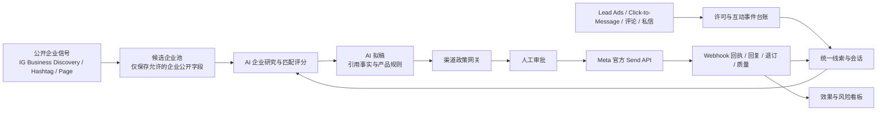

# Meta 官方接口销售自动化评估方案

> - 评估日期：2026-08-13
> - 适用范围：莱莎使用 Instagram、WhatsApp、Facebook 开展客户调研、线索获取、开发话术生成、合规触达、会话跟进与效果归因
> - 证据口径：Meta/WhatsApp 官方开发者文档、平台条款及监管机构原文；价格和权限以正式开通当日后台为准
> - 法律声明：本文用于产品和技术立项，不替代目标国家/地区律师的正式法律意见

## 一、结论摘要

### 1.1 最终判断

本项目可以做，但目标必须从“AI 在三个平台自动搜索客户并批量发陌生开发信”调整为：

> **用官方允许且范围有限的公开企业数据和广告找到企业线索，形成可追溯的客户研究；让潜客通过广告、主页内容、评论、私信或表单先进入许可链路；AI 负责研究、分级、拟稿和跟进建议；所有发送由渠道政策网关决定是否允许，高风险首触达由人工审批。**

原因不是技术做不到，而是 Meta 官方接口从产品层面就没有开放“全网个人搜索 + 陌生私信群发”：

- Instagram/Facebook Messenger 的普通消息要求用户先与企业主页或专业账号互动；标准消息窗口通常为用户互动后的 24 小时。Instagram/Facebook 评论可触发一次私密回复，但只有对方回复后，才进入可继续对话的 24 小时窗口。[Meta Send API](https://developers.facebook.com/documentation/business-messaging/messenger-platform/send-messages)、[Instagram 私密回复](https://developers.facebook.com/documentation/business-messaging/instagram-messaging/features/private-replies)、[Facebook 私密回复](https://developers.facebook.com/documentation/business-messaging/messenger-platform/discovery/private-replies)
- WhatsApp 允许企业发起会话，但企业必须已经获得电话号码和明确的 WhatsApp opt-in；企业主动消息必须使用获批模板，24 小时客户服务窗口内才可发送自由格式消息。[WhatsApp Business Messaging Policy](https://whatsappbusiness.com/policy/)
- Meta 开放平台条款禁止未经有效许可建立或扩充用户画像，也禁止将开放平台数据用于文档所列允许用途之外的目的。[Meta Platform Terms](https://developers.facebook.com/terms/dfc_platform_terms/)

因此，建议立项，但分为两条主线：

1. **近期主线：自有账号的官方化接入。** 接入 WhatsApp Cloud API、Instagram Messaging API、Facebook Messenger/Pages API 和 Lead Ads Webhook，实现线索进入、AI 研究、人工审批、合规发送、会话同步与退订。
2. **获客主线：让客户先发起或先授权。** 使用 Click-to-WhatsApp、Click-to-Messenger、Instagram/Facebook Lead Ads、主页内容和评论私密回复，把冷流量转成可合规跟进的暖线索。

### 1.2 不建议做的方案

| 方案 | 判断 | 原因 |
|---|---|---|
| 模拟浏览器批量搜账号、关注、点赞、私信 | 禁止进入生产 | 不是官方 API；封号、验证码、设备风控和条款风险不可控 |
| 使用 WhatsApp Web linked-device 私有协议批量发开发消息 | 禁止用于自动外呼 | 无法满足官方 opt-in、模板、质量分和发送限额治理；账号资产风险集中 |
| 购买手机号/账号列表后直接 WhatsApp 群发 | 禁止 | WhatsApp 明确要求已获得电话号码和 opt-in；“公开可见”不等于同意接收消息 |
| 用 Instagram/Facebook API 建个人级客户画像库 | 禁止 | Meta 条款限制未经许可扩充用户画像；消息联系人数据只能用于支持对应会话 |
| AI 无审批自动发送首封开发消息 | 暂不允许 | 品牌、事实、价格、承诺、法律和误触达风险高；应先验证回复率与投诉率 |
| 把 Lead Ads 线索转卖或用于无关商品 | 禁止 | Lead 数据只能用于用户授权和对应业务目的，且受 Meta 条款与当地法律约束 |

### 1.3 必须开通的接口

第一阶段建议只服务莱莎自有资产，不做面向其他企业的 SaaS。自有 Instagram/WABA 的部分场景可使用 Standard Access 或免 App Review，能显著降低审核复杂度；但 Messenger、Lead Ads 和公开内容 Feature 是否需要审核，仍以 App Dashboard 对目标权限的实际要求为准。

| 优先级 | 官方产品/接口 | 解决的问题 | 第一阶段是否必须 |
|---|---|---|---|
| P0 | Meta Business Portfolio + Meta App | 统一管理 Page、IG 专业账号、WABA、应用和系统用户 | 必须 |
| P0 | WhatsApp Business Platform Cloud API | 官方收发 WhatsApp、模板消息、状态回执、质量和费用数据 | 必须 |
| P0 | Instagram Messaging API | 收取 IG 私信、回复互动、评论私密回复、人工接管 | 必须 |
| P0 | Facebook Messenger Platform + Pages API | 收取 Messenger 会话、评论私密回复、主页互动 | 必须 |
| P0 | Webhooks | 实时接收消息、评论、线索、送达、已读、质量和政策事件 | 必须 |
| P0 | Lead Ads Retrieval API | 获取用户主动填写的姓名、邮箱、WhatsApp、采购需求和同意记录 | 建议必须 |
| P1 | Instagram Business Discovery | 对“已知用户名”的专业账号补充公开企业资料和媒体指标 | 建议开通 |
| P1 | Instagram Hashtag Search | 按有限话题标签发现公开内容和行业信号 | 可选 |
| P1 | Marketing API | 管理 Click-to-Message/Lead Ads、读取广告效果 | 由是否自研投放决定 |
| P2 | Instagram Content Publishing API | 自动排期发布莱莎自有账号内容 | 与外呼无直接关系，可后开 |
| 不建议 | Page Public Content Access | 跨大量非自有 Facebook Page 做公开内容分析 | 审核难度较高，先用业务发现和广告验证价值 |

## 二、先澄清“自动开发”的四个不同问题

“自动开发客户”实际上包含四类工作，不能用一个 API 解决：

| 工作 | 本质 | 官方接口能否完成 | 正确路径 |
|---|---|---|---|
| 找企业 | 发现可能的经销商、沙龙、零售商、品牌 | 部分可以 | 已知用户名的 Instagram Business Discovery、Hashtag Search、经 Feature 审核的 Facebook Pages Search、Lead Ads，加官网/展会/海关等非 Meta 数据 |
| 做背调 | 判断主营、地区、渠道、产品匹配度、联系人线索 | 部分可以 | 公开企业内容 + 官网 + 方舟已有订单/社媒客户数据；禁止扩充个人隐私画像 |
| 写开发信 | 根据企业特点生成个性化话术 | 可以 | AI 拟稿 + 事实引用 + 价格/承诺规则 + 人工审批 |
| 发开发信 | 通过 DM、WhatsApp 或 Email 触达 | 强约束 | Meta 渠道先互动/先 opt-in；Email 不属于 Meta API，需另接企业邮箱服务并遵守目标法域规则 |

特别说明：如果“开发信”指电子邮件，Meta 没有邮件发送 API。需要单独使用企业邮箱、Microsoft Graph/Gmail API 或合规邮件服务，并配置 SPF、DKIM、DMARC、退订和域名信誉。美国商业邮件受 CAN-SPAM 约束，欧盟/英国还要结合 ePrivacy/PECR、GDPR 和接收者类型判断，不能把 Meta 渠道的同意自动等同为邮件同意。[FTC CAN-SPAM Guide](https://www.ftc.gov/business-guidance/resources/can-spam-act-compliance-guide-business)、[ICO B2B Marketing](https://ico.org.uk/for-organisations/direct-marketing-and-privacy-and-electronic-communications/business-to-business-marketing/)

## 三、平台能力与限制评估

### 3.1 Instagram

#### 可做能力

1. **管理莱莎自有 Instagram 专业账号**
   - 读取账号、媒体、评论和洞察；
   - 发布图片、视频、Reels 和轮播；
   - 接收私信 Webhook、回复私信、设置快速回复和人工接管。

2. **研究已知企业账号**
   - Business Discovery 可按“已知 Instagram 用户名”读取其他 Business/Creator 账号的部分公开字段、粉丝量、媒体数量和公开媒体指标；
   - 它不是“按行业、国家搜遍所有企业”的搜索引擎，也不能读取普通个人账号或年龄受限账号的完整数据。[Instagram Business Discovery](https://developers.facebook.com/documentation/instagram-platform/instagram-api-with-facebook-login/business-discovery)

3. **发现行业内容**
   - Hashtag Search 可查询公开话题标签的 recent/top media；
   - 每个 Instagram Business/Creator 账号在滚动 7 天内最多查询 30 个不同话题标签；不能通过 API 对发现的媒体直接评论。[Instagram Hashtag Search](https://developers.facebook.com/documentation/instagram-platform/instagram-api-with-facebook-login/hashtag-search)

4. **对互动用户进行一次私密回复**
   - 用户评论莱莎账号的帖子、广告、Reels 或直播时，可在允许时间内发一条私密回复；
   - 普通评论需在 7 天内发送且只允许一条；对方回复后才开启 24 小时会话窗口。[Instagram Private Replies](https://developers.facebook.com/documentation/business-messaging/instagram-messaging/features/private-replies)

#### 不能做能力

- 不能通过官方接口根据关键词批量搜索所有个人用户、粉丝列表、邮箱或电话号码；
- 不能对从未给莱莎发消息、从未评论/互动、未授权的账号直接批量 DM；
- 不能把 Business Discovery/Hashtag 数据做成未经许可的个人画像库；
- 不能用标准消息突破 24 小时窗口持续营销；Instagram 不支持 Messenger 的赞助消息和一次性通知能力。[Messenger/Instagram Policy](https://developers.facebook.com/documentation/business-messaging/messenger-platform/policy)

#### 推荐权限

第一阶段选 **Instagram API with Facebook Login**，因为项目需要 Business Discovery、Hashtag Search，并且可与已绑定的 Facebook Page、Messenger 和 Lead Ads 共用资产体系。Meta 明确规定同一个应用不能同时使用 Facebook Login 和 Instagram Login 两套登录方式。[Instagram App Review](https://developers.facebook.com/documentation/instagram-platform/app-review)

| 权限/Feature | 用途 | 是否申请 |
|---|---|---|
| `instagram_basic` | 读取自有专业账号基础资料和媒体，也是多项能力依赖 | 必须 |
| `pages_show_list` | 找到管理员可管理的 Facebook Page 及其绑定 IG 账号 | 必须 |
| `pages_read_engagement` | 读取 Page/绑定 IG 的互动及 Business Discovery 依赖 | 必须 |
| `instagram_manage_insights` | 自有洞察和 Business Discovery 指标 | 必须 |
| `instagram_manage_messages` | 读取和回复 IG 私信 | 必须 |
| `instagram_manage_comments` | 读取/管理评论与私密回复 | 必须 |
| `pages_manage_metadata` | 订阅 Page/IG Webhook | 必须 |
| `pages_messaging` | 使用 Page Send API/评论私密回复 | 必须 |
| `business_management` | Instagram 消息审核中的依赖和业务资产授权 | 按后台依赖申请 |
| Instagram Public Content Access | Hashtag Search | P1 可选 |
| `instagram_content_publishing` | 发布自有 IG 内容 | P2 可选 |

仅服务莱莎自有账号时，官方文档列出的场景是 Standard Access、App Review 非必要；如果未来让其他企业把账号接入莱莎平台，则需要 Advanced Access 和 App Review，并为每项权限提交用例、测试账号、端到端录屏和审核说明。[Instagram App Review](https://developers.facebook.com/documentation/instagram-platform/app-review)

### 3.2 Facebook

#### 可做能力

1. **自有 Page 管理和研究**：读取/发布 Page 内容、评论、互动、洞察和 Webhook。Page Access Token 只授予能在对应 Page 执行相应 Task 的管理员。[Pages API Overview](https://developers.facebook.com/docs/pages-api/overview)
2. **Messenger 会话自动化**：接收用户消息，在用户互动后的 24 小时标准窗口内回复；可使用 AI 自动回复，但需披露自动化身份并提供人工升级路径。[Messenger Send API](https://developers.facebook.com/documentation/business-messaging/messenger-platform/send-messages)
3. **评论私密回复**：用户在莱莎 Page 发帖或评论后 7 天内可发送一条私信；用户回复后才可继续 24 小时会话。[Facebook Private Replies](https://developers.facebook.com/documentation/business-messaging/messenger-platform/discovery/private-replies)
4. **Lead Ads**：通过 Webhook 或批量 API 获取用户主动提交的表单线索，写入方舟并快速分配业务员。[Lead Ads Retrieval](https://developers.facebook.com/documentation/ads-commerce/marketing-api/guides/lead-ads/retrieving)
5. **其他公开 Page 研究**：Page Public Metadata Access 可聚合多个公开 Page 的 About/粉丝等数据；Page Public Content Access 可读非自有 Page 的公开帖子和评论，但两者需要 Feature 审核，允许用途以公开 Page 分析为主。[Meta Features Reference](https://developers.facebook.com/docs/features-reference)

#### 不能做能力

- 不能搜索或导出个人用户、好友关系、个人邮箱/手机号；
- 不能给从未与 Page 互动的个人批量发 Messenger 冷开发消息；
- 24 小时外的推广只能走用户订阅的付费 Marketing Messages 或广告产品，不能滥用消息标签；
- Messenger Marketing Messages 只允许向明确订阅的人发送，且当前官方接入条件面向已通过 App Review 并具备 `pages_messaging` 的技术代理，不应作为第一阶段前置。[Messenger Marketing Messages](https://developers.facebook.com/documentation/business-messaging/messenger-platform/marketing-messages-on-messenger/get-started)

#### 推荐权限

| 权限/Feature | 用途 | 是否申请 |
|---|---|---|
| `pages_show_list` | 列出业务员授权的 Page | 必须 |
| `pages_read_engagement` | 读取 Page 内容、互动及基础字段 | 必须 |
| `pages_manage_metadata` | 安装 Webhook、管理 Page 元数据订阅 | 必须 |
| `pages_messaging` | Messenger 收发和私密回复 | 必须 |
| `pages_read_user_content` | 读取用户在自有 Page 的帖子/评论 | 按实际端点申请 |
| `pages_manage_posts` | 通过系统发布 Page 内容 | P2 可选 |
| `pages_manage_engagement` | 回复/管理自有 Page 评论 | 建议申请 |
| `leads_retrieval` | 读取 Lead Ads 表单线索 | 建议必须 |
| `ads_management` | 创建/管理广告和读取广告专用字段 | 自研投放时申请 |
| `pages_manage_ads` | 管理 Page 相关广告 | 自研 Lead Ads 时申请 |
| Ads Management Standard Access | 规模化管理 Marketing API | 自研投放且超开发层限制时申请 |
| Page Public Metadata/Content Access | 研究非自有公开 Page | P1 单独验证价值后申请 |

### 3.3 WhatsApp

#### 推荐产品

使用 **WhatsApp Business Platform Cloud API 直接集成**，而不是继续扩大 WhatsApp Web linked-device 自动化。

Cloud API 的核心资产是：

- Meta Business Portfolio；
- WhatsApp Business Account（WABA）；
- 一个专用业务电话号码及 `phone_number_id`；
- Meta App；
- System User 长期访问口令；
- 公网 HTTPS Webhook；
- 经过审核的 Message Templates。

官方入门文档要求长期 System User token 至少授予 `business_management`、`whatsapp_business_messaging` 和 `whatsapp_business_management`；实际最小权限以具体端点为准。[WhatsApp Cloud API Get Started](https://developers.facebook.com/documentation/business-messaging/whatsapp/get-started)、[WhatsApp Permissions](https://developers.facebook.com/documentation/business-messaging/whatsapp/permissions/)

#### 必须权限

| 权限 | 用途 | 是否必须 |
|---|---|---|
| `whatsapp_business_messaging` | 发送各类消息、接收消息和状态 Webhook | 必须 |
| `whatsapp_business_management` | 管理 WABA 元数据、模板、号码、分析和账户事件 | 必须 |
| `business_management` | 以 API 管理 Business Portfolio 资产 | 通常非必需；System User 创建流程可需要 |
| `whatsapp_business_manage_events` | WhatsApp Marketing Messages + CAPI 事件 | 第一阶段不申请 |
| `ads_read` | WhatsApp Marketing Messages 转化指标 | 第一阶段不申请 |

如果只访问莱莎自有 WABA，Meta 明确说明直接开发者不需要 App Review 或权限 Advanced Access；如果未来代表其他企业访问其 WABA，则必须 App Review、Advanced Access 和 Embedded Signup。[WhatsApp Permissions](https://developers.facebook.com/documentation/business-messaging/whatsapp/permissions/)

#### 发送边界

| 场景 | 是否可发 | 规则 |
|---|---|---|
| 客户刚在 WhatsApp 发来消息 | 可以 | 开启 24 小时客户服务窗口，可发自由格式消息 |
| 客户已明确 opt-in，但 24 小时窗口未开启 | 可以 | 只能用已审批模板；开发内容归营销模板 |
| 只有公开手机号，没有 WhatsApp opt-in | 不可以 | 公开号码不等于同意接收 WhatsApp 消息 |
| 客户回复了模板 | 可以 | 从客户最新消息起重新开启 24 小时窗口 |
| 客户退订/拉黑/要求停止 | 不可以 | 立即进入全渠道或对应渠道 suppression list |

WhatsApp 政策还要求自动化回复必须提供清晰、直接的人工升级路径；可能是在线转人工、电话、邮箱、网页支持或表单。[WhatsApp Business Messaging Policy](https://whatsappbusiness.com/policy/)

#### 号码与扩容条件

- 需要可接收短信或语音验证码的有效业务号码，并设置两步验证 PIN。按常规 Cloud API 注册路径，该号码不能继续作为普通 WhatsApp 账号使用；如果要保留现有 WhatsApp Business App，必须先在正式开户时确认该号码和地区是否具备官方 Coexistence 共存式接入资格，不能默认可共存。[WhatsApp Business Phone Numbers](https://developers.facebook.com/documentation/business-messaging/whatsapp/business-phone-numbers/phone-numbers/)
- 新建 Business Portfolio 的窗口外主动触达限额当前为滚动 24 小时内 250 个独立号码，资产组合内全部号码共享；完成公司验证、合作伙伴验证，或在 30 天内高质量送达 2,000 条窗口外模板，可申请提升到 2,000，之后按质量和利用率自动扩到 10,000、100,000、无限。[WhatsApp Messaging Limits](https://developers.facebook.com/documentation/business-messaging/whatsapp/messaging-limits/)
- 新业务资产组合初始最多注册 2 个业务号码；业务验证或达到 2,000 消息限额后，可自动提高到 20 个。[WhatsApp Business Phone Numbers](https://developers.facebook.com/documentation/business-messaging/whatsapp/business-phone-numbers/phone-numbers/)

公司验证本身与付费的 Meta Verified 蓝标订阅不是一回事。不要为了开 API 误买 Meta Verified；仅在确有品牌保护/支持价值时单独评估。

### 3.4 Lead Ads 与 Click-to-Message：推荐的陌生获客入口

这是三个渠道中最适合作为“自动开发入口”的官方方案：

1. 在 Facebook/Instagram 投放 Lead Ads 或 Click-to-WhatsApp/Click-to-Messenger 广告；
2. 用户主动填写表单、勾选授权或主动发起消息；
3. Webhook 将线索实时写入方舟；
4. 系统保存广告、表单、授权文案、渠道、时间、国家和原始事件 ID；
5. AI 完成公司识别、行业匹配、资料摘要和首轮回复草稿；
6. 业务员审核后在允许窗口内发送；
7. 回执、回复、退订和成交回写，计算 CPL、有效线索率、首次响应时间和成交率。

Lead Ads 完整线索读取通常需要 `ads_management`、`leads_retrieval`、`pages_show_list`、`pages_read_engagement`、`pages_manage_ads`；使用 Webhook 还需 `pages_manage_metadata`。具体依赖必须以 App Dashboard 当时显示为准。[Lead Ads Retrieval](https://developers.facebook.com/documentation/ads-commerce/marketing-api/guides/lead-ads/retrieving)

## 四、开通条件与准备材料

### 4.1 组织与账号前置

| 准备项 | 要求 | 责任人建议 |
|---|---|---|
| Meta Business Portfolio | 用莱莎正式企业主体创建；企业名称、地址、电话、网站与证照一致 | 市场负责人 + IT 管理员 |
| Meta 开发者账号 | 至少两名受控管理员；启用 2FA | IT 管理员 |
| Meta App | 选择 Business 类型；第一阶段只接莱莎自有资产 | 技术负责人 |
| Facebook Page | 完整企业资料、支持联系方式、近期正常内容 | 海外市场运营 |
| Instagram 账号 | 切换为 Professional；建议与 Page 绑定 | 海外市场运营 |
| WABA | 使用正式企业资料创建 | IT 管理员 |
| WhatsApp 专用号码 | 可收国际短信/语音验证码；不与个人账号混用 | 海外市场负责人 |
| 官网 | HTTPS；公司主体、联系信息、隐私政策、数据删除入口可公开访问 | 品牌/法务/IT |
| 支付方式 | WhatsApp 账单及广告账户分别配置 | 财务 |
| Webhook 域名 | 公网 HTTPS、稳定证书、可验证 challenge | 技术负责人 |

### 4.2 公司验证准备

建议一开始就准备并提交公司验证，尽管自有 WABA 可先在低限额下开发。常见材料包括：

- 营业执照或公司注册文件；
- 与登记主体一致的公司法定名称、地址和电话；
- 税务文件、银行或水电账单等辅助证明；
- 可验证的企业域名邮箱；
- 官网域名控制权；
- 管理员身份和业务关联证明。

Meta 可能接受公司注册证明、营业许可、水电账单和税务文件；名片、Logo、普通信纸和可编辑文档通常不能证明业务关联。[Facebook Business Document Guidance](https://www.facebook.com/help/287728524907292)

### 4.3 App Review 提交材料

若第一阶段严格限定自有资产，Instagram 和 WhatsApp 的审核负担较低；但 Facebook Messenger/Lead Ads 以及部分高级权限仍可能要求 App Review。建议按“只申请真实使用的最小权限”准备：

1. 每个权限对应一个明确业务场景和页面；
2. 审核员可访问的测试环境和测试账号；
3. 英文端到端录屏：登录授权 → 选择 Page/IG/WABA → 接收事件 → AI 拟稿 → 人工审批 → 发送 → 退订/删除；
4. 隐私政策公开 URL；
5. 用户数据删除说明或回调；
6. 客服联系方式；
7. 对每项权限至少完成一次成功 API 调用；
8. 说明数据存储位置、保留周期、删除流程和服务提供商。

Instagram 官方要求申请 Advanced Access 时提供用例、测试凭证、逐项权限录屏、可访问的隐私政策和业务邮箱；无关权限会导致拒审。[Instagram App Review](https://developers.facebook.com/documentation/instagram-platform/app-review)

公司验证、App Review、权限补充审核和 WhatsApp 模板审核是彼此独立的外部流程，官方不承诺与本项目排期一致。实施排期必须允许“技术已完成、权限尚未放行”的等待状态；不得为了赶时间切换到浏览器模拟或私有协议发送。

生产服务还需要部署在能依法、稳定访问 Meta Graph API 和 Webhook 的网络环境中。不要把员工电脑、个人代理或人工登录浏览器当作生产链路；应使用企业控制的云环境、固定出口、密钥管理和可观测性，并由公司完成网络与跨境合规确认。

## 五、费用评估

### 5.1 官方费用模型

| 成本项 | 官方计费方式 | 结论 |
|---|---|---|
| Meta App / Graph API | 官方文档未列固定开通费；受权限和限流约束 | 接口本身通常不收月租 |
| Instagram API | 官方文档未列调用费 | 主要成本是开发、审核和运维 |
| Facebook Pages/Messenger API | 普通会话接口未列调用费 | 24 小时外的营销消息/赞助消息和广告另计 |
| Lead Ads / Click-to-Message | 按广告投放计费 | 广告预算是主要获客成本，API 只负责管理和取回线索 |
| WhatsApp Cloud API | 按送达的模板消息、收件市场和模板类别计费 | 无统一全球单价；营销、实用、身份验证费率不同 |
| WhatsApp 服务窗口消息 | 用户消息开启 24 小时窗口后，非模板服务消息，以及在窗口内响应用户的实用类模板不收费 | 仍受窗口、质量和政策约束 |
| 免费入口窗口 | 用户从 Click-to-WhatsApp 广告或 Page CTA 发起消息并得到回复后，72 小时内各类消息可免费 | 适合广告获客与快速跟进 |
| BSP/解决方案提供商 | 合作伙伴自定月租、号码费、平台费或加价 | 不是 Meta 官方必收费用；直连 Cloud API 可避免 |
| Meta Verified | 付费订阅 | 不是开通 API 或公司验证的必要费用 |

WhatsApp 当前采用按送达消息计费：费率由收件人市场、模板类别及实用/身份验证消息量级决定；24 小时服务消息免费，免费入口窗口为 72 小时。官方价目表会调整，应在预算审批和上线前重新导入。[WhatsApp Platform Pricing](https://whatsappbusiness.com/products/platform-pricing/)、[WhatsApp Developer Pricing](https://developers.facebook.com/documentation/business-messaging/whatsapp/pricing)

### 5.2 月度成本公式

```text
monthly_total =
    meta_ad_spend
  + sum(delivered_whatsapp_template_messages × current_market_category_tier_rate)
  + messenger_paid_marketing_message_cost
  + bsp_or_crm_subscription
  + cloud_and_monitoring
  + ai_model_cost
  + ongoing_operations_and_compliance
```

预算时必须按目标市场拆分，而不是用一个“WhatsApp 单价”乘总消息数。例如美国、英国、法国、德国、尼日利亚、南非、中东和拉美客户应分别计算，营销模板和实用模板也应分开。

### 5.3 立项预算建议

下面是内部实施量级，不是 Meta 报价：

| 阶段 | 范围 | 预计工作量 | 外部现金成本 |
|---|---|---:|---|
| Phase 0：账号与合规准备 | Business Portfolio、资产整理、公司验证、隐私政策、授权文案、测试号码 | 1–2 周，多部门并行 | 域名/证照整理；通常无 API 开通费 |
| Phase 1：官方消息 MVP | WhatsApp Cloud API + IG/FB Webhook + 统一会话 + 人工审批 + 退订 | 6–10 人周 | 云资源、AI 调用、少量 WhatsApp 测试消息 |
| Phase 2：合规获客闭环 | Lead Ads、Click-to-Message、研究编排、分配、跟进、归因 | 6–10 人周 | 广告试投预算为主要成本 |
| Phase 3：规模化 | 自动模板、内容排期、多市场规则、看板、合规抽检 | 4–8 人周 | 广告和消息按业务量增长 |

建议第一阶段选择 Meta 直连，不使用 BSP；只有出现下列情况再采购 BSP：多国家本地号码代办、7×24 官方支持要求、现成呼叫中心坐席、复杂路由/质检、当地发票或 SLA。采购时必须要求把“Meta 原始费率、BSP 加价、月租、号码费、坐席费、模板费、最低消费”拆开报价。

## 六、推荐系统方案

### 6.1 总体架构



### 6.2 核心领域对象

| 对象 | 必须字段 | 作用 |
|---|---|---|
| `business_prospect` | 企业名称、官网、国家、行业、企业社媒账号、来源、证据 URL、抓取时间 | 企业级研究，不做个人隐私画像 |
| `channel_identity` | 平台、Page/IG/WABA/用户范围 ID、账号归属、可用状态 | 防止跨 Page/平台错误合并身份 |
| `consent_event` | 渠道、用途、授权文案版本、事件类型、时间、来源、证据、撤回时间 | 决定是否允许触达 |
| `interaction_window` | 渠道、最近用户互动、窗口结束时间、允许的消息类型 | 系统硬闸门 |
| `message_draft` | 事实引用、语言、模板/自由消息类型、AI 版本、审批人 | 可审计拟稿 |
| `outbound_decision` | 规则版本、允许/拒绝、拒绝原因、风险标签 | 所有发送前留痕 |
| `suppression_entry` | 号码/平台 ID 的不可逆哈希、渠道、范围、原因、时间 | 永久防止误重发 |
| `delivery_event` | 外部消息 ID、状态、费用类别、失败码、质量事件 | 幂等回执和成本归因 |

### 6.3 渠道政策网关

发送服务不得让 AI 直接调用 Meta API。每次发送必须依次通过：

1. 账号是否是企业正式资产；
2. 收件身份是否来自合法来源；
3. 是否存在可证明的 opt-in 或平台互动事件；
4. 是否命中退订/拉黑/内部禁止联系名单；
5. 当前是否在 24 小时窗口；
6. 窗口外是否使用对应渠道允许的获批模板/订阅令牌；
7. 模板类别、语言和变量是否匹配；
8. 国家/地区法律规则是否允许；
9. 是否超过个人、活动、账号和资产组合频控；
10. AI 内容是否含价格、折扣、交期、医疗/功效、竞品、敏感属性或无证据事实；
11. 是否需要人工审批；
12. 是否在发送预算和质量阈值内。

任一条件不满足，返回面向业务员的明确原因，例如：

```text
不可发送：该号码只有公开来源，没有 WhatsApp opt-in 证据。
建议动作：通过邮件、展会表单或 Click-to-WhatsApp 链接邀请客户主动发起对话。
```

### 6.4 AI 的正确边界

AI 可以：

- 对企业官网和允许的公开社媒内容做摘要；
- 判断企业类型、区域、产品定位和莱莎匹配度；
- 生成多语言开发话术、标题、问答和跟进建议；
- 检查信息缺失、事实冲突、禁用词和承诺风险；
- 对已发生的会话做摘要、下一步建议和客户意图分类。

AI 不可以：

- 决定一个没有 opt-in 的号码“应该可以发”；
- 自行突破渠道窗口或替换模板类别；
- 编造客户背景、联系人关系、价格、库存、认证或交期；
- 因性别、年龄、健康状况、种族等敏感特征决定是否触达或给出差别报价；
- 自动解除黑名单或忽略退订；
- 在试点期直接自动发送首触达消息。

## 七、风险控制方案

### 7.1 风险矩阵

| 风险 | 典型后果 | 控制措施 | 停止条件 |
|---|---|---|---|
| 无 opt-in 的 WhatsApp 外呼 | 号码质量下降、模板暂停、WABA/组织封禁 | consent ledger 硬校验；无证据不发 | 任一未经许可发送立即停活动审计 |
| IG/FB 陌生私信或滥用标签 | Page/IG 消息功能受限 | 只允许互动触发；窗口与消息类型代码化 | 政策 Webhook/受限通知立即停发 |
| 账号质量下降 | 送达下降、限额冻结 | 按号码/模板监控质量、投诉、拉黑、退订 | 质量进入低档或负反馈突增即暂停 |
| AI 编造/不当承诺 | 品牌和合同风险 | RAG 只引用已批准产品/价格/交期；首触达人工审批 | 高风险字段无证据即拒发 |
| 个人信息过度收集 | 监管、审核和声誉风险 | 数据最小化；个人字段与企业研究分层；保留期和删除流程 | 无合法目的/超保留期立即删除 |
| 跨境数据处理 | 中国、欧盟/英国等合规风险 | 数据流图、处理者协议、最小出境、加密和区域规则 | 未完成法务评估不得面向对应地区上线 |
| Token/应用密钥泄露 | 全渠道被接管 | Secret Manager、最小权限、轮换、IP/告警、日志脱敏 | 泄露疑似即吊销和轮换 |
| Webhook 重复/乱序 | 重复入库、重复发送 | 外部事件 ID 幂等、签名校验、状态机、重放队列 | 无幂等验收不得开放自动发送 |
| 业务员绕过系统 | 退订后手工重发 | 黑名单同步、审计、权限分离、违规责任人 | 重复违规关闭个人发送权限 |
| 费用失控 | 广告/模板成本异常 | 日/月预算、单活动上限、异常暂停、费用回执对账 | 超预算或异常增幅自动熔断 |

### 7.2 频控建议

平台官方限额是上限，不是业务安全值。试点采用更保守的内部限额：

- WhatsApp：每个新 opt-in 潜客 7 天内最多 2 次营销模板，未回复不自动继续第三次；
- Instagram/Facebook：一次评论私密回复后，只有用户回复才继续；24 小时窗口外不做推广性普通消息；
- 同一企业跨渠道合并频控，避免一天内 WhatsApp、IG、Messenger、Email 四路轰炸；
- 新模板/新市场按小批次逐级放量，不在首日触达全部存量客户；
- 所有退订在 5 分钟内进入 suppression，发送前同步校验；
- 频控参数由合规管理员维护，业务员不可自行放宽。

这些数值是莱莎内部保守基线，不代表 Meta 官方限额；试点后只能根据回复率、退订率、拉黑/投诉和质量评分收紧或有审批地调整。

### 7.3 数据保护与跨境

最低要求：

- 公开隐私政策说明收集哪些 Meta/WhatsApp 数据、用途、共享方、保留期限和删除方式；
- 用户能请求访问、更正、删除和退订；
- Platform Data 不再需要时删除，账号断开或用户请求时触发删除工作流；
- 禁止把一个客户的聊天内容分享给另一个客户；
- 服务商/模型提供商只能按莱莎指令处理数据，并签署相应数据处理条款；
- token、应用密钥、原始消息和个人联系方式分级加密，日志不记录明文凭证；
- 个人数据只用于客户授权的业务目的，不与广告数据拼接扩充个人画像。

中国《个人信息保护法》要求处理个人信息具有法定基础，并对个人信息出境设置条件；2024 年《促进和规范数据跨境流动规定》对部分国际贸易、跨境营销和低数量场景提供豁免，但不免除告知、最小必要、安全和个人权利义务。[个人信息保护法](https://www.npc.gov.cn/npc/c2/c30834/202108/t20210820_313088.html)、[促进和规范数据跨境流动规定](https://www.cac.gov.cn/2024-03/22/c_1712776612187994.htm)

欧盟/英国客户还要建立适用的合法基础、透明告知和反对权处理。GDPR 第 21 条规定个人可随时反对为直接营销处理其个人数据；英国 ICO 明确把社交媒体私信视为电子邮件式直接营销，公开可见的业务联系方式也不自动免除数据保护义务。[GDPR Article 21](https://eur-lex.europa.eu/eli/reg/2016/679/art_21/oj)、[ICO B2B Marketing](https://ico.org.uk/for-organisations/direct-marketing-and-privacy-and-electronic-communications/business-to-business-marketing/)

## 八、与方舟现状的差距

### 8.1 当前已有能力

仓库已具备：

- `backend/app/whatsapp/`：WhatsApp 账号、会话、消息投影、同步游标、审计和权限；
- `docs/requirements/2026-06-16-whatsapp-connector-contract.md`：linked-device 扫码、历史会话/消息拉取契约；明确方舟不代发消息；
- 社媒客户 MCP：查询业务库中已有社媒客户数据，不负责从 Meta 获客；
- `sales_automation`：公海分级、企业背调和知识检索能力；
- RBAC、MCP token、运行中心、scheduler、AI 调用日志和知识库等基础设施。

### 8.2 关键缺口

| 缺口 | 影响 | 建议 |
|---|---|---|
| WhatsApp Connector 不是 Cloud API 适配器 | 无法用官方模板、质量、价格、送达和 opt-in 治理做自动外发 | 保留历史只读同步，新增官方 Meta Channel Adapter；不要扩展私有协议发送 |
| 没有 IG/FB 官方 Channel Adapter | 无法统一接收私信、评论和 Lead Ads | 新建 `social_channel` 领域，不塞入老 `whatsapp` 目录 |
| 没有 consent/interaction ledger | 系统无法证明为什么允许发送 | 先建规则和领域对象，再开放发送 |
| 没有跨渠道 suppression | 退订后可能换渠道继续打扰 | 建统一禁止联系表，支持渠道级和全局级 |
| 没有发送政策网关 | AI/业务员可能绕过窗口、模板和审批 | 所有 adapter 只接受已通过 `outbound_decision` 的任务 |
| 社媒 MCP 只查已有数据 | 不能代替 Meta API 采集 | 继续作为内部查询层，不承担公网采集与发送 |
| 缺少费用/质量事件 | 无法按市场、模板、活动算 ROI | 持久化 webhook pricing/quality/status 事件 |

### 8.3 推荐模块边界

```text
backend/app/social_channel/
├── router.py                 # 账号、线索、会话、草稿、审批、发送 API
├── models.py                 # identity/consent/window/suppression/draft/decision/event
├── schemas.py
├── service.py                # 统一业务规则
├── policy.py                 # 渠道政策网关，纯规则、可测试
├── webhooks.py               # Meta Webhook 验签、幂等、事件分发
├── adapters/
│   ├── whatsapp_cloud.py
│   ├── instagram.py
│   ├── messenger.py
│   └── lead_ads.py
├── research.py               # 只处理允许的企业公开数据
└── ai.py                     # 拟稿/摘要；永远不直接发送
```

旧 `app/whatsapp/` 在迁移期只承担 linked-device 历史数据读取；新外发一律走 `social_channel/adapters/whatsapp_cloud.py`。完成官方历史同步能力验证后，再决定是否退役旧 Connector，不建立双向兼容层。

## 九、分阶段实施路线

### Phase 0：规则与账号准备（1–2 周）

交付物：

- 业务目标和目标市场清单；
- Meta Business Portfolio、Page、IG Professional、WABA、专用号码和 Meta App；
- 公司验证材料；
- 隐私政策、数据删除说明、WhatsApp opt-in 文案、Lead Form 授权文案；
- 消息类型矩阵、退订词和禁用内容；
- 数据流图、保留期和服务商清单；
- 试点 KPI 和停止条件。

验收：没有授权文案版本、退订流程和测试号码，不进入开发发送能力。

### Phase 1：官方消息 MVP（3–5 周）

范围：

- WhatsApp Cloud API、Instagram、Messenger Webhook；
- 统一账号/身份/会话模型；
- Webhook 验签、幂等、重放和状态机；
- consent ledger、24 小时窗口、suppression；
- AI 拟稿、事实引用、人工审批；
- 手动小批次发送和回执；
- 运行中心增加 adapter 健康、队列、失败、质量和 token 过期告警。

验收：

- 无 consent/互动事件的消息 100% 被阻止；
- 窗口外自由消息 100% 被阻止；
- 重复 Webhook 不产生重复线索或消息；
- 退订后任意重试和定时任务都无法发送；
- token 不出现在日志、前端或数据库明文字段；
- 发送失败给出可行动原因，不静默重试未知错误。

### Phase 2：合规获客闭环（3–5 周）

范围：

- Lead Ads Webhook 和 Click-to-Message 来源归因；
- Business Discovery/Hashtag 企业研究；
- 企业去重、行业门控、产品匹配和分配；
- 多语言首轮回复草稿；
- 首次响应 SLA 和 T+N 跟进提醒；
- 广告、消息、回复、样品、报价和订单的漏斗。

验收：每条线索能回答“从哪来、同意了什么、谁审核、为什么能发、发了什么、花了多少、结果如何”。

### Phase 3：受控自动化（4–8 周）

只有 Phase 2 连续四周满足 KPI 和风险阈值才开放：

- 低风险服务消息自动回复；
- 已批准模板的定时发送；
- 用户主动询盘后的 FAQ 自动回答；
- 评论私密回复的规则化自动拟稿/发送；
- 内容发布排期；
- 多市场预算与质量自动熔断。

仍保留人工审批：已取得 opt-in 后的首条营销模板、价格/折扣/交期、定制承诺、投诉、敏感主题、低置信度企业匹配。

## 十、KPI 与试点停止条件

### 10.1 业务 KPI

- 有效线索成本（广告费 / 有效企业线索）；
- 首次响应时间 P50/P90；
- 线索→有效对话率；
- 有效对话→样品/报价率；
- 报价→订单率；
- 单成交客户的广告 + 消息 + AI 成本；
- 研究资料被业务员接受/修改的比例；
- AI 草稿一次通过率。

### 10.2 风险 KPI

- 无授权发送拦截率：必须 100%；
- 退订后误发：必须 0；
- 重复 Webhook 导致重复动作：必须 0；
- 事实无来源的高风险草稿拦截率：必须 100%；
- 拉黑/投诉、模板暂停、号码质量和 Page/IG 政策警告；
- token 泄露、未授权数据访问和删除 SLA 违约：必须 0。

### 10.3 自动停止条件

发生任一条件，暂停对应账号/模板/活动而不是继续重试：

- Meta/WhatsApp 返回政策限制、模板暂停或账号质量降级；
- 拉黑/投诉明显高于最近 28 天基线；
- 发现 consent 证据缺失或授权文案与消息用途不一致；
- 日预算超限或费用相对 7 日均值异常增长；
- Webhook 验签失败或幂等存储异常；
- 退订处理延迟超过 5 分钟；
- AI 输出含未经批准的价格、折扣、功效、认证或交期承诺；
- 访问口令疑似泄露。

## 十一、立项决策与执行清单

### 11.1 建议决策

**建议立项，采用“官方 API + 用户先互动/先授权 + AI 辅助 + 发送政策网关 + 人工审批”的路径。**

第一阶段不追求全自动发开发信，而追求三个可验证结果：

1. 三个平台的自有企业账号正式接入并能稳定收消息/回执；
2. 每条触达都有 consent/interaction 证据、窗口判断和审批记录；
3. Lead Ads/Click-to-Message 形成从陌生流量到有效对话的可归因闭环。

### 11.2 立即执行

- [ ] 确定第一批目标市场、语言和客户类型；
- [ ] 盘点现有 Page、IG、WhatsApp 号码及实际所有人；
- [ ] 用莱莎主体创建/整理 Business Portfolio 和 Meta App；
- [ ] 准备公司验证材料并核对官网信息一致性；
- [ ] 申请一个全新 WhatsApp 业务专用号码；
- [ ] 发布隐私政策、数据删除和联系支持页面；
- [ ] 确认第一版 opt-in 文案及证据字段；
- [ ] 决定是否自研广告管理；不自研时只开 Lead Retrieval；
- [ ] 建 Phase 1 技术任务书和数据模型评审；
- [ ] 选 1 个市场、1 个产品线、1 个 WhatsApp 模板做小规模试点。

### 11.3 暂缓

- [ ] Page Public Content Access 大规模 Facebook 公开 Page 研究；
- [ ] Messenger Marketing Messages 技术代理接入；
- [ ] 对外 SaaS/多企业账号接入；
- [ ] AI 自动发送首触达营销消息；
- [ ] 用 linked-device Connector 代替 Cloud API 外发；
- [ ] 跨渠道自动连续追打。

## 十二、官方资料索引

### Meta/WhatsApp

- [WhatsApp Cloud API Get Started](https://developers.facebook.com/documentation/business-messaging/whatsapp/get-started)
- [WhatsApp Permissions](https://developers.facebook.com/documentation/business-messaging/whatsapp/permissions/)
- [WhatsApp Business Messaging Policy](https://whatsappbusiness.com/policy/)
- [WhatsApp Platform Pricing](https://whatsappbusiness.com/products/platform-pricing/)
- [WhatsApp Messaging Limits](https://developers.facebook.com/documentation/business-messaging/whatsapp/messaging-limits/)
- [WhatsApp Business Phone Numbers](https://developers.facebook.com/documentation/business-messaging/whatsapp/business-phone-numbers/phone-numbers/)
- [Instagram Business Discovery](https://developers.facebook.com/documentation/instagram-platform/instagram-api-with-facebook-login/business-discovery)
- [Instagram Hashtag Search](https://developers.facebook.com/documentation/instagram-platform/instagram-api-with-facebook-login/hashtag-search)
- [Instagram Messaging Get Started](https://developers.facebook.com/documentation/business-messaging/instagram-messaging/get-started)
- [Instagram Send Message](https://developers.facebook.com/documentation/business-messaging/instagram-messaging/features/send-message)
- [Instagram App Review](https://developers.facebook.com/documentation/instagram-platform/app-review)
- [Pages API Overview](https://developers.facebook.com/docs/pages-api/overview)
- [Messenger Send API](https://developers.facebook.com/documentation/business-messaging/messenger-platform/send-messages)
- [Messenger/Instagram Policy](https://developers.facebook.com/documentation/business-messaging/messenger-platform/policy)
- [Lead Ads Retrieval](https://developers.facebook.com/documentation/ads-commerce/marketing-api/guides/lead-ads/retrieving)
- [Meta Features Reference](https://developers.facebook.com/docs/features-reference)
- [Meta Platform Terms](https://developers.facebook.com/terms/dfc_platform_terms/)
- [Meta Developer Policy](https://developers.facebook.com/devpolicy/)

### 法律与监管

- [中华人民共和国个人信息保护法](https://www.npc.gov.cn/npc/c2/c30834/202108/t20210820_313088.html)
- [促进和规范数据跨境流动规定](https://www.cac.gov.cn/2024-03/22/c_1712776612187994.htm)
- [GDPR Article 21](https://eur-lex.europa.eu/eli/reg/2016/679/art_21/oj)
- [ICO Business-to-business marketing](https://ico.org.uk/for-organisations/direct-marketing-and-privacy-and-electronic-communications/business-to-business-marketing/)
- [FTC CAN-SPAM Compliance Guide](https://www.ftc.gov/business-guidance/resources/can-spam-act-compliance-guide-business)

## 十三、信息时效说明

Meta 权限、App Review、消息限额、模板分类和价格变化频繁。本方案核实日期为 2026-08-13；正式开发前需要在 App Dashboard 和 WhatsApp Manager 做一次“现场刷新”，上线前再次核对：

1. Graph API 当前稳定版本及目标端点的权限依赖；
2. 自有资产是否仍可 Standard Access 免审核；
3. WhatsApp 目标市场当期价目表；
4. WABA 实际消息限额、号码上限和质量状态；
5. 模板实际审核类别；
6. Lead Ads/Marketing API 的权限依赖；
7. 目标市场最新直接营销和数据跨境要求。

若后台与本文冲突，以当期官方后台、条款和目标法域法律为准，并在变更后更新本文，不在代码里保留旧规则 fallback。
