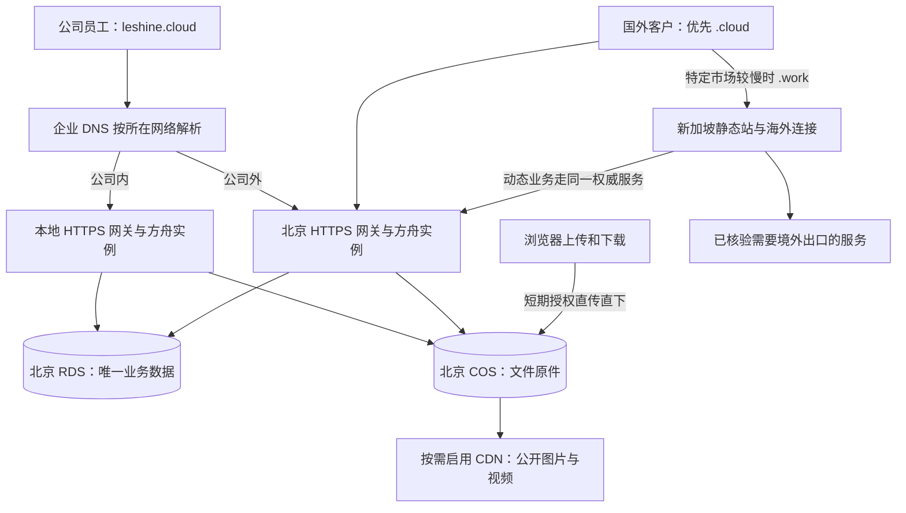

# LeShine 全平台部署调整方案

日期：2026-09-05。状态：调研与实施建议，未执行部署、DNS 切换、数据库迁移或云资源购买。

依据：本仓库 main `270d3180`、两台云服务器的只读检查、公开域名与海外探针实测。公司本地服务器未能直连，其状态依据部署脚本、项目记录和新加坡反代响应；没有把开发机当作生产机。本文沿用 `docs/requirements/日期-主题.md` 约定，不替换尚未实施的运行手册。

## 1. 建议采用的布局

**北京作为主要应用和数据中心，公司本地保留内网入口与本地设备服务，新加坡保留海外静态分发及确有需要的境外连接，腾讯云 COS 统一承载文件。** 不建设三套独立数据库，也不把所有服务在三台机器上各跑一遍。

员工只记 `https://leshine.cloud`：公司内由企业 DNS 解析到本地 HTTPS 入口，公司外解析到北京。国外客户首先使用 `.cloud`，主要市场实测不达标时提供对应 `.work` 入口。域名后缀本身不会提速，决定速度的是解析地址、线路、缓存和后端位置。

新加坡有区域性优势，**本次证据不支持“新加坡对所有海外客户更快”，也不支持立即取消新加坡**：欧美总体优先北京；印度、新加坡样本优先保留海外分发。先治理既有新加坡服务的归属，再决定是否降配。

这是目标拓扑。切换前必须先统一代码版本、文件可见性、鉴权与任务执行位置；不能只把域名改指向北京。

## 2. 当前服务器与服务清单

### 2.1 资源与入口

| 资源 | 当前已知状态 | 目标职责 |
| --- | --- | --- |
| 公司 Windows 生产服务器 | 仓库部署路径 `D:\commission-system`；NSSM `CommissionSystem`、`WhatsAppConnector`，frpc；方舟后端、内网静态入口、计划任务、文件盘 | 内网方舟入口、必须连接本地设备的集成、文件缓存及备份；共享北京 RDS/COS |
| 北京 `154.8.205.162` | Ubuntu；约 8GB 内存；根盘 178GB，已用 9.4GB；`ark-backend` + Nginx；本次内存 available 约 6.6GB | 主公网应用、客户门户、统一后台任务、RDS 同区访问 |
| 新加坡 `119.28.107.92` | Ubuntu；约 4GB 内存；根盘 59GB，已用 39GB；多项业务服务与 frps | 海外静态分发、境外依赖；其余普通业务逐项迁北京 |
| 腾讯云 RDS | 项目记录为北京；`commission_db` 主库读写、`lsordertest` 业务镜像跨查；办公室与北京共享 | 唯一生产业务数据库；迁移只执行一次；开发与生产分离 |
| 腾讯云 COS，待搭建 | 当前客户素材适配器只支持 `local`，没有完成 COS 接入 | 北京主桶，统一文件权威副本；公开分发与私有文件隔离 |

本地端口存在历史记录冲突：setup 脚本为 8001，部分文档写本地 8002；**新加坡 frps 的远程 8002 不能当作办公室实际监听端口**。文档中的 `192.168.101.193:8001/8002` 本次均超时，实施时在服务器上读取 NSSM/frpc 配置核实，不沿用猜测地址。

### 2.2 方舟内的功能服务

下列大多共用一个 FastAPI 后端，不是需要独立部署的几十套服务。实际路由以 `backend/app/routers.py` 为准，旧文档的“23/32 模块”不是当前完整计数。

| 服务组 | 功能覆盖 | 入口与部署归属 |
| --- | --- | --- |
| 组织、权限与管理 | 员工/主管/客户归属、登录 RBAC、字典、工作台、数据概念治理、运行与自动化中心 | 方舟主前端 + 共享后端；内网与北京同版本 |
| 财务与经营 | 提成、回款、薪资、报表中心、方舟洞见、客户机会/经营雷达、订单洞察 | 同上；数据库和权限不可按服务器复制成独立体系 |
| 外贸订单与供应链 | 订单发票、OKKI 接入、备货、生产订单、半成品订单及库存 | 同上；相关迁移及数据操作纳入统一发布门禁 |
| 内贸与工厂 | 内贸客户/订单/会员与价格、工序、生产报工、发货验货 | 主站、微信小程序、PDA/扫码设备共用接口 |
| 客户与获客 | 统一客户主档、客户池、研究/公海背调、机会、受控 Agent 提案 | 方舟后端；外部 Agent 通过受限 API/MCP 使用 |
| 物流 | 跟踪、运单 OCR、轮询、物流报表 | 方舟后端及唯一任务执行实例 |
| 设计与知识 | 设计预约、售后、素材中台、发色、培训、企业知识库与 ACL | 主前端 + 后端 + 文件存储；切北京前解决文件根路径 |
| AI | AI Provider/Preset、展会试戴、设计部生图、客户效果图、AI 方案对话、Agent Runtime | 共享业务后端；图片/知识队列不能重复消费或丢失文件 |
| PM 资料协作站 | 项目、资料、版本、评论、任务、AI 差异 | 独立 `frontend-pm`，后端 `/api/pm`；保留独立门牌鉴权 |
| 客户拍摄素材门户 | 上传、审核、发布、客户登录、查看下载 | `frontend/public/customer-media`；目前北京 `/data/customer-media` 是原件存放点 |
| 对客页面与活动 | `/inventory` 公开库存、`/create` 客户生图、展会 kiosk、名片、采购节、展销静态页、素材移动页 | 部分是主 SPA，部分在 `frontend/public`，必须一起登记，不能只传 assets |
| 系统接入 | 钉钉回调/推送、短链 `/s/`、方舟 `/mcp/`、外部站点订单接入 API、WhatsApp 同步与翻译 | 注册回调、API 基址、下载包和服务进程分别验收 |

微信小程序当前生产基址写死为 `https://leshine.work`；WhatsApp 翻译扩展 manifest 也只授权该域名。服务器更新不等于员工已经更新扩展、小程序或 PDA。外部电商/独立站只核实到方舟接入 API，本次未取得其独立仓库和主机清单，不将“接入已部署”写成“外部站点已纳管”。

### 2.3 两台云上容易漏掉的独立服务

| 当前服务 | 本次证据/位置 | 后续建议 |
| --- | --- | --- |
| 新加坡方舟静态 | `/var/www/ark/dist`，约 66MB；通用 API 经 frps 8002 回办公室 | `.work` 保留；动态后端逐域切北京，避免客户请求依赖办公室上行 |
| PM 静态 | `/var/www/pm/dist`，约 2.8MB；API 回办公室 | 北京部署 `.cloud` 主站；仅确有海外协作需求时保留 `.work` 静态入口 |
| 发型展示 hair | 新加坡及北京均有 `/var/www/hair-styles`；新加坡约 47MB | 北京 `.cloud` 主入口，新加坡 `.work` 保留现有二维码；两机同一制品 |
| 视频展示 video | 新加坡 `/var/www/video.leshine.work`，约 183MB | 页面北京为主，视频原件进 COS；按地域缓存分发 |
| 社媒客户 MCP | `social-customer-mcp.service`，loopback 8100，`/opt/social-customer-mcp` | 数据查询优先北京；原 `.work/mcp/social-customer/` 客户端入口可保留代理 |
| 旧客户/库存/物流 MCP | PM2：`leshine-customer-mcp`、`okki-inventory`、`shipment-tracking-mcp`；3100/3200 有监听 | 核清代码与消费者，普通数据库查询迁北京；不凭服务名删除或与方舟 MCP 合并 |
| OKKI 任务 | PM2 `okki-index`，systemd `okki-sync` | 核清各自同步表、游标、定时安排；迁北京时先停旧任务，保证单活 |
| 钉钉群监听 | `dingtalk-monitor.service`，`/root/.openclaw/workspace/dingtalk-group-monitor` | 优先北京，核对钉钉应用出口白名单/订阅方式与游标 |
| OpenClaw | 新加坡有运行进程，loopback 18789 | 核对其 profile 与任务；境外网站依赖有实测必要则留新加坡；不能认定它就是仓库中的 macOS 获客 Agent |
| Deputy 远程中继 | `deputy-relay.service`，`/opt/deputy-relay`，3800；`/relay/` 和 `relay.leshine.work` | 根据远程端所在地域保留，优先修好子域证书 |
| frp 与 n8n | `frps.service`；8002、5678 由 frps 监听；新加坡 n8n systemd 未运行，Docker 无运行容器 | n8n 是穿透到本地的服务，不是新加坡 n8n 容器；确认办公室流程和数据后决定是否迁北京 |
| 北京生图代理 | `wlai-tunnel.service` 实际 active，loopback 1081 | 文档写过“停用”，但服务仍在；先核对调用依赖再决定保留或停掉，不能立即撤新加坡 |
| DSH / 获客 Agent / 心跳 | 仓库含 DSH worker、OpenClaw sales agent、runtime heartbeat | 未在此次云 systemd 清单确认 DSH 上线；登记为代码已存在、实例待核验，不自动启用灰度功能 |

hair 的权威源码目前记在个人 Downloads，video、旧 MCP 等部分服务没有接入本仓库发布流程。要做到“所有平台一键更新”，必须先为它们确认代码来源、负责人、版本、健康检查与发布目标；未知来源的组件应显示“未纳管”，而不是显示“已更新”。

## 3. 当前入口实测与切换阻断项

| 入口/检查 | 2026-09-05 结果 | 需要处理 |
| --- | --- | --- |
| `leshine.cloud`、`www.leshine.cloud` | DNS 到北京；HTTPS 200，证书验证通过 | 可作为主域名的基础；本次未登录备案控制台，备案通过依据用户确认 |
| `media.leshine.cloud` | DNS 到北京；HTTPS 200 | 有两份同名 HTTP server 配置，`nginx -t` 报冲突并忽略其中一份；统一为一份 |
| `hair.leshine.cloud` | DNS 到北京；标准 TLS 校验失败 | 北京目前没有对应正式站点块，落到默认自签 IP 证书；补站点及证书 |
| `pm.leshine.cloud` | DNS 无 A 记录、请求无法解析 | 新建解析、证书及站点 |
| `leshine.work`、`www`、`pm`、`hair`、`video` 的 `.work` 入口 | 本机 HTTPS 200 | 保留，逐项对齐版本和职责 |
| `relay.leshine.work` | 证书主机名不匹配 | 当前证书 SAN 仅根域与 www，不能覆盖 relay |
| 北京应用版本 | 仓库 HEAD `cf82d4eb`，服务最后启动 9 月 2 日 | 与本次参考 main 不同，不能直接承接所有内部业务 |
| 北京 Alembic 只读核查 | `alembic current` 失败：`Can't locate revision identified by '137_domestic_labor_fee'` | 数据库记录已指向 137，北京代码缺该迁移；应补齐同版本代码，禁止 stamp 掩盖差异 |
| 翻译 API 对比 | `GET /api/whatsapp-translation/health`：北京 404、`.work` 200 | 证明目前后端覆盖不一致，不只是首页缓存问题 |
| 两站主页面 | 北京引用 `index-aRrk7-4x.js`，新加坡引用 `index-BfCXGYPk.js` | 产物不同；不能仅以根路径 200 判部署一致 |
| 北京配置文件 | `.env` 中 `COOKIE_SECURE=false`，Scheduler/WhatsApp auto-sync/TFT 为 false | HTTPS 全链配置时修正；有效配置还需包含 systemd 环境，不能只改示例文件 |

证书实际到期：北京主域 2026-10-19、media 2026-11-11、新加坡主域 2026-11-03（证书 GMT 日期）。实现自动续期并在到期前 30/14/7 天告警，不再依赖文档中的旧日期。

## 4. 海外访问速度评估

### 4.1 方法与结果

使用 [Globalping 官方 API](https://globalping.io/docs/api.globalping.io) 对美国、德国、英国、印度、新加坡各选两个探针，后续请求复用首轮探针；测试域名 HTTPS，未跳过证书校验。时间约北京时间 10:03–10:08。以 GET 首页两轮、GET `/health` 一轮区分静态入口和动态链路。

下表是**第二轮各国两个探针的总请求耗时范围**，包含 DNS/TCP/TLS/响应接收，单位秒；不是浏览器完整页面加载时间，也不是该国平均值或 P95。

| 探针国家 | 北京 `.cloud` 首页 | 新加坡 `.work` 首页 | 北京 `/health` | 新加坡入口 `/health` | 判断 |
| --- | --- | --- | --- | --- | --- |
| 美国 | 0.50–0.72 | 0.56–0.82 | 0.55–0.73 | 0.99–1.67 | 此组北京优先 |
| 德国 | 0.50–0.66 | 0.75 | 0.51–0.52 | 0.93–1.75 | 此组北京优先 |
| 英国 | 0.53–0.85 | 0.48–0.52 | 0.58–0.72 | 0.90–0.95 | 新加坡首页部分更快，北京动态入口更快 |
| 印度 | 0.74–1.18 | 0.17–0.18 | 0.96–1.15 | 0.64 | 新加坡入口有明显优势 |
| 新加坡 | 1.01；另一次 15 秒超时 | 0.013–0.021 | 1.00–1.60 | 0.43–0.44 | 明显优势，且北京跨境线路有抖动 |

首轮两站首页均 10/10 返回 200；次轮北京 9/10、新加坡 10/10；健康接口两站均 10/10。北京失败样本来自新加坡 OVH，同一探针首轮首页 2.31 秒。保留失败样本，不能只统计成功请求证明速度。

探针分布：美国 Buffalo/Los Angeles（HostPapa），德国 Falkenstein（Hetzner）/Nuremberg（netcup），英国 London（OVH/Oracle），印度 Mumbai（Oracle）/Bengaluru（RACKVOLT），新加坡（OVH/LeaseWeb）。主要为机房网络，不能代表客户家庭宽带、移动网络及全体国家。

`/health` 比较的是**现行访问链路**：北京直接到北京后端，`.work` 经过新加坡 → frp → 办公室 → RDS；不是两台同配置 API 服务器的纯硬件对比。它说明当前办公室回源链路有成本，但不能据此量化“新加坡本地完整后端”的性能。

还核对了两站同一 JS：`vendor-element-DJGl6w0i.js`，均为 942,567 字节，SHA-256 `f6bcca97434a2a7b16017832bd31575abc1c14a8b844fa595c66ac64366cb478`。海外探针返回 `truncated=true`，因此**这批请求不作为完整下载吞吐量证据**。本次没有得到真实客户的视频下载速度、完整首屏 LCP、上传速度与高峰期统计，不能以小 HTML 的速度保证大文件体验。

本机补充：直连 HEAD 主域北京约 0.14 秒、新加坡约 0.39 秒；这是当前单一出口的即时值，不代表公司全员。新加坡服务器自身请求 `.work/health` 三次约 0.46–0.49 秒，也支持“静态在海外很快，动态仍要回办公室”的判断。

### 4.2 如何决定新加坡保留多少

1. 现在默认把员工入口、数据库查询、业务 API 放北京；不因海外客户存在就复制一套跨境直连 RDS 的完整应用。
2. hair/video 等公开内容，允许 `.cloud` 也使用海外 CDN 节点，用户不必为了加速换域名。`.work` 保留已印二维码和确有线路收益的入口。
3. 对印度、新加坡这类样本明显受益的市场保留新加坡静态分发；英国看具体客户运营商。未测国家暂按 `.cloud` 优先。
4. 下一阶段在真实主要市场连续 7 天覆盖工作/晚高峰：每地至少两个不同运营商，每入口至少 100 次有效采样；测完整首屏、核心只读 API、图片及经授权的上传/下载。失败单独计入成功率，完整文件做字节数/哈希校验，不使用截断探针估吞吐。
5. 建议业务验收目标：主要页面 LCP P75 ≤2.5 秒，普通查询 P95 ≤1.5 秒，HTTP 成功率 ≥99.5%；AI 生成等长任务独立计时。若北京已达标，继续用北京；若未达标且新加坡降低 P95 ≥30% 且 ≥300ms，或消除明显失败，再对该市场切换。以上是拟定目标，不是现状承诺。

证据链接：[北京首页首轮](https://api.globalping.io/v1/measurements/2BWBwFa1plDu1KQFm000214pP)、[新加坡首页首轮](https://api.globalping.io/v1/measurements/28T1ctX321QZCWpvB000214pQ)、[北京首页次轮](https://api.globalping.io/v1/measurements/2d0gmKtK6SlSd8MkU000214pR)、[新加坡首页次轮](https://api.globalping.io/v1/measurements/2tuoHPD1sChYvPCpe000214pR)、[北京健康接口](https://api.globalping.io/v1/measurements/2hSivFBu7yiI49Eyu000214pR)、[新加坡健康接口](https://api.globalping.io/v1/measurements/24JeUXXQUzUwlQRxH000214pR)。结果服务可能有保存期限，关键数据已摘录于本文。

## 5. 域名与内外网访问设计

| 服务 | 推荐主入口 | 公司内解析/路径 | 海外备用入口 |
| --- | --- | --- | --- |
| 方舟员工平台 | `leshine.cloud`；www 同域规范跳转 | 同域解析到本地 HTTPS 网关、本地后端 | `leshine.work` 保留，需要时使用 |
| PM | `pm.leshine.cloud` | 同域解析到本地网关；最终用同一 root 构建 | `pm.leshine.work` 按协作需求保留 |
| 客户生图 | `leshine.cloud/create` | 同一业务、同一 COS | `leshine.work/create` |
| 公开库存 | `leshine.cloud/inventory` | 同一权限与公开字段契约 | `leshine.work/inventory` |
| 客户拍摄素材 | `media.leshine.cloud` | 保持到北京；大文件直接去 COS | `media.leshine.work` 仅在海外验收确有收益时新建 |
| 发型展示 | `hair.leshine.cloud` | 无需专门内网后端 | `hair.leshine.work`，保留现有码 |
| 视频展示 | `video.leshine.cloud` | 视频由 COS/CDN 提供 | `video.leshine.work` |
| 集成/MCP/短链 | 主域现有 `/api`、`/mcp/`、`/s/` 路径 | API/MCP 继续鉴权 | 保留旧 `.work` 客户端地址到迁移完成 |
| n8n、运维中继等 | 员工专用入口，按实际必要性开通 | 优先内网/VPN；明确身份校验 | 不混入客户网站导航 |

内网 DNS 仅覆盖已经在本地部署的精确主机名，不做整个 `*.leshine.cloud` 的泛解析。客户端使用第三方 DoH 绕过公司 DNS 时会走北京，这仍应正常可用；通过企业设备策略提高内网命中率，不要求员工手动切换地址。

本地网关终止正式 HTTPS，证书使用 DNS 验证自动续期；主域证书与通配证书的覆盖范围分别核对。保留安全 Cookie 和相机访问要求，不用 HTTP IP 作为员工常用入口。只对同一 `.cloud` 根域/www 做规范跳转，不能把海外备用 `.work` 强制跳回慢的 `.cloud`。

前端 API 尽量使用同源相对路径。逐项清理硬编码域名：短链基址、分享链接、钉钉/微信回调、小程序合法域名、扩展权限、外部站点 API、PM 与客户门户 Origin、下载包元数据、CSP/CORS。跨域请求只允许明确名单，带凭证时不得 `*`。

新加坡到北京的代理使用可验证的正式 TLS 与限定来源，核对原始 Host/Origin、转发协议及客户端地址可信范围；不要把当前 `proxy_ssl_verify off` 的 IP 中继直接复制为正式方案。保留现有 `/create` 安全响应头、API 上传限制、视频 Range、MCP/SSE 的无缓冲和 WebSocket 升级行为，避免域名能打开但登录、长任务或大文件失败。现有 3100/3200、frps 管理与穿透端口有全接口监听，实施时核验防火墙实际暴露，只向所需来源开放，不把“监听”误报为“公网一定可达”。

`.cloud` 与 `.work` 不共享浏览器 Cookie/localStorage；切换到备用站可能需要重新登录。保留客户邀请路径时沿用现有受控邀请机制，不在 URL 中传递员工 access token。需要无感切换时另做一次性登录票据，首期不为此增加 SSO 项目。

## 6. 数据、文件和后台任务怎样保持一致

**共享 MySQL 并不等于共享文件。** 目前 Windows 的 `D:\WORKSOURCE`、`uploads`、`backend/data/pm` 和北京 `/data/customer-media` 是不同磁盘。直接让相同模块轮流落到两台后端，会出现记录存在但图片打不开、任务取到别台机器路径的问题。

按模块迁移并验收，先解决文件再切流量。对象标识保存 `provider + object_key`，业务记录不保存服务器绝对路径或签名 URL；用户授权时即时生成读取地址。模型输入、原件、预览、导出临时文件要区分，原件必须只有一个权威位置。

最终北京承担唯一 APScheduler 实例，办公室关闭调度；切换前逐项核实所有 job 的文件、浏览器、字体、Connector、TFT、外部出口依赖。当前 `design_image_queue`、`customer_image_queue` 也在 Scheduler 中，不能为了关闭重复定时任务把客户生图队列一起停掉。

任务迁移顺序：暂停旧调度及新领取 → 等在途任务完成/核对租约 → 移交游标和存储访问 → 确认旧实例不再领取 → 开北京唯一调度 → 核对没有重复生成、发信、同步或扣额度。文件尚未迁好的模块继续固定在原处理实例，不允许随机路由到两台机器。

WhatsApp Connector、工厂设备、内网专属服务可留办公室，北京以受限、鉴权的专用连接访问；此类功能应明确“依赖办公室在线”。客户门户、素材下载、普通查询的日常工作不应依赖办公室在线。外部同步器与 n8n 也必须建立单一任务归属，不能只关闭方舟 Scheduler 就认为没有重复任务。

## 7. 腾讯云 COS 建设方案

### 7.1 区域、权限与路径

首期选北京，与权威应用及 RDS 同区。建议三个边界清楚的桶：私有业务原件、公开发布素材、私有备份。桶名带账号后缀，实施时确定；代码只通过配置读取。不要首期同时建设北京/新加坡双写桶。

私有桶按域/对象 ID 组织：客户素材、PM、售后、生图、知识、验货等使用不同前缀，权限仍由方舟按客户/员工/文档 ACL 判断。公开桶只放经过发布审核的产品展示与视频，不放客户原始照片、内部 PM 文件或知识附件。

浏览器 → 方舟申请上传 → 获取限定对象和短有效期的 STS/签名 → 浏览器分片直传 COS → 服务端复核对象大小、格式、校验和及授权 → 才将业务记录置为可用。未完成对象、超限、重试、取消、重复完成均有明确状态和清理规则。长期密钥绝不下发浏览器。[腾讯云临时密钥指引](https://intl.cloud.tencent.com/zh/document/product/436/14048?has_map=2&lang=zh&pg=)

客户素材当前上限有单文件 500MB/批量约束，直传后仍要服务端复核，不能绕过配额和审核。下载同样先鉴权，签发短期只读地址；视频支持 Range、正确 Content-Type 和可续传。分享文案继续使用 `.cloud` 门户地址，COS 地址作为后台传输细节，不要求员工复制。

### 7.2 加速与成本

公开图片、视频按访问需求接 CDN；海外开启境外节点，可以继续使用 `.cloud` 自定义资源域名。私有文件首期签名直下，只有实测必要才加私有 CDN，并同时开启**回源鉴权和客户端访问鉴权**，仅“桶私有”不能保证缓存文件私有。[腾讯云 CDN 权限说明](https://intl.cloud.tencent.com/document/product/436/18670?lang=en)

COS 全球传输加速解决上传/回源/长距离传输，CDN 主要解决重复下载，两者不能混为一谈。开启功能不代表普通桶域名请求自动被加速；海外链路按需使用对应加速地址。全球加速下载会额外叠加相关流量费用，不建议为全部文件默认打开。[腾讯云流量计费](https://intl.cloud.tencent.com/zh/document/product/436/33776)

北京轻量与同区 COS 默认可内网通信；**轻量与 RDS 并非只要同区就自动私网互通**，应核对云联网/VPC 关联、实际解析与访问链路。官方也明确轻量不支持经云联网实现跨境内网互联，不能按“新加坡轻量私网直连北京 RDS”设计。[腾讯云轻量内网互联](https://cloud.tencent.com/document/product/1207/56847)

成本按实际数据估算：存储量 × 存储单价 + 下载流量 + 请求 + CDN/回源 + 可选加速 + 备份版本。上线前统计当前文件盘规模、每月新增和下载量；目前仅知道网站静态目录大小，不能据此报完整月费。价格以[腾讯云计算器](https://buy.cloud.tencent.com/price/cos)所选地域及账号报价为准。

运行手册记载北京套餐为 12Mbps，控制台实际配额仍待核实；即使按该速率计算，理论共享下行也只有约 1.5MB/s，500MB 文件单人下载下限就约 5.6 分钟，实际还受并发与线路影响。视频/大附件直下 COS 的收益通常比搬一份网页到新加坡更关键。对当前 4C8G 北京实例先测业务峰值、图片任务 CPU/内存和数据库连接数，不因即时空闲就承诺无限承载。

### 7.3 文件迁移顺序

1. 先做客户拍摄素材：已有 `storage_provider/object_key` 边界，但 `storage_for()` 目前仅支持 local，需要实现 COS 适配和直传闭环，不能只改 `.env`。
2. 再做 PM：消除大文件经过新加坡 frp 的问题，再让北京与办公室 PM 共享文件。
3. 再做公开 hair/video/产品图，接入同一发布制品与 CDN。
4. 最后逐域处理素材中台、生图、知识、AI 对话、售后、培训、内贸附件、验货等，并盘清剩余 uploads。
5. 每域先生成对象清单、数量/大小/SHA-256，复制后全量比对；最后短暂停写补增量、切 provider、两入口读写验收。回滚窗口内原文件只读留存，期满按清单清理，不做长期双写或静默跨机 fallback。

业务桶开启版本与生命周期，备份桶使用独立权限，防止应用误删连备份一起删除。明确 RDS 时间点恢复和对象版本如何对应；每月做一次隔离环境恢复演练。建议先验收数据库 RPO ≤15 分钟、关键文件 RPO ≤24 小时、恢复 RTO ≤4 小时，再按预算收紧；这些目标必须由备份配置及演练证明。现有 `robocopy /MIR` 是镜像，会传播删除，不能单独充当可回溯备份。

## 8. deploy.bat 当前问题与证据

| 问题 | 代码位置/行为 | 对用户的影响与调整 |
| --- | --- | --- |
| 主前端跳过失效 | 198–235 行附近，`FRONTEND_CHANGED` 只置 1，未初始化为 0，却用 `==0` 跳过 | 普通环境变量未预置时无变化也重建；应显式初始化，并把构建输入纳入检测 |
| “smart”仍整包传 JS/CSS | 382–383 行删 staging 后 `scp -r assets` | 每次重传全 assets；改为逐文件内容哈希比较，批量传缺失/变化文件 |
| PM 改动后全量传 | 476–477 行 `scp -r dist/*` | PM 没有文件级增量，且直接覆盖在线目录 |
| 依赖每次安装 | pip 自升级、requirements 安装、Connector/npm install | 无变化也等网络；改为固定依赖与锁文件/运行时摘要驱动，禁止每次升级 pip |
| 数据库每次停本地服务 | 迁移段始终停 `CommissionSystem`、upgrade、启动 | 无迁移也造成中断；北京和外部写入仍可能运行，停本地不等于冻结全部写入 |
| 不覆盖北京后端 | `CLOUD_SERVER` 只有新加坡，云端同步是前端目录 | 共享库在前进，北京应用停在旧版本；今天已实测缺迁移 137 |
| 漏独立平台 | hair/video、云独立 MCP/同步器/中继/Agent 不在部署清单 | “Update completed”不能代表全平台完成 |
| marker 检测不完整 | 主站路径列表漏 `frontend/index.html`、构建环境等；Git 失败被管道过滤；marker 不按目标分开 | 改入口可能漏构建；失效 marker 可能误判；一台成功掩盖另一台失败 |
| 只检查目录或 Git 改动 | vendor 等远端只查存在，缺少清单完整性验证；m 上传失败标成非致命 | 文件损坏/局部缺失不能可靠自愈，可能成功标记却缺页面 |
| 在线资源切换有缺口 | rsync 对 live 目录 `--delete`；SCP 依次移动 assets/index；PM/public 原地覆盖 | 旧页面在发布窗口可能引用已删资源；“index 最后上传”不等于完整原子发布 |
| 服务运行不等于可用 | 主要核对 NSSM `SERVICE_RUNNING`；缺少全站版本、API、静态验收 | API 缺失、白屏、数据库不匹配仍可显示成功；错误路径应明确非零退出 |
| 回滚覆盖不足 | rollback.bat 仅本地代码/主 dist/新加坡主前端，云同步失败只警告 | PM、北京后端、依赖等不能恢复到同一发布版本 |

以上是脚本审阅与只读探测结论。本次没有运行生产 deploy/rollback，也未在生产机测量每个部署阶段耗时。

## 9. 一键发布的目标契约

保留用户入口 `deploy\deploy.bat`。内部使用项目已有 Python 作为编排层，OpenSSH 作为传输方式；小型目标清单登记每个组件。无需引入 Kubernetes 或大型流水线平台。

**每次运行核对全平台；只有变化的组件才构建、传输和重启。** “全部更新”表示所有目标达到指定发布状态，不表示每次重装所有东西。一个平台没有独立后端或数据库时显示“共用方舟/不适用”，不能伪造更新步骤。

### 9.1 发布清单必须覆盖

| 组件 | 发布内容 | 必须验证 |
| --- | --- | --- |
| 方舟 | 本地 + 北京后端，同仓库同 SHA；主前端及全部 public 静态页到指定主机 | schema、真实 HTTP 方法、鉴权、静态引用完整 |
| PM | 前端和方舟后端契约；现阶段还含 LAN `/pm/` 构建，统一同域 root 后退役旧构建 | 独立鉴权、上传、版本、下载 |
| 客户素材/生图/库存/展会 | 主构建及门户目录、模块配置 | 不能只测首页，核对对应 API 和文件权限 |
| hair/video | 独立静态源和文件清单，按目标表分发 | 两域内容一致、子路径、二维码与视频 Range |
| WhatsApp Connector | Node 源码、锁定依赖；持久会话单独保存 | pairing/health 和同步状态，不因发版丢登录 |
| MCP、OKKI、钉钉监听、中继、Agent | 各自仓库或制品的固定版本、配置契约、服务定义 | 鉴权握手/心跳、游标、唯一任务实例；禁止仅按 PM2 online 判完成 |
| n8n | 固定运行时版本、受控工作流变更及其自身数据库备份/升级策略 | 工作流和凭据恢复测试；无 n8n 变更不升级运行时 |
| 小程序/扩展/PDA | 构建、签名/包版本、发布渠道、后端契约 | 区分包已生成、渠道已发布、终端已安装；平台审核/人工安装不能伪称自动完成 |
| RDS 与 COS | RDS 唯一目标 revision；COS 访问/权限/必要配置 | 数据库只执行一次；COS 不是数据库，不清空或覆盖业务对象 |

方舟同仓库组件用同一源码 SHA；外部仓库组件可以有自己的 SHA，由一个总 release ID 绑定。将当前个人目录中的站点与旧服务收敛到受版本管理的来源后才纳管。没有新版本的第三方平台只检查状态和版本，不无条件拉 latest。

### 9.2 输入摘要与文件级增量

- 组件输入摘要 = 源文件内容 + 依赖锁文件 + 构建脚本 + Node/Python/工具链版本 + 有影响的公开构建配置 + 生成的扩展包等前置制品摘要。包括入口 HTML 和全部 public 内容，不能只 diff src。
- 每台服务器分别记录 `component/input_digest/artifact_digest/deployed_release/schema_target/health_checked_at`。Git revision 不存在、目标无 manifest 或文件损坏时重新核对，不按“无变化”跳过。
- 前端相同 base/config 只构建一次，供所有相同入口复用；当前 PM 的 `/pm/` 和 `/` 是两种构建输入，不能拿一份产物混用。生产目标拒绝未提交源码；本次准备过程中生成的制品以 manifest 管理。
- 传输前读取目标文件 SHA-256 清单，计算新增/变化集；将差量文件打成一个包，经少量 SSH 会话传输并远端校验。后端同样增量；静态不变的 35MB vendor、66MB 主站包不应反复上传。仅 mtime 不够，重建可能改变时间但内容相同。
- 服务配置变更单独有版本，密钥只在目标主机的受限配置中；不要把 Windows `.env` 或虚拟环境复制到 Linux。Python 依赖按 OS/Python/锁摘要复用各自环境，保持平台原生二进制正确。
- 后端依赖只有锁摘要变化才安装；前端与 Connector 用已锁定依赖及缓存。安装器/构建失败直接失败，不悄悄降级为全量 SCP 或浮动依赖。

### 9.3 发布步骤

1. **预检并锁定版本**：选定一次 release；检查工作区、所有主机连通/权限/磁盘、来源版本、证书、配置契约、数据库状态和全部目标。锁住发布，禁止另一次部署并发。显式 dry-run 输出变化清单。
2. **先准备，后停业务**：全部变化组件构建、测试、生成清单；增量上传到各自新 release 目录；逐对象校验完整性。任一必需目标准备失败，原服务继续运行，不开始迁移。
3. **数据库预检**：读取真实当前 revision、目标迁移图与单 head；校验迁移文件摘要/已执行记录。相同版本跳过迁移、不停服务。数据库领先于发布代码、未知 revision、多 head 立即阻断，禁止 stamp 或 downgrade 抹平。
4. **有后端/数据库契约变化时维护切换**：冻结所有相关入口和写进程，包括办公室、北京、任务、Connector、MCP、外部同步、开发机生产权限。排空请求与任务，验证无写入后，由唯一迁移账号持跨主机数据库锁执行到本次目标 revision；锁失效就中止，不自动换连接继续。迁移后核对 schema、关键约束与数据不变量。
5. **激活同一版本**：后端新环境启动并 readiness 验证；静态完整 release 通过同文件系统原子切换激活；只重启变化组件。单活任务最后启用。需重启主机/特殊迁移的组件走其登记过的专用步骤，不临场拼命令。
6. **逐目标验收**：页面、关键 API、schema、权限、必要文件与发布版本均正确，才写该目标成功 marker；最后全部必需目标完成，输出总成功并退出 0。失败输出具体平台/阶段和可重试项，退出非零，不能被末尾 pause 吃掉状态。

跨服务器不能依靠一个文件 rename 达成分布式原子提交。有契约变化时保持维护闸门，直到所有必需实例匹配才恢复写入；不接受“本地成功就全平台成功”。仅静态改动可独立切换，前提是与当前后端契约一致。

**保留旧资源的准确方式**：所有 hash 命名的 `/assets/<hash>` 在目标侧进入只增不改的共享资源目录，各 release 指向该目录；切 index 后旧会话仍能取旧 chunk。非 hash 公共文件使用版本化路径或随 release 封存。不能只保留 `releases/old`，却让旧资源 URL 经新 `current` 查找而 404。至少保留约定的旧会话/回滚窗口后按引用清单回收，禁止对 live assets 直接 `--delete`。

### 9.4 数据库治理必须同步调整规则

目前 `CLAUDE.md` 允许开发机直接迁移共享生产库，这与未来“唯一发布入口控制全平台”冲突。**实施前先改这条规则**：开发使用独立数据库/账号；生产迁移只由统一发布器执行，普通应用账号无 DDL。开发库可以同 RDS 实例的隔离库起步，但不能继续共用生产 schema。

`lsordertest` 不由方舟每次发布重建/覆盖，默认只读及已登记的受审计写例外保持不变；外部同步器的独立 schema/游标按所属组件处理。迁移备份、应用回滚和业务数据恢复是三件事，不能运行“回滚程序”就自动降级 MySQL schema。

## 10. 失败恢复与运行验收

构建/上传失败留在 staging，不动在线版本；纯应用发布失败仅在 schema 兼容性已验证时切回上一份应用和依赖；MySQL DDL 中断或不兼容 schema 保持相关写入口关闭，优先按审阅过的前向修复方案恢复。需要恢复数据库时使用时间点恢复到独立实例、核对新增业务再切换，不自动覆盖原生产库。

建议发布器必须通过以下场景：

| 验收场景 | 通过标准 |
| --- | --- |
| 连续运行两次、第二次无变化 | 第二次构建 0、制品上传 0 字节（不含状态通信）、依赖安装 0、业务服务重启 0、DDL 0；仍检查全部目标 |
| 只改一处前端/只改入口 HTML | 正确触发该组件，一次构建，多目标仅传变化；旧页面继续可用 |
| 只改后端/依赖/PM/hair/video | 只处理受影响组件，其他平台记为一致未变；不漏任一指定副本 |
| 云端缺一个文件/marker 指向失效提交 | 检出异常并补齐，不误判未变 |
| 传输中断/北京不可达 | 总结果失败且保留旧版；重跑按目标续做，不重传已校验完整文件 |
| 数据库已是目标版本 | 不重复迁移，不停所有服务；数据库未知或领先时阻断 |
| 迁移失败或锁丢失 | 不晋级 release、不开放写入、没有自动 downgrade/stamp |
| 权限与门户 | 员工权限、客户 A/B 隔离、私有对象拒绝匿名；小程序/扩展 API 契约一致 |
| 文件和任务 | 内网上传外网可读、反向也成立；队列能完成且不重复；公网基本服务不依赖办公室 |
| 旧会话与回滚 | 切版时旧 JS chunk 不 404；回滚同时覆盖应用、依赖和每个目标静态制品 |

每次输出一张人能看懂的表：平台、目标、当前/目标版本、已更新/无变化/失败/未纳管/待终端安装、耗时、上传字节数。复用现有“运行与自动化中心”展示实例和健康状态；公网健康响应只含必要状态，详细发布信息给授权运维查看。

## 11. 分阶段执行顺序

| 阶段 | 主要工作 | 完成标志 |
| --- | --- | --- |
| P0：收敛事实与规则 | 在办公室核清服务/端口/文件规模；补齐外部平台来源；先修订生产迁移规则；确认北京 137 差异和证书问题 | 目标清单无假成功，发布来源及迁移责任明确 |
| P1：统一发布和版本 | 改 deploy/rollback；建立制品、增量、目标 marker、单次迁移与逐站验收；先完整发布当前已经纳管的方舟/PM/门户 | 本地与北京同版本；翻译等差异端点对齐；第二次部署无无效工作 |
| P2：文件收敛 | 北京 COS；先客户素材、PM，再公开展示，最后其他业务文件；可恢复备份 | 任意入口读写同一对象；大文件不经过 frp |
| P3：北京主入口 | 配置 `.cloud` 各站、正式 HTTPS、内网 DNS；普通 API 与唯一任务迁北京；普通同步服务逐项迁移 | 公司内外同地址，办公室断网时主要对客业务仍能运行 |
| P4：海外与成本优化 | 真实市场 7 天测试；公开静态 CDN；保留有收益的 `.work` 和境外依赖，清理旧站副本/无用进程前核对消费者 | 北京为默认，新加坡职责明确；有测量和费用依据才降配/退役 |

阶段可以按模块推进，但依赖不能倒置：不能在文件共享未完成时把有本地文件的业务切北京，也不能在迁移责任未统一时放开多实例自动更新。暂不报固定工期，P0 的未知平台源码、办公室访问和文件体量决定工作量；每阶段以验收结束。

## 12. 本次交付边界与下一步

已完成：两台云服务器运行服务/站点/磁盘的只读盘点，主域和多个子域 DNS/TLS 探测，海外同探针对比，deploy/rollback 审阅，北京迁移状态只读核查，以及本方案。

尚未完成且不应假定已完成：办公室直连盘点、全部外部独立项目与真实客户市场清单、RDS 控制台备份/私网配置核验、COS 创建、真实用户上传/下载及登录回归、7 天性能采样。本次没有运行时变更。

建议下一项实际工作是 **P0 + P1：先把一键发布改成真正覆盖所有已纳管平台的增量发布，并消除北京代码与共享数据库的版本差异**；其后做 COS 和正式切流。只改 DNS 或只补一个 `FRONTEND_CHANGED=0`，都不足以解决这次提出的整体部署问题。
