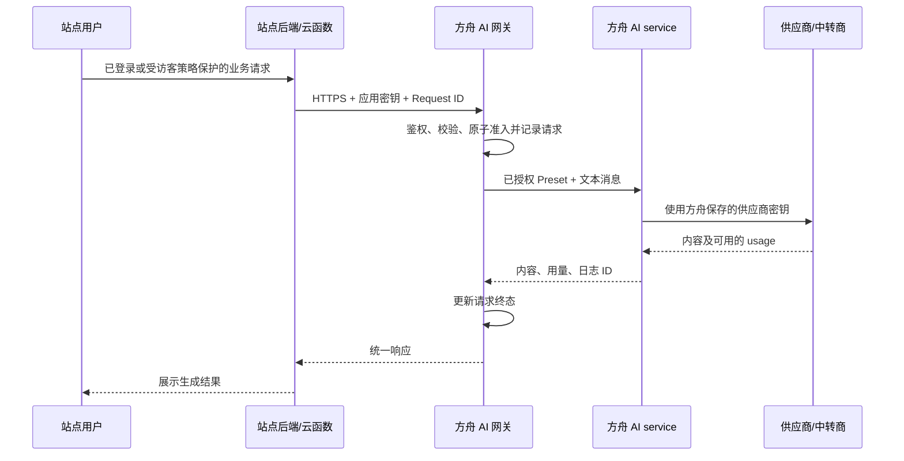

# 业务员自建站点接入方舟 AI — 开发规格 v1.0

日期：2026-09-11
状态：v1.0 已在 `codex/ai-site-gateway` 实现并完成本地验证，2026-09-14 按用户授权进入 main 合并推送交付，未部署；验证记录见本文第 13 节。
适用范围：公司业务员使用 Codex 搭建的站点，通过方舟调用公司统一配置的 AI 服务。

## 1. 目标与方案

采用“一站一密钥、方舟统一中转、按站点限额”。业务员站点通过自己的后端或云函数调用方舟，方舟完成机器鉴权、能力授权、请求准入和用量记录，再复用现有 AI 接入服务。

业务员只配置方舟地址、站点密钥和允许使用的 Preset。供应商、模型和系统提示词由方舟统一维护；更换供应商不要求修改各站点代码。

完成判据：一个示例站点可完成文本生成；密钥不出现在浏览器；非法调用不能到达供应商；并发请求不能绕过站点限额；管理员可查清站点消耗并停止新的调用。

## 2. 第一版范围

包含：

- 管理员创建站点应用、绑定负责人、授权 Preset、生成和重置密钥、停用应用。
- 同步、非流式文本生成，覆盖翻译、文案和摘要；支持调用方提交有限长度的文本对话历史。
- 每日调用次数、每分钟请求次数、最大并发数及单次输入/输出限制。
- 应用调用记录、实际 token 用量、失败和未知用量统计。
- 一份站点后端示例和可交给 Codex 的接入说明。

暂不包含：生图、文件上传、多模态、流式响应、异步任务、工具调用、联网检索、金额结算、充值、自助申请审批、完整 OpenAI API 兼容协议，以及方舟客户/订单/知识库数据访问。

应用密钥仅代表站点身份，不代表访问者已经通过方舟员工登录，也不授予方舟其他业务权限。

## 3. 现有基础与新增边界

依据当前仓库代码核对：

| 已有能力 | 位置 | 本次处理 |
| --- | --- | --- |
| Provider、Preset、调用日志 | `backend/app/ai/models.py` | 继续复用 |
| 统一 AI 调用入口 | `backend/app/ai/service.py` | 网关必须从此 facade 调用 |
| 同步文本调用及 metadata 日志模式 | `backend/app/ai/call_service.py` | 复用，补必要的服务端限制参数 |
| AI 管理端路由 | `backend/app/ai/router.py` | 保持 `ai:admin`，不改成公开机器接口 |
| 密钥哈希存储参考 | `backend/app/mcp/models.py`、`auth.py` | 参考方法，不共享 MCP token 或权限 |
| AI 管理页面 | `frontend/src/views/system/AIManager.vue` | 增加“站点应用”入口 |

新增领域 `backend/app/ai_gateway/`，包含 models、schemas、router、service 和机器鉴权模块。统一在 `backend/app/routers.py` 注册。不得新建独立供应商 HTTP client。

## 4. 架构与接入前提



- 站点必须具备服务端执行能力；纯静态站点增加一个云函数。
- 站点服务端验证访问者身份或执行访客限流；不能搭建匿名、无限调用的转发接口。
- `ARK_AI_KEY` 仅配置在服务端环境变量，不使用 `VITE_*`、`NEXT_PUBLIC_*` 或其他会注入浏览器的变量。
- 应用密钥不写入源码、Git、错误响应、访问日志或 Codex 接入文档；由业务员在部署平台的服务端密钥配置中填入。
- 第一版服务端到服务端调用不依赖 CORS；Origin/Referer 和域名白名单不作为身份凭据。
- 新网关路由须纳入实际部署反向代理配置，沿用 HTTPS，核对请求体和超时限制。

## 5. 管理交互

“系统管理 → AI 接入管理 → 站点应用”，使用现有 `ai:admin` 权限。

创建表单：应用名称、负责人、站点地址（备注用途）、用途说明、允许的 Preset、每日次数、每分钟次数、最大并发、单次最大输出 token。

默认建议：每日 100 次、每分钟 10 次、并发 2、输出上限 2,048 token；这些是初始管理配置，不是费用承诺。管理员可调整。

创建成功后显示应用 ID、密钥和接入示例；密钥只返回一次，关闭后不可再次查看。列表只显示密钥前缀/尾号等掩码。

列表展示应用名称、负责人、启用状态、今日已占用次数/上限、已知输入和输出 token、未知用量请求数、失败数和最近调用时间。详情展示调用记录。重置密钥立即替换旧密钥；停用不删除历史记录。

Preset 选择器只提供启用、绑定启用 direct Provider 的文本预设。复用现有 Preset 配置页面创建能力；不向业务员站点暴露 Provider 或供应商密钥。

## 6. 数据模型

第一版新增三张表，不引入 Redis、消息队列或独立网关进程。具体 SQL 类型和外键需以迁移时现有模型为准。

### 6.1 `ark_ai_gateway_apps`

| 字段 | 约束/含义 |
| --- | --- |
| `id` | BIGINT 主键 |
| `name` | VARCHAR(100)，必填 |
| `owner_user_id` | 负责人 FK，必须与 `ark_users.id` 的类型和 unsigned 属性一致 |
| `site_url`、`description` | 可空，管理备注，不用于自动访问或鉴权 |
| `key_hash` | SHA-256 十六进制字符串，唯一索引 |
| `key_hint` | 非敏感密钥掩码 |
| `is_enabled` | 默认启用 |
| `daily_limit`、`rpm_limit`、`concurrency_limit` | 正整数，0 不代表无限额 |
| `max_output_tokens` | 正整数，另受平台硬上限约束 |
| `created_by`、`updated_by` | 管理操作人 |
| `created_at`、`updated_at`、`key_rotated_at` | 北京时间 |

密钥使用密码学安全随机数生成，至少 32 随机字节，可加 `ark_site_` 前缀；哈希只针对完整明文密钥。应用记录不物理删除。负责人更换不改变历史请求负责人快照。

### 6.2 `ark_ai_gateway_app_presets`

字段：`app_id`、`preset_id`；联合主键，类型匹配关联表。采用关系表维护允许集合，不在请求中信任客户端声明的权限。撤销授权后新的准入立即检查生效。

### 6.3 `ark_ai_gateway_requests`

| 字段 | 约束/含义 |
| --- | --- |
| `id` | BIGINT 主键 |
| `app_id`、`request_id` | 联合唯一键；request_id 为调用方生成的 UUID |
| `owner_user_id` | 准入时负责人快照 |
| `preset_id`、`preset_name`、`model` | 已解析的调用配置快照 |
| `status` | `pending` / `success` / `error` / `timeout` / `unknown` |
| `ai_log_id` | 可空，关联已有 AI 日志；类型匹配现有日志主键 |
| `tokens_prompt`、`tokens_completion`、`tokens_used` | 可空；无 usage 不填 0 |
| `usage_status` | `known` / `partial` / `unknown` |
| `duration_ms`、`error_code` | 耗时及脱敏错误分类 |
| `created_at`、`finished_at` | 北京时间；finished_at 可空 |

索引：`(app_id, created_at)`、`(app_id, status)`，并保留请求 ID 联合唯一约束。不存提示词、回答正文和密钥。

以准入记录计次数，避免从供应商日志反推限额。拒绝准入的请求不进入用量账本，可在常规安全日志记录脱敏拒绝原因。

## 7. 调用 API

以下接口已在本任务分支实现，生产环境尚未发布。

### 7.1 `POST /api/ai-gateway/chat`

请求头：

```http
Authorization: Bearer <ARK_AI_KEY>
X-Request-ID: <UUID>
Content-Type: application/json
```

请求体：

```json
{
  "preset": "sales_copy",
  "messages": [
    {"role": "user", "content": "请把这段产品介绍翻译为英文……"}
  ]
}
```

验证规则：

- 请求体最大 64 KiB，反向代理和应用层均限制；messages 为 1–20 条。
- role 只接受 `user`、`assistant`，content 必须是非空文本；最后一条必须为 user。
- 所有 content 合计最多 16,000 个 Unicode 字符，不支持图片、URL 抓取、工具结构或文件。
- 禁止未知字段；不接受客户端 `system` 消息、model、provider、api_base、caller_user_id、caller_module、max_tokens 等覆盖参数。
- 字符数限制是输入大小保护，不等同于精确输入 token 预算。
- 只允许应用获授权且当前可用的 Preset；仅走同步 direct 文本调用。

成功响应 HTTP 200：

```json
{
  "code": 0,
  "message": "ok",
  "data": {
    "request_id": "d27ff095-abf5-4428-b396-fb968db7ae92",
    "content": "Generated text",
    "usage": {
      "input_tokens": 120,
      "output_tokens": 300,
      "total_tokens": 420,
      "status": "known"
    }
  }
}
```

usage 缺项返回 null。不得返回供应商原始响应、内部异常堆栈、系统提示词或内部日志详情。

### 7.2 错误契约

保持 `{code,message,data}` 信封；`data` 包含可用的 `request_id` 和下表 `error` 字符串。数值业务码在实现时按项目现有规范分配，不冲突。

| HTTP | `error` | 处理 |
| --- | --- | --- |
| 400/422 | `invalid_request` | 参数或 Request ID 无效，修正后再发 |
| 401 | `invalid_api_key` | 缺失或无效密钥 |
| 403 | `app_disabled` | 应用停用或负责人账号失效 |
| 403 | `preset_not_allowed` | 未获授权；不泄露其他预设配置 |
| 409 | `duplicate_request` | 同应用 Request ID 已准入，不再调用上游 |
| 413 | `payload_too_large` | 请求体超限 |
| 429 | `daily_limit_exceeded` / `rate_limit_exceeded` / `concurrency_limit_exceeded` | 明确提示对应限制 |
| 503 | `preset_unavailable` / `gateway_unavailable` | 配置或本地依赖不可用 |
| 502 | `upstream_error` | 上游调用失败 |
| 504 | `upstream_timeout` | 结果未知，禁止自动重发 |

固定分钟限流返回到下一分钟的 `Retry-After`；日限额按北京时间下一日零点计算。失败响应不返回原始上游错误文本。

Request ID 用于防止同一请求被重复执行，不承诺回答缓存或结果恢复。同 ID 重试返回 409；原请求失败也不自动重新执行。创建新 ID 代表新调用并重新计数。并发重复 ID 只能准入一次。

## 8. 鉴权与准入算法

1. 检查请求体和格式；计算密钥哈希，定位应用。
2. 开启短事务，按主键 `SELECT ... FOR UPDATE` 锁定应用行；使用锁定后最新值重新核验密钥、启用状态、负责人有效性和授权。
3. 按当前读语义检查重复 Request ID；核对 Preset/Provider 可用性并解析安全的调用配置。
4. 计算北京时间当日 `[00:00, 次日00:00)` 的已准入请求数、当前固定分钟请求数，以及占用并发的请求数。
5. 任一超限即拒绝；否则插入 pending 请求并提交，释放行锁。
6. 在事务外调用 `app.ai.service.chat()`，完成后用条件更新写入终态和用量。

所有网关实例使用同一个数据库和同一套准入逻辑。查询必须读取前一持锁事务已经提交的数据；不得在 MySQL REPEATABLE READ 的旧快照上统计。实现可使用明确的锁定/当前读查询，验收必须覆盖真实 MySQL 并发行为。

管理端停用、密钥重置和授权修改也先锁同一应用行，以准入提交为边界串行化。停用完成后的新准入拒绝；之前已准入的请求允许完成，不承诺取消或退费。

准入提交即占用当日一次调用和当前分钟次数；第一版不退还次数，包括准入后上游失败或超时。文案统一称“已占用调用次数”，不能称“成功次数”。鉴权/参数/授权/配置校验拒绝及限流拒绝均不占用次数。

并发占用定义为 pending 和尚未确认结束的 unknown 请求。网络超时且上游是否继续执行无法确定时记录 unknown，对调用方返回 504；不能仅因 HTTP 已断开就承诺上游停止。

进程崩溃遗留 pending 在管理页标记“超时待核查”。第一版不自动过期释放：管理员确认本地执行已结束并完成上游核查后，使用受审计的“解除并发占用”动作更新为 timeout，保留原请求和次数。这样异常时可能暂时阻塞该站点，但不会通过不断释放未知请求绕过并发保护。

不在数据库持锁期间等待模型，不自动重试已可能发送至上游的请求。仅靠进程内计数器不能通过验收。

## 9. AI service 适配与日志

网关调用使用 `snapshot_mode="metadata"`；`caller_module` 由服务端生成 `ai_gateway:<app_id>`，`caller_user_id` 使用准入时负责人，不能接受客户端覆盖。统计含义为应用归属，不宣称负责人亲自触发了每次请求。

当前 chat 返回 `content`、`tokens_prompt`、`tokens_completion`、`tokens_used`、`duration_ms`、`log_id`，网关按第 7 节转换。需补充以下窄范围支持：

- 服务端可信的输出上限参数：实际输出上限取 Preset、应用和平台硬上限的最小值；Preset 未设时仍必须应用网关上限。平台第一版硬上限建议 4,096 token，使用 Settings 配置。
- 明确禁止应用自行提交通用 provider 参数；不得为单次调用修改数据库中的共享 Preset。
- 配置解析与实际发送保持一致：通过 facade 内部可信配置快照或发送前再次验证，避免预检查后配置变更绕过上限。
- 使用 metadata 模式时，失败日志同样不得记录请求或响应正文。
- 审核底层 HTTP 行为，网关路径禁止隐式重试已经可能发送的请求，并启用整体调用超时。

第一版应用层整体超时设为 60 秒；站点后端超时建议 75 秒，方舟代理等待时间须大于应用层超时。具体云函数必须具备匹配的执行时长，部署前实测。超时不等于供应商取消计费。

如 AI 调用完成但网关结果落库失败，不返回未经持久化确认的成功；保留待核查占用、记录 request_id，禁止再次调用上游作为恢复手段。

token 统计只汇总已知值，并显示 unknown/partial 数量。输入和输出均有可靠值而 total 缺失时可计算合计；不根据字符数伪造实际 usage。暂不按 token 推算费用。

## 10. 管理 API

管理接口统一前缀 `/api/ai-gateway/admin`，全部使用登录鉴权和 `require_permission("ai:admin")`。机器调用端点单独声明应用密钥依赖，并注释机器对机器鉴权用途。

| 方法与路径 | 用途 |
| --- | --- |
| `GET /apps` | 分页应用列表及今日汇总 |
| `POST /apps` | 创建应用，首次返回明文密钥 |
| `GET /apps/{id}` | 配置详情，不含密钥明文或哈希 |
| `PATCH /apps/{id}` | 配置、负责人、授权和启停；记录操作者 |
| `POST /apps/{id}/rotate-key` | 原子更换密钥，新密钥仅返回一次 |
| `GET /apps/{id}/requests` | 按日期、状态分页查询调用记录 |
| `POST /apps/{id}/requests/{request_id}/resolve` | 核查后解除异常并发占用；必须填写处理原因并记录操作者/时间 |

resolve 只允许处理经过超时阈值的 pending/unknown，不能改变次数、用量或重新发送请求。具体审计记录复用项目已有审计设施；若无法覆盖则在请求记录增加 resolution 字段保存原因、操作人和时间。

创建及密钥重置响应发送失败时，不自动重复操作。管理员先查询应用是否已存在；明文无法恢复时明确执行一次密钥重置。

## 11. 实施顺序与交付物

1. 在归属正确的 `codex/` worktree 实施；核对用户表状态字段、审计设施、代理超时和现有 HTTP 重试逻辑。
2. 建三张表和机器鉴权；创建迁移前检查所有分支迁移编号，不在本文预分配 revision。
3. 实现原子准入、调用接口、AI facade 窄范围适配、终态更新和错误映射；先跑通一个文本 Preset。
4. 增加站点应用管理、调用记录和异常占用处理；前端 API 使用现有 clients，交互使用项目组件与反馈方式。
5. 交付可运行的最小站点后端示例：本地用户鉴权挂接点、服务端配置、UUID、超时、错误展示，无自动重试。
6. 完成隔离库测试、前端构建、独立风险审查和文档同步，再提交具体部署变更供授权。

开发交付同步 `docs/api-reference.md`、`docs/database.md`、`docs/module-notes.md` 和 `docs/handoff.md`。本规格的源码实现位于任务 worktree；生产迁移和发布仅通过项目指定部署入口，另按用户授权执行。

## 12. 验收清单

| 场景 | 必须观察到的结果 |
| --- | --- |
| 正常文本请求 | 返回内容、request_id、usage，关联应用和 AI 日志 |
| 无效密钥/停用应用/负责人失效 | 拒绝，上游 mock 调用次数为 0 |
| 越权或停用 Preset | 拒绝，不泄露内部配置，不消耗准入次数 |
| 参数注入、system 消息、超大输入 | 按契约拒绝，不到上游 |
| 输出长度控制 | 发往上游的 max_tokens 不超过三层最小上限 |
| 配置并发变更 | 实际发送仍满足可信配置及输出上限 |
| 日限额只剩 1 次，20 请求并发 | 仅 1 次准入和上游调用 |
| 最大并发 2，多实例同时调用 | 最多 2 个占用；不能靠切实例绕过 |
| 相同 Request ID 并发提交 | 最多调用一次，其余返回 409 |
| 分钟及北京时间零点边界 | 按固定窗口正确重置；服务器非东八区结果一致 |
| 重置密钥/停用与请求同时发生 | 以同一应用锁及准入提交为界，操作完成后旧密钥/停用应用无法新准入 |
| 上游失败、超时、无 usage | 次数保留；用量未知不显示 0；无自动重试 |
| 进程退出或完成落库失败 | 保留待核查占用，可审计处理，不重复发送 |
| 浏览器和日志检查 | 看不到站点密钥、供应商密钥、提示词或回答正文 |
| 普通方舟员工访问管理接口 | 无 ai:admin 权限即拒绝 |
| 站点密钥访问方舟业务接口 | 不能获取客户、订单、知识库或管理权限 |

测试使用隔离数据库和 mock 上游；并发锁测试使用 MySQL，不能以 SQLite 结果替代。真实供应商仅在已获授权的测试额度内做端到端验证，记录实际结果。

仓库收尾执行 `python scripts/check_conventions.py`、适用后端测试、前端构建及 `python scripts/git_sweep.py --no-fetch`。涉及迁移和跨模块调用契约的实现须按项目完工规范进行独立风险审查。

## 13. 实现与本地验证记录（2026-09-12）

工作目录 `D:/MyProgram/commission-system-codex-ai-site-gateway`，分支 `codex/ai-site-gateway`，基点 `794b2499`。实现包含新增领域、迁移146、可信 AI 配置快照、独立管理页签、服务端接入示例及代理候选配置。新增管理 `/options` 返回有效负责人和可用文本能力；管理成功沿用平台 code=200，机器调用成功按本规格 code=0。

- Python 定向验证：`test_ai_gateway.py`、`test_ai_gateway_mysql.py`、`test_ai_gateway_example.py`、`test_ai_call_service.py`、`test_ai_http_client.py`、`test_ai_tls_client.py`，共 72 项通过。
- MySQL 8.4.6 回环隔离实例：实际执行迁移146的 upgrade，核对 FK/索引；20 并发下剩余一次日/分钟额度仅一个准入，最大并发2仅两个准入，同 Request ID 仅一个准入；旧 RR 快照下密钥重置、停用、授权撤销、负责人失效均不能绕过。9 项真实 MySQL 验证包含在上述总数。
- 站点示例通过 TestClient + MockTransport 验证访问者校验、服务端参数、单次发送及错误脱敏；未调用真实付费供应商。
- 浏览器 `scripts/test_ai_gateway_ui.py` 使用实际 Vite 页面和 mock 管理 API，验证列表、首次直接重置密钥、一次性展示、编辑、启停、审计解除、创建和390px窄屏。截图保存在任务 `tmp/ai-gateway-qa/`，不含真实密钥或客户数据。
- `npm --prefix frontend run build` 通过；保留仓库既有大 chunk 提示。
- 增量代码约定规则检查：红0、黄0。完整 `check_conventions.py` 的 UI 门禁仍失败：素材模块两项原有问题，以及 AIManager 原有超长组件因接入页签增加4行（788→792）。新业务已放独立 AiGatewayApps 组件；不为行数机械拆分旧页面、不修改基线掩盖警报。
- 独立审查发现的 null/非法 usage 处理、错误 Request ID、首次重置的 Preset 名称和 Docker 413 信封问题均已修复并补验证；浏览器发现的抽屉遮挡已修复。
- `git_sweep.py --no-fetch` 已完成，结果只代表本地 refs 快照；未执行自动合并、推送或分支清理。隔离 MySQL 和 Vite 验证进程已停止；保留浏览器截图、构建日志和可重跑脚本。自动审批以 `blocked by policy` 拒绝了临时目录清理命令，`tmp/ai-gateway-mysql/` 的隔离数据目录、运行时和下载包仍保留，不属于发布制品。

发布前仍需获得环境授权、核对最新迁移 head/入口并执行生产发布及真实供应商连通性验证；本轮仅合并 main 并推送 origin，不执行部署。用户实际流量、跨云隧道延迟和供应商真实计费未以 mock 结果替代验证。
