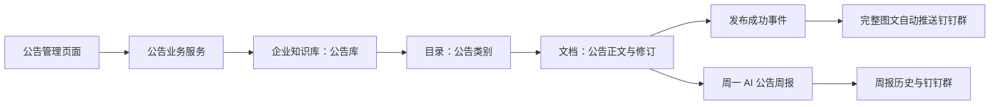

# 公告管理功能设计

日期：2026-09-17。状态：功能设计草案，未实现、未创建实际定时任务、未发送消息。

## 1. 产品目标与范围

方舟新增独立「公告管理」入口：录入图文公告、分类浏览、审核发布、查看推送结果，以及每周自动生成并推送公告周报。企业知识库承担内容存储、版本、检索和权限，用户无需进入知识库完成日常公告工作。

核心原则：一份正文、一个发布事实、多个展示渠道。公告页与知识库读取同一篇文档和同一发布修订；钉钉消息是该修订的分发副本。

首版覆盖用户提出的四项需求。暂不增加已读回执、强制签收、附件、公告定时发布或复杂部门定向通知。

### 设计假设

- 发布规则暂按「编辑者提交、审核者审核通过后自动推群」；此项已向用户询问，尚未确认为业务决定。若选择直接发布，仍复用版本和发布事件，只调整发布权限与流程，不绕过内容及范围校验。
- 周报每周一 09:00（Asia/Shanghai）生成并推送，时间可在设置中调整；统计上周一 00:00 至本周一 00:00，左闭右开。
- 首版使用一个公司级公告库、单层类别目录、一个默认企业内部公告群。预留投递记录中的目标群标识，但不建设多群路由界面。
- 群成员应属于公告允许披露的受众；实施启用时必须配置具体群和负责人，不复用系统告警群作为默认公告群。

## 2. 信息关系

| 用户看到的概念 | 底层对象 | 规则 |
| --- | --- | --- |
| 公告库 | KnowledgeLibrary | 以 ID 绑定，改名不丢关联；系统标记为公告业务管理的库 |
| 公告类别 | node_type=folder 的 KnowledgeDocument | 首版仅库下一级目录；可新增、改名、停用，非空类别不得直接删除 |
| 一篇公告 | node_type=document 的 KnowledgeDocument | 必须属于有效类别，不另存一套正文 |
| 公告版本 | KnowledgeRevision | 发布时冻结标题、正文、图片引用；修改生成新草稿 |
| 公告业务信息 | 公告扩展记录 | 关联 document_id，保存有效期、业务状态等知识库没有的字段 |
| 推送记录 | 发布事件与逐条投递记录 | 对应发布修订、群和消息序号，独立于正文状态 |

公告库在知识库中可被授权用户检索和阅读，已发布内容继续供现有 AI/MCP 使用。业务写操作统一经过公告服务：通用知识库页面对受管库展示「前往公告管理」，HTTP/MCP 的通用写入、审批、移动、软删除也必须在服务层拦截或统一转入公告规则，不能仅隐藏按钮。禁止直接递归删除公告库绕过撤回和投递取消。

## 3. 页面与使用流程

### 公告列表

独立路由建议 `/announcements`，主站响应式布局，适配钉钉内打开。沿用现有列表页搜索、分页和详情组件。

- 顶部操作：新建公告、周报历史；有管理权限者可见公告设置、类别管理。
- 筛选：关键词、类别、发布状态、发布时间；管理者增加推送状态筛选。默认按置顶优先、发布时间倒序。
- 列：标题（重要/置顶标记）、类别、发布人、发布时间、有效期、发布状态、推送状态、操作。
- 普通读者仅看已发布/已到期历史公告；编辑者看其授权范围内草稿；审核者有待审核视图。草稿修改时间不冒充发布时间。
- 可用操作随状态呈现：查看、编辑、提交审核、审核、撤回；推送异常展示具体原因和处理入口。
- 无权限内容不出现在搜索结果、计数或筛选汇总中。

### 新建与编辑

必填：标题、类别、图文正文。选填：重要标记、生效日期、截止日期；置顶为站内排序行为。默认立即生效、无截止日期。

复用知识库图文编辑器，支持粘贴/上传图片、标题、列表、表格。图片未上传成功时不可提交。纯图片公告要求补充文字说明，涉及时间、对象和行动要求须录成正文或结构化字段，确保周报可准确读取。

表单展示默认目标群及「发布后自动推送」说明。保存草稿、预览、提交审核为主要操作；预览同时展示方舟原文与拟发送的钉钉分条图文。系统不要求用户选择知识库 ID 或目录 ID。

类别调整、生效/截止日期和重要标记是发布内容的一部分：与正文一起冻结在公告版本元数据中，待审时不可被静默改动。置顶可单独调整并记录审计。

### 查看与审核

详情页展示标题、类别、发布人、发布时间、版本、有效期和完整正文。管理者另见版本记录、审核记录、推送记录；读者打开旧群链接时提示已有新版并可前往当前版本。

审核页面展示待发布修订、变更说明、发布群和钉钉预览；通过后自动分发，驳回必须填写原因。已发布公告修改期间，读者继续看到旧的已发布版本。新修订通过后，自动发送带「更新」标记的新版本图文。

### 设置与周报历史

设置包括：类别、默认群、发布角色/知识库成员映射、周报启停与时间、AI Preset、周报提示词补充。Webhook/凭据沿用安全配置入口，不在业务列表或日志暴露。

周报历史按周列出统计区间、公告数、生成状态、推送状态和生成时间，可查看正文与来源公告。提供「重新生成预览」「补发失败部分」；已发送周报重新生成不会自动再推群，需明确执行「发送更正版」。

## 4. 发布状态与权限

内容生命周期和群推送状态分开管理：

- 内容：草稿 → 待审核 → 已发布；驳回回到可编辑草稿。已发布内容可以有一个待审更新，不把整篇公告从读者视野移走。
- 有效性：未生效/生效中/已到期是依据时间计算的标签；未来生效公告仍在发布时立即推送，正文显示生效日期。
- 撤回：从正常列表与检索移除；管理者保留历史和原因；旧链接只显示撤回说明，不展示原正文。
- 推送：待发送、发送中、已送达接口、部分失败、失败、结果不确定、已取消。界面可简写为「推送成功」，但不等同于群成员已读。

草稿允许软删除；已发布公告通过撤回处理，避免历史消息指向无解释的页面。撤回取消未发送条目，并在同一群发送撤回说明；不承诺删除已进入钉钉的消息或缓存图片。公告到期保留历史和到期标记，供知识检索识别历史制度，不作为当前有效规则输出。

功能入口建议使用 announcement:read/write/admin；审核复用已存在的 knowledge:review 及公告库 reviewer/admin ACL。公告权限和知识库 ACL 采用同一身份、同一授权源，提供角色配置映射，不生成绕过 ACL 的虚拟超级用户。读公告的人无需拥有整个知识库管理入口；这要求 service 层明确入口权限与库 ACL 的组合契约，不能直接套用只认 knowledge:* 的现有方法后吞掉授权错误。

后台周报使用受限执行身份，只能读公告库的已发布内容并投递到配置群；每次运行和发送前重新检查身份、库状态及群配置。缺少发布目标或配置失效时，保存草稿可继续，发布应说明缺失项并阻止进入待分发状态。

## 5. 公告即时推群

### 内容规则

按发布修订将标题、类别、发布人、有效日期、正文文字与图片按原顺序转换为钉钉图文；附「查看原公告」链接。即时推送不调用 AI 改写，金额、日期、名单、要求等必须保持原文。

超长内容按段落和图片边界拆成顺序消息，显示「1/N、2/N」；不直接截断。表格或不支持的复杂排版转换成清晰的渲染图片，并保留可访问的原文。具体长度、图片大小、频率限制通过选定机器人通道实测后配置，不把尚未核验的平台阈值写死。

### 图片交付

当前图片端点受方舟登录与 ACL 保护，不能直接作为钉钉取图 URL。优先评估企业内部应用机器人上传媒体并发送图文，避免把整座知识库开放为公网静态资源。钉钉官方开发者资料说明应用机器人具备 OpenAPI 和媒体上传能力：[机器人概述](https://opensource.dingtalk.com/developerpedia/docs/learn/bot/overview/)、[机器人发送消息](https://open-dingtalk.github.io/developerpedia/docs/learn/bot/appbot/reply/)。这些资料不能证明项目现有 Webhook 与应用媒体 ID 可互换。

实施第一步用测试群核验实际应用、群权限、媒体展示、长文分片及过期后的表现，再确定发送适配器。若只能使用现有 Webhook，需另行设计已批准公开给该群的发布图片副本和受限下载令牌；其链接可被转发、不能撤销已缓存内容，必须在设计收敛时明确，不能无声改为公开原图。未完成图文通道验证不能以「标题加链接发送成功」认定完成本需求。

### 一致性与失败处理

1. 在同一数据库事务内更新发布指针、记录发布事件、写入待投递任务；提交后由后台发送。现有知识库 approve_request 内部直接 commit，需要重构事务边界，不能先提交发布再尽力插入推送任务。
2. 唯一键采用「发布事件 ID + 目标群 + 消息序号」；冻结修订、类别元数据、群配置版本和渲染内容，重试不重新读取可变草稿。
3. 明确未送达的错误限次退避重试；已成功分片不重复发，后续分片按顺序补发。
4. 网络超时、系统繁忙以及请求后进程崩溃可能已送达：标记结果不确定，能够查证时先查证；无法查证则提供人工核对和显式重发，不自动无限重试。数据库去重不能承诺外部系统恰好一次投递。
5. 后台租约防止并发领取，启动恢复过期任务；请求已经发出却未记录结果的任务进入不确定状态。
6. 新版发布时，未开始发送的旧版任务取消并标明被新版替代；已部分发送的旧版停止剩余条目并通过更新说明链接新版。撤回与发送并发使用版本/撤回检查和任务锁，若外部请求已在途，补发撤回说明。
7. 每个即时消息分片发送前，重新校验执行身份、公告当前披露范围与目标群配置。ACL 收紧或群配置失效时取消未发分片，保留已发送事实；冻结 payload 不构成永久发送授权。
8. 推送失败不回滚已经发布的公告；列表清晰展示「已发布，推送失败」，可补发。发送记录至少保存目标、版本、序号、尝试次数、响应状态与脱敏错误。

## 6. AI 公告周报

### 输入与统计口径

北京时间每周一 09:00自动执行；推荐命名为「上周公告回顾」。读取上周的发布/更新事件，而非 created_at 或最后编辑时间。同一公告周内多次发布，选区间内最后一次发布修订，保留更新标记，按公告去重计数。

生成时冻结 source document/revision/event IDs、类别及日期。草稿、待审和已撤回公告不进入普通摘要；另外查询周期内的撤回事件，包括更早发布但上周撤回的公告，在「撤回说明」中仅列仍允许向该群披露的标题与原因，不计入发布/更新数量。已到期公告标注到期。截点之后的新版本不混入上周快照；若发送前发现来源已撤回或权限收紧，删除该来源并重新校验，不泄露旧正文。

### 周报结构

1. 总览：上周发布/更新公告数量与类别分布。
2. 重点公告：重要公告优先，每条 1～3 句，附原文链接。
3. 分类回顾：每篇至少有一条可追溯入口；数量较多时分片，不能模型自行省略。
4. 本周须关注：仅提取这些来源中明确写出的本周生效、截止或行动要求。首版不扫描所有历史公告充当完整待办清单。

AI 只对授权的冻结来源做归纳，不外搜、不杜撰负责人/日期、不将建议写成公司要求。公告正文中的指令当作待总结内容，不能修改任务提示词或调用工具。调用统一 app.ai.service.chat 和可配置 Preset，通用调用日志只保留元数据，正文留在受控记录中。

要求模型返回结构化条目和来源 ID；服务端校验来源在白名单中、链接由服务端生成、数量与日期一致、所有公告有覆盖。数字、负责人、期限等关键事实保留来源原句。结构校验不能完全消除语义偏差：涉及行动要求的条目采用可逐字核对的摘录，无法验证的结果不自动发送。

### 运行和历史

- 建立稳定周期记录，唯一约束「公告库 + 周起始日」；同周期调度重复触发复用记录，生成尝试与发送尝试分开记录。
- 生成成功先保存周报与来源再入投递队列；发送失败仅重发保存版本，不重新调用 AI。
- 发布/更新和撤回事件均为空时不调用 AI，发送固定「上周暂无新增、更新或撤回公告」消息，保留运行记录。仅有撤回事件时发送通过当前披露权限校验的确定性撤回说明，不生成空周消息。
- AI 超时/校验失败限次重试；仍失败则发送注明「AI 摘要未生成」的确定性公告目录（标题、类别、时间、原文链接），周报状态记录为降级，管理端可见失败原因。
- 服务停机错过周一时，同周恢复后补做当周漏掉的一期，并标注补发；不自动连续补发多周历史。手动补历史需要指定周期。
- 周报不自动写成公告库的普通公告，独立保存于周报历史，避免下一期总结上一期而递归膨胀。

复用现有 APScheduler 单活调度与运维状态，新增公告周报任务类型和运行记录；不额外建设一个通用任务平台。现有 Agent Runtime 有 scheduled Profile 标记，但本轮未验证其通用 cron 执行入口，因此不把该枚举视为已完成的定时能力。后续若要求统一进入 AI Agent 任务中心，可由同一个周期执行记录关联 AgentRun，不再注册第二套调度。

## 7. 开发边界与数据草案

新增 app/announcement/ 领域，前端 views/announcement/。知识库继续负责正文、修订、资产与 ACL；公告服务负责发布业务、受管库写入边界、投递和周报；钉钉域负责选定通道的发送适配器。

建议新增以下逻辑实体，实施时按现有模型收敛迁移：

| 实体 | 主要信息与约束 |
| --- | --- |
| 公告配置 | library_id 唯一绑定、目标群配置引用、周报时间、Preset、执行身份、启停及配置版本 |
| 公告扩展 | document_id 唯一、置顶、撤回信息；不复制正文与可推导的类别 ID |
| 公告修订元数据 | revision_id 唯一、生效/截止时间、重要标记、类别快照、更新说明 |
| 发布事件 | 文档、修订、发布人、发布时间、初发/更新/撤回、目标快照；数据库唯一约束防重复提交 |
| 投递任务 | 发布事件或周报版本、群、序号、固定 payload、状态、租约、重试及脱敏回执 |
| 周报及其版本 | 周期唯一主记录，冻结来源、正文、模型/Preset、生成状态；发送的版本保持不可变 |

不在此阶段编造 Alembic 编号。实现前查所有分支的迁移编号，使用隔离数据库验证。部署启用周报和真实群推送另走项目发布流程。

## 8. 验收标准

1. 在公告页建立类别和图文公告后，知识库恰有对应目录和文档，正文没有第二事实源；改名与分类操作保持一致。
2. 普通读者无法从列表、详情、搜索、MCP、图片接口看到草稿或越权内容；受管库通用写入口不能绕过公告规则。
3. 初发和更新分别自动推送完整图文，中文长文、多图片、表格均可读；群链接在登录后到达正确公告。
4. 待审更新不改变读者看到的旧版；重复审核和事务失败不产生重复发布事件或漏投任务。
5. 发送部分成功、超时和进程崩溃均保留可恢复且准确的状态；失败重试不重复成功分片，不把不确定投递伪报成功。
6. 撤回立即影响详情、检索、MCP 与未发送任务，保留审计，补发撤回说明；已发群消息不能被假装已删除。
7. 周一任务在服务器不处于东八区时仍以北京时间执行；验证跨日、跨月、跨年、周边界、停机补跑和重复触发。
8. 周报覆盖正确周期的所有来源，排除草稿，修订去重，逐条原文可追溯；无公告、AI 失败和来源撤回有明确处理结果。
9. 普通编辑者无法修改机器人凭据、目标群或后台执行身份；成功投递不显示为员工已读。

## 9. 现状核对与实施顺序

代码核对依据：backend/app/knowledge/models.py、service.py、asset_service.py；backend/app/dingtalk/webhook.py、client.py；backend/app/schedulers/registry.py；backend/app/insight/scheduler.py；backend/app/agent_runtime/models.py；frontend/src/config/navigation.js。现状核对基于本地代码，未核验生产部署和真实机器人配置。

实施顺序：①测试群图文通道验证与发布规则收敛；②公告页、知识库受管关系和发布闭环；③可靠投递及异常恢复；④AI 周报、周期去重与历史；⑤权限、并发与手机端端到端验收。前三步完成前不启用正式自动推送。

## 实施边界（2026-09-17）

实际交付及验证以 [实现记录](../reports/2026-09-17-announcement-implementation.md) 为准：表格转逐行文字；周报抽取有证据原句，失败为目录；历史版本保留但未提供专门对比界面。真实 MySQL 与钉钉通道仍需上线联调。
