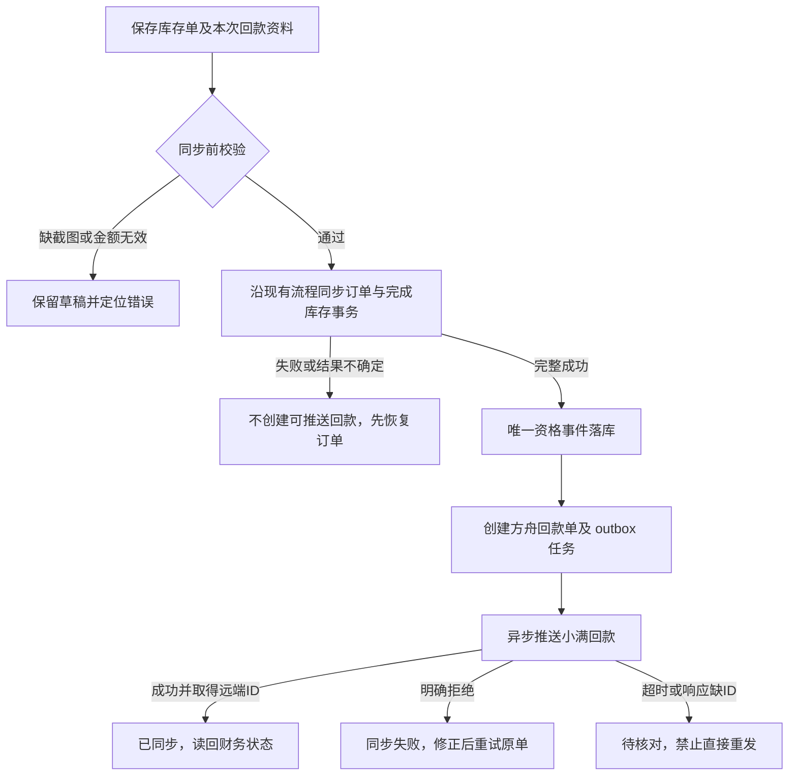

# 库存单自动回款与回款单管理 — 功能设计

日期：2026-09-17 · 范围：产品、交互、数据与接口设计；不包含业务实现或生产变更。

后续用户已要求开发，实现已落在 `codex/receipt-management`；实际表结构、配置、验证与未部署边界以[实现交付说明](2026-09-17-receipt-management-implementation.md)为准，本文保留设计依据。

交互原型：[打开回款工作台](2026-09-17-receipt-prototype/index.html)。使用模拟数据，刷新还原；上传文件只在当前浏览器预览，不发送。

## 1. 目标与设计结论

库存单在方舟保存回款凭证，订单完整同步小满后自动生成一张方舟回款单并异步同步小满。失败不丢单、不重复建单。统一回款列表提供查看、处理异常及手工补录入口；手工回款必须关联订单发票。

“提交”按本次需求具体解释为**同步 OKKI 成功**，保存草稿不产生回款；OKKI 与小满是同一系统，不是两个同步目标。

| 需求 | 本期方案 |
|---|---|
| 库存单上传截图 | 创建、编辑页增加回款信息区；草稿可暂缺，所有库存单同步入口都由后端验证凭证 |
| 自动创建并同步 | 首次完整同步成功触发一次；落地方舟单与待同步任务，再由后台推送 |
| 回款单列表 | 列出方舟创建的自动、手工单，包含失败、待核对及已作废单；受数据权限限制 |
| 手工创建 | 选择已成功同步的库存单或生产单；带出客户、币种、已回款与剩余金额，上传截图后提交 |
| 小满截图 | 官方接口存在附件字段；传值协议联调通过后启用，无法支持时只保留方舟凭证 |

本期不包含 OCR 自动认款、银行流水对账、跨订单分摊、跨币种回款、退款冲销、方舟财务审批、新增提成入口、全量导入小满历史回款。历史小满回款仍参与余额计算。

### 1.1 待业务确认的两项（不阻止审阅设计）

1. 自动回款金额：推荐默认剩余应收、允许修改，用户提交前确认实际到账金额；不是仅凭截图推断全额到账。若要求库存单一律全额，保留金额展示并锁为订单剩余金额。
2. 小满生效状态：暂按 `collect_status=0` 未生效设计，待财务在小满确认。这个选择**不等于现有提成链路已经过滤未生效单**，见第 9 节上线门槛。

未收到答案时，两项保持设计假设，不能作为已经批准的财务规则直接上线。

## 2. 现状核对与改动边界

| 现有实现 | 设计影响 |
|---|---|
| `backend/app/invoice/models.py: Invoice` 含 `total_amount/currency/internal_received/internal_balance` | 当前 `internal_received` 在 UI 中为“预付款”，不是可靠的回款流水合计；新功能不能直接累计写入它 |
| `xiaoman_service.sync_invoice()` 先持久化小满 ID，再检查明细、回写最终状态 | 有 ID 不代表订单完整同步成功，不能在刚拿到 ID 时创建回款 |
| `router.sync_invoice()` 再做半成品预占 finalize | 自动回款资格需等待库存事务完成；远端受理、本地恢复未完成时显示“等待订单完成” |
| 首推成功已有出库任务队列 | 回款任务独立幂等，不能与出库任务混用；二者失败互不重建对方 |
| `payment_sync_service.py` 从 `lsordertest.okki_receipts` 同步提成数据 | 新方舟回款不直接进入 `synced_payment`；等小满镜像按原通道回流 |
| “回款日期修复”改历史镜像日期 | 保持原管理工具边界，新建单不得写业务镜像 |
| 截图导入只保存来源图片 hash | 来源订单截图与回款凭证是不同材料，不能相互替代 |

## 3. 库存单自动回款流程

### 3.1 创建和保存

库存单表单在费用结算之后增加“本次回款”区：金额、币种（只读）、回款日期、回款方式、凭证和备注。默认日期是北京时间今天，可修改为真实回款日；默认金额采用 1.1 的设计假设。可保存不完整草稿。

原“预付款”仍是原有单据字段。UI 清楚说明“回款以回款单为准”，避免新旧字段同时当作余额来源；本期不重写旧发票打印和已有预付款含义。

首次提交同步前，内联提示本次将创建的金额和凭证数量；不增加重复确认弹窗。主按钮为“同步订单并生成回款”。自动回款只对上线后进入新流程的库存单启用，保存时记录资格版本。

### 3.2 服务端前置验证

以下条件在**发出订单推送及库存预占前**验证，前端校验仅用于及时提示：

- 至少一张已完成上传、未被删除且当前用户可用的回款截图；拒绝仅传 URL、其他人的文件 ID、上传中的文件。
- 金额大于 0、同订单币种、符合金额精度与剩余额度；日期和回款方式有效。
- 保留原订单必填、产品 SKU、业务权限、价格及半成品约束。
- 所有库存单同步入口适用：页面、外部 API、重试和管理恢复入口不能绕过凭证要求。
- 已经自动建过回款的库存单重新同步，沿用不可变的凭证引用验证，不要求再次填“本次金额”，不再次建单。
- 上线前已同步库存单不自动补建；后续重推时如历史无凭证须补传，但仍不把历史销售额新建为回款。

缺凭证文案：“请上传回款截图后再同步小满。库存单可以先保存。”上传按钮旁展示错误并定位该区，其他输入保持。

### 3.3 成功、失败与恢复

订单状态和回款状态分别显示。例如：“订单已同步；回款单 HK20260917-0001 已创建，正在同步小满”。回款失败不回滚销售订单、不再次出库，也不显示笼统的“提交失败”。

自动资格按 `invoice_id + auto_initial` 唯一。首推缺行后补齐、结果待核对后绑定订单、本地库存恢复后的首次完整成功，仍需补触发；不能只用这次调用的 `action == create` 判断。

同步订单前持久化一次回款意图（金额、日期、凭证、版本），完成库存事务时持久化可建单事件。后台对账按“新流程资格 + 完整成功证据 + 未创建”补齐中断任务。不能扫描全部历史 `synced` 单补建，不能拿最新编辑的金额替代当次快照。回款模块短暂不可用时，订单保留成功，UI 显示“回款待生成”并可由任务恢复。

## 4. 手工创建回款

入口：回款单列表右上角“新建回款单”；订单详情“登记回款”带入该订单。支持库存单尾款和生产单分期回款。

1. 搜索发票号、小满订单号或客户名，选中一张有访问权、已完整同步的方舟订单发票；未同步订单显示不可选原因和原订单入口。不能直接输入远端 ID 绕过关联。
2. 展示客户、订单总额、已生效回款、登记中金额及可登记余额；币种跟随订单，不提供额外币种输入。
3. 默认金额为订单金额减去已登记回款金额，用户可改为较小的分期实收金额；不能为 0、负数或超额。
4. 上传凭证，确认日期与回款方式；金额不从图片 OCR 推断。
5. “创建并同步小满”先创建本地单，再异步推送；双击、网络重传使用同一幂等键。失败保留单号，不能引导用户再次新建。

关闭未提交表单时有脏数据确认；提交成功直接打开新单详情并更新列表。再次打开新建表单不带入上次图片和金额。余额已清的订单不允许创建，详情仍可查看。

## 5. 金额口径和并发控制

订单总额采用当前完整同步版本的 `Invoice.total_amount`，包含现有产品净额及费用。订单有未同步金额改动时，先完成订单同步，才能新增回款；不混用新本地金额与旧远端订单金额。

**已登记回款 = 本订单小满已有且未删除的回款原币金额 + 尚未与远端记录匹配的方舟有效登记金额。** 按 `cash_collection_id` 去重，失败、排队、同步中和待核对单都暂时占用余额，避免用户在失败时重复登记。已作废的本地未发送单不占用。

自动流程从持久化回款意图开始冻结该意图金额；订单同步中不接受手工回款。完整成功但“回款待生成”期间，尚未转单的意图也计入有效登记占额。意图转成回款单时同事务原子交接，只计一次；转单前再次锁订单校验余额，远端新增导致不足时转“待核对”继续冻结，不强行推送。自动意图明确取消且确认订单未受理后才释放，超时不能释放。

- 已生效与未生效均属于“已登记”，分开展示；“已回款”若用于输入默认值，必须明确标为“已登记回款”，避免与财务确认额混淆。
- 可登记余额 = `max(订单总额 − 已登记回款, 0)`；异常超额单显示实际差额并阻断新增，不能只靠截断掩盖异常。
- 列表金额为客户打款金额；手续费独立保存，不把净到账 USD 作为订单原币回款额。2026-09-18 用户确认：自动回款按本次含费金额占订单含费总额比例分摊订单手续费，尾款吸收舍入差额；手工手续费留空默认0，显式手续费保留。
- 财务回款合计需读取原币 `amount/currency`；若现有镜像只有净额或 USD，扩展只读投影或调用小满只读接口，不能猜算。数据不可得时显示“余额待核验”并阻止提交。
- 所有已在小满创建的该订单回款都应参与余额，不局限于方舟创建。远端分页全量/增量对账需有水位与完整性标识。
- 每次提交获取新鲜远端余额快照，锁定订单行后重新计算本地占额并校验版本；本地并发第二笔返回 409、新余额和“余额已更新，请核对金额”，保留凭证。
- 本地行锁无法锁住小满 UI 的并发人工回款。推送前再次核验远端，推送后对账；仍有竞态时标异常并冻结后续新增，不能宣称跨系统强一致。
- 一旦存在有效回款或占额记录，订单客户、币种和远端订单绑定冻结；订单总额不得下调至已登记金额之下。既有 `update_invoice` 路径也必须校验，不能只限制新回款页面。若小满侧改动这些字段，标记对账异常并阻断新回款，人工处理后再恢复。
- 金额使用 Decimal/DECIMAL(14,2)，接口传十进制字符串；币种精度若并非两位则按配置限制。本期原型以 USD/CNY 两位展示。不同币种不能直接求和。

例如 USD 4,860 订单，小满已登记 1,500，方舟尚未回流的登记 600，可登记余额是 2,760；600 回流后按远端 ID 合并，余额仍为 2,760。

## 6. 界面设计

### 6.1 信息架构

主站“订单发票”分组新增“回款单”，与“订单发票管理”并列，原“提成管理 → 回款同步”保留。页面路由建议 `/invoice/receipts`，由 `navigation.js` 单点登记。

列表页顶部：标题、简短说明、唯一主操作“新建回款单”。摘要仅展示当前权限内的全部单数、待同步/同步中、失败/待核对数量；金额汇总必须按币种选择后展示，不能跨币种合计。

筛选：回款号/订单号/客户关键词、同步状态、来源、回款日期范围；必要时展开业务员与币种。默认按创建时间倒序、服务端分页 20 条。保留搜索条件，详情关闭后停留原页。

| 列 | 内容 |
|---|---|
| 回款单号 | 方舟编号，可打开详情 |
| 关联订单 | 发票号，可回订单；客户可作为独立列 |
| 本次金额 | 原币金额 + 币种 |
| 回款日期 | 北京时间业务日期 |
| 来源 | 库存单自动 / 手工登记 |
| 同步状态 | 待同步 / 同步中 / 已同步 / 同步失败 / 待核对 |
| 财务状态 | 未生效 / 已生效 / 未取得；不能用“已同步”替代 |
| 凭证 | 张数，点击在详情预览；不得用小满截图状态替代本地完整性 |
| 操作 | 查看、重试（明确失败）、核对（有管理权）；按状态和权限展示 |

作废作为独立业务状态筛选，详情显示原同步历史。空列表显示“尚无回款单”及创建入口；筛选无结果显示“没有符合条件的回款单”和清除筛选。加载保留布局，列表请求失败保留筛选并提供刷新。

### 6.2 新建抽屉与详情

新建采用右侧 640px 抽屉：订单选择 → 金额摘要 → 本次回款表单 → 凭证 → 固定底部操作。详情同宽：单号与状态、关联订单、金额日期、凭证预览、同步时间线、可执行操作。

详情同时展示“小满回款编号”和“截图传输状态：已传小满 / 仅方舟留存 / 待处理”。API 能力未知不能显示为“已传”。待核对单显示原因及处理入口，不能出现普通重试按钮。用户缺少核对权限时显示“联系财务管理员核对”。

### 6.3 视觉与交互规范

沿用 DESIGN.md 和 tokens.css：深灰侧栏、暖金静态背景、白色玻璃面板；列表 13px、表头左对齐、有纵向边界、无斑马纹。主按钮 36px，金色；操作文字带图标，按宽度换行。复用 `DictManagement.vue`、`useListPage`、`DetailDrawer`、`AppUpload`、`feedback`。

桌面内容宽度自适应；≤768px 导航收起、筛选换行、抽屉不超出视口、表格内部水平滚动；不遮挡操作列。可键盘完成、输入有可见标签、错误靠近字段、状态不只靠颜色。弹层管理焦点、Escape 关闭、关闭后恢复焦点；脏数据先确认。高频界面不加入场错峰、弹跳或无限光斑动效，尊重 reduced-motion。

### 6.4 原型覆盖

交互原型包含回款列表及关键词/状态/来源筛选、手工创建、订单切换默认余额、截图选择预览、金额校验、详情时间线、明确失败重试、待核对展示、库存单缺截图拦截与自动建单。顶部“演示结果”只属于原型，用于模拟成功、拒绝、结果不确定；正式产品不提供此控件。日期筛选、远程订单搜索、真实分页、管理员核对/修正/作废、订单完整编辑与服务端事务属于文档规格，原型未实现这些后端能力。

## 7. 小满官方接口核验

核验日期 2026-09-17，仅查公开文档，未调用租户写接口。下表中的内部规则与 API 支持结论分开，官方字段不是联调成功的证据。

| 官方接口 | 用途与核验结论 |
|---|---|
| [回款新建/编辑](https://open.xiaoman.cn/api-3478278) | `POST /v1/invoices/receipt/push`；返回回款 ID/编号；请求包含 `file_list` 字符串数组 |
| [回款列表](https://open.xiaoman.cn/api-3478279) | 按更新时间分页获取，含删除标志查询；用来做回流与不确定结果查找 |
| [回款详情](https://open.xiaoman.cn/api-3478277) | 核对关联订单与回款字段，最终匹配结果需详情校验 |
| [回款字段](https://open.xiaoman.cn/api-3478276) | 获取租户必填、自定义字段，不照抄示例字段 ID |
| [回款方式](https://open.xiaoman.cn/api-3485302) | 获取可用回款方式，内部付款方式需明确映射，不直接传内部中文标签 |

推送映射：关联订单→`order_id`；金额/币种→`amount/currency`；日期→`collection_date`；方式→`type`；银行扣费→`bank_charge`；备注→`comment`；财务状态→`collect_status`；方舟编号作为 `cash_collection_no` 的候选关联标识。字段格式、金额小数、汇率单位及编号唯一性需要联调，不将订单接口经验直接套入回款接口。

公开文档的金额类型与列表小数示例、汇率默认和必填描述存在需验证之处。实施前需在经授权的测试租户验证两位小数、USD/CNY 换算、返回净额与原额、付款方式映射及企业自定义必填；测试失败不得静默取整或猜汇率。该 API 域名含 sandbox，但项目客户端注明实际用于生产，不能因域名将其当成隔离测试环境。

### 7.1 截图策略

文档确认存在附件参数；未找到可核验的公共文件上传协议说明，**不能宣称不支持，也不能宣称已经打通**。实施时先确认字符串表示文件 ID 还是 URL、是否复制文件、数量/大小限制和访问时效。

优先使用小满正式上传机制（若对接方确认存在）；如接受 URL，采用受控时效地址，不发送本地路径或需方舟登录的地址，不默认公开真实凭证。用无敏感内容的测试图片验证详情可见且后续仍可访问后才启用。

确认不支持或暂未具备可靠传图能力时，省略 `file_list`，回款继续推送，UI 显示“仅方舟留存”。若已发送的整笔请求超时，不能通过去掉附件再创建；先核对整单结果。只有明确确认远端未创建，才允许无附件重试原单。附件补传必须有已验证的编辑协议，不能伪装成再次新建。

## 8. 数据、状态与接口设计（拟新增，非现状）

新增领域 `backend/app/receipt/`，业务逻辑在 service；通用鉴权客户端复用既有 token 边界，不复制凭据。路由统一注册、响应使用 `ok()`。

| 实体 | 核心字段与约束 |
|---|---|
| `ark_receipts` | id、唯一 receipt_no、invoice_id、source、auto_key（可空唯一）、request_key（唯一）、amount、currency、collection_date、payment_type、bank_charge、comment、owner_user_id、created_by、业务状态、sync_status、version |
| 远端映射 | xiaoman_order_id、唯一 xiaoman_receipt_id（可空）、xiaoman_receipt_no、collect_status、附件传输状态、last_error、synced_at |
| `ark_receipt_attachments` | 上传资源 ID、receipt_id 或 invoice_id（上传阶段）、文件名、MIME、大小、hash、storage_key、上传者；不存公开永久地址 |
| `ark_receipt_intents` | invoice_id、类型、资格版本、金额/日期/凭证快照、源发票版本、资格状态；库存单初次回款唯一 |
| `ark_receipt_sync_tasks` | receipt_id、状态、attempt、next_run_at、lease_until、attempt_token、payload_hash；同一回款最多一个有效任务 |
| `ark_receipt_sync_logs` | receipt_id、操作、操作者、时间、结果、脱敏错误、远端 ID、摘要；不记录截图地址/token/账户敏感信息 |

金额、单据快照与任务同事务创建。后台领取任务用原子状态迁移/租约，避免双 worker；请求发出后租约超时或进程崩溃转待核对，不能重新当作未发送。HTTP 调用不长时间占用订单数据库锁。

| 同步状态 | 允许动作 |
|---|---|
| pending | 后台发送；尚未发送可撤销，释放占额 |
| syncing | 等待，不可编辑/撤销/重复发送 |
| synced | 查看、刷新财务状态；锁定核心金额和关联订单 |
| failed | 明确远端未受理；修正合法字段、重试同一单，版本更新 |
| uncertain | 只核对；禁止重试和释放占额 |

作废与同步状态分离：仅未发送或确证未创建的单允许作废；已在小满生成的回款本期不在方舟撤销，提示去小满按现有财务流程处理，再只读回查。不物理删除历史单据及其凭证。

待核对流程：先按更新时间窗口分页查远端；自动绑定必须同时满足稳定来源标识（经联调确认小满保留的方舟编号）、订单、金额、币种和日期全部一致，且唯一命中。来源标识不可得时，即使同订单同金额同日只有一笔，也只是人工候选，不可自动认领；多条或模糊命中交管理员。管理员绑定还需校验远端 ID 未被其他单占用、权限和审计原因。确认未创建需核对证据与原因，再恢复 pending。编号只是查找锚点，不假设小满提供幂等保证。

| 方舟拟定端点 | 功能 |
|---|---|
| `GET /api/receipts`、`GET /api/receipts/{id}` | 权限内列表、详情、同步轨迹 |
| `GET /api/receipts/order-options`、`GET /api/receipts/order-balance/{invoice_id}` | 可选订单及新鲜余额/版本/完整性 |
| `POST /api/receipts/attachments` | 上传校验并返回受控资源 ID |
| `POST /api/receipts` | 创建，接收幂等键与余额版本；返回本地单号和排队状态 |
| `POST /api/receipts/{id}/retry` | 仅明确失败状态可执行 |
| `PATCH /api/receipts/{id}` | 仅未发送/明确拒绝可修正，重新校验占额 |
| `POST /api/receipts/{id}/void` | 仅本地且无远端效果可作废 |
| `POST /api/receipts/{id}/reconcile` | 只读查询远端结果 |
| `POST /api/receipts/{id}/resolve` | 管理员证据核对后绑定或确认未创建 |

静态路由在 `/{id}` 前注册。同步订单接口增加 `receipt_generation_status/receipt_id/receipt_sync_status`，保留既有订单结果；页面不能只看 HTTP 200 当作业务成功。

## 9. 权限、凭证与现有财务链路

权限建议 `receipt:read/write/admin`，跨业务员查看使用 `receipt:read_all`（kind=data）；菜单、动作与数据范围分别控制。业务员仅本人/已授予代办范围，财务按角色获得全量查看和管理；截图下载与回款详情同权限，不能拿资源 ID 绕过。

库存单自动回款属于原 `invoice:sync` 动作的明确副作用，不额外要求用户拥有手工回款写权限；管理员核对使用 `receipt:admin`。授权 invoice:sync 的业务员应同时获得其本人回款单只读权限，否则订单结果只显示摘要，不暴露不可访问链接。权限种子按项目 upsert，按钮用 v-permission。

凭证建议 PNG/JPEG/WebP，单张 ≤10MB、最多 5 张；真实 MIME/解码、大小、资源归属由后端校验。上传中不能提交；原文件不可被重用 URL 覆盖。有效单引用文件禁止删除，作废仍留审计；仅过期未绑定上传可按既有清理策略清理。

现有提成读取镜像回款但代码未显式检查 `collect_status`。上线前必须核实镜像采集是否已过滤未生效单，以及回款生效/修改后增量同步如何处理；否则仅设置未生效并不能避免提前计提。新模块不双写提成数据，不能以“已同步小满”宣称“已进入提成”。如需要调整提成过滤，须单列影响和回归验收，不把未验证行为当现状。

## 10. 验收清单与实施门槛

| 场景 | 预期证据 |
|---|---|
| 库存草稿无截图 | 可保存；同步 API 拒绝，远端订单/库存未变化 |
| 正常库存单 | 完整订单成功后且只生成一单，凭证/金额快照一致 |
| 首推缺行、库存 finalize 失败 | 不推回款；恢复完整成功后补建一次 |
| 已同步库存重推、刷新、并发点击 | 不新增自动回款、不重复出库 |
| 历史已同步订单 | 不批量补建；尾款走手工创建 |
| 手工部分回款 | 默认正确剩余金额，可改较小值，余额及时减少 |
| 零、负、超额、NaN、精度溢出 | 前后端都拒绝；金额不自动截断 |
| 本地并发和远端人工回款 | 本地超额被拦；跨系统异常可识别且停止后续新增 |
| 自动待生成与手工并发 | 意图占额可见，补建只原子转移占额，不能再次登记同笔余款 |
| 小满明确失败 | 同一方舟单可修正重试，不回滚订单 |
| 超时、缺 ID、发送后崩溃 | 待核对、占额保留、禁止自动重新创建 |
| 小满镜像回流 | 以远端 ID 去重，默认金额不二次扣减 |
| 原币/手续费/财务状态 | 分别核验原币总额、净额、生效状态及提成路径 |
| 小满不传图 | 方舟截图完整，单据可同步，详情明确仅本地留存 |
| 权限/文件归属 | 越权订单、回款、截图均拒绝；代办按已有授权范围 |
| 时间/响应式/键盘 | 非东八区及北京时间零点测试；390/768/1440px 无不可达控件 |

建议实施顺序：先核实财务两项规则和 API 联调契约 → 领域表/凭证/手工单闭环 → 订单成功事件及恢复补偿 → 只读回流和财务链路验证 → 角色授权及灰度。迁移只走 Alembic，查所有分支编号，在隔离库测试；本设计不创建迁移、不写生产库。

设计交付验收：文档和交互原型落地、关键路径在模拟环境可操作、独立风险审查完成、差异/项目约定检查结果留存。API 真实传图与财务业务选择仍是实施前门槛，不伪称已联调。
