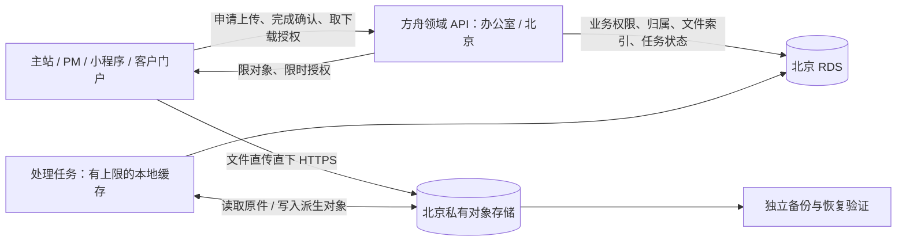

# 方舟统一云存储：现状调查与迁移方案

日期：2026-09-18；实施约定更新于2026-09-19。桶与套餐已购买，复制和接口改造进行中，尚未切换生产。

附件全链路复核、补充域和三入口放行条件见[附件切换验收](2026-09-19-attachment-cutover-audit.md)。不得用候选配置预检或隔离测试代替办公室/cloud/work真实登录态验收。

**实施优先约定**：用户已确认公网北京中转到COS、手机检验局域网持久接收后异步同步。现场LighthouseCOS桶CORS/OPTIONS返回403，下文最初方案中的浏览器直传不作为本次前提；不需要挂载桶为服务器磁盘。进度及待处理项以docs/handoff.md为准。

> 上述状态为 9 月 18 日原始调查时点。9 月 19 日已购买北京 LighthouseCOS 桶 `leshine-ark-1259007308`（1 TB / 100 GB 外网下行）；实施进度统一见 [handoff](../handoff.md)。实测 SDK 对象上传、分片防覆盖、签名 PUT 和 Range 可用，但浏览器 OPTIONS 与桶 CORS 配置接口返回 403。腾讯云[产品说明](https://cloud.tencent.com/document/product/1207/108904)明确 Lighthouse 版不支持存储桶级 SDK 操作，因此原方案中的浏览器直传仍是未通过的切换条件，不得按普通 COS 已支持 CORS 来发布。

## 1. 结论与建议

统一业务文件存储值得做，直接解决“共享数据库、文件却只在某台机器”的问题。建议目标为：**业务原件进入对象存储，浏览器直传直下，方舟负责权限、文件校验和业务关联；服务器只保留运行环境与有上限的处理缓存。**

不建议通过给三台机器挂同一个远程目录完成全部迁移。当前办公室 Windows、北京 Linux、新加坡 Linux 跨地域，一键挂载覆盖不了全部；现有代码还依赖本地原子替换、目录扫描、进程锁和图片解码，直接改盘符会改变这些语义。挂载后继续让上传经过办公室/frp，也不会消除跨境瓶颈。

产品建议：**长期主存储优先标准 COS；如确定使用 LighthouseCOS，则先通过直传兼容性验证，再按相同对象接口实施。** 不为简单试点提前购买长期套餐。LighthouseCOS 并非完全不能用，但版本保护、域名、备份自动化的差异会影响平台长期成本。本文中的“标准 COS”指完整对象存储产品，不是 LighthouseCOS SDK 的 `StorageClass=STANDARD` 参数。

## 2. 调查范围与证据等级

- 已读当前源码、Settings、部署登记、架构/运维文档及 9 月 18 日回款生产验证记录；文档中的历史拓扑与最新报告冲突时优先采用最新具体证据。
- 已通过 SSH 只读访问北京、新加坡，运行目录容量统计；未读取业务文件正文、密钥或完整环境文件，未运行部署、迁移、上传或配置变更。
- 北京运行 checkout HEAD 为 `aed61c435`，与本地 main 不应假定一致。后续开发必须整合生产补丁，不能拿当前 main 直接覆盖生产。
- 未完成办公室生产磁盘扫描、全量数据库文件引用核对、云账号桶权限/套餐核查、各地终端 COS 实测。因此以下容量是部分目录快照，不是完整采购容量或已验证迁移清单。

主要依据：[架构](../architecture.md)、[部署](../../deploy/README.md)、[部署登记](../../deploy/platforms.json)、[回款验证](../reports/2026-09-18-receipt-production-verification.md)、[文件备份脚本](../../deploy/backup-uploads.bat)。

## 3. 当前拓扑与痛点

| 节点 | 已知职责/文件归属 | 迁移影响 |
| --- | --- | --- |
| 办公室 Windows | 方舟后端、单活调度；素材、PM、知识库等本地文件；回款/充值凭证权威存储 | 优先消除永久文件对办公室在线状态的依赖；调度器仍保持单活 |
| 新加坡 | `.work` 主站、PM 静态站、frps、hair/video、独立连接器与同步服务 | `.work` 业务 API 主要穿透回办公室；文件直传后可卸掉大流量，但控制 API 仍走原链路 |
| 北京 | `.cloud` 后端/静态站、客户素材 `/data/customer-media`、色块工作台 | 可作为同地域对象处理节点；不能把所有业务自动切到北京 |
| 北京 RDS | 多后端共用 `commission_db` / `lsordertest` | 继续保存业务数据、文件标识与权限；数据库不属于对象挂载迁移范围 |

最新回款链路为 `.cloud → 新加坡 .work → frp → 办公室`，整个 `/api/receipts` 当前固定办公室。9 月 18 日报告记载北京入口 1MiB/10MiB 请求超时；文件迁移可解决大字节传输，但不自动修复所有跨境 API 请求。[证据](../reports/2026-09-18-receipt-production-verification.md)

PM 公网前端仍设 256KiB，内网 50MiB，原因明确是 frp 跨境链路。完成直传验收后才撤销公网临时限制，保留业务上限。[源码](../../frontend-pm/src/utils/uploadLimit.js)

### 北京只读目录快照

`du -sh` 是磁盘占用近似值；字节数为普通文件逻辑大小总和。在线统计可能遇到并发变化，均须在正式迁移清单中复核。

| 路径 | 文件数 | 逻辑字节 | 磁盘占用 | 说明 |
| --- | ---: | ---: | ---: | --- |
| `/home/ubuntu/commission-system/uploads` | 2,393 | 1,975,769,844 | 1.9G | 混合业务上传与历史副本，逐域辨认 |
| `/home/ubuntu/commission-system/backend/uploads` | 0 | 0 | 16K | 当前无普通文件，不代表办公室设计附件为空 |
| `/home/ubuntu/commission-system/backend/data` | 4 | 479,518 | 488K | 可能包含历史副本，不能覆盖办公室权威文件 |
| `/data/customer-media` | 33 | 75,960,883 | 73M | 客户素材的现有主要存储 |
| `/home/ubuntu/commission-system/.deploy_state/colorwork/data` | 544 | 2,592,643,366 | 2.5G | 含应用持久状态；不得整体挂载、删除或当附件复制替换 |

新加坡 `/var/www/ark` 约 3.5G、`/var/www/pm` 约 13M：这是目录整体占用，不能当作上传原件量。hair/video 的实际线上根目录还需按有效站点配置定向核查。目录不存在不证明业务资产不存在。

## 4. 文件清单与改造点

以下根目录来自源码默认值，生产 Settings 覆盖值必须在盘点阶段逐台确认。不得把开发机默认路径当生产事实。

| 领域/类型 | 当前存储方式与源码 | 迁移工作 |
| --- | --- | --- |
| 客户素材 | `CUSTOMER_MEDIA_STORAGE_ROOT`；[storage.py](../../backend/app/customer_media/storage.py) 已有 provider/object_key/size/sha256，但只接受 local | 适合作为首个技术试点；替换 resolve、删除、缩略图和鉴权下载调用，不能只新增上传方法 |
| PM 资料 | `backend/data/pm`；[service.py](../../backend/app/pm/service.py)、[material_service.py](../../backend/app/pm/material_service.py)；版本、签名下载、在线文本编辑、AI 差异都读本地 | 优先业务试点；保留独立门牌鉴权、版本号并发规则、历史版本和强制附件下载策略 |
| 回款凭证 | `backend/data/receipt-proofs`；[attachments.py](../../backend/app/receipt/attachments.py)，10MiB/张、最多5张，绑定时检查文件存在 | 替换 path_for、存在性验证、proxy 和下载链路；只迁文件，不能触发小满发送或修改回款状态 |
| 内贸充值等 | `DOMESTIC_STORAGE_ROOT`；[file_service.py](../../backend/app/domestic/file_service.py)；充值写/读目前固定办公室 | 保留订单/客户归属与审核权限，逐接口移除已不需要的跨境字节转发 |
| 素材中台 | `ASSET_STORAGE_ROOT` 默认 `D:\WORKSOURCE`；[asset_service.py](../../backend/app/asset/asset_service.py)、[folder_upload_service.py](../../backend/app/asset/folder_upload_service.py) | 文件夹上传、分片合并、历史版本、图片/视频缩略图、签名下载均需改；`ASSET_UPLOAD_STAGING` 仅作临时工作区 |
| 发货检验 | `SHIPPING_INSPECTION_STORAGE_ROOT`，默认根 `uploads/shipping-inspection`；[file_service.py](../../backend/app/shipping_inspection/file_service.py) | 保留主站、小程序、工位与外部访问各自权限；禁止变成公共静态文件 |
| 售后/培训 | 对应 `AFTERSALES_STORAGE_ROOT`、`TRAINING_STORAGE_ROOT`，默认 WORKSOURCE 子目录 | 上传、预览、删除、AI 读取和推送链接一并改；推送任务不在迁移时自动重发 |
| 设计生图/客户生图/AI 对话 | `DESIGN_IMAGE_STORAGE_ROOT`、`AI_CHAT_STORAGE_ROOT`；存在进程内锁、本地读写、清理与图像处理 | 本地锁不能保证多实例互斥；任务租约/DB 状态约束发布；保留邀请隔离与客户生图清理语义 |
| 知识库 | `KNOWLEDGE_STORAGE_ROOT` 默认 `backend/data/knowledge`；[image_service.py](../../backend/app/knowledge/image_service.py) | 校验富文本内引用、鉴权图片和旧内容兼容 |
| 设计附件 | 实际为 `backend/uploads/design`；[router.py](../../backend/app/design/router.py) | 与根目录 uploads 分开盘点；现备份脚本未显式覆盖此目录，需核实其他备份是否覆盖 |
| 展会/名片/头像/报告及发色相关资源 | 根 `uploads` 及各域上传/生成路径；[static_files.py](../../backend/app/bootstrap/static_files.py) | 分清公开商品资产与客户照片；扫描 URL、HTML/富文本、固定文件名缓存、二维码旧链接和生成后清理 |
| 色块工作台 | 北京 `.deploy_state/colorwork/data`；`FILES: R2Bucket` 接口、分片 PSD；[template-sources.ts](../../colorwork-workbench/lib/server/template-sources.ts) | 单独适配对象接口；先拆清文件对象、数据库/本地运行状态，不把 R2 接口声明误判为已使用远程云桶 |
| hair/video/其他独立服务 | 权威源码或运行资产部分在仓库外 | 查有效路径、业务引用、状态数据库与拥有者；原件可入云，运行代码/会话状态另行管理 |

跨域公共挂载目前包含 `/uploads/assets → ASSET_STORAGE_ROOT` 与 `/uploads → 仓库 uploads`。源码对检验私有目录做了排除；**不能照搬现有整个目录并把桶设公读**，WORKSOURCE 也包含其他私有领域子目录。

文件类型划分：

1. 永久业务原件、派生图、需要长期保存的导出文件：入对象存储。
2. 图片解码、FFmpeg、OCR、AI 输入准备、ZIP 导出和分片中间态：留有限额/超时清理的本地缓存，处理完成再写对象。
3. MySQL/SQLite 文件、连接器会话、运行代码、虚拟环境、日志热文件、密钥、发布锁/状态：不放对象挂载盘；备份快照可另入专用私有备份桶。

## 5. LighthouseCOS 与标准 COS

腾讯云中国站官方文档，核对日期 2026-09-18：[产品对比](https://cloud.tencent.com/document/product/1207/108904)、[产品概述](https://cloud.tencent.com/document/product/1207/80957)、[计费](https://cloud.tencent.com/document/product/1207/80959)。注意不要混同另一产品 LightCOS（产品编号1722）。

| 项目 | LighthouseCOS | 对方舟的决定 |
| --- | --- | --- |
| COS SDK 与基本对象读写/分块 | 支持；StorageClass 省略或 DEFAULT，不设 STANDARD | 统一对象接口可保留，不能认为所有桶级 API 同样可用 |
| 自定义源站域名 | 官方对比列为不支持 | 自有 files 域名不能作为直接绑定该桶的既成能力；若有此需求优先标准 COS |
| 生命周期、版本控制、清单、跨区域复制 | 官方对比列为标准 COS 的高级能力 | 不在 LHCOS 方案中承诺原生提供，须自建清理/清单及独立备份，或改用标准 COS |
| 计费 | 容量和外网下行；标准 COS 另含请求等项目 | 算总体费用，不能只比较容量套餐 |
| 地域 | 中国站包含北京等大陆地域 | 主存储候选北京；国际站地域清单不能替代中国站账号实际可选项 |

官方[一键挂载说明](https://intl.cloud.tencent.com/zh/document/product/1103/78324)要求同地域、支持的 Linux 系统、空挂载目录和至少10GB `/tmp` 空间。此为挂载工具条件，SDK 访问不要求客户端必须是同地域 Linux；办公室 Windows 和新加坡仍可通过 HTTPS 访问北京桶，网络/费用单独评估。

官方[GooseFS-Lite 使用限制](https://cloud.tencent.com/document/product/436/115507)明确多客户端需协调写入，rename 非原子，随机写等受限。现有 `.part → os.replace`、目录扫描和本地锁不能原样搬到挂载目录。

**LHCOS 购买前阻断项**：用测试桶验证实际浏览器 CORS/预检/ETag 暴露、短时签名 PUT/GET、分片、Range 视频播放、Content-Disposition 预览行为、撤权后再取签名。桶级 API 受限，不能直接假定标准 COS 的 CORS 设置流程可用。失败则选择标准 COS，不把“让后端再中转全量文件”作为已实现直传目标。尚未创建测试桶，本轮不声称这些项通过。

## 6. 目标架构与安全边界

目标逻辑划分为私有业务桶、明确可公开的静态资源桶、独立备份桶；可根据产品能力落地，不能以一个公读桶加路径前缀替代权限隔离。开发/验收和生产桶隔离。先北京单地域权威写入，海外公开分发是否加速以后由实测决定，第一期不做北京/新加坡双主写入。

业务持久化存 `provider + bucket/region引用 + object_key + size + content_type + sha256 + 状态`，不存临时签名 URL 或服务器绝对路径。已有领域字段能表达的先复用，确需跨源定位的用迁移映射表；不先重建全平台文件管理产品。

建议共享能力位于 `app/core/storage/`：对象写入/读取/HEAD/删除、签名授权、分片、受限临时文件上下文；领域权限仍留领域 service。配置全部经 Settings，Python 和色块工作台的适配各自遵守运行环境约束。

### 上传完整流程（拟议契约，不是现有 API）

1. 用户向当前领域申请上传；后端校验主体、业务归属、类型、额度，生成随机且唯一的暂存 key 和上传会话；不接受客户端指定任意 key/bucket。
2. 只授予本次对象的短时上传权限，浏览器直传；分片限定会话及 key，不授予列桶/删除其他对象权限。长期 SecretId/Key 不进浏览器。
3. 完成确认幂等；后端先对暂存对象做限额预检查，再复制/流式写入客户端无写权限的唯一最终隔离 key。复制过程中暂存对象可能被未过期授权覆盖，因此不把暂存对象的预检查当最终验收；最终对象不再允许客户端或后续完成重试覆盖，且此时对业务不可见。
4. 对该最终对象执行 HEAD、实际内容探测/解码与可信摘要校验，通过后才提交数据库关联，使业务可见。不能信任客户端提交的 sha256，也不能把 multipart ETag 当文件 SHA256。校验失败或 DB 提交失败记录隔离对象清理任务；失败不返回“上传成功”。此顺序避免“校验暂存对象后、复制前被覆盖”的竞态；未核实支持的源版本/条件复制不作为前提。
5. 上传会话过期、异常中断、分片残留按明确保留期清理；清理按会话/任务状态判断，不按猜测目录整体删除。并发完成和取消由 DB 状态/租约串行化。

短时签名 URL 在有效期内具有访问能力；新签名必须重新鉴权。需要立刻撤销或一次性访问的内容保留鉴权代理/受控下载入口，不宣称已发 URL 可立即撤回。日志避免保存完整签名查询串。

下载先查领域权限，再发短时 URL；内部 JWT、PM 门牌、客户邀请、小程序 token、MCP token 不混用。私有图片不经过公共 CDN 缓存；HTML/SVG 等不可信活动内容强制附件或隔离源。生产 CORS 明列实际 Origin，且小程序配置相应合法上传/下载域名并用真机验收。

后台图片/视频/AI 处理从对象下载到有空间配额的工作目录，处理完成写新对象并更新 DB；跨实例任务用现有租约/数据库保证唯一完成，本地 RLock 不作为分布式锁。对象存储不负责业务事务或调度选主。

## 7. 分阶段执行与验收

| 阶段 | 工作 | 交付/退出条件 |
| --- | --- | --- |
| A 只读盘点与产品验证 | 枚举实际 Settings 根、业务引用、全部写入实例/定时任务；核对桶能力；各地测速 | 确定产品/地域；出容量、来源和冲突清单；LHCOS 直传关键项通过才选用 |
| B 共用存储能力与技术试点 | 测试环境接对象 SDK，客户素材打通授权/校验/缩略图/下载/删除 | 故障与越权测试通过；生产尚不切换 |
| C 第一批业务迁移 | PM 直传 + 回款/充值凭证；每域独立迁移和切换，不同时切全部 | PM 公网50MiB、凭证合法上限的真实验收；两入口与内网一致；不触发财务业务动作 |
| D 大文件与其余领域 | 素材/视频、检验、售后培训、知识库、生图AI、展会设计头像，色块单独适配 | 权限/旧链接/派生文件/后台任务均验证；所有持久写入口已纳入 |
| E 稳定运行与收尾 | 观察、恢复演练、确认留存期后清理旧副本与过渡适配 | 新写原件100%入云、全部有效历史引用可取回、备份可恢复、无隐藏本地唯一副本 |

建议先用客户素材做小范围技术试点，再优先兑现 PM/凭证的业务收益。每阶段完成标准独立，不用“已安装 SDK/挂载成功”替代端到端验收。

粗略投入仅供排期：A 1–2 人日，B 2–4 人日，C 3–5 人日，D 5–10 人日，E 1–2 人日；约12–23工程人日，另加复制/观察等待。假设一个熟悉代码的工程执行者、账号/网络可用；不构成工期承诺，盘点后重估。域数量和色块持久状态拆分是主要变数。

### 每个领域的数据迁移协议

1. 明确权威源实例。清单记录 `source_instance/root/relative_path/size/mtime/sha256/business_ref/target_key/status`；扫描权限错误单列，不能跳过后报完整。覆盖隐藏业务目录、候选发布目录历史原件及数据库/富文本旧引用，但不盲目复制整个发布目录。
2. 同 key/相对路径、不同摘要视为冲突，保留各来源，按业务记录判定，不采用“mtime 较新覆盖”。源文件不存在列缺失单，不能由其他业务的同名文件补齐。
3. 在线全量复制只能作预热。扫描前后大小/mtime变化的文件重试；真正切换前短暂停该领域全部入口写入及后台文件写任务，再做最终增量与删除清单核对。冻结须覆盖签名发放与完成确认，等待在途请求/已有上传授权排空或过期；用上传会话代际拒绝冻结前的迟到确认。其他业务继续服务。
4. 目标使用确定的命名映射，可恢复重跑；每次记录成功对象，迁移只复制不删源，禁止 `sync --delete` 或 `/MIR` 指向主桶。每个对象核验大小及可信完整性证据；历史回款等关键原件逐份 SHA256，其他原件也须建立可复核摘要，不用仅对象总数作为验收。
5. 文件验证完成才更新 provider/key 映射。读取根据记录明确选择 local/COS，过渡期间 local 读取必须指向原权威实例，不能随请求落在哪台机器就读哪台磁盘。COS 已提交对象缺失应报错/告警，不静默回退另一台同名文件。
6. 所有可能读该共享记录的实例先部署兼容版本，再切 provider 并恢复该域写入。在线切换后只向选定权威后端写；本方案不要求长期双写。
7. 逐域保留源副本建议至少30天，并在窗口内完成恢复演练。时间是技术建议，最终删除还须遵守业务留存和明确删除授权；软删除、待清理、孤儿分别处理。

迁移只拆走文件字节，不顺带迁移业务 API 的权威实例。例如当前整个 `/api/receipts` 固定办公室：可给上传授权/文件下载增加精确路由，但不能因凭证入云就删除整组回款路由；发送、重试、单活调度保持既有归属，业务计算节点调整另作验证。

### 回滚必须覆盖切换后的新文件

- 切换前失败：继续原实例服务，目标副本与清单保留；不改业务状态。
- 切换后应用有问题：优先回滚到仍支持 local/COS 两种记录的兼容版本，继续从 COS 读取已提交对象；不能直接退到完全不懂 COS 的旧程序。
- 需要退回本地存储：暂停该域全部写入，将切换后新增/变更对象按清单复制回权威本地源，核验摘要；保留删除墓碑避免复活已删内容，再切记录/路由并恢复。无法完成校验就保持维护状态，不能假称已回滚。
- COS 故障且新文件没有已验证备份：旧本地副本不能保证恢复最新数据，应明确受影响范围；不能自动宣布零丢失。数据库不做全库回滚来配合文件回滚。

## 8. 验证、监控与费用

必须覆盖：各入口上传与下载、历史引用、跨用户/跨客户/跨项目拒绝、过期授权、重复完成、上传后覆盖攻击、文件伪装、超限、断网续传、数据库提交失败、worker 崩溃重跑、分片孤儿、删除后旧链接、Range/视频拖动、中文文件名、移动端/微信和后台 AI 读取。

PM 50MiB、回款10MiB、充值20MiB、代表性视频/PSD大文件按本域真实限制验收；同时观察普通 API 延迟，确认文件字节不再进入 frp。技术验证用隔离数据，生产阶段不为测试制造真实回款、充值审核或外部通知。

监控记录上传成功率、p50/p95耗时、签名失败、校验失败、COS 4xx/5xx、待确认/孤儿对象、处理队列与本地缓存空间、每月下行量。告警和日志不得暴露凭据。发布由统一 `deploy/deploy.bat`，schema 如确需变化按全分支编号检查、共享生产迁移单次执行和 writer 规则；本轮不执行。

成本模型：`主存容量 + 派生图/版本 + 独立备份 + 互联网下行 +（标准 COS 请求/取回等）+ 可选加速 + 处理计算`。同地域内网、办公室外网、新加坡跨地域及客户下载分别计量，不能把“腾讯云服务器”统称免费内网。价格按选定地域、账号套餐和实际账单核算，目前缺全量容量/月下行，不给虚假月费。

容量建议按“现有有效原件 + 派生对象 + 留存历史 + 预计增长 + 临时迁移副本”估算；去重只在业务归属清楚后进行。对象冗余不等于误删备份；现 `robocopy /MIR` 会传播删除，独立备份应按日期/清单保留恢复点，并隔离删除权限。

**待落实的输入**：办公室权威目录容量与备份现状、云账号实际可用桶/授权、海外用户占比与月下载量、业务留存/RPO/RTO目标。本方案暂以北京为主存、原件私有、迁移可短暂停单域写入为工作假设；无需这些信息即可继续本地实现设计，但购买、真实桶试验和生产迁移前必须落实对应条件。

## 9. 本轮交付边界

已完成：源码架构调查、两台云节点定向只读检查、官方产品能力核对、可执行的分域迁移/校验/回滚方案。

未执行：全量生产盘点、测试桶能力验证、代码改造、数据上传、购买/建桶、生产迁移、发布、清理旧文件。本文是下一轮实施入口，不代表迁移已经启动。

方案验证：19个本地引用均存在，文档空白/diff检查通过；独立审查指出的暂存对象校验与复制竞态已修正为“先写最终隔离对象，再校验并发布”。全局 `check_conventions.py` 仍报告7项既有前端行数基线问题，未改基线；`git_sweep.py --no-fetch` 已执行，仅代表本地Git快照。
