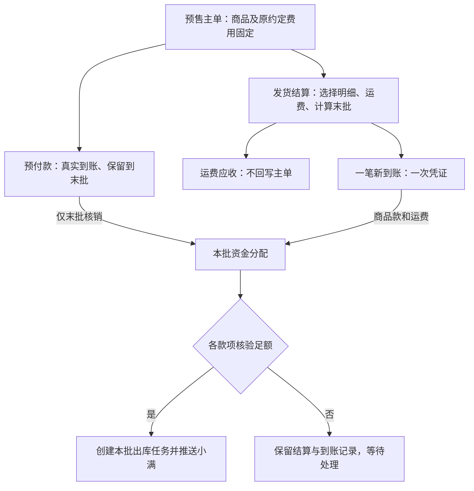

# 预售末批抵扣、发货结算与多订单回款：开发规格 V2

日期：2026-09-23。交付物类型：经对抗性审查修订的开发规格，不是实现或上线证明。

开发更新：用户已授权进入开发；当前本地实现范围、与规格差异及 P0 阻塞以 [实现报告](../reports/2026-09-23-presale-implementation.md) 为准。下文是目标规格，其中执行器与外部联调尚未完成。

本规格取代 [V1 设计](2026-09-23-presale-outbound-batch-receipt-design.md) 中的业务规则、金额模型与接口建议。审查发现及外部验证门槛见 [审查报告](../reports/2026-09-23-presale-settlement-adversarial-review.md)。规格编写阶段没有修改业务代码、执行迁移、推送或发布；后续开发状态见上方实现报告。

## 1. 已确认需求与工程决策

### 1.1 用户已确认

1. 新增预售单，产品能力与库存单相同；初始主单不含运费，不自动创建方舟出库单或推送小满出库。
2. 首次按实际预付款创建回款。预付款只抵最后一批商品款，不在前批使用，不再重复记一次收入。
3. 分批发货选择产品与数量，数量受已创建有效出库单限制；出库编号为主单号加 `-01`、`-02` 等。
4. 款到发货：非末批支付本批商品款和运费；末批支付本批商品款和运费减预付款。
5. 客户支付一笔合计款，上传一次凭证。商品/运费拆分由系统完成，不要求客户分开付款或业务员重复登记。
6. 回款页面支持同客户、同币种多订单分配；每行不得超剩余额，分配合计必须等于本次收款总额。回款金额沿用当前含支付手续费口径。
7. 运费不回写预售主单金额，不使主单 GMV 随每次发货改变。

### 1.2 本版为闭合边界采用的工程决策

- 主单首次首款提交后冻结商品、数量、成交价、折扣、包装费、支付手续费、客户、币种；修改履约地址/备注另存批次快照。不借这次功能新建合同变更和退款系统。
- 同一预售单仅允许一个尚未确认实际出库完成的活动发货结算。其余批次须等上一批出库完成或安全取消，避免“前批撤销、末批不再是末批”。不同订单可并行。
- 确认出库任务前，相关回款必须远端回读一致且 `collect_status=1`；当前回款推送本来就提交 `collect_status=1`，不新增独立人工审批。返回编号、上传凭证、同步中均不等于核验完成。
- 保留预付款只抵商品净额及其原先随款记录的支付手续费，不抵本批运费或包装费；明确把“商品预收”“手续费”“物流费”分列。无手续费时回到用户示例公式。
- 每批运费单独形成应收。首版优先验证独立小满运费订单作为承载目标，未验证前禁用带运费的自动发货链路；不依赖未经验证的“费用单 API”。
- 运费应收金额本版不自动叠加新的支付手续费。已有主单手续费继续按本节及第 3 节处理；若业务实际要求对新增运费另加手续费，需在开发前扩展冻结的运费费用口径，不能默默扣入商品款。
- 若原预付款已覆盖末批全部应付，允许零元新增到账，不创建零元回款、不强制上传新凭证；仍须验证原预付款。

上述决策是本次审查修正，不是声称现有代码已经具备。小满能力验证是集成启用门槛，不妨碍编写本地纯计算和隔离测试。

## 2. 领域对象与业务流程



### 2.1 对象职责

| 对象 | 唯一职责 | 不应承担的职责 |
| --- | --- | --- |
| Invoice | 原商品合同、归属、定价、主单 GMV 基础 | 累计追加每批运费 |
| ShipmentSettlement | 本批数量、价格/费用快照、应收、末批判定、发货资格 | 凭空生成实际到账 |
| Receivable | 主单商品侧或某批运费的收款上限与小满目标 | 代替真实到账凭证 |
| ReceiptBatch | 一次客户付款事实、日期、方式、原始金额、附件 | 额外推一笔汇总款造成双计 |
| Receipt | 此次付款分配到一个应收对象的份额及小满回款 | 用整个客户付款金额反复推给各子单 |
| SettlementApplication | 一笔已有 Receipt 用于某批结算的份额，含末批预付款核销 | 再次产生到账或增加订单回款 |
| ShipmentOutbound | 本批出库单、远端身份、任务租约和回读状态 | 重算为整张商品订单的数量 |

### 2.2 两个入口共用同一套规则

**订单列表 → 发货结算**：选择产品 → 运费 → 后端报价 → 显示预付款保留/末批抵扣 → 自动引用本结算已登记付款或登记一笔新付款 → 提交。后端保存结算和收款，自动完成同步与核验后生成出库任务，用户不需再手工创建运费单。首版不提供任意已有款选择器，不允许借此挪用其他批次资金；末批预付款由系统自动带入。

**回款列表 → 新建回款单**：选择同客户/同币种多个订单 → 填总额/日期/方式/凭证 → 给订单分配本次总金额。库存/生产单按原规则；预售订单必须选择已准备的发货结算，显示该结算剩余商品/运费应收。用户填写订单级分配合计，系统生成组件分配；不允许通过旧单订单 API 绕过预售结算。

允许一个批次分多次实际付款：结算一直等待，累计足额后再发货。首笔预付款由专门的初始意图创建，后续普通回款不能悄悄增加或提前消耗末批预付款。

若用户先在发货弹框准备结算、随后到回款页登记，不重复选择出库明细、不重复上传同一笔款。候选里商品款已收满但运费未收的预售订单仍应可见。

## 3. 金额算法：先固定应收，再登记实际资金

### 3.1 定义与单位

所有货币用 Decimal，API 传十进制字符串，数据库 `Numeric(14,2)`；单价保留当前 `Numeric(12,4)`，数量沿用当前整数件数，禁止新引入任意小数件。四舍五入用 `ROUND_HALF_UP`，禁止 float 容差。日期/时间统一北京时间。

| 符号 | 定义 |
| --- | --- |
| L_i / Q_i | 主单行折扣后的固定总价 / 固定总数量 |
| G | `sum(L_i)`，商品折后净额 |
| P | 原主单约定包装费用，不是配件产品行（配件属于 G） |
| H | 原主单支付手续费 `surcharge_amount` |
| C | 原主单含费应收 `G+P+H`，预售 `shipping_fee=0` |
| D / D_h / D_g | 初始预付款原额 / 随该款记录的手续费 / 商品可抵金额；`D_g=D-D_h` |
| g_j / p_j / h_j | 本批商品净额 / 包装费分摊 / 原主单手续费分摊 |
| F_j | 本批向客户收取的物流运费，不是物流成本，也不是支付手续费 |
| d_j | 本批原额抵扣，非末批 0，末批 D |
| N_j | 本批应新收 `g_j+p_j+h_j+F_j-d_j` |

预付款提交校验：`0<D<=C`，`0<=D_h<=D`，`0<D_g<=G`；不允许以纯手续费或包装费构成商品预付款。D_h 沿用现有首款手续费分摊规则并冻结，不通过每次发货重新计算原预付款。

页面将“客户支付金额（含手续费）”与“扣费后入账/推送金额”分开显示，避免把银行净到账误填为含费付款。此处不是新增收费政策。

### 3.2 本批商品金额与分币尾差

不能直接用 `quantity*unit_price`：当前行折扣是整行金额，必须以冻结的 L_i 分摊。对累计已完成数量 k、本次数量 q：

`line_amount = round(L_i*(k+q)/Q_i,2) - round(L_i*k/Q_i,2)`

同订单一次只有一个活动批次，k 取已实际出库且未冲销的已确认批次；当前批次取消时回到原 k。最后一段自动补齐尾差，所有批次合计恰为 L_i。Q_i=0 的非法行禁止进入结算；零价赠品仍参与数量与末批判断。

包装费 P 按累计商品净额/G 使用同样累计差额法，尾批取剩余；G 必须为正。H 按累计 `(g+p)/(G+P)` 分摊，末批取剩余。非末批 h_j 至多为“未分摊 H 减去保留 D_h”，确保预付款手续费也留至末批；分摊结果持久化，取消后按确定顺序释放，不回写原付款费用。

后端报价返回各行折后金额、p_j、h_j、F_j、d_j、N_j 和版本摘要；前端展示服务端报价，不自行重算后提交权威总额。实现新预售分摊函数，不能直接复用按整笔付款比例动态重算的 `fees.allocate` 覆盖已冻结批次。

### 3.3 末批与保留余额

- 末批由服务端判断：本次选中每行的数量等于该行全部未发数量，提交后所有行余量均为零；不能以“金额为零”代替“数量为零”。前序批次必须已确认实际出库。
- 非末批必须保证 `G-累计已完成商品额-g_j >= D_g`，同时保留 D_h。违反时返回 `DEPOSIT_TAIL_INSUFFICIENT`，展示可调整数量，不放宽、不强制设为末批。
- 末批要求 `g_j>=D_g`、`h_j>=D_h`，原预付款完整有效且未被分配。d_j=D；预付款不能用于 F_j 或 p_j。
- `N_j>=0`；N_j=0 时只绑定已有预付款，不产生新 ReceiptBatch/Receipt；F_j>0 且无已有运费款时不能零元放行。
- 商品已发完才算履约完成；主单金额收满、末批单据创建、出库任务已推送都不能替代实际出库完成。

### 3.4 收款内部拆分与上限

本批商品侧新应收 `A_j=g_j+p_j+h_j-d_j`，其随款手续费 `a_h=h_j-(末批?D_h:0)`；运费应收 F_j。

整笔一次结清时，新收 N_j 自动拆成 A_j 与 F_j，对应的商品净额推送为 `A_j-a_h`，运费净额推送为 F_j。A_j 或 F_j 为零就不生成该组件的零元子单。

部分付款时，系统按当前未收 A_j:F_j 的比例分配，按分向下取整后最大余数补分，稳定排序商品在前；限制不超过各组件余量，末次支付补足精确余额。用户可展开查看分配，但默认不手填两个金额。费用也按商品侧剩余费用额度分摊，最后一笔取剩余，保证费用不超过其付款原额。

双层余额：

1. **应收登记余额**＝目标应收－远端已登记款－尚未在远端出现的本地有效款/首款意图。用于拒绝超收；失败、未知、排队均占用，按远端 ID 去重。
2. **资金用途余额与发货资格**分开算。某 Receipt 的未分配登记余额＝未作废登记原额－全部 reserved/applied 份额，用于防重复分配；本批可用于发货的资金＝本批 reserved/applied 中所引用且已核验有效的 Receipt 份额之和，不再扣除本批自己的预留。预付款另受末批限制，pending/failed/uncertain 的资金份额不计入发货资格。

已付款额、已用于发货额、保留预付款额分别展示；“应收余额为零”不等于“所有商品已发完”。运费子单不进入主单商品余额减项，不能把全部 Receipt 按 invoice_id 简单求和。

### 3.5 无手续费基准例与含费例

| 事件 | 商品侧新款 | 运费新款 | 预付款核销 | 新到账 |
| --- | ---: | ---: | ---: | ---: |
| G=10,000，初始 D=3,000 | 3,000（保留） | 0 | 0 | 3,000 |
| 第一批商品 4,000，运费 200 | 4,000 | 200 | 0 | 4,200 |
| 末批商品 6,000，运费 150 | 3,000 | 150 | 3,000 | 3,150 |

最终回款 10,350，商品主单仍 10,000，物流运费 350，主单商品 GMV 不重复。

含费例：G=10,000、P=0、H=500、C=10,500；D=3,150、D_h=150、D_g=3,000。第一批 g=4,000、h=200、F=200，新收 4,400；末批 g=6,000、h=300、F=150，新收 3,300（商品侧 3,150，运费 150）。累计新收含首款=10,850，累计手续费=500，小满净额合计=10,350，商品主单小满金额=10,000。禁止在末批把 D_h 再扣第二次。

## 4. 数据模型及迁移契约

下列为拟新增结构，最终迁移编号必须先查所有分支；ID/FK 类型严格匹配被引用列。所有表写 commission_db，不写 lsordertest 镜像。时间列用 beijing_now，状态和数额变更带 version 及审计。

### 4.1 invoice 域

**Invoice**：扩展 `order_type=presale`；增加 `settlement_policy_version`、冻结合同摘要 `commercial_hash`、`active_settlement_id`（可空 FK）、`next_outbound_sequence`。主单 shipping_fee 强制为 0；当前 internal_received 在预售里仅表示冻结首款，不用作累计实收；新增汇总字段从账本计算，不能破坏旧“预付款+尾款=原主单总额”的契约。

**`ark_shipment_settlements`**：

- id BigInteger PK；invoice_id FK；settlement_no 唯一；sequence 与 invoice_id 联合唯一。
- currency、customer_id 快照；is_final；goods_amount、packaging_amount、handling_amount、freight_amount、deposit_applied、new_payment_due Numeric(14,2)。
- state：`awaiting_payment/awaiting_verification/ready/paused/outbound_pending/outbound_uncertain/shipped/cancelled/review_required`。
- request_key 唯一、request_hash、quote_hash、version、created_by、created_at、updated_at、cancel_reason。
- 批次收货地址/备注/计划发货日期快照；用于出库，不让后续主单编辑回写旧快照。
- 主单 active_settlement_id 在同订单锁下占位，提供“一个活动批次”的并发保护；不以先查 count 再 insert 代替锁。

**`ark_shipment_settlement_items`**：id、settlement_id FK、invoice_item_id FK(RESTRICT)、xiaoman_order_record_id、product_id/sku_id 快照、ordered_quantity、prior_shipped_quantity、quantity Integer、line_amount、unit_price/discount 分摊快照；unique(settlement_id,invoice_item_id)。

现有 `Invoice.service._replace_items` 会 clear 后重建行；对已冻结预售必须拒绝该路径的商业明细替换，非商业编辑不能调用该路径。若后续允许改合同，先另行实现稳定行更新，不能悄悄破坏关联。

### 4.2 receipt 域

**`ark_receivables`**：id、invoice_id（所有权主单）、settlement_id 可空、kind=`goods/freight`、business_key 唯一（`invoice:{id}:goods` 或 `settlement:{id}:freight`）、amount、handling_amount、currency/customer_id、status、remote_order_id 可空唯一、remote_order_no、remote_status、request_key/hash、lease/attempt_token、version。

- goods 指向原小满订单，amount=C，handling_amount=H。
- freight 指向独立运费目标，amount=F_j、handling_amount=0；F_j=0 不建远端目标。
- 不把运费虚构为商品明细，不让它进入商品库拣货。

**`ark_receipt_batches`**：id、batch_no 唯一、customer_id、currency、gross_amount、bank_charge_total、collection_date、payment_type、remark、source=`receipt_page/shipment/initial`、request_key/hash 唯一、business_status、created_by/time、version。同步聚合状态从子单派生。

**现有 `ark_receipts` 增量扩展**：batch_id 可空、receivable_id 可空（仅旧数据过渡）、purpose=`ordinary/presale_deposit/presale_goods/freight`；保留 invoice_id 作为所有权主单，现有 source 仍 auto/manual。新增唯一 `(batch_id,receivable_id)`；同一预售商品+运费将产生两个不同目标子单，所以不能再用 `(batch_id,invoice_id)` 限制一条。

- xiaoman_order_id 对新流程允许尚未绑定，增加 `waiting_target` 同步状态；旧执行器只消费 pending，新执行器先处理目标依赖，再固化身份和 payload 转 pending。
- amount/bank_charge 为分配组件原额/手续费；所有子单 amount 合计必须等于批次 gross_amount，费用合计等于 bank_charge_total。
- 旧单订单 create/edit/retry/void、自动首款、remote_change 均须感知 purpose/receivable/绑定关系，不能仅修改新入口。
- 商品/运费回款都按原 Invoice 的所有权鉴权，但外发目标从 Receivable 取，不能假设 receipt.xiaoman_order_id == invoice.xiaoman_order_id。

**`ark_settlement_applications`**：id、settlement_id、receipt_id、component=`goods/freight/deposit`、amount、bank_charge、status=`reserved/applied/released`、created_by/time、released_at/reason；unique(settlement_id,receipt_id,component)。

- 应用只转移用途，不增加收款总额；receipt 和订单锁内校验 Σreserved/applied<=该未作废 Receipt 的已登记原额，费用份额同样不得超过该款 bank_charge。预留允许引用待同步款；发货资格另外要求引用款已有效，避免提交时未生效导致预留失败。
- 预付款每个订单唯一首款业务键保留；只能绑定本订单最后一批，成功末批出库后标 applied。
- 普通当前批次付款提交时就 reserved，防止另一批抢用；远端核验通过后提供资金资格。

**`ark_receipt_batch_attachments`**：batch_id、attachment_id 联合 PK。原附件私有存储不变，新增关联不反复改写原 attachment.invoice_id/receipt_id。首款可直接通过 batch 表示；旧附件保留原归属读取。

### 4.3 shipping_inspection 域

**`ark_shipment_outbounds`**：id、settlement_id 唯一 FK、invoice_id、outbound_no 唯一、sequence、remote_outbound_invoice_id 可空唯一、remote_record_id 可空、status、payload_snapshot/hash、request_key/hash、attempt_token、lease_until、attempts、last_error、verified_at、shipped_at、version。

该行兼作持久发送任务，不新增重复任务账本；只有 settlement ready 才创建并转 pending。本地编号使用冻结主单号+序号，sequence 在结算预留时分配，允许取消造成空号但不重用。编号从 -01 到 -100，自定义发票号长度必须在创建预售时留够后缀容量；小满长度上限在 P0 验证，不静默截断。

旧 OkkiOutboundTask 保留 stock/production 现有逻辑；新预售任务单独队列，不移除旧 order_id 唯一约束。本地文件意图和执行台账必须以新 outbound_id 分区，而非 order_id，否则第二批永远被第一批挡住。

## 5. 状态、事务与防重复

### 5.1 提交事务

1. 权限检查并获取远端完整只读快照：主订单身份、回款、所有相关出库及明细。失败不提交；使用读取超时，不拿着数据库写锁跨网络等待。
2. 开始本地写事务；按 invoice_id 升序锁所有参与订单，再锁应收、结算、Receipt、Application、附件，执行器/取消/回款纠错必须采用一致顺序。
3. 再次校验幂等键归属与内容摘要、合同哈希、数量与金额版本、首款身份、活动结算、完整远端快照与主单身份是否一致。
4. 保存结算/行、运费应收、ReceiptBatch、各 Receipt、附件关联、Application 和审计；一次 commit。任一订单失败整批回滚，不在循环里调用现有会自行 commit 的 `receipt.service.create`。
5. 返回 201/幂等复用 200 与真实状态；后台按目标→子回款→核验→出库依赖推进。请求处理期间不发送远端写操作。

“先准备结算、后在回款页付款”同样在步骤 2 下预留数量，但不创建实际到账记录；prepare 本身可零付款。未付款结算只允许在无并发租约/资金绑定时取消或重新报价。

### 5.2 状态判定

| 状态 | 数量是否占用 | 款是否占收款额度 | 是否发货 |
| --- | --- | --- | --- |
| 结算 awaiting_payment | 是 | 仅已存在回款占用 | 否 |
| 收款 waiting_target/pending/syncing | 是 | 是 | 否 |
| 收款 failed/uncertain | 是 | 是 | 否，处理原单 |
| 全部资金有效，结算 ready | 是 | 是 | 允许自动创建出库任务 |
| 出库 pending/sending/waiting_stock/failed/uncertain | 是 | 是 | 未确认实际出库，不再开下一批 |
| 远端回读确认为已出库 | 转为已发数量 | 是 | 标 shipped，释放活动批次槽 |
| 无实际付款且无外部效果的安全取消 | 释放本批数量 | 无资金事实可删除 | 否 |
| 已付款批次暂停 | 保留本批数量及资金用途 | 实际到账保留 | 否，仅原批恢复 |

发货门槛：用于本批的每笔资金必须回读目标、原币、净额/费用匹配、collect_status=1、业务有效，且本批应用原额足额；末批原预付款也必须满足。当前 remote.push 直接传 collect_status=1，可自动回读成功，不另起审批。若原回款后续被远端删除/改额/失效，未出库批次冻结；已出库批次记异常并通知操作人处理，不抹去发货事实。

### 5.3 外部竞争与未知结果

本地锁不能控制小满直接新增收款或出库。发送前重核远端余量、最新订单身份与有效资金，排除本次本地占额但保留其他占额。需要 P0 明确小满服务端超收/超出约束或限制同订单外部并行写入的可执行办法；仅“再 GET 一次”不能保证原子性。

每次发送持久化 request_key、固定 payload、attempt_token、租约；不确定结果一律 uncertain，先查远端精确身份再恢复，不按同日同额自动认领。明确拒绝可重试同一对象。订单目标创建、回款创建、出库创建三种远端写入均需要此保护。

租约到期不能让旧进程恢复后继续发送；使用执行 token 的前置检查及结果 CAS。依赖对象撤销/改额须互斥；派发前再次检查 funding/quantity 版本。多订单回款远端允许部分成功，本地批次明确显示成功/失败/未知各条，成功条不重发。

### 5.4 取消与收款更正

- 已提交真实到账不得因出库取消直接删除或作废。只有确认“录入错误、资金事实不存在”才可走原受审计回款纠错；已在小满生效还需核对远端处理。
- 只有本结算未登记新增真实付款、无远端出库/运费目标效果、无发送租约/未知结果时可取消结算、释放数量及仅预留的预付款 Application；历史原始预付款及其既有远端回款不妨碍此操作，预付款本身不删除。
- 一旦登记真实付款，首版仅支持原结算暂停/恢复或原失败任务重试；保持数量、资金应用和活动槽占用，不开放取消重建。不得释放为任意新批次通用资金。已收运费的 Receivable 不删除、不减小到已收额以下；商品款、运费款和小满目标均保留原归属。
- 需要改变已收款批次的产品、数量、运费或取消交易时标 review_required，待明确的受审计退款/纠错处理完成后再评估恢复。本次不实现隐式退款、转款或贷项。该限制在按钮禁用原因中说明，而不是让业务员反复尝试失败。
- 已创建远端出库必须先确认其删除/取消成功且未实际出库；存在验货/扫码工作时同时走当前出库删除保护。已出库不允许走取消释放数量，退货/补发另走现有业务流程。
- 批量款一旦有 Application 或任一远端效果，禁止通过旧子单 PATCH/void 改金额，避免汇总等式失真。明确录入错误且整批无远端效果、无租约/未知结果、无实际出库时，允许专门的原子整批纠错：释放仅本批 reserved（不得含 applied）的应用，作废错误 Batch/Receipt，回算结算尚欠并记理由及版本；任一前提不满足不执行。该入口是纠正不存在的付款事实，真实已收但暂不发货不是作废理由。

## 6. API 契约（拟新增）

路由只做鉴权、输入验证、事务异常转换，业务写 service；统一 ok() 信封。以下路径均为设计，不应写入已实现 API 清单。

| 方法与路径 | 输入与输出 | 权限 |
| --- | --- | --- |
| POST `/api/invoices/{id}/shipment-quotes` | items[{invoice_item_id,quantity}]、freight_amount；返回行金额、费用、末批/抵扣、new_payment_due、quote_hash、blocking_reasons；不占用 | invoice:read 且主单可见 |
| POST `/api/invoices/{id}/shipment-settlements` | quote_hash、items、freight、request_key；可含一笔 payment；系统自动引用本结算已有付款和末批预付款，不接受任意 existing_receipt_ids；返回结算、收款、状态 | invoice:write + 新增 shipment:write；含新收款另需 receipt:write |
| GET `/api/shipment-settlements/{id}` | 结算、资金分配、应收余额、出库进度、可执行动作 | 主单范围 + shipment:read |
| POST `/api/shipment-settlements/{id}/cancel` | version、reason；受审计取消，收款不删除 | shipment:write |
| POST `/api/shipment-settlements/{id}/pause`、`/resume` | version、reason；无发送租约/未知结果时暂停；只恢复原内容的 paused 结算，重验全部数量/资金/末批资格；cancelled 不复活 | shipment:write |
| POST `/api/receipts/batches` | 同客户同币种总额、凭证、日期、方式、allocations[{invoice_id,settlement_id?,amount,balance_version}]、request_key | receipt:write + 每订单范围 |
| GET `/api/receipts/batches/{id}` | 一笔付款及组件、各小满结果、受限凭证 | receipt 读权限且整批订单均可见 |
| POST `/api/receipts/batches/{id}/void-entry` | version、reason；仅不存在真实付款事实的整批录入纠错，按第5.4节全部前提原子执行 | receipt:admin + 全部订单范围 |
| GET `/api/receipts/order-options` | 扩展 customer_id/currency、可收金额、预售活动结算/运费余额；分页 | 原 receipt 读权限 |
| POST `/api/shipment-outbounds/{id}/retry`、`/reconcile` | version、reason（仅写动作需要）；处理原任务，未知结果仅核对 | shipment:write；人工绑定另需 shipment:admin |

新增 shipment 权限独立于验货员的 shipping_inspection:write，避免原本只能验货的人获得新建发货/收款权。seed upsert 按 read/write/admin 规范登记，不自动授予角色。创建者、订单业务员、代创建者分开记录；receipt 数据范围保持现有语义，代创建订单不自动获得已建回款权限。

示例：无手续费末批结算提交（ID 为演示）：

```json
{
  "request_key": "shipment_01_unique_request",
  "quote_hash": "<server-returned-hash>",
  "items": [{"invoice_item_id": 123, "quantity": 6}],
  "freight_amount": "150.00",
  "payment": {
    "amount": "3150.00",
    "collection_date": "2026-09-23",
    "payment_type": "<valid-okki-type>",
    "attachment_ids": ["<uploaded-private-resource-id>"]
  }
}
```

不能提交客户端自称 is_final、deposit_applied、goods_amount 来覆盖后端计算。相同 request_key+相同内容复用结果；相同 key 内容不同返回 409。API 业务错误返回结构化 reason_code + affected_order/items + refreshed_quote/balance（仅有权限字段），并保留前端输入和附件。

关键错误：`QUOTE_STALE`、`ACTIVE_SHIPMENT_EXISTS`、`INSUFFICIENT_QUANTITY`、`DEPOSIT_TAIL_INSUFFICIENT`、`PAYMENT_NOT_VERIFIED`、`ALLOCATION_MISMATCH`、`RECEIVABLE_EXCEEDED`、`REMOTE_CAPABILITY_UNVERIFIED`、`REMOTE_OUTCOME_UNCERTAIN`、`CONTRACT_FROZEN`。负数、NaN、超过两位小数、重复行/订单、错币种和未知字段在 schema 拒绝。

## 7. 小满集成与 GMV

### 7.1 必须改造的现有假设

| 当前代码 | 已核对的假设 | 新处理 |
| --- | --- | --- |
| receipt/remote.py::order_snapshot | 总按 Invoice 小满 ID/主单金额核验 | 以 Receivable 目标身份/含费金额核验，旧 goods 行保持原逻辑 |
| receipt/balance.py / fees.py | 按 invoice_id 合并回款，假定全是商品款 | 按目标过滤，商品与运费互不占额；首款意图仅属于 goods |
| receipt/sync_service.py | 直接用 Invoice 身份发款、绑定单单附件 | 等待目标、批次附件授权、新手续费快照、目标级回读 |
| invoice/xiaoman_service.py、outbound_task_service.py、outbound_followup_service.py | 首推/补偿/缺货恢复按整单自动出库 | presale 全入口排除；只由 settlement ready 入新队列 |
| deploy/okki_outbound_creator.mjs | 全量 product_list；存在任何关联单即跳过；意图文件按 order_id | 新 createShipment 只接冻结批次；查重按 outbound_id/精确远端 ID/本批单号，旧路径不复用这些整单假设 |
| shipping_inspection/outbound_sync_plan.py | 用订单全部 product count 构造编辑 payload | 预售只能对已冻结本批行/数量核对，禁止整单覆盖 |
| shipping_inspection/outbound_queue_service.py | order_id 可用于隐藏本地重复项 | 按出库单映射逐批替换，单头先到不能吞掉后批 |
| invoice/linked_outbound_service.py / linked_sync_service.py | 部分路径要求整单数量相等 | 合法部分出库不报错；超量/错行仍冻结 |

### 7.2 运费目标与依赖顺序

预售商品款继续关联原小满订单。F_j>0 时系统自动建立一个本批运费目标，编号建议主单号+`-F01`，与出库 `-01` 命名空间分离；无物流商品库存动作、不自动出库。创建成功并精确回读后，运费子回款才转 pending。

本版以“独立运费订单”作为 P0 的首选验证方案，不能把普通商品订单伪装为已验证费用功能。若租户不能建不影响库存的运费订单、无法可靠识别分类、无法单独回款，则 P0 不通过，改用经验证的原生费用单方案并修订本节后再实施集成；不通过提高原商品订单金额绕过。

一笔客户款可拆为“商品小满回款+运费小满回款”，两者关联同一 Batch。客户仍只付一次，方舟总额只计一次。附件仅方舟留存，不能声称已传小满。

### 7.3 GMV、订单数和资金统计

- 对本次新增的预售链路，商品主单沿用当前口径（主单净额/既定统计日期）；不因分批发货/回款重复计 GMV。运费目标排除商品 GMV，并单独统计运费应收/实收。
- 运费目标必须持久记录明确角色和远端 ID，不能只按单号、备注或商品名字排除；远端映射未完成时不能让镜像先把未知运费目标当普通订单计入报表。发布门槛要求可在远端写入前建立可匹配的唯一业务标识，或将同步投影分类未完成的记录冻结出报表并提示不完整。
- 统一可复用的“订单统计角色”判定用于 GMV、订单数、客单价、新签/复购、活动战报和销售日报；运费不制造一次新的购买。库存/生产历史口径不借此全量重算。
- 当前 dingtalk/gmv_daily_service、battle_report/statistics、festival/service 存在直接累计小满 amount_usd 的路径；必须覆盖所有读取路径及相关提成消费。不得通过 status、业务员归属置空等歪曲业务数据规避统计。
- 主单汇率/核算日期按当前成交统计快照固定；运费另有发生日期和币种金额，不回写主单日期/汇率。若主单远端被手改金额，标异常而非静默刷新历史 GMV。实施时验证现有汇率转换与统计快照覆盖范围。
- 回款汇总只选 Batch 原额或其 Receipt 子额之一汇总，不叠加二者；Application（含预付款末批核销）从不进入新增回款统计。物流成本另账，不拿应收运费当实际支付成本。
- 小满自身原生报表是否能排除运费目标也属 P0 检查；仅修改方舟统计不能承诺小满报表不受影响。不能排除时需向用户说明该差异并暂停该目标方案启用。

## 8. 页面行为与权限

订单类型增加“预售单”，列表入口仍可标“生成出库单”，打开“发货结算”弹框。显示商品数量/已出/本批/剩余、折后金额、包装费/支付手续费明细、本批运费、预付款保留及可抵扣、本次应付、已登记/已核验/尚差。提交按钮“确认收款并安排出库”；响应按真实进度显示“待核验/待推送/缺货/待核对”，不提前显示已发货。

回款页用户主视图展示“一笔客户付款”，可展开商品/运费子款和各目标小满状态；历史单单回款仍可查看。选择预售结算后自动识别末批及抵扣，无需用户重复填写。列表不能仅按原主单 remaining_amount>0 筛掉运费欠款。

凭证以批次归属：整批详情和完整凭证需对整批涉及订单都有权限，否则只展示有权限的子款及脱敏状态，不提供包含其他订单/金额的原始凭证。不能因为同客户就放宽跨业务员数据权限。

界面遵循 DESIGN.md、tokens、DetailDrawer、AppUpload 和当前反馈组件；本规格不制作视觉原型、不引入新动画。库存/生产单的既有表单和自动流程保持原业务行为；新增多单能力复用公共回款入口。

## 9. 开发任务与文件责任边界

新文件名为建议，现有文件路径已经核对。实现使用 Codex 自有 worktree，保留主目录已有 UI/文档改动，不在此任务自动 commit/push。

| 阶段 | 产物与主要路径 | 完成证据/依赖 |
| --- | --- | --- |
| P0 外部契约验证 | 小满沙箱/隔离租户 fixture、运费目标分类与统计验证报告；deploy/okki_outbound_creator.mjs 只读契约梳理 | 第 10 节全部门槛；不对生产做试建款 |
| P1 纯计算与模型 | invoice/settlement_pricing.py、settlement_models.py；receipt/receivable_models.py、batch_models.py；shipping_inspection/shipment_models.py；Alembic | 金额/数量属性测试、隔离 MySQL 迁移/唯一约束；无发送 |
| P2 首款与冻结 | invoice/schemas.py、service.py、xiaoman_service.py、lifecycle guards；receipt/invoice_link.py、sync_service.py | presale 首款只一次、所有自动出库入口排除、合同不可绕过冻结 |
| P3 结算与收款事务 | invoice/settlement_service.py、settlement_router.py；receipt/batch_service.py、application_service.py、balance.py、fees.py、access.py、attachments.py | 两入口同一规则、多订单事务、费用及附件权限、旧单兼容回归 |
| P4 目标和出库执行 | receipt/receivable_sync_service.py；shipping_inspection/shipment_service.py；deploy 新分批执行入口/poller；队列/同步/取消/验货服务 | P0 通过；断点恢复、远端部分成功、不重复、不整单覆盖 |
| P5 UI 与统计 | InvoiceManage、useInvoiceEditor、InvoiceReceiptFields、ReceiptManage/useReceipts、新 ShipmentSettlementDialog；api/clients.js 与已有 API 模块；GMV/战报/活动统计 | 同客户多单、末批/费用/错误恢复可用；运费从所有相关统计剔除 |
| P6 验收交付 | backend/tests、frontend/tests、deploy/tests；api-reference/database/module-notes/handoff 更新 | 完整测试矩阵、隔离联调、授权后统一部署并在线验证 |

不提前写实施完成记录。模型建好后再将具体端点/字段加入 API 和数据库现状文档，避免把规划混入线上事实。

## 10. 外部能力门槛及发布顺序

P0 需取得可复现证据，不能只凭文档或接口返回 200：

1. 同一小满订单可创建多张出库，能指定订单明细唯一 ID、整数部分数量、自定义编号；编号长度/字符/唯一性已知。
2. 运费目标能合法建单/关联客户/币种/回款，且不触发库存、产品出库；其业务角色能被方舟和所需小满统计可靠识别。
3. 创建未知结果可凭持久业务标识精确查回；若自定义编号不保留，提供可靠人工绑定证据流程，不能同额自动认领。
4. 远端回款金额/手续费/财务生效、出库 ID 与镜像 record ID 的映射已用读回样例确认。不能混淆 outbound_invoice_id 与镜像 id。
5. 外部并行超收/超出保护有实证，或具备可执行的写入范围约束；普通本地锁不算证据。
6. GMV 所有相关入口排除运费；小满原生报表差异已消除或明确取得对应业务选择。

发布使用 Settings 中默认关闭的 `PRESALE_SETTLEMENT_ENABLED`，并设置带版本的能力证据/启用配置；不是隐藏数据库问题的开关。先发布兼容 schema 和读路径，再升级目标/回款/出库执行器与统计过滤，最后启用新建预售。新统计过滤必须先于第一张运费目标产生。

生产迁移仅 deploy/deploy.bat 执行一次，开发机只用已确认隔离库。迁移前 `git log --all --oneline -- backend/alembic/versions/` 查编号，revision<=32 字符，检查单 head、FK unsigned 和约束索引。保留历史数据，不回填出库/回款事实；旧行可空字段走明确 legacy 路径，新建 presale 强制完整字段，不能长期依赖模糊 fallback。

回滚优先关闭新建/新发送入口，保留查询、核对与已发任务恢复；不得删除已收款/运费目标或 downgrade 丢列。持久任务 payload 带 schema_version，旧 poller 不消费新类型。发现 unknown outcome 先核对，不能用回滚触发整批重发。

## 11. 验收矩阵

| 编号 | 场景 | 必须观察到的结果 |
| --- | --- | --- |
| T01 | 初始 G=10000、D=3000、F=0 | 首款仅 3000；不建出库；重复同步仍一笔 |
| T02 | 第一批 4000+200、末批 6000+150 | 新款 4200/3150，首款只末批应用；全程实收 10350 |
| T03 | 非末批拟发 8000，预付款 3000 | 余货 2000<3000，拒绝并保留输入 |
| T04 | 满额预付款，一次全部发货、运费0 | 零新增回款，无新凭证要求，原资金有效才发货 |
| T05 | 上例运费150 | 仅新增运费150子款，不建0元商品款 |
| T06 | 10元/3件分三批，及折扣/4位单价 | 行累计10元，无多收/少收一分；最后赠品也须计数量 |
| T07 | G10000 H500 D3150(D_h150) | 第一批4400、末批3300；费用合计500，未重复扣首款费用 |
| T08 | 两次部分付款、末次补分 | 子组件合计等于实收，款不足不发货，尾差精确归零 |
| T09 | 两用户同时建同订单批次 | 一张活动结算，另一方409，不超量、不提前抵首款 |
| T10 | 多订单其中一个余额过期/无权限 | 本地整批不建款；附件不丢，指出有权查看的变化行 |
| T11 | 商品额度满但运费欠款 | 仍可选择该订单的运费目标，不突破商品主单余额 |
| T12 | 预售通过旧单款API/批量API绕过 | 必须绑定结算；不允许把运费写入商品回款 |
| T13 | 远端有单号但回读失败/collect_status=0 | 仍等待核验，不产生出库发送 |
| T14 | 已同步部分子款，其余失败或超时 | 成功款不重发，未知不重试，出库未放行 |
| T15 | 请求重复、同key不同内容、任务崩溃 | 原结果复用/409；所有远端写入均无盲重试 |
| T16 | 第一批镜像先到头后到明细；第二批后生成 | 不重复展示/计数，不隐藏第二批 |
| T17 | 对预售点现有“同步出库单” | 保留本批数量，不扩成整张订单 |
| T18 | 同SKU两行不同折扣；远端改行 | 按稳定行ID映射，歧义冻结，不按SKU猜分 |
| T19 | 已收款未出库请求取消；暂停再恢复 | 拒绝取消重建；收款/数量/应用保留，原批恢复无新增到账 |
| T20 | 已收运费想换批/减费 | 不删运费款；保持目标，需核对处理，不能静默冲销 |
| T21 | 前批尚未实际出库就创建末批 | 拒绝；只有前批出库完成才允许下一批 |
| T22 | 小满直接新增/改/删款或出库 | 再核验冻结受影响批次；没有自动放宽额度 |
| T23 | 同客户不同业务员凭证访问 | 无整批权限看不到完整凭证/总额；有权子款可看 |
| T24 | 费用单镜像先到映射后到 | 不污染GMV；分类不完整时显式提示，不当普通订单 |
| T25 | 商品/运费拆单与预付款核销 | GMV/订单数只计商品；实收不叠加Batch、Receipt、Application |
| T26 | 北京时间零点、非东八区服务器/浏览器 | 日期一致，编号与审计时间正确 |
| T27 | 历史库存/生产回款、旧附件、旧出库任务 | 原行为不回归，镜像始终只读 |
| T28 | 编号-99/-100、最大长度、取消空号 | 唯一且不截断、不回收，远端保持可核对 |
| T29 | 新款pending时建立reserved；同步后核验本批资金 | 可以预留，不提前发货；核验不再扣本批自身预留，足额后自动推进 |
| T30 | 整批录入错误但已有reserved应用 | 无远端效果/租约/已出库时原子释放本批reserved并纠错；真实付款不允许该动作 |

### 测试命令与证据要求

开发阶段新增有区分力的纯函数、隔离 MySQL 事务并发、API 鉴权、远端 fixture/故障注入测试；现有 tests 命名按实现实际落点选择，不能现在伪造通过记录。前端交互用现有 Node 测试与浏览器验证；deploy 测试只用模拟网络/临时目录。

至少运行受影响 pytest、前端对应测试及 `npm run build`、`python scripts/check_conventions.py`、`python scripts/git_sweep.py --no-fetch`。后两者基线问题单独报告。本轮是纯文档，只执行文档结构/链接/公式示例检查和仓库约定/巡检，不声称已跑业务测试或小满联调。
