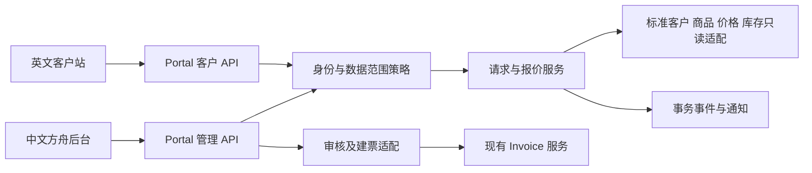

# 门户架构与访问控制

## v1.72 当前只读成员的历史请求范围

fresh591/session69862 实际terminal exit0：2 passed、22 warnings、31.89s。两种只读价格能力各6组有限浏览器场景，商业API拦截0；这两项规格不能相加称12项测试或64T全部通过。

实际方舟API配置只读权限后，使用实际main/OTP/独占MySQL和已构建客户站，验证当前目录/价格、正常下单入口隐藏、三宽浏览提示及手工quote POST403。新增模拟key-only恢复参考：实际GET404响应结束、恢复按钮返回及两帧观察后，原参考仍保存、没有恢复POST或重试按钮；这不是已提交请求丢ACK实验。同公司历史请求通过真实domain服务在取证基线之前创建，来自另一有效采购成员；当前只读成员实际打开列表和详情，价格API/DOM按当前权限遮罩，动作为空。十个财务/订单模型全列取证不变。

本轮扩展七个测试/夹具/取证辅助文件；产品Vue、API、模型、角色、CSS/动效和已有构建不变，没有重复构建或将历史Node130结果冒称本轮执行。589实际2failed/22warnings/32.85s，原因是新driver的Request details标题匹配重复；明确level2后590实际2passed/22warnings/31.83s，但590在终态门槛补强前。591才是补强后的两项终态证据。独立定向源码复核不代跑认证日志。

广覆盖592/session8572实际terminal exit1：收集2503项，完成316项，293 passed, 12 failed, 0 errors, 11 skipped, 0 xfailed, 0 xpassed，946 warnings、534.95s，尚余2187项。采用有限maxfail12；原规格保留，因停止门槛本次未执行旧自动回款生成规格，不用历史失败冒充本轮结果。原始stdout/stderr只在父进程内存计bytes后丢弃，保留退出码、白名单结构摘要和失败sourceframe。启动器前两次exit4尚未收集/建DB，安全只读诊断确认缺少backend模块路径，修订后才开始上述实际运行，不能计为业务规格。广覆盖失败明细见安全JSON D:/commission-system/tmp/portal-v172-wide-result.json；没有启用full-chain专用历史回放或缺失Node mysql2的mode runtime，不等同完整迁移或2503项全绿。

上述12项为三类验收代码问题：9项在跨案例共享固定密钥的IP发码桶发生429；1项联系人选择器遇同名员工歧义；2项锁序观测器误把MySQL超时设置读取当作业务SQL。联系人593隔离单跑实际1pass/9warnings/31.21s；594同名员工反例实际1fail/3warnings/29.11s，安全driverframe29:76。同名修订按真实settings GET中员工id求候选顺序，仍通过真实UI选项点击并核对保存的精确actorID。595额度对照初稿IP撞夹具初始login导致2fail/1pass/23.63s，纠正测试IP后596实际2pass/1fail/23.63s：只有第二独立案例首次发码429形成干净RED，不能把595初稿错误称产品缺陷。

每trade只生成一次随机OTP密钥，不删除限流桶，不在登录或second_company再次换密钥，保留同案例共享IP额度、邮箱间隔和验证码绑定。锁序观测仅有限放行精确两条超时SQL，并要求顺序/SET参数；任意其他首SQL即中断，仍要求唯一首业务SQL是AuthorityBarrier FOR UPDATE。597/session75512修订后实际terminal exit0：22 passed、29 warnings、45.98s；包含2只读应用浏览器、1联系人router-only浏览器、6锁序参数、1身份重绑、8两成员拒绝事务、1邮箱HTTP及3真实额度/冷却规格。两个独立案例各30挑战/第31次429、桶count30/无邮件事件；同账户即时重发仍429。22项不是广覆盖2503全部重跑；未执行的2187项及广覆盖中未选入这22项的通过项未在夹具修订后重跑，不累计22+293。独立风险差异源码复核无新增具体P1/P2，不认证运行或整体完成。

完整历史迁移126、全部writer/旧自动ReceiptIntent执行身份与接入、真实库存/价格/供应商/SMTP/存储、完整双端64T、生产发布与恢复门禁仍OPEN。执行身份政策尚未得到人类答复，不默认created_by或接旧worker。P0仅本地PI与ReceiptIntent草稿，无供应商推送、预占或出库。以下章节按各历史时点阅读，不累计历次测试数量。

## v1.71 服务端能力与前台操作一致

fresh587/session83971实际terminal exit0：11 passed、133 warnings、141.93s；4项实际应用浏览器、2项实际main API回归、2项仅挂载router的能力HTTP回归及3项诊断。两个新增只读参数各4组、开通8组、原交易18组有限浏览器场景，不能相加称34项测试或64T全部通过。

真实方舟API把客户设置为enabled/can_order=false，并分别保留或移除can_view_price。真实OTP登录会话有效place_order=false；目录/商品详情在隐价模式没有unit_price字段，前台价格DOM不存在。手工构造有效Origin/CSRF的quote POST仍403 ACTION_FORBIDDEN，不能把隐藏按钮当服务端权限。

方舟身份/负责人/商品和上游为隔离前提，真实main/JWT/OTP/独占MySQL及已构建Vue受测；只读配置通过实际方舟API，非新增配置UI验收。新只读浏览器未植入恢复marker或打开历史Requests，这两项保护仅定向源码核对，不能冒称已以只读身份做浏览器复验。完整历史迁移126、全部writer/旧自动ReceiptIntent执行主体与接入、真实库存/价格/供应商/SMTP/存储、全部双端64T及生产门禁仍OPEN。自动回款主体政策已集中async提问，尚未答复，不默认created_by或接旧worker。P0仍仅本地PI与ReceiptIntent草稿，无推送、预占或出库。 以下章节按历史时点阅读。

最终页首微调后的有限复验：主线程查看587实际320图后，将仅浏览状态标题/说明改为Your collection及浏览说明；browsingOnly明确排除pending和receipt，不覆盖旧回执或未知提交页首。最终build34模块/561ms实际exit0，fresh588/session88178实际terminal exit0：2 passed、22 warnings、31.86s，两个只读价格参数各三宽新增h1阳性及原API/DOM/财务断言通过。587的11项是页首微调前联合回归；其余9项未在标题微调后重跑，不能合计13项或称最终全11重跑。独立只读复核确认新computed与该证据拆分，不代跑认证日志。

## v1.70 新旧会话与当前权限隔离

fresh585/session54143已实际terminal exit0：7 passed、131 warnings、135.91s；2项浏览器、2项实际API回归与3项诊断。新开通浏览器8组、原交易18组有限场景，业务API拦截均0；不相加称26项测试或全部64T通过。

商品授权恢复后，英文320px页面实际普通login OTP登录并读取当前唯一SKU，再获取新有效报价。保留原cookie的独立上下文仍对session/catalog返回401；原报价继续expired，新会话/报价保存恢复后的权限版本，没有复活旧会话或旧报价。自然等待实际验证码发送后的61秒，不改时钟、限流、历史挑战或数据库来绕过60秒间隔。 新挑战purpose=login、invitation_id为空且消费一次；两个会话为同一账号/成员，原session版本为邀请时值且已撤销，新session版本为当前授权值且有效。

本轮仅扩展四份测试/取证辅助，产品API、模型、角色及双端构建不变，原交易浏览器字节不变。方舟身份/归属/标准SKU为隔离前置数据；实际门户授权与采购账号来自服务。报价通过实际HTTP，非新增报价UI验收。上游及邮箱取证受控，非SMTP送达或生产认证。完整历史迁移126、全部writer/旧自动ReceiptIntent主体与接入、真实库存/价格/供应商/邮件/存储、完整双端64T与生产门禁仍OPEN。P0仅本地PI和ReceiptIntent草稿，不推送、预占或出库。 以下章节按历史时点阅读。

## v1.69 当前负责人绑定与商品授权隔离

独立规格仅为自身案例给另一业务员角色增加portal_access:admin，用其本人客户列表阳性对照验证：仍不能列出目标客户，目标商品授权GET与PATCH均404 RESOURCE_NOT_FOUND；操作权限不等于其他业务员的数据权限。原交易规格的默认角色与隔离断言不变。

实际新建授权保留当前canonical_customer_id、有效主负责人assignment_id、强验证external_identity_id和okki命名空间；创建回执必须核对绑定对象，状态先draft后明确启用。缺失身份候选行明确阻断。商品移除/恢复每次推进目录、行及授权版本；移除撤销目标会话、使其已有报价失效，恢复不复活会话，也不改变can_order/can_view_price。

本轮目标客户的方舟身份、有效负责人和标准商品仍为隔离前置数据；门户授权、商品授权、邀请及采购账号由实际服务创建。邮件通过实际加密outbox的严格只读取证代理，不证明SMTP发送/送达。报价创建通过真实HTTP，未新增报价UI验收；恢复商品授权不复活已撤销会话，未证明新OTP登录后的恢复目录。完整历史迁移126、全部writer、旧自动ReceiptIntent执行主体与接入、真实库存/价格/供应商/SMTP/存储、完整双端64T与生产发布仍OPEN。P0只生成本地PI与ReceiptIntent草稿；不推送、预占或出库。

## v1.68 实际邀请激活与单账号撤权

真实员工JWT管理员在中文客户管理页邀请新采购邮箱；实际服务建立Account/Membership/Invitation和加密outbox、幂等回执，不返回原令牌。只读测试邮箱broker严格限本次access/管理员签发/目标邮箱/关联、授权版本、到期、信封AAD及token摘要；非产品入口，无外部邮件。

hash/query邀请打开后清除地址秘密，无自动API/会话或激活；同邮箱OTP激活一次。有效外公司邮箱持转发链接只得通用202，实际挑战为activate但无账号/邀请关联、无发码事件/会话，外国Account/Membership所有列不变。同公司已授权新成员可读原历史；中文账号停用后仅其旧会话401，原buyer仍200。fresh581/session70058实际terminalexit0，3passed/3deselected、101既有warnings/62.98s；选中原浏览器交易内核及两项实际应用API回归，浏览器18组有限场景、商业API拦截0。本轮以隔离的已有客户绑定及目录授权为前提，不称新客户绑定/商品授权页面已完成实际服务验收。邮件仅实际进入加密outbox队列，测试只读取证，不证明SMTP发送或送达。完整历史迁移126、全部writer及旧自动ReceiptIntent主体/接入、真实库存/价格/供应商/SMTP/存储、完整64T与生产门禁继续OPEN；P0仅本地PI和ReceiptIntent草稿，无推送、预占或出库。

## v1.59 显式主体内核与尚未确定的后台主体

只改新内核及_make_row纯本地构造；旧new_row保留原费用计算，旧generate_ready与scheduler没有接入新内核。执行主体政策（原创建人/最近同步员工/服务账号）已向用户询问，答案尚未收到；不能为跑绿默认取created_by。I81自动Intent/全writer门禁继续OPEN，旧worker反例仍未关闭。P0仍仅本地PI+ReceiptIntent草稿，不自动转换/外发/预占/出库；无新API/表/权限/前端/生产操作。

内核只接受调用方明确给出的员工ID，每次从当前DB重建receipt:write及原Invoice财务范围；原创建人字段不自行授权。两端登录/既有权限契约不变，后台主体选择仍待回复，不以审计字段代替该政策。

## v1.58 自动回款后台执行身份尚待固化

generate_ready当前未完成当前员工/动作/原Invoice财务范围接入，属于I81现有静态P1 OPEN子路径。created_by只记审计值，不能自动授予后台业务权；原创建人、后续同步人、服务账号以及委托失效/接管政策必须明确，不能临时换当前负责人。完整边界以[04 自动回款生成门禁](04-transactions-and-state.md#自动回款生成明确的未接入路径)为准。本轮没有实现或运行复现，门户本地建PI仅留ReceiptIntent草稿，不能立即转换或外发。

## 当前契约：原确认恢复的身份与范围（v1.56）

员工JWT仅身份；显式确认与核对保持当前shipment:write、原实际Invoice财务范围（receipt:read_all、当前super_admin或实际业务员），手工绑定另需shipment:admin。invoice:read_all不是财务全量，门户负责人不替代原Invoice归属；不新增ready/invoice或receipt写权限。锁外GET前后当前授权、金融绑定、原journal/proof重验。

浏览器按actor和当前tab保存原确认记录，不保存凭证；存储不赋予权限。重开/刷新/props切换仍请求原Invoice及结算，校验回执完整目标；401/403/404隐藏私密内容并保留原记录。换账号/组件卸载代次隔离迟到响应。普通GET按首业务读取时点授权，不能召回已在途数据，也不能解除本地未知命令。可靠保存允许退出对话框；当前tab记录不等于关闭tab耐久。

关键核对最终授权先于应用结果；下载/邮件按各自发送前时点。全writer/真实服务/生产权限仍未由合成浏览器验证，以下旧增量按各自时点阅读。

## 实施增量：显式确认实际出库的当前授权（v1.54）

POST /api/shipments/{identity}/confirm-outbound 的路由依赖只读取员工身份，service 在每个阶段查询当前数据库主体与 shipment:write。安装后的永久授权屏障在 PORTAL_ENABLED ON/OFF 都参与。对象必须属于原实际 Invoice 财务范围：super_admin、receipt:read_all 或实际 sales_user_id；invoice:read_all 不授予该财务范围。不另要求 invoice:write/receipt:write 或主单 ready。

固定顺序为新事务→永久授权→原订单谱系/Invoice→当前资金图与结算/出库目标。取证和 token/POST 均在业务锁外。取证后、每一轮发送前、发送回读前后重新核当前权限、范围、完整冻结关联、版本和 lease；正常关联变化返回冲突，停用/撤权拒绝，转交后的旧业务员不能收尾。

外部已发送效果与员工当前操作权分离。只有内部冻结的原 Attempt、原 START 身份、原 Invoice 保护可保存安全 FACT；不要求原员工仍有权，不借此更新订单、金额或当前执行权。正常诊断异常不能阻断事实保存的有限重试。原 FACT 的持久锁保护并不证明全部原谱系变化、Core/raw SQL/all writer 已完整治理。

## 实施增量：出库原单当前授权（v1.53）

POST reconcile-outbound 从 fresh boundary 开始；永久 authority 在 ON/OFF 均参与。JWT 仅身份，当前 shipment:write、实际 Invoice 的 receipt:read_all/super_admin 或所属业务员范围；输入手工 remote_id 另须当前 shipment:admin。不要求额外 invoice:write/receipt:write，也不能以 invoice:read_all 代替财务范围。原 presale 与主运费为零条件保留，不增加 ready 限制。

捕获原完整资金图与不可变目标后提交释放业务锁；锁外仅查询出库/回款/订单及有效列表。结束 token/cache 事务后，再按相同锁序核当前主体、权限、归属、完整原关联。授权优先于远端业务不匹配；期间停用、撤权、转交或资金变化时，不保存原单或接受回款。实际出库确认/发送 worker 需各自接入，不能从本入口推断已覆盖。

## 实施增量：运费核对当前权限（v1.52）

员工原运费核对 JWT 仅身份；永久 authority ON/OFF→当前 shipment:write（body含remote_id另当前 shipment:admin）→原谱系/实际 Invoice→原 receipt 财务范围。当前 receipt:read_all/super_admin 或实际业务员可见，invoice:read_all 不能替代；不新增 invoice:write/receipt:write。锁外 GET 后再次当前授权、范围和原完整资金关联一致，再依据匹配证据绑定/隔离；期间停用、撤动作/管理权或转交先拒绝。

保持原 presale/主运费为零约束，不追加主单 ready、同步完成或库存分配清空条件阻断原单恢复。覆盖当前员工 reconcile-freight，其他执行/worker/raw SQL 与现场门禁保持各自 OPEN。

## 实施增量：发货重试当前授权（v1.51）

POST /api/shipments/{id}/retry-freight 与 retry-outbound 的 JWT 仅确认身份；新事务永久 authority ON/OFF 屏障、当前 shipment:write、原实际 Invoice 财务范围（当前 receipt:read_all/super_admin 或实际业务员）都必须通过。invoice:read_all 不替代财务范围，不凭旧 JWT permissions/roles 作决策；无需新增 invoice:write/receipt:write。当前谱系、Invoice 和参与资金关联锁读后才查重，锁外取证后重新执行全部当前授权与关联比较，优先于查到原单的商业冲突。

协议覆盖这两个员工重试入口；不改变客户会话设计，也不证明其他确认/核对、worker/raw SQL 入口均已参与。成功、依赖、校验和异常响应 private, no-store/Pragma；授权只承诺当前事务边界。

## 实施增量：原发货核对授权边界（v1.50）

原核对不是匿名恢复入口。身份JWT仅线索，当前invoice:write、shipment:write及有payment才receipt:write；当前receipt全量或原实际Invoice业务员scope，invoice:read_all不可替代。按原key定位实际Invoice再验请求URL、原actor/完整内容和历史关联；无权不返回原商业字段。永久authority ON/OFF同协议，业务读锁finally rollback，无商业commit或外部IO；脏caller在finally外拒绝，不回滚调用者修改。只承诺核对事务内的当前授权，不承诺响应显示期间持续授权或全writer覆盖。

## 架构决定

P0 在方舟模块化单体新增 `backend/app/portal/`，中文管理页进入现有 `frontend/`，英文站使用独立构建入口 `frontend-portal/`（新目录）。客户域名只暴露门户页面、静态资源及 `/api/portal/v1/`；内部管理仍由现有方舟域名访问 `/api/portal/admin/v1/`。反向代理不得把客户域名的通配 `/api/` 转发到所有内部模块。

前后端同源是首期部署约束：客户站和它的 API 共用确切 origin，避免为登录额外开放跨站 Cookie。客户访问不携带员工 JWT、不携带 Integration App token。平台公网已有接口的权限不因这项路由约束而放松。

建议文件职责：`router.py`（客户端）、`admin_router.py`、`auth.py`、`access_policy.py`、`models.py`、`schemas.py`、`service.py`（请求编排）、`catalog_service.py`、`mapping_service.py`、`quote_service.py`、`invoice_adapter.py`、`notification_service.py`。只有独立职责形成后才拆文件；路由不承载业务计算。注册到 `app/routers.py`；配置进入 Settings。

## 四种身份不可混用

| 身份 | 可信来源 | 禁止的推断 |
| --- | --- | --- |
| portal_account_id | 邮箱持有验证后建立的服务端会话 | 客户请求体中的邮箱就是本人 |
| canonical_customer_id | 已批准、仍有效的站点成员绑定 | 公司名称相同就属于同公司 |
| sales_user_id | 方舟门户客户授权记录中的有效负责人 | 前端提交哪个业务员就归谁 |
| employee_actor_id | 当前数据库仍有效的方舟员工主体 | 服务 token owner 代表任意客户或员工 |

`canonical_customer_id` 指 `ark_customer_accounts.id`，不是发票的 `customer_id`。后者当前存 OKKI company_id 字符串。通过审核过的外部身份映射明确转换，并保存 `okki_company_id` 与来源命名空间；没有唯一映射不允许进入可下单状态。客户合并、拆分、外部身份重绑必须使该门户授权进入复核，不能自动把 A 的账号扩大到 B。

`portal_customer_access.sales_user_id` 是门户负责人的显式授权记录，不能由联系人邮箱、最近访问者或无约束的客户关系行猜出。维护该记录需 `portal_access:admin` 或管理员；业务员不能把别人客户改给自己。其值要与人工确认的当前客户归属一致，客户域发生变化时门户权限进入待复核状态。

## 账号邀请与验证

1. 管理员或获准人员选择已存在客户、唯一 OKKI 绑定、负责人和目录；创建账号成员关系草稿，再发送邀请。邀请目标不能使用自由文本公司自动建档。
2. 邀请令牌使用至少 32 字节加密安全随机数，invitations 表只保存摘要；有效期默认 72 小时，单次兑换。异步发信所需原令牌只以短期加密信封进入专用 outbox 列，规则见数据模型，不写通用 payload 或日志。打开邀请链接仅显示确认页面，不能因邮件安全扫描 GET 就消费邀请。
3. POST 接受邀请前对同邮箱发送一次性验证码。验证码建议 6 位、有效 10 分钟；仅持有转发链接不足以建立其他邮箱的账号。OTP 保存 `HMAC(secret, challenge_id + code + email_key + purpose + account/member/access IDs + auth versions)`，避免低熵验证码仅裸 SHA 后可离线枚举。
4. 单个 challenge 最多 5 次失败；同邮箱 60 秒发送间隔、每小时 5 次；来源 IP 每小时 30 次为初始可配置值。多实例必须共享计数与原子扣减。成功验证及消费同事务；并发验证只能成功一次。
5. 新 challenge 使同 purpose 的旧 challenge 失效；已封锁的邮箱/账号不能靠重发清空失败窗口。不可用账号使用相同外部响应结构，错误不泄露账号是否存在。实际邮件只发给有效邀请/有效账号。
6. 登录只允许已激活的有效账号。邮箱规范化策略为 trim、域名小写，并在开通时约定整个地址大小写不区分；不移除 `+tag` 或点号，不猜测邮箱服务商别名。地址上限 254 字符；IDN 域名先规范化。登录、邀请、限频用同一个规范化函数。

上述次数和时长是本项目工程默认，不声称是业务方已确认值；配置可收紧，不能关掉服务端校验。恢复邮箱、重绑公司、停用再激活需管理权限与审计，不提供客户自助改公司接口。

## 会话与浏览器边界

- 会话使用 32 字节随机 opaque token，数据库仅保存 SHA-256；生产 Cookie `__Host-portal_session`，`Secure; HttpOnly; SameSite=Lax; Path=/`，不设 Domain。员工域名不共享此 Cookie。
- 默认闲置 30 分钟、绝对有效期 12 小时；过期后重新验证邮箱。成功登录、成员变更和账号恢复不复用旧 token；登出撤销服务端会话并清 Cookie。
- 每个请求回查账号启用、会话撤销/到期、账号 auth_version、成员版本、站点访问状态。数据库不可用则失败关闭；不得以缓存旧权限继续写或下载。
- 所有客户写接口校验精确 Origin 和绑定该会话的 `X-Portal-CSRF`；禁止把 SameSite 当完整 CSRF 防护。登录验证码与邀请 POST 尚无正式会话时使用预登录同源 CSRF challenge；只接受 JSON，拒绝外源、`null` Origin 和不可信 forwarded host。
- `/session` 通过已认证请求取得 CSRF token 和精简账号信息，令牌不进 localStorage；会话 Cookie 不返回 JS。退出、切换账号清除内存查询缓存、购物车、轮询与下载状态。
- 私密响应 `Cache-Control: private, no-store`，共享 CDN 不缓存；日志不记录 Cookie、验证码、完整邀请 URL、收货详细地址或整份请求体。客户站 CSP 禁止任意脚本与 iframe 嵌入；跳转只允许明确的站内路径。
- CSRF 拒绝、登录限频、权限拒绝保留安全审计 ID，但客户文案使用英文稳定消息，不回显内部堆栈或权限清单。

## 功能权限与范围

拟新增权限使用已允许动作词汇，seed upsert，明确 kind。`read_all` 是数据范围，不用于菜单显隐。

| code | kind | 作用 |
| --- | --- | --- |
| portal_order:read | action | 门户请求列表、详情、统计 |
| portal_order:write | action | 审核提案、驳回、确认建票；建票另需 invoice:write |
| portal_order:read_all | data | 门户请求全量读取；不自动授予审核或发票操作 |
| portal_access:read | action | 本人客户的账号和授权情况 |
| portal_access:admin | action | 邀请/启停、归属、公司与目录授权调整 |
| portal_mapping:read | action | 本人客户映射读取 |
| portal_mapping:write | action | 本人客户映射发布 |
| portal_site:admin | action | 全局站点和经营策略；不自动读取所有订单 |

客户能力以成员/客户授权中的 `can_view_price`、`can_order` 表示，不进入员工 RBAC。`can_order=true` 要求 `can_view_price=true`。未授权价格的账号不能通过详情、报价、历史订单金额或 PI 绕过：可看不含金额的订单状态，PI 和金额字段被拒绝/省略；恢复查价后重新请求，不能复用旧缓存。

P0 两项能力存于 customer_access，公司成员共享，不额外引入成员级覆盖。每个动作都要求当前有效账号、成员、access 和对象范围，另加下列能力；所有新写动作均在事务内复查。

| 客户动作 | 额外能力 |
| --- | --- |
| 目录与不含金额的订单状态 | 无；目录仍按授权裁剪 |
| 商品价格、报价详情、历史金额、正式 PI | can_view_price |
| 新报价、提交、复购报价、接受提案、拒绝提案、取消未建票请求 | can_order AND can_view_price |
| 登出 | 允许撤销自身会话，不要求下单能力 |

只读成员不能接受或拒绝新交易条件，也不能取消请求；撤销下单能力后由有权业务员处理。成功写操作的结果回查可以按当前读取能力裁剪返回，但重放不恢复已经撤销的写能力。

读取订单：客户须 `order.access_id == active_membership.access_id` 且站点、公司、成员全部有效。P0 不自动跨公司展开；同公司已获准成员共享该 access 下的订单。无权对象和不存在对象统一 404。

员工读订单：当前有效员工且有 `portal_order:read`，再满足：该订单当前服务授权范围属于本人，或有该订单/该客户的显式交接读取授权，或有 `portal_order:read_all`。全量读取不改变 `sales_user_id` 财务归属。审批写入额外要求本人/有效代办权限，调用发票服务时复核既有 delegation 规则；管理员全量读取不是 `invoice:write` 的替代。

P0 不新增“团队”自动范围。代办授权只沿用现有有效授权，不从主管职称推断。权限查询调用现有 `auth.service.get_live_user_authorization(db, user_id)` 并重建员工主体，丢弃旧 JWT roles/permissions，包括旧 super_admin 标志。当前 DB 中的 `super_admin` 依项目规则绕过功能权限，但仍记录真实操作人与目标归属，不能改变客户端主体规则。客户域 `apply_customer_scope` 默认包含公海，不得直接用作门户订单 scope。

## 撤销与竞态的边界

定义授权变更提交为撤销线性化点。已在此前授权读取的数据无法召回；此后开始的读、下载和写必须被拒绝。P0 使用一行全局 `ark_order_portal_auth_barriers(code='authority')` 作为数据库授权屏障，参与事务先 `SELECT ... FOR UPDATE`，再作当前读鉴权，持有到 commit/rollback。它有意串行化短时关键写，规模扩大前以压测决定是否分片；不得持锁调用邮件、外部库存服务或生成文件；当前事务内读取本地库存镜像不属于外部 I/O，仍须核对可靠观测时间并保持短事务。

必须参与同一屏障的入口：客户 verify/下单/提案接受与拒绝/取消、员工审核/发布、门户账号/目录/能力/归属变更，以及现有 ArkUser 启停删除、角色/权限分配、InvoiceDelegateGrant 变更、CustomerAssignment 变更、客户合并拆分/归档、外部身份重绑。上游变更必须在**同一个数据库事务**先取得屏障、更新自身记录并提升 barrier.version；客户归属/身份变化还同步暂停受影响 access、提升 auth_version 并撤会话，不允许等异步消息补做。批量任务和脚本写入口也须登记并调用同一服务；未接入的写入口是 W02/W05 上线阻断项。

固定锁顺序：authority barrier → 上游员工/授权/客户身份行（按表固定序、ID 升序）→ site → customer_access → account/membership/session → order_request → quote/revision → conversion → invoice → publication/outbox。按需跳过不存在的层，但禁止反向获取；新 request 尚不存在时直接锁 quote。鉴权使用锁后当前读，不能复用屏障获取前的 REPEATABLE READ 快照或 ORM 缓存。事务内权限再次失效即回滚。撤销先取得屏障并提交，后续写看到新授权并失败；写先取得屏障，则撤销等待其结束，该次写保留完整审计。

普通只读使用每次请求新建的 DB Session 和同一有效范围，不能跨请求复用快照。文件在事务外渲染，开始发送前重新取得短时屏障及对应 invoice 锁，复查授权和发布版本，完成后释放再发送；这次检查定义下载授权时点。检查后的在途响应与已下载文件无法召回，不承诺撤权中止全部在途网络字节。

客户转交分三层：新单归属更新；未建票请求经管理员明确重新指派 servicing_user_id，并与当前 customer_access.sales_user_id 一致；原 sales_user_id_snapshot 保留审计，旧提案失效、清当前接受指针，必须生成包含新 sales_user_id 的新提案并由客户重新确认；已生成 PI 的 `sales_user_id` 不变。旧业务员取消门户访问后，若其仍有原发票的内部读取权，应在交接工单中单列处理，不能宣称只改门户就撤销所有方舟历史数据权限。

客户合并/拆分或外部公司 ID 变化：立即暂停 access、提升版本、撤销会话、阻断未发出建票任务，进入管理员复核。已生成 PI 保留原快照，不自动搬迁或将两公司订单合并可见。

## 代码证据与外部依据

相对仓库根目录，均在基线提交只读核对：

| 代码 | 事实与接入限制 |
| --- | --- |
| `backend/app/customer/models.py` 的 CustomerAccount | id 是内部稳定客户 ID，支持 merged/archived，不能与 OKKI ID 混用 |
| `backend/app/integration/auth.py` 的 resolve_submission_principal | actor 与 sales 都绑定 IntegrationApp owner |
| `backend/app/integration/validation_service.py` 的 resolve_customer | 组织级匹配，私海不是其授权边界 |
| `backend/app/invoice/delegation_service.py` | 本人及有效代办的订单操作约束 |
| `backend/app/auth/dependencies.py` | 普通依赖从 JWT 读权限；门户关键操作需增补当前 DB 回查 |
| `backend/app/stock/public_service.py` | 公开库存只有规格与有货标识 |
| `backend/app/core/response.py` | 使用 code/message/data 信封，成功 code 默认 200 |

浏览器安全原则参考 OWASP 的 [Session Management](https://cheatsheetseries.owasp.org/cheatsheets/Session_Management_Cheat_Sheet.html)、[CSRF Prevention](https://cheatsheetseries.owasp.org/cheatsheets/Cross-Site_Request_Forgery_Prevention_Cheat_Sheet.html)；一次性令牌、统一恢复响应和限频参考 [Forgot Password](https://cheatsheetseries.owasp.org/cheatsheets/Forgot_Password_Cheat_Sheet.html)。这里将其用于邀请/验证设计，具体 OTP 数字、时限和架构取舍是本项目设计，并非上述资料给出的固定要求。

## 上游写入口覆盖核查（2026-10-03）

以下是当前任务分支的源码调用链核查，不是生产端到端或MySQL并发证明。查询顺序、撤权和回滚由隔离SQLite测试佐证；最新实施进度仍以交接为准。

| 权威对象与入口 | 事务协调位置 | 核查与测试 |
| --- | --- | --- |
| 员工角色/权限/启停、管理员重置密码 | auth/admin_router各相关写端点首读前begin_employee_authority_write；角色关联批量删除在同事务内 | test_upstream_authority、test_employee_authorization，旧JWT撤权不得恢复 |
| 权限种子 | auth/service.seed_role_permissions首读前lock_authority | 保留启动upsert语义，种子变更与锁同事务 |
| 客户合并/拆分、主负责人分配/转交 | customer/proposal_router.execute首读前屏障、实时员工权限；proposal_service→ownership_execution_service/workflow_service同事务暂停门户绑定 | test_customer_authority、test_identity_authority；检查实际ORM/批量SQL调用方 |
| 外部身份与来源投影 | identity_service公开写入口先锁；_bump_accounts复核绑定；OKKI/Alibaba/sync batch外层也先锁 | test_identity_authority、test_external_binding_authority、test_upstream_authority |
| 员工外部账号绑定与PI代办 | insight/external_binding_service写服务authority_changed，管理员路由首读前实时鉴权；invoice/delegation_service协调屏障 | test_external_binding_authority、test_upstream_authority |
| 可写客户身份的Agent token | sales_automation.require_sales_agent_for_identity_write先锁，再resolve_token(commit_usage=False)；ingest_candidates不释放屏障 | test_agent_token_transaction |
| MCP凭据发放/轮换/撤销 | mcp/token_admin.issue_token/rotate_token/revoke_token首读前begin_employee_authority_write(mcp:admin) | test_token_authority：旧JWT首读前拒绝、真实当前授权成功、轮换失败回滚、撤销后Agent身份写拒绝 |

本次发现并修复的缺口是MCP凭据管理：身份写Agent已经持有屏障，token管理却未参与，撤销可能与旧请求写入交错；三个管理写入口现与关键身份写串行，实时mcp:admin检查先于目标凭据查询。轮换的新token、旧token失效及屏障版本同事务，不在服务内部新增提交点。

启用协议要求同库所有相关在线writer实例采用覆盖上述入口的代码和一致的PORTAL_ENABLED配置。不能让部分实例跳过屏障而将另一实例的测试视为全系统保证；维护脚本/破坏性cutover须走既有维护冻结，不属于允许并行的在线入口。

边界：个人profile/password/avatar是既有员工自服务路径，未修改本次审计的RBAC或客户归属；当前仅依赖JWT、未逐项检查active/deleted的事实已识别。本轮不将其宣称为全平台凭据撤销已收口，不将门户权限测试推广为全平台认证安全结论。客户门户自身账号与会话撤销仍按本组专用协议执行。

## 员工 PI 编辑与本地恢复的当前授权契约

门户开启时，普通 PI PUT、关联编辑 linked-save，以及本地 linked-close/linked-resolve 必须在首个业务数据库读取之前取得 authority，再读取当前有效员工、角色、功能权限及对象范围。旧 JWT 只证明请求身份，不能延续已经撤销的权限。普通编辑需要 invoice:write；关联编辑同时需要 invoice:write 和 invoice:sync；关闭失败任务需要 invoice:sync；人工核对需要 invoice:admin。当前 super_admin 按现有管理员规则判断；invoice:read_all 只扩大读取范围，不能代替动作权限。范围判定复用受控发票与代办服务，不自动赋予业务员其他人的订单写权。

涉及远端回款取证的编辑使用[交易文档](04-transactions-and-state.md#员工-pi-编辑的远端证据与最终写入)的分阶段协议，等待外部接口时不持 authority 或 invoice 行锁。最终写入事务再次检查当前权限与范围，不能复用预读时的角色、数据库快照或 ORM 缓存。本地恢复只改变本地任务与同步指针，同样受到当前授权保护；不得以任务恢复为理由绕过客户已接受版本或永久建票关联。实际远端 linked-run 按既有执行令牌和结果 fencing 协议处理，不机械套用整个请求持屏障的方式。

以上是开发目标契约。门户关闭时原内部发票协议保持既有边界，不据此宣称修复全方舟 JWT 撤权问题；全写入口清单、脚本和直接 SQL 的覆盖仍须 T62 提供证据。

### 本地生命周期、校验与删除的授权边界

本地 lifecycle.begin/retain/abort 均需当前 invoice:admin；validate 保留当前 invoice:write **或** invoice:sync 的任一权限语义，不能误改成同时具备两项；DELETE 需当前独立 invoice:delete；lifecycle.remove 在 invoice:admin 之外另需 invoice:delete。所有动作先检查当前有效员工和范围，再查状态及执行领域操作；read_all 不能代替动作权限。首个数据库读取、当前读与锁序遵循上述协议，不复用已开启事务、旧 ORM 对象或 JWT 中的管理员标志。

GET lifecycle 也必须遵守每请求当前主体及对象范围，不能因仅查询而信任旧管理员标志；不因本节要求把只读请求机械改为全局长锁事务。refresh/remove/outbound_retry/ack_outbound、sync、linked-run 和不确定结果核对中涉及外部 I/O 的部分，需采用各自短事务、执行令牌和结果 fencing 协议。此分类只明确开发目标，当前实现与逐入口证据须另行核验。

### 已提交会话缓存与取消核对的接入

启用协议的两个PI准备入口在拒绝已有事务和待写对象后，对合法无事务Session执行expire_all；先前提交后仍在identity map中的Invoice/明细不能当作当前读。该操作不先查询数据库，仍由authority取得锁后开始当前主体读取。实际GET lifecycle使用同一当前员工与范围检查；所有敏感读范围仍以当前授权为准。

refresh采用两个短授权事务，中间只读外部证据；捕获完整PI绑定和取消JSON，释放事务，用独立快照取证，最终再次鉴权及锁定当前PI/取消绑定。本地Receipt、ReceiptIntent、InvoiceAllocation以锁定当前读重新检查，非零pending_delta也阻止结束取消。remove及outbound_retry/ack_outbound已分别接入其独立阶段协议，不能从refresh证明推断其他同步入口或worker已覆盖；当前结果见交接。

## 1.8 同步不确定核对的授权边界

既有 `sync-uncertain/resolve` 要求当前 `invoice:admin` 与当前发票对象范围，不把旧 JWT 管理员身份当作持续授权。`confirm_existing` 分为当前授权捕获、锁外原订单只读取证、最终当前授权与完整绑定比较、业务提交、另一次当前授权响应；`bind_order` 与 `confirm_not_created` 属于同一当前授权短事务内的本地证明，不因此取得外部发送权。

两次授权事务都强制 authority → 当前员工/身份 → 永久 request/conversion → invoice → 关联执行及分摊依赖的锁序；入口已开启事务或含待写对象必须拒绝。入口启用后即使取证期间关闭门户，也不得退回旧身份鉴权或跳过永久谱系。成功提交后响应权限被撤销时，403/404不得撤销已提交业务事实，也不得返回旧私密序列化结果。初始关闭开关的旧路径、正常同步及实际 worker 仍需独立核验。

## 1.18 自动出库执行身份与单活边界

内部 scheduler 固定读取 Settings 的 PORTAL_OUTBOUND_WORKER_ACTOR_ID，使用方舟当前员工 principal、invoice:sync 与当前 PI 数据范围；不是客户 token 或匿名机器超管。后台账号停用、撤动作或撤范围立即阻止新发送/业务收尾；原请求已经发生的安全 FACT 仍可按可信 START 保存。另一位当前有权执行员工只能核对原结果，不能用改配置重发旧 SEND。

PORTAL_ENABLED、PORTAL_OUTBOUND_WORKER_ENABLED、OKKI_OUTBOUND_AUTO_ENABLED 三者均为真才执行。PORTAL_OUTBOUND_WORKER_ENABLED 默认 false，执行员工默认0不产生授权。mode=outbound-worker-v1 持久在已有 authority barrier，不随重启或独立 Node .env 改变。新 worker、更新后的 poller/直接 creator 共用数据库 advisory lock ark-okki-outbound-poller；该锁仅是执行器单活，不替代逐阶段的当前权限/PI/任务短事务。供应商 I/O 期间不持这些行锁。

生产切换必须先排空旧执行器并建立模式，再启用新路径，不能让首个30秒tick承担原子切换。现有发布入口尚未取得该切换的完整证据；该门禁仍阻断正式启用。未更新的旧二进制、删除对账、linked-run、其他 receipt/intent/allocation writer 不能由新模式自动覆盖。

## 1.34 已安装授权协议的永久参与

PORTAL_ENABLED只控制客户入口可用性，不能解除已安装屏障。默认与force调用均使用实际AuthorityBarrier mapper Connection，对该连接设置有限MySQL锁等待，再执行authority FOR UPDATE；当前根/nested已持屏障才复用缓存。调用方事务不会被helper提交、回滚或autoflush。已安装表缺authority行也拒绝，不按空出库mode回到legacy。

唯一旧业务例外为OFF/nonforce，且屏障SELECT自身实际1146；在同物理连接FOR UPDATE查询alembic_version，唯一精确171_customer_tag_display_value才返回None。连接取得、@@/SET、父版本查询失败及权限不可见不满足缺表资格；ON/force、未知/176/177/多head、缺版本表均拒绝。该分支不写head、不stamp或补表，仍须生产迁移冻结所有writer，不能把它当在线迁移协议。

legacy能力绑定验证它的根事务，根结束、新验证或失败force后不可借用；suspend/review只有此能力可跳过无表路径，已安装协议仍要求调用方先拿屏障，否则拒绝，不能在客户行锁后补拿。OFF下归属/身份变化同步暂停access、递增版本、撤session/邀请和有效quote，重新ON不得复活。原已接入employee/role/seed/delegation/ownership使用共同helper，不代表raw SQL、未登记脚本或全部旧writer已参与。

## 1.45 批次创建的当前权限边界

JWT只识别员工身份。create在捕获与最终事务均force永久authority，当前receipt:write及每个真实Invoice原财务scope；全量范围不授动作，invoice全量不替代receipt范围。锁序为authority→门户谱系→排序Invoice→实际Batch/member，再current资金关联；全部相关Application/Receipt/Receivable/Settlement/log与文件绑定均冻结。需要外部取证先commit释放业务锁，结束独立token/cache事务后重新授权并按当前绑定校验。

原键回放先核当前动作和实际原批次完整范围，核actor/hash及真实子单目标/Settlement关系；不调用provider/storage、不新建目标。不存在原键才适用新单商业和凭证守卫。当前登录能力新增可对旧token生效，撤动作403、范围404、绑定变化409；实际ON/OFF业务先提交/回滚与管理员竞争规格只在隔离运行，结果见handoff。

## 1.46 原批次核对的当前授权与客户端范围

原键核对继续使用当前receipt:write与实际全部Invoice原财务范围；同键成功记录先核原created_by、规范化body hash及实际成员/目标/结算关联，再投影当前批次。未知键仅返回已授权Invoice的id/号/客户名/客户ID/币种，不返回回传body、凭证内容或外部事实。当前新增范围对旧JWT生效；scope不够404、有scope却不是原actor409，不把全量读取自动当写动作。

客户端sessionStorage按actor ID分槽，只保留精确恢复所需操作字段，不含token/Cookie、地址或额外显示资料。原金额、备注及附件ID是必要原body组成，记录未加密，不能称其为安全授权来源。组件销毁/账号切换清DOM与内存回调，原槽仅在原actor重新获得服务端当前授权后显示；另一账号不得恢复它。真实服务端权限与浏览器合成身份分开验证。

核对从干净Session边界开始，永久authority→谱系→排序Invoice→实际Batch/member→历史关系当前锁读；只构造白名单DTO并rollback释放读锁，不跨外部IO，也不flush或commit调用方脏数据。status专用路由包装覆盖正常、JWT依赖及请求校验错误的private,no-store/Pragma；校验错误不回显私密提交。

## 发货结算创建的当前授权边界（v1.47）

POST /api/invoices/{invoice_id}/shipment-settlements 的 JWT 只提供身份。初始与最终事务均查当前员工、invoice:write、shipment:write；仅含嵌入payment时额外要求receipt:write。沿用原receipt财务范围：当前receipt:read_all或实际业务员归属，invoice:read_all不能替代。永久授权屏障不依赖PORTAL_ENABLED开关；范围外隐藏实际对象。

原request_key若已存在，先按其实际Invoice授权，再比较URL订单、原actor、完整body摘要和实际历史关联。当前新授权对旧token生效；已停用或撤权的旧token不能继续创建或回放。业务提交与管理员撤权按共同屏障顺序串行，锁外取证期间管理员可先提交，最终事务必须拒绝旧权限。

此增量只覆盖发货结算create及其嵌入本地回款，不据此宣称quote/read/state/reconcile/retry/confirm、自动Intent绑定、投递绑定、worker/sender、raw SQL及未登记入口均已迁移。

## 发货报价与读取的当前权限（v1.48）

员工JWT只提供身份。shipment-quotes保留原invoice:read OR invoice:write，capabilities保留invoice:read/invoice:write/receipt:write/shipment:read四动作OR，order/detail保留shipment:read OR shipment:write；动作与原receipt财务范围分别检查，invoice:read_all不替代实际范围。当前新增grant可用于旧token；停用/撤角色/撤动作不能沿用旧claims。

报价初始和最终均查当前永久授权及实际Invoice/谱系；普通capabilities/order/detail在第一次业务读取前查当前DB授权，不承诺整个响应期间持续授权。历史order/detail不新增ready要求，仍执行原预售单与主单运费规则。只读三路无供应商IO或商业commit。四路窄路由统一private,no-store/Pragma，包括依赖401/403与清理后的422。

## 发货暂停/恢复/取消的当前权限（v1.49）

POST /api/shipments/{id}/pause、resume、cancel 的 JWT 仅确认员工身份；每次从新事务取得永久 authority 屏障（PORTAL_ENABLED ON/OFF 都参与），重新查询方舟当前 shipment:write。无需另外新增 invoice:write 或 receipt:write。实际结算定位 Invoice，先锁永久门户谱系与当前 Invoice，再检查原 receipt 财务范围：本人实际业务员或当前 receipt:read_all/super_admin；invoice:read_all 不替代财务范围。

保留原预售、完整同步 ready、库存同步无 pending 与主单运费零规则。当前锁读结算、产品关联、Application、Receipt、应收目标、相关批次及日志，实际 Invoice/客户/币种/组件/目标须一致，全部验证后才本地变更。服务不提交、不做外部 I/O，路由唯一 commit 同时保存状态、原应用与审计。未参与协议的 worker、sender、直接 SQL 和其他动作仍是开放边界。
