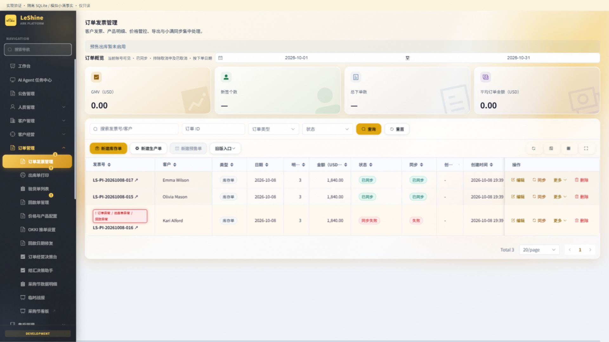
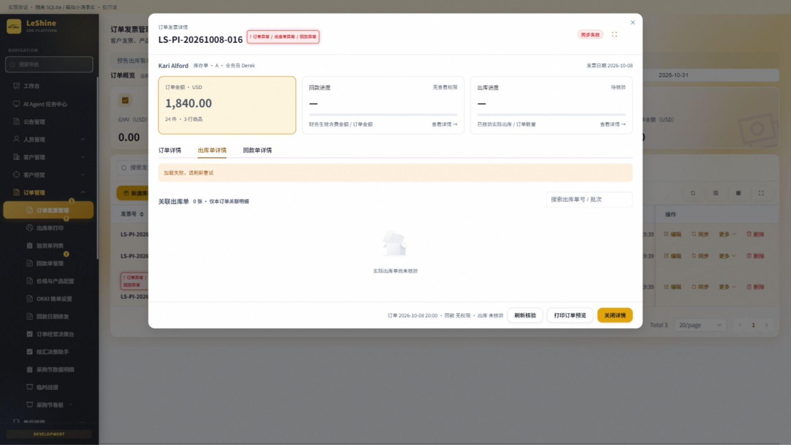
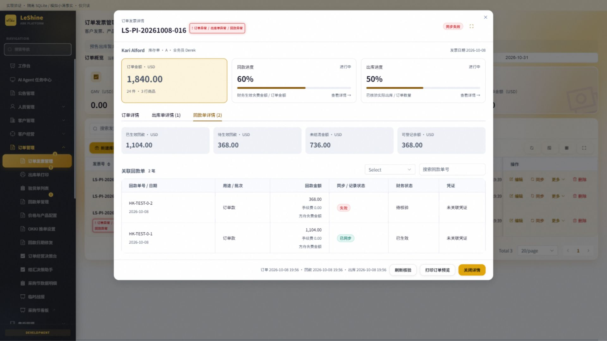
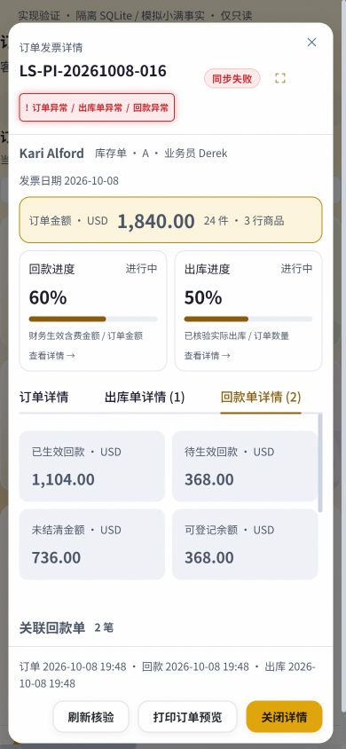
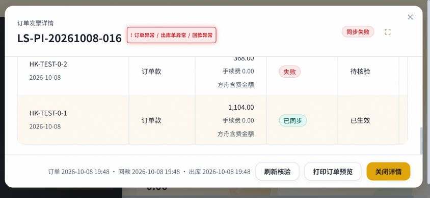

# 订单发票关联详情：实现及验收

2026-10-08，分支 `codex/invoice-detail-prototype`，基于 main `fbb63182`。按[功能设计](2026-10-08-invoice-detail-design.md)实现本地代码，未提交、合并、推送或部署，无 schema 变更。

## 用户可见行为

- 订单发票号成为只读弹框入口；三页签展示订单信息/保存金额与商品行、关联出库单与生成任务/预售批次、回款记录/财务状态/只读凭证。
- 顶部独立展示回款与实际出库进度。点击进度或红色异常标签直接定位相关页签；各数据源独立加载、刷新核验，权限不足和核验失败不伪造汇总或单据数量。
- 发票号右上角红色静态荧光标识按实际异常显示“订单异常 / 出库单异常 / 回款异常”；左侧对应导航黄色 `!` 按完整可见范围聚合。普通等待、财务未生效、生成成功及已证实安全的自动重试不误报异常。
- 支持关联单据搜索、出库明细展开、只读回款凭证和已有订单打印预览。弹框保留原列表位置；Escape/关闭取消请求并返回原入口焦点。账号/权限变化清除旧详情和导航状态。
- 制单人来自精确关联镜像；检验状态独立校验检验可见范围。预售批次展示冻结商品名、数量及原始成交金额，独立运费与抵扣单列；金额需回款权限与私有批次范围。

## 数据与权限

后端 `detail_router/detail_access/detail_receipts/detail_outbounds/document_anomalies` 复用现有领域服务。四个 GET 端点见 [API 参考](../api-reference.md)。前端真实 `InvoiceManage` 和 `SidebarNavigation` 接入，静态原型保留为设计参考。

资金沿用原币领域汇总，唯一远端 ID 去重、手续费仅恢复一次。未同步/失败记录占登记余额，财务状态 1 才进入生效金额；未知财务状态、删除/转移/金额不一致直接待核验。历史记录保留但不重复匹配远端 ID。独立运费不叠加到主单；预付款抵扣不新增回款。

实际出库实时读取完整关联事实，通过订单 ID、远端订单行 ID、产品 ID、SKU 精确关联。仅远端出库状态 2 计量，状态 1 只显示待出库；混合订单只展示本订单行，同 SKU 多行保持独立。重复、映射缺失、数量超出及未知状态不发布百分比。预售本地出库和冻结数量必须一致。

发票本人/代创建/全量范围与回款本人/全量范围、小满出库绑定/归属、检验归属分别校验。混合业务员回款批次按现有私有凭证范围整体阻断，不能通过此入口旁路取证。无关联域权限不显示计数；金额和检验状态另裁剪。导航只读概要不调用真实远端业务写接口。

GET 核验允许既有 OAuth 刷新和回款索引缓存维护提交，不创建回款、出库单、结算或改变账本。远端事实读取可能耗时；前端提供独立加载和手动刷新，核验失败不回退旧金额，也不改变原单状态。

## 验证证据

测试全部使用临时 SQLite、模拟小满响应，不读写共享业务库，也没有真实小满写入。浏览器挂载真实页面、组件和详情后端，通过隔离只读服务验证。

- 后端相关回归 182 项通过（52.87 秒，14 条既有 JWT UTC 弃用警告）：`test_invoice_related_detail.py`、`test_receipt_management.py`、`test_invoice_scope.py`、`test_presale_settlement.py`、`test_shipping_outbound_queue.py`；覆盖权限独立、混合归属批次、资金去重/历史冲突/未知财务状态、预售运费/预付款、实际出库映射、生成与实际出库区分、安全自动重试等。新增详情专属 26 项。
- 前端 `node --test tests/invoiceRelatedDetail.test.mjs` 三项通过：异常读取失败保留与权限清空、零基数/精确完成边界、请求过期与取消。
- 浏览器验证三页签、异常跳转、出库搜索空结果/清空恢复、回款展开、正常单无红框、Escape 焦点返回、390×844 手机与 844×390 横屏短窗口。页面不产生横向溢出，短屏详情区可滚动、关闭操作始终可达；截图见下方。
- `npm run build` 最终版本通过（3409 模块，24.98 秒；保留项目已有大包和 auth 动静态导入警告）；`python scripts/check_conventions.py` 增量无违规，`git diff --check` 通过，`python scripts/git_sweep.py --no-fetch` 已执行。巡检是本地快照，不代表已拉取远端最新状态。
- 独立 agent 完成资金、权限、状态及前后端契约审查，发现问题已修复并回归。最后新增的检验范围和冻结金额另有隔离回归。

## 实际界面

以下为真实组件与服务的隔离数据界面，非生产数据。

## 交付边界

功能代码与接口文档已落地。没有生产发布授权，本次不合并推送或部署；真实租户全量关联扫描耗时与线上权限配置未核验。发布使用项目既有统一部署入口，前后端需同时更新。
