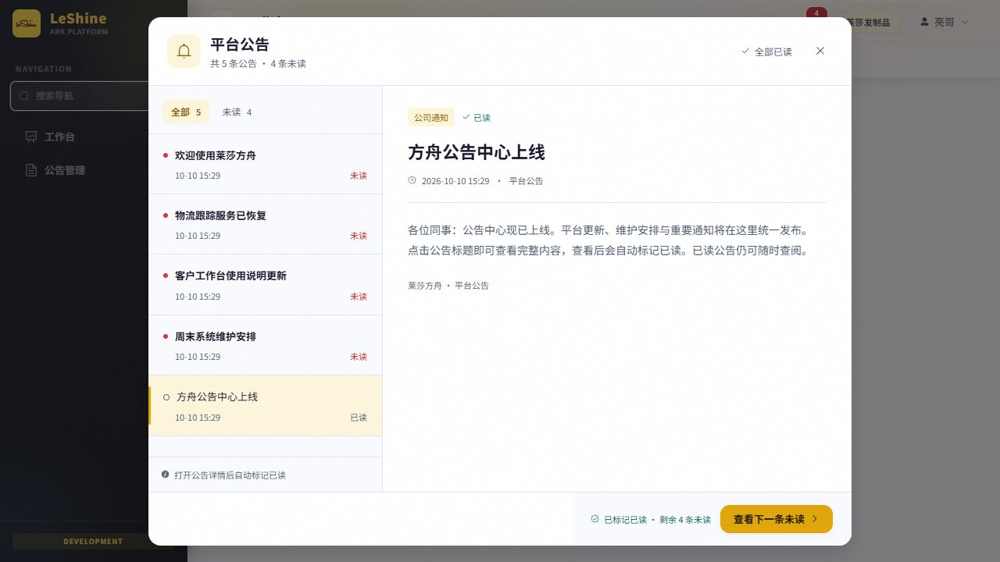
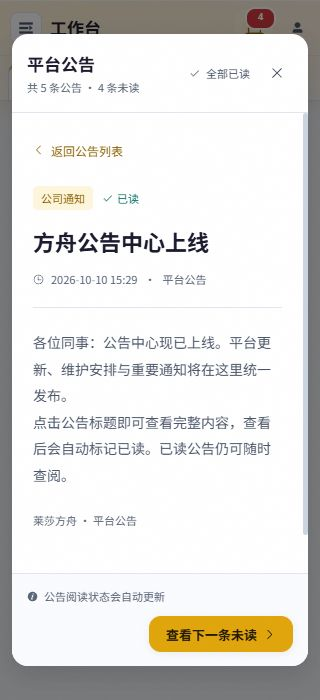

# 平台公告提醒实现与验收

按已确认原型实现方舟右上角公告入口、未读数量、缓慢光点提示、公告列表与正文、自动已读以及空状态。复用现有公告管理发布内容、知识库 ACL 和正文预览；不创建演示公告，不改变公告发布或钉钉投递流程。

## 阅读与提醒规则

- 公告数量以当前用户有权限的、已发布且未撤回/删除、处于生效期内的当前修订为准。未初始化公告库时返回空列表。
- 打开弹框只获取列表；用户选择公告且正文组件成功渲染后提交 revision_id。写入成功才移除条目未读标识并更新数量；失败保留未读，提供重试。
- 首次阅读按用户、文档、修订唯一持久化。重复查看保留首次 read_at，其他用户不受影响；新版本发布重新成为未读，旧版本确认不能消费新版本。
- 全部已读确认当前可见版本，随后刷新列表；并发新发布的公告仍可保持未读。后台每 60 秒以及窗口重新可见/聚焦时更新摘要，仅在用户有公告权限时请求。
- 旧列表/摘要响应不覆盖写入后的计数；快速选条、关闭、账号切换会失效旧请求。写入串行处理，账号切换后旧响应不更新新账号界面。

## 界面

入口红色角标显示未读数（99+ 上限），金色光点 3.2 秒呼吸；零未读时角标和光点消失，入口保留。减少动态偏好关闭呼吸。

桌面左右列表/正文，移动端单栏及返回列表；支持全部/未读筛选、每页 20 条、上一页/下一页、下一条未读、全部已读。加载失败与详情失败使用局部反馈。弹框关闭与 Escape 均返回入口焦点。

## 数据与集成

新增迁移 `182_announcement_reads`，当前父节点为 `180_settlement_funding_amendment`；单 head 已核对。所有分支已有另一个 181，集成前必须按最新分支状态核对迁移链。用户 FK 使用 MySQL INT UNSIGNED，文档/修订为 BIGINT。升级保留已有记录，降级拒绝删阅读历史。

新增 `/api/announcements/inbox` 列表、summary、detail、read、read-all 共五个接口，统一 ok 信封与公告权限/知识库 ACL 双重校验。GET 无写副作用，时间统一北京时间。详见 [API](../api-reference.md#公告管理2026-09-17)、[数据库](../database.md#公告管理迁移-155_announcements) 和根目录 DESIGN.md。

## 验证证据

- 隔离 SQLite：公告服务、提醒服务、旧公告迁移共 **40 passed**。覆盖真实 ASGI 路由/权限、未初始化、独立用户、重复确认、重新发布、草稿隔离、撤回/删除/生效期、分页与全部已读、北京时间零点边界、182 升级重复执行保留事实、模型及迁移 MySQL unsigned 类型编译。
- Node：提醒状态控制器及导航回归共 **16 passed**。覆盖正文渲染确认、失败重试、错序响应、关闭、账号切换、写进行中的列表/摘要竞态、未读筛选成员更新/空尾页回退及空态。
- 实际 MainLayout + 公告组件 + 真实提醒 HTTP 服务，在隔离 SQLite/测试身份中验收：打开不消费、3→2 自动已读、全部已读后隐藏提醒、重复查看/重新打开保留状态、空列表无报错、Escape 与关闭恢复焦点。320×700 窄屏列表/详情与 1024×420 短屏页脚可达；浏览器未捕获 error 日志。演示公告仅存在于隔离库。
- 独立审查发现并修复 MySQL FK signed/unsigned 不匹配、写进行中旧响应恢复未读两个问题；均添加回归。
- 前端生产构建与增量约定检查通过；保留既有 auth 混合导入、vendor 体积和测试 metadata 循环 FK 警告。
- `git_sweep.py --no-fetch` exit 0，仅本地快照；未处理其他工作树和分支。隔离预览进程和临时验收入口已清理，保留截图证据。

未运行真实 MySQL 升级/并发演练，未连接或修改共享/生产数据库。用户已授权本任务合并推送，尚未部署。发布前按项目入口做迁移演练并应用 182。

