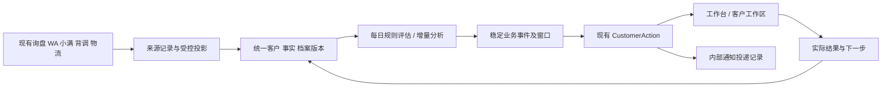

# 私海客户工作台开发方案

2026-09-24 · 评审版 v1.0 · CWC task `c2c_pcw24`

**交付边界：完整功能设计、开发契约、迁移蓝图和交互原型。没有实现生产 API、运行数据库迁移或部署。** 当前事实以 `401a2a42` 和本轮定向代码核查为基线；线上数据质量尚未验收。CWC 原始规划见 `review/cwc-plan.txt`，最终复核见 `acceptance.md`。

## 1. 目标与产品组织

业务员每天用同一入口完成：查看重要客户 → 理解为什么要联系 → 查看上下文 → 实际联系 → 登记结果与下一步。以重要事件不漏跟、样品进展和客户复购机会为结果，不以生成文本数量为成果。

入口升级现有“今日工作台”。正式实现保留“我的客户”和“跟进日历”，客户列表支持主负责/协作、阶段、价值、最近互动及数据异常筛选。客户完整工作区承载档案、沟通、订单、渠道动态、维护计划；轻量 `CustomerDetailDrawer.vue` 继续作为其他模块快捷入口，复杂编辑进入完整页。原型将六种能力直接列为导航方便评审，每个客户页面都有统一客户选择器；任务点击进入对应客户，返回首页保留筛选。

第一屏只展示四项可解释指标：范围内客户数、待办任务数/涉及客户数、原期限已逾期任务、复购窗口客户。指标可点击。规则扫描覆盖率与 AI 成功率分开；不把查询时刻当作来源同步时间。现有 `scope=mine` 是行动执行人，`visible` 是全部可见任务；正式新增 `customer_scope=primary|collaborator|authorized`，不改旧参数含义。

## 2. 当前复用与缺口

| 已核实代码 | 本次设计增量 | 不应重建的能力 |
|---|---|---|
| `customer/workbench_service.py`、`workflow_service.py`、`followup_service.py` | 稳定事件、期限分离、客户维度聚合、扫描状态 | CustomerAction 与结果登记闭环 |
| `customer/models.py`、`fact_service.py`、`profile_service.py` | 普通修订白名单、建议审核与冲突界面 | 客户主档、不可变事实/档案版本 |
| `whatsapp/models.py`、`customer/projection_service.py` | 绑定与源权限、WhatsApp 投影、摘要服务 | 原消息同步与 CustomerConversationAnalysis 表 |
| `projection_okki_order.py`、`CustomerOrderItem` | 可靠采购批次、结构统计和窗口服务 | 订单投影，已有 sample/bulk/unknown 分类 |
| `sales_automation/private_research_service.py` | 渠道订阅、基线、变化事件、频率预算 | 私海背调执行链 |
| `tracking/models.py`、既有调度/邮件服务 | 物流显式关联、维护日历与通知投递 | 邮件发送审批、现有调度注册 |

额外依赖：`agent_runtime/orchestration.py` 的现有复购 Agent 只消费当天待办；事件跨日去重上线时，改为消费有效未解决窗口及未处理输入版本，取消单纯 `action_date=today` 门槛，避免漏分析或并行重复分析。

## 3. 六类需求与完整工作流

### PCW-01 每日客户概览与行动

输入为冻结的客户范围、当前归属、已授权消息水位、有效订单、计划实例和已确认监控事件。建议北京时间 07:00 扫描，硬规则覆盖全部私海；AI 只处理变化的数据与需解释的事件，频率与预算可配置。规则任务先落地，AI 超时不阻挡紧急询盘和承诺到期提醒。

P0/urgent：已逾期的明确客户承诺、重要未回复问题；P1/high：今日到期样品/报价、有效复购窗口与重大经营变化；P2/normal：日常维护；P3/low：低置信度内部核验。最终阈值由业务确认。排序先硬期限，再业务影响、证据可信度、客户价值与最近有效互动；显示命中规则和证据，禁止不可解释的神秘分数。

同客户可聚合联系话题，底层不同承诺/订单事件仍是独立任务。建议每日展示 15 条主动经营任务，但硬到期/逾期项不受容量截断；其余进入待规划区。用户可登记结果、安排下一步、延后或有理由忽略。任务的 `done` 仅代表本次动作完成；问题/样品事项是否解决由独立事件状态决定。没有回复时记录“已联系，待回复”并创建后续，不能关闭业务问题。

状态：pending → done / dismissed / snoozed / cancelled；snoozed 到期恢复可执行。`original_due_at` 不变，合法改约保留审计并改变 `business_due_at`；个人延后只改 `snoozed_until`。同事件稳定键不包含扫描日、负责人、提示词版本或证据集合。晚到的新证据更新解释，不新建重复任务；事件已关闭后只有真实的新周期才能新建。

无档案新客户：同步创建只包含已确认身份与来源的最小可编译档案，再生成硬规则行动；编译失败进入显式待处理队列，重试可见，不为绕过外键创建假客户/假画像。任务写入与幂等占位同事务。

### PCW-02 客户档案与背调纠错

业务员可补充公司业务类型、产品/颜色/长度偏好、采购需求、沟通偏好及普通备注；联系人生日等关系信息须有客户提供或人工确认来源，年未知不推测年龄。界面展示当前值、来源、采集/确认时间、建议新值和有效期。原始背调保留不可变，修订复用Annotation v2人工覆盖层，写替代关系与新档案版本；原事实层级和来源不伪造（映射见API第6节）。

字段权限：普通字段由当前主负责人或被授予编辑能力的协作者使用拟新增 `customer_profile:write`；只读协作者不可编辑。客户合并、身份重绑、归属变更、DNC 解除和重大风险确认继续走已有 `CustomerChangeProposal` 治理链，不能扩大现有管理员接口到普通业务员。事实键/事件注册必须按 `contracts.py` 的运行时枚举与 schema 完成，不能把任何 JSON 键作为可编辑字段。

AI 建议状态 pending → accepted / rejected / deferred / stale。采纳允许先编辑，并明确记录原建议和确认后的修订Annotation引用；驳回记录原因，稍后保存提醒日期。版本过期返回 409 与可见字段差异，保留用户输入；刷新后重新确认，不自动覆盖。后续 AI 结果不能覆盖人工确认字段，只能生成新冲突建议。私人备注复用现有CustomerAnnotation并按作者隔离，不进入共享画像和 AI 共享上下文。

### PCW-03 询盘、WhatsApp 与沟通摘要

先做源会话绑定队列。源系统+源账号+会话 ID 是稳定身份；同名、相似手机号、群聊不自动并入客户。绑定需要双方访问权限、明确联系人依据、预览将共享范围、绑定版本；待绑定会话保留源域，不创建占位客户。解绑/重绑使派生摘要与建议失效并重新归属，旧客户不能继续读取派生内容。

客户工作区提供渠道、联系人、时间筛选，原文与摘要并排。摘要分需求、客户画像候选、异议、双方承诺、未决问题和建议下一步，每条可点到对应消息；附件未读取、同步缺口、消息撤回与源权限变化必须显式显示。分析输入是已授权消息内容哈希和水位快照，不以首尾 ID 证明全量完整。客户级摘要只汇总当前可见、有效分析版本，不混入私人备注。

分析异步执行，模型统一用 `app.ai.service.chat`，结构化结果校验失败可重试。数值统计、期限与身份校验由确定性服务负责。源文本作为数据隔离，不允许其中指令更改权限或触发工具。生成/复制回复草稿不产生发送记录，不自动完成行动；真实发送复用原渠道并以其结果为证据。

### PCW-04 订单统计与复购

订单在工作台只读。显示订单号、生效日、状态、原币金额、标准金额质量、样品/大货、产品族/型号/颜色/长度/数量单位、来源及同步时间。支持时间、产品属性、类别筛选和订单明细。产品结构可切换金额、同单位数量、订单覆盖率；“覆盖率”按包含该类产品的订单/有效选定订单，可交叉不要求合计 100%；金额和数量才是互斥分类占比。未知颜色单列，未映射项进入质量指标。

金额按币种分组；统一美元指标仅纳入可验证汇率和金额质量的数据，注明排除数量。不同单位不得混加。原型只展示原币分组；生产以 Decimal 计算，JSON 金额/数量使用字符串。旧画像的 `purchase_cycle_days`、line_count 指标保持旧语义，新接口使用 `commercial_cycle_v1`。

复购规则：按产品族、有效商业采购批次计算；排除样品、取消、退回失效、未知类型和拆单重复。无真实采购批次键时以“同客户同业务日同产品族”合并作为可见的低置信近似，不假装精确。至少 4 批次（3 个间隔），以间隔中位数为基准；波动明显/数据过旧则仅提示核验。原型采用间隔极差/中位数>0.6即降级为irregular，该阈值是待业务确认的试点值。演示 [28,32,30] → 30 天，观察窗口为上次采购 + 周期 ±7 天。该窗口是询问采购计划的依据，不表示客户库存即将耗尽。

新订单关联到同产品族与窗口后取消旧窗口行动（原因=被新单覆盖），形成新窗口；样单、无关产品和取消单不得关闭旧窗口。金额统计与周期样本分别给覆盖率和排除原因。

### PCW-05 官网与社媒监控

订阅包含渠道、规范 URL、执行方式、频率（重点客户周级、普通月级为试点值）、最近成功、下次计划和失败原因。调度enabled独立于采集状态baseline/active/failed/restricted；没有订阅表示unconfigured，暂停/恢复不改变最近采集结果。首次成功采集只建立基线；旧内容不能被当作今日新闻批量催办。

快照引用现有不可变来源记录。变化提取 → 与历史/跨渠道同事件归并 → 重要性判断 → 候选事件。记录发布时间、发现时间、采集时间、旧值新值、多源引用及置信依据。门店开业、新产品、渠道变化、采购招募等可生成经营候选；身份和风险类进入治理，普通信息经确认后进入档案建议。用户确认事件只生成一次对应任务；忽略留原因，不能以网页标题相同粗暴去重。

抓取失败显示失败而非“无变化”。网站地址未来服务端必须校验 HTTPS、DNS/IP/重定向每跳、禁止内网/回环/凭据 URL，限制内容类型、体积和超时，隔离页面指令。社媒只用已授权可用渠道，不绕过登录限制。原型新增 URL 不发出任何网络请求。

### PCW-06 日常维护日历

统一维护计划类型：manual、birthday、holiday、campaign、shipping、sample。维护实例采用schema第6节定义的稳定occurrence键；改约只更新日期，不改变实例身份，扫描日不进入键。日历按北京时间主展示，客户当地时间辅助提示；当地生日转换需 IANA 时区、DST 规则、2 月 29 日策略（默认不猜，交业务确认）。日程不意味着自动发送。

新品/优惠：主管维护有效期、适用产品/市场、排除条件；预览名单显示匹配与被排除原因，再由业务员创建联系任务。DNC、投诉未处理或活动过期抑制推广；交易服务联系也不能绕过全局 DNC，必须回到既有治理确认边界。

物流必须通过显式订单/明细关联，支持一票多单和一单多票；收件人相似不是绑定依据。发出、签收是物流事实；样品测试有独立状态 ordered → shipped → delivered → awaiting_test → testing → feedback_received → closed；签收不自动开始测试。客户改约更新样品事项及对应任务并留历史；未测试可以改约，不用虚假测试结论完成任务。

通知仅引用行动 ID，已读、投递成功、实际联系、行动完成四个状态分开。内部通知可走已配置渠道，暂无可靠持久通知能力时以站内任务为准。投递执行前重校验当前归属/权限/联系限制；合并通知按客户聚合但保留所有事件。

## 4. 实现架构与代码落点

| 任务包 | 未来文件/模块 | 主要验收 |
|---|---|---|
| 范围与首页 | `workbench_service.py`、`router.py`、`schemas.py`、`WorkbenchList.vue` | 主负责/协作与执行人分开；数目与分页一致；权限无泄漏 |
| 事件与行动 | `workflow_service.py`、`followup_service.py`；新增 `evaluation_service.py` | 跨日/并发不重复；结果+后续原子；延后不抹期限 |
| 档案 | `fact_service.py`、`profile_service.py`、`contracts.py`；新增 `profile_revision_service.py` | 普通字段白名单、409 差异、Annotation v2投影、原证据保留 |
| 沟通 | WhatsApp 领域及 `projection_service.py`；新增 `conversation_binding_service.py`、`conversation_analysis_service.py` | 源权限交集、绑定版本、增量水位、撤回与重绑失效 |
| 订单 | `projection_okki_order.py`；新增 `order_analytics_service.py` | 原币/单位隔离、商业批次、可解释窗口 |
| 监控与日历 | 新增 `monitoring_service.py`、`maintenance_service.py`；复用背调/物流 | 基线、事件归并、测试改约与计划实例幂等 |
| 前端 | `CustomerDetailDrawer.vue`、新增客户工作区及分职责面板；`customerHubContract.js`、`customerHub.js` | 统一 client；错误/空态/失权；返回保留筛选；响应式 |
| 后台调度 | `schedulers/registry.py`、`agent_runtime/orchestration.py` | 单活、租约、分片检查点、补偿重试、无重复分析 |

权限 seed、导航、API/数据库文档与契约测试随对应阶段更新。调度使用现有单活机制与数据库租约，按客户独立事务/savepoint；下游通知用提交后的 outbox，AI 调用不长时间占用数据库锁。规则版本、模型、输入哈希与 trace/run ID 可审计。

性能验收先以试点真实规模建立基线：列表分页默认 20/上限100，消息游标分页；禁止每行客户 N+1。扫描记录应检/完成/失败/抑制数量，规则失败和 AI 失败分别监控。并发写与重复调度由 DB 唯一约束兜底，不能只靠 Python 内存锁。

## 5. 分期与放行

| 阶段 | 范围与依赖 | 放行证据 |
|---|---|---|
| A 数据与权限基线 | 归属、源账号、订单口径、物流关联盘点；影子扫描 | 覆盖率报告、越权测试、重复事件回放；无需自动发通知 |
| B 最小经营闭环 | PCW-01/02/03 + 手动计划；先启用有限规则 | 从证据到行动到结果/下一步全链；幂等/409/撤权/跨日测试通过 |
| C 订单与服务 | PCW-04 + 物流/样品/已确认重要日期 | 采购批次标注样本、混币/混单位测试、改约一致性；无假库存预测 |
| D 监控与活动 | PCW-05 + 活动匹配/通知预算 | 基线无轰炸、多源去重、失败可见、退订/DNC抑制；业务试点反馈 |

每阶段需要开发、测试、产品/业务联合验收，不承诺未估算工期。开发量应在 A 的数据契约确认后按任务包估算。所有六类入口可保留，未启用显示真实状态。

## 6. 上线前待确认（不阻碍本轮原型）

| 决策 | 决策人 | 保守默认 | 影响阶段与放行证据 |
|---|---|---|---|
| 私海与小满归属冲突 | 销售负责人+数据管理员 | 以方舟已确认当前归属，冲突单列 | A：样本人工核对及归属切换演练 |
| WhatsApp 授权链路与共享范围 | 账号管理员+销售负责人 | 无授权不共享原文或摘要 | A/B：账号授权、绑定和撤权测试 |
| SLA、容量、静默时段 | 销售负责人 | 仅硬承诺/人工计划先启用；主动提醒试点15条 | B：历史回放与业务签定规则版本 |
| 有效单、退货、拆单和批次 | 销售运营+财务 | 未知排除预测，原始记录仍可看 | C：已标注订单金标准集 |
| 物流关联可靠来源 | 物流+销售运营 | 无明确关联不生成客户提醒 | C：分批发货/多单合票案例 |
| 生日/节日与活动维护人 | 业务团队负责人 | 仅确认的适用日期，无自动群发 | C/D：维护责任与排除规则 |
| 通知渠道与失败补偿 | 平台管理员 | 站内待办优先 | D：投递/失败/撤权/重复回放 |

详细接口见 `api-contracts.md`；数据库设计见 `schema-migrations.md`；场景与实际验证见 `acceptance.md`。

## 7. 本轮复核后的实施约束

- 原型所有沟通消息使用客户+渠道+稳定消息ID；渠道筛选不改证据正文。建议依赖binding_version和analysis_version，两种采纳入口共用校验，绑定后必须重分析。
- 事项与行动轮次分层：CustomerWorkItem稳定去重，CustomerAction按事项+轮次唯一；维护实例始终指向当前后续行动。未来提醒时间未到的snoozed任务保留期限风险，但不进入当前主动建议。
- 订单未知值保留未知；字段分类覆盖率与金额/数量可计算覆盖率分开。周期产品族与左侧统计筛选独立标注，窗口从末单+中位数±7天计算。新单必须同产品族、被明确关联且在该窗口中，才取消对应旧任务。
- 人工修订采用现有Annotation的v2扩展；当前事实注册键/类型及来源限制保持。不是把未注册preference.color或数组直接写入现有事实。完成行动的结果沿用当前六项枚举，事项状态另列。具体契约、版本字段与六类payload以API第6节、schema第5/6节为准。
