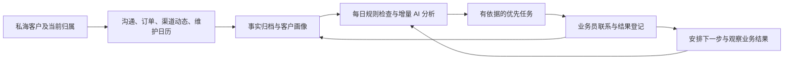

# 私海客户工作台：能力复盘与完整功能规划

版本：评审稿 v1.1 · 2026-09-24

依据：当前工作目录 `D:/MyProgram/commission-system`，分支 `main`，HEAD `401a2a42` 及当前可见文件。已核查代码与相关需求文档，未查询生产客户数据，未验证线上启用情况。文中“已有”指代码能力存在，不代表数据覆盖率或生产可用性已经验收。

历史状态：初稿因内置浏览器失败尚未发给 CWC。

当前状态：连接已恢复，CWC 已完整读取本稿并定向核查当前代码，返回 PLAN（见 review/cwc-plan.txt）。开发规格与原型已进入执行/验收；最终复核状态见 acceptance.md，不以规划完成代替验收完成。本稿与 development-spec.md 有冲突时，以后者及 api-contracts.md、schema-migrations.md 的细化契约为准。

## 1. 产品结论

建议在现有“客户经营”上升级，复用统一客户、档案版本、事实证据、机会和行动模型。核心产品是：**帮助业务员每天发现值得跟进的客户，带着准确上下文完成联系，并把结果沉淀为下一次经营依据。**

用户提出的六类能力必须组成闭环，而不是六个独立列表：

产品成功的标准是重要客户没有漏跟、客户问题得到响应、样品推进和复购机会被及时处理。不能用“生成多少 AI 内容”“发了多少提醒”代替经营效果。

### 1.1 本稿采用的规划假设

- 面向外贸业务员的私海客户，不混入国内业务的私海释放规则。
- 私海范围以方舟当前有效主负责人和协作关系为准；小满作为外部身份和业务数据来源，需要同步并核验归属。
- 默认首页是“我主负责的客户”；“我协作的客户”单独切换。公海获客继续保留独立入口。
- 订单管理在本期指订单查看、统计、分析及提醒；改单、下单、收款操作继续进入各自业务系统。
- 工作台提醒业务员，默认不替业务员自动向客户发送消息。现有邮件发送流程继续受原有权限、审批和发送状态约束。
- 站内待办是工作事实的唯一入口；钉钉可作为内部通知渠道。通知渠道是否已配置，应在实施时核验。
- 所有阈值、时间和容量是试点建议值，不是已确认公司制度；生产启用前通过历史回放和业务确认定版。

## 2. 当前能力复盘

| 能力 | 代码已具备 | 距离目标的缺口 | 处理建议 |
|---|---|---|---|
| 今日工作台 | 按行动执行人筛选我的待办/可见范围待办、今日到期、逾期、高优先级、完成统计、搜索分页、延后、忽略、登记结果并安排下一次行动 | 还不是每天覆盖全部私海的经营决策中心；缺少跨信号排序、客户维度概览和提醒预算 | 升级现有工作台与行动生成，不另建待办系统 |
| 统一客户档案 | 客户身份、联系人、外部账号、归属、事实、证据、档案版本、权限控制 | 客户详情主要是阅读；业务员缺少完整的字段补充、背调纠错、冲突处理流程 | 在现有事实和版本体系上增加编辑与确认入口 |
| 询盘与沟通 | 阿里询盘/消息投影，客户时间线，机会推进及证据选择 | 缺少完整的客户沟通中心、增量摘要、跨渠道需求与承诺归并 | 复用会话/消息模型，增加分析服务和业务界面 |
| WhatsApp | 独立账号、会话、消息、附件及同步；另有回复助手和会话记忆 | 统一客户投影注册中未见 WhatsApp 接入；会话缺少统一客户绑定闭环；助手记忆不是客户长期档案 | 先做会话绑定、同步与证据链，再做客户级分析 |
| AI 会话总结 | 有 `CustomerConversationAnalysis` 版本化表结构 | 当前业务代码未发现该表的完整生成、查询和落档闭环 | 补分析触发、证据校验、建议确认与档案更新 |
| 订单与采购画像 | 小满订单及明细投影；产品族、型号、颜色、长度、数量、单位等字段；有效订单额、订单数、首末单日期、平均间隔 | 当前页面主要显示商业摘要；缺少明细分析、颜色型号分布、可靠复购窗口及补货任务 | 扩展订单视图和确定性统计服务 |
| 私海背调 | 已有按主负责人批量生成完整背调任务的服务与脚本，会冻结订单/产品快照 | 不等于按官网/社媒订阅的持续监控；缺少前后变化、事件去重、业务重要性判断和通知闭环 | 复用背调任务，增加监控订阅与变化检测 |
| 日常维护提醒 | 行动模型、后续跟进、调度基础；独立物流模块有发出/签收事件 | 缺少客户日历、活动匹配、样品测试流程；物流尚需明确客户/订单绑定 | 统一生成 CustomerAction，补少量专用业务对象 |
| 邮件经营 | 客户详情已有邮件草稿与审核面板；后端有草稿、修订、审批及任务入口 | 不能把生成草稿或批准发送误记成客户已收到；需与维护任务关联 | 复用现有发送流程与结果证据 |

### 2.1 需要纠正的现状认知

1. 旧《客户经营功能使用说明书》写“资格审核只有 API”“雷达无筛选”等，已落后于现有代码；当前已有资格审核界面和今日工作台。
2. 雷达定义了“样单反馈、复购窗口、大客户维护”等分组名称，但实际机会转行动分支主要覆盖阿里询盘、公海资格开发、老客唤醒。**标签存在不代表对应触发器已实现。**
3. 目前订单画像的采购周期是有效订单日期间隔的平均值；产品分布主要按明细行数计数。它们不能直接当作稳定复购周期、销量占比或金额占比。
4. 现有日行动指纹包含日期，同一信号跨日可能再次产生行动。新工作台必须增加“同一未解决业务事件”的跨日去重。
5. WhatsApp 回复助手的记忆按用户/设备隔离，且有过期清理；不适合作为统一客户档案的唯一长期事实来源。
6. 私海批量完整背调已有服务与脚本，但生产同步完整度、客户数、字段完整率、执行端健康状态仍待数据验收。
7. 现有“社媒工作台”方案主要针对我方广告投放分析，与“监控客户官网/社媒变化”是不同产品范围，不能直接宣称可复用整套能力。

## 3. 信息架构与业务员每日路径

### 3.1 菜单组织

| 一级入口 | 主要用途 |
|---|---|
| 客户工作台 | 今日重点、全部私海概览、待处理建议、数据健康 |
| 我的客户 | 主负责/协作客户列表，分层、筛选、进入客户详情 |
| 跟进日历 | 今天/本周/未来的联系计划与客户重要日期 |
| 经营机会 | 延续现有机会生命周期与成交证据 |
| 获客与背调 | 保留获客、公海筛选、背调执行和材料审核 |
| 经营规则 | 主管/管理员维护规则、活动、频率和试运行报告 |

这是信息架构建议，不要求一次新增所有独立页面。第一版可把日历、建议确认和数据健康放在工作台页签，控制菜单数量。

### 3.2 工作台首页

第一屏回答四个问题：今天必须做什么、先跟谁、为何现在联系、有没有数据盲区。

- 顶部客户概览：我的私海客户数、活跃/沉睡/待开发客户、近期复购窗口、样品待反馈、重点风险客户。客户数必须去重，分层规则可查看。
- 今日行动区：立即处理、今日重点、可顺带完成、以后安排。每条行动说明原因、来源日期、截止时间、对象、建议渠道和建议话题。
- 客户卡片可聚合多个话题；“2 个任务涉及 1 个客户”明确显示。聚合仅影响展示，不吞掉订单或承诺级任务。
- 待确认区：画像修订建议、身份待绑定、异常数据、背调冲突。与外部联系任务分开，避免把整理资料当成经营成绩。
- 数据状态：本次扫描时间、应检/已检/失败客户数、各渠道同步截至、AI 待处理或预算不足数量。
- 所有数字可点击进入对应客户或任务集合；数据失败显示“未完成/数据过期”，不显示零。

### 3.3 客户详情工作区

客户固定信息：名称、主负责人/协作人、客户阶段、经营等级、联系限制、最近有效互动、最近订单、下一步。

六个业务页签：

1. 概览与待办：客户经营摘要、当前机会、下一次联系和近期变化。
2. 客户档案：公司、联系人、需求偏好、关系维护资料、背调与修订。
3. 沟通与询盘：跨渠道时间线、原文、摘要、需求与未兑现承诺。
4. 订单与复购：订单明细、趋势、产品结构、采购周期与提醒。
5. 官网与社媒：订阅渠道、变化事件、背调历史、采集状态。
6. 维护计划：生日节日、活动触达、样品反馈、手动计划及已完成记录。

默认从当前任务打开客户的对应页签，保留外层筛选和滚动位置；复杂工作支持进入完整客户页，避免所有操作挤在窄抽屉。深度链接每次重新校验权限。

### 3.4 一天的工作流程

早上打开首页 → 看今日重点 → 点击任务进入客户上下文 → 查看原始依据与建议话题 → 在既有渠道联系 → 回到任务登记结果 → 必要时安排下一次日期 → 系统根据回复/订单/签收继续调整计划。

“已联系”表示执行了沟通动作，不等于客户已回复、需求已解决或订单已成交。需要等待结果时，保留明确的下一次检查任务。

## 4. 能力 0：客户概览与每日智能任务

### 4.1 每日检查机制

建议每日北京时间 08:00 前完成一轮全量私海检查；消息到达、订单变化、签收、重要监控事件另走增量触发。时间可配置，失败可续跑，不依赖业务员打开页面。

检查顺序：

1. 冻结本轮范围与规则版本，按当前有效归属枚举客户；记录缺归属、身份争议和未编译档案的客户。
2. 检查数据水位。必须依赖某渠道的规则，只有该渠道足够新且覆盖完整时才作否定判断。
3. 用规则评估每个客户：新消息、承诺到期、报价等待、样品阶段、复购窗口、重要日期、监控变化、长时间缺少有效联系。
4. 复用最新有效 AI 摘要；有新消息、信息变化或摘要到期时才增量分析。无变化客户也留下“本轮已评估，无新行动”的记录。
5. 生成候选建议，经权限、联系限制、身份、重复、冷却期和数据质量检查，再形成正式行动。
6. 按优先级与业务员处理容量排序，首页展示并投递必要通知。

每日全量覆盖的是“评估”，不是每个客户每天一次完整背调或重复读取全部聊天。这样同时满足每日检查与成本可控。

### 4.2 任务规则首批清单

以下时间均为可调试点值；工作时间 SLA 与自然日等待分开计算。

| 触发 | 生成的行动 | 初始级别 | 抑制/关闭条件 |
|---|---|---|---|
| 客户新询盘/新消息等待人工响应，超过约定工作时 SLA | 回复客户的具体问题 | P0/P1，按 SLA 与明确期限 | 有对应有效回复；生成草稿不算回复 |
| 我方承诺的报价、交期确认、材料发送临近或超过期限 | 履行承诺 | P0/P1 | 有履约证据或双方改约；AI 推断日期先确认 |
| 报价已真实发出，3 个工作日无已归档反馈 | 询问报价反馈与阻碍 | P1/P2 | 客户回复、明确等待日期、报价失效或已成交 |
| 样品签收且到约定测试日 | 收集具体测试反馈 | P1 | 反馈已归档、未开始测试并重约、问题转售后 |
| 接近可靠采购周期的预期下单日 | 核实补货计划和产品组合 | P1/P2 | 已有覆盖本轮需求的订单、明确库存充足或暂停采购 |
| 重点客户超过维护间隔，无有效互动 | 关系维护 | P2 | 新互动、客户指定联系日、营销联系限制 |
| 长期低互动且采购显著放缓 | 复核流失风险并制定唤醒动作 | P1/P2 | 数据不完整则转数据核验；不能直接认定流失 |
| 官网/社媒出现已证实的业务变化 | 围绕变化联系或内部核实 | P1/P2 | 已处理同一事件、证据过期、来源身份不确定 |
| 新品/优惠与客户需求匹配 | 推荐特定产品/活动 | P2 | 无适用政策、已触达、客户拒绝、投诉未解决 |
| 已确认生日/适用节日临近 | 关系问候或采购准备 | P2/P3 | 不适用、重复、联系人离职、未确认日期 |

### 4.3 优先级与工作量控制

- P0 必须及时处理：已超时的客户问题、今天必须兑现的承诺、明确的严重交付问题。只有可核验的硬事件才能触发；不由模型自由判高。
- P1 今日重点：复购窗口、重要商机、到期样品反馈、可行动的重要客户变化。
- P2 计划维护：常规联系、合适的新品/优惠、非紧急机会。
- P3 信息与补资料：低置信度线索、普通动态、没有明确行动价值的建议。

建议显示映射：P0→`urgent`、P1→`high`、P2→`normal`、P3→`low`，延续既有存储枚举。机会 A/B/C/D、客户经营等级和任务优先级是三件事，不混用。

同级内按截止时间、客户明确需求、机会价值、证据可靠性、等待时间排序；AI 提供原因和沟通策略，不独立决定金额、订单有效性、客户归属或硬截止时间。

首页建议先展示约 15 条计划性重点行动，允许业务员调整容量。P0 及硬到期任务不被容量截掉；超出容量的任务进入“需重新安排”，主管看到积压，不能悄悄延期。长期靠后的客户通过等待时间权重避免一直被忽略。

### 4.4 任务去重、状态与结果

- 以“逻辑客户 + 业务对象/事件 + 规则族 + 事件周期”识别同一工作，不以扫描日期制造新任务。规则升级重新评估未完成项，不批量复制旧任务。
- 同一问题未解决只更新原行动的证据与截止风险；已完成后只有新回复、新订单周期或新的明确业务事件才开新行动。
- 客户一天可以有多个独立事件；界面合并联系话题，不能用“每客户每天一条”吞掉新投诉或新承诺。
- 复用 `pending/snoozed/done/dismissed/cancelled`。延后保留原业务截止日用于衡量逾期，另存提醒日期；到期恢复可操作。
- 完成必须有结果摘要；系统可确认的消息或订单直接关联证据，电话/线下使用人工记录。后续安排与原行动完成保持事务一致、重复提交幂等。
- “客户暂无需求”“客户要求下月联系”“已在其他渠道完成”“建议不准”分别登记，反馈影响后续冷却与规则改进。
- 条件失效、订单撤销、源消息更正时重新评估，保留原推荐和取消原因。AI 服务失败仍能生成确定性规则任务，标记缺少 AI 建议。

## 5. 能力 1：可维护、可纠错的客户档案

### 5.1 档案结构

| 层级 | 内容 |
|---|---|
| 公司事实 | 公司/品牌名称、国家地区、官网、社媒、客户类型、规模、门店/渠道、身份核验 |
| 联系人 | 姓名、职务、决策角色、所属公司、语言、时区、联系方式、有效状态 |
| 商业关系 | 主负责人/协作人、合作阶段、经营等级、最近互动、订单概况 |
| 采购需求 | 产品族、型号、颜色、长度、规格、采购量范围、预算、质量标准、交付要求 |
| 沟通偏好 | 常用渠道、适合联系时段、关注点、已确认禁忌或限制 |
| 关系维护 | 经确认的生日月日、重要纪念日、适用节日、客户要求的联系日期 |
| 经营判断 | 潜力、主要异议、供应商切换意向、机会与风险；明确标识推断与置信度 |

每个关键字段保留来源、观察日期、确认人、有效期、证据与版本。“客户口头说的”“订单观察到的”“AI 推测的”“人工核验的”分别标识。

### 5.2 手动编辑与背调纠错

普通业务补充：有写权限的当前客户团队成员可新增/修改普通档案字段，写成新的事实或批注并生成新档案版本，不要求每次管理员审批。

背调修订流程：打开背调结论 → 选择具体错误字段/段落 → 修改并填写依据 → 预览将影响的档案字段 → 保存修订 → 生成新版本 → 重新评估相关未完成任务。

- 保留原始背调、引用和原值，不能直接改掉原始报告以伪装成来源内容。
- 新 AI 结果与人工确认冲突时，进入“待核对”，不覆盖已确认值；人工确认也需要适用时间，不能永久压住后续真实变化。
- 区分“历史判断错误”与“客户现在发生变化”：前者纠错，后者保留前后有效期。
- 联系人离职/联系方式失效应停用并停止对应提醒，保留历史沟通关系。
- 客户合并/拆分、主负责人变化、DNC 解除、重要风险确认继续复用既有治理流程；普通偏好编辑不能获得这些权限。
- 小满等外部系统管理的交易和身份字段展示来源；本地纠错不宣称已回写小满，必要时创建源系统修正事项。
- 并发编辑按版本检测冲突，展示差异后再保存，不做后保存者静默覆盖。

### 5.3 AI 画像建议确认

建议卡展示：当前值、建议值、为什么、对应消息/背调证据、适用范围与时间。支持采纳、编辑后采纳、驳回、稍后；批量操作仅对无冲突的低风险字段开放。

聊天中的一次试探报价不能固化成永久预算；一次购买颜色不能自动升级为长期颜色偏好。业务员个人备注不自动成为团队共享画像。

## 6. 能力 2：询盘、WhatsApp 与 AI 沟通总结

### 6.1 先解决“这些消息属于谁”

- 以来源系统、我方账号、稳定会话 ID 和消息 ID 去重；统一绑定逻辑客户与具体联系人。
- 已核验外部身份或唯一联系方式可按受控规则关联；同名公司、昵称、相似头像不能自动归并。
- 一个手机号涉及多人、多公司、群聊或冲突时进入待绑定队列，由业务员核验。群聊必须明确参与者和适用客户，不能默认整群挂到某一家公司。
- 显示历史覆盖范围、最近同步、未解析附件和缺失片段。来源离线时，“未收到回复”只能表述为“截至已同步记录未见回复”。
- 账号授权、客户数据权限和消息来源权限取交集，不能因为接手客户而读取原业务员整个 WhatsApp 账号。

### 6.2 沟通中心

按客户统一展示阿里询盘、WhatsApp、邮件以及人工电话/会议记录；支持按联系人、渠道、日期、商机筛选、搜索与原文跳转。

保留原文与译文，摘要不替代原消息。附件按能力展示；未读取语音/图片时明确标注，不让 AI 对未见内容作判断。人工补记与系统同步使用不同来源标签。

第一阶段不重做多渠道收发客户端；先实现归档、摘要、任务关联和打开已有沟通工具。发送状态必须来自已有渠道或明确人工登记。

### 6.3 AI 摘要的固定产物

| 产物 | 必备内容 |
|---|---|
| 本次沟通摘要 | 讨论了什么、达成什么、还有什么没解决 |
| 当前需求 | 产品、型号/颜色/规格、量级、交期、预算；每项有原消息引用 |
| 采购阶段与障碍 | 询价/选型/样品/测试/谈判等建议阶段，主要异议、待澄清问题 |
| 双方承诺 | 谁承诺什么、明确期限、是否已履约；模糊期限先确认 |
| 下一步建议 | 具体动作、推荐时间、建议对象与渠道 |
| 档案更新建议 | 候选事实/偏好，以及与现有档案的差异 |

短期需求以询盘/商机为范围，长期画像以客户/联系人为范围，不把两者混成一段不断增长的总结。

### 6.4 增量分析与人工控制

建议会话暂歇 15–30 分钟后做增量分析，日终/晨间补偿漏处理；紧急客户消息先由规则提醒，不等待总结完成。业务员可手动“总结这段沟通”。

分析使用已确认的前一版摘要与新增消息，保留覆盖水位、证据消息、规则/模型版本。晚到消息、消息更正、绑定修订应触发受影响范围重算；不盲目追加到旧结论。

AI 不能自动把机会推进到成交、替客户承诺、写入未经核验价格交期。可确定的业务事件直接走规则；不确定画像和承诺日期进入建议确认。

## 7. 能力 3：订单经营分析与补货提醒

### 7.1 订单管理视图

- 订单列表：业务日期、订单号、样品/大货/混合/未知、状态、金额币种、产品、数量、负责业务员、物流、关联商机。
- 订单详情：型号、颜色、长度、数量单位、单价/行金额、履约信息，跳转已有订单/发货模块。
- 指标：有效订单数与金额、客单价、近 30/90/365 天成交、首单/末单、复购次数、距离末单天数、同比/环比（有足够完整区间才展示）。
- 结构分析：产品族→型号→颜色→长度；支持金额占比、统一单位数量占比、订单覆盖率切换，明确各自分母。
- 样品转化：寄出→签收→开始测试→反馈→商业订单，显示卡在哪一步与下一责任人。

### 7.2 统计口径必须先固定

1. 有效经营订单沿用现有确定性口径；取消、无效、测试订单不计入。样品与商业大货分别统计，混合订单按明细分类。
2. 金额保留原币和已有标准美元值；缺失/不可信汇率显示覆盖缺口，不将缺失金额当零，不直接把多币种行金额相加。
3. 订单金额不等于净收入。退款/退货没有接入之前，页面明确不提供净销售结论；接入后单列并追溯原单。
4. 产品分布保留“未识别”，展示型号/颜色/数量/金额字段覆盖率；不能把有记录的少量明细假装成全部采购结构。
5. pcs、kg、bundles 不直接累加。标准化映射由现有产品/颜色字典或人工核验维护，保留原始值。
6. 历史订单业绩归属保持订单当时的业务员快照；当前客户经营权限按当前归属，两套口径分开。
7. 库存、毛利、回款、客户零售销量没有可信来源时，不推测、不伪造图表。

### 7.3 复购周期与提醒算法

第一版使用可解释的统计规则，不让语言模型计算采购周期。

- 优先计算客户×产品族的商业采购间隔；样品、取消单、明显一次性项目不纳入自动周期。
- 相同采购业务的拆单按采购批次去重；暂缺采购批次字段时，同日订单作为保守合并窗口并标记口径，异常间隔供人工核验，不任意删掉。
- 本版采用保守阈值：至少 4 次可用商业采购、3 个有效间隔才展示周期观察；不足时仅显示样本与待核验提示。达到阈值仍结合波动、近期一致性和覆盖率分层，不自动标高置信度。
- 使用近期间隔中位数，展示样本数和范围；高度不规律、季节性明显、数据不足时显示“暂不能可靠预测”，改用业务员确认计划。
- 预计下单日 = 最近一次可比采购日期 + 典型采购间隔；提醒日 = 预计下单日 − 业务跟进提前量（试点可设 7 天）。这个公式预测下单时间，不重复扣除物流/生产周期。
- 如未来有可信库存和消耗速度，则另外计算预计缺货日，再减供应周期和缓冲得到补货下单日；明确区分两种模型。
- 提醒文案为“可能进入补货沟通窗口”，不是“客户库存即将耗尽”。没有库存数据不能断言缺货。
- 同产品族有新订单、正在处理覆盖本周期的采购、明确暂不采购时抑制重复营销；延迟交付、投诉未解决时改为服务跟进。
- 客户明确确认了下次采购日期时，以该日期为本轮计划依据，保留统计参考并设置有效期。

示例（合成数据）：客户某产品族有效采购间隔为 28、32、30 天，中位数 30 天。末次采购为 9 月 1 日，预计下单日约 10 月 1 日，提前 7 天则 9 月 24 日生成核实补货计划任务。若同日已同步到新采购，则取消旧窗口任务并等待下一轮。

## 8. 能力 4：客户官网与社媒监控

### 8.1 监控对象与频率

每个客户维护已核验的官网、新闻页、产品页、门店页及社媒账号；标注官网/社媒、所属品牌、来源状态、监控主题、频率、最近成功采集和负责人。

建议试点：重点客户关键渠道每周、普通和低活跃客户每月；活动期间在预算内临时加密。频率取决于可用数据源和预算，不承诺所有平台都能自动抓取。登录受限/不可访问渠道进入“需补来源”，不能记作“无变化”。

### 8.2 从内容变化到经营事件

采集新内容 → 去除页面模板/重复帖子 → 与上次成功快照比较 → 识别事件 → 核对客户身份、发布时间和引用 → 判断业务价值 → 生成事实候选与行动。

| 事件 | 对业务员的意义 | 处理 |
|---|---|---|
| 开新店、拓展新市场、招聘采购/培训人员 | 潜在需求变化 | 核实并准备产品/样品建议 |
| 上新某产品族、增加颜色或新服务 | 产品适配机会 | 结合历史订单推荐相关产品 |
| 公开求供应商、采购计划、明确测试需求 | 直接机会 | 尽快跟进并带原始证据 |
| 关键联系人变更、官网迁移 | 联系方式可能失效 | 核验后更新档案与联系人状态 |
| 暂停经营、公开重大服务问题 | 关系或交付风险 | 内部复核；不把未经证实信息定成事实 |
| 日常宣传、重复活动、旧文重发 | 通常低行动价值 | 留时间线或周摘要，不逐条推送 |

首轮采集是建立基线，不将历史全部帖子当作新事件。每条事件保留首次发现、来源发布时间、抓取时间、前后差异、引用和置信度。

同一开店消息在官网、Instagram、Facebook 同时出现，只形成一个经营事件，挂多个来源证据；实质更新可升级原事件。

### 8.3 自动更新与提醒边界

- 确定性采集元数据、新的来源快照可自动保存；低风险无冲突观察事实可进入事实层。
- 官网归属、决策人、联系方式、重要风险和与人工确认冲突的字段，需要核验后进入有效档案。
- AI 的事件总结可立即显示，但必须标识“待确认”；不能把候选结论当成客户确认事实。
- 重大且有行动价值的变化推送业务员；普通动态进入每日/每周摘要。再次扫描相同内容不再次提醒。
- 周期性完整背调只在到期、重大变化、信息缺口或业务员主动请求时执行，复用既有私海背调任务和审核流程。
- 外部网页和帖子只作为数据；其中的指令不能控制系统、改规则或触发外发。失效引用、低质量来源和采集失败均可见。

## 9. 能力 5：日常联系与维护计划

### 9.1 四类维护计划

| 类别 | 功能设计 | 触发与结束 |
|---|---|---|
| 新品与优惠 | 维护正式活动、适用产品/国家/客户范围、有效期、可用物料和已批准政策；按画像与订单匹配推荐理由 | 活动上线生成候选；已联系、活动结束、不适用或客户拒绝后停止 |
| 节日、生日、纪念日 | 公司经营地区节日日历 + 联系人已确认日期；可预览祝福/业务备货两类计划 | 按具体年度日期生成；变更、离职、抑制规则生效后取消 |
| 发货与服务 | 实际发出、物流异常、签收确认、交付后回访 | 由已绑定订单/客户的可靠物流事件触发；同一状态不重复生成 |
| 样品测试 | 测试对象、产品/批次、签收日、计划开始/结束日、反馈维度、结果及下一步 | 签收后询问测试计划；按确认计划收反馈，结论后转报价/复测/售后 |

### 9.2 关键业务细节

- 业务员可新增任意手动维护计划：对象、动作、日期、渠道、重复方式；无需先造一个商机。
- 国家不能直接推断宗教、个人节日或偏好。节日日历需确认客户适用性，浮动日期按年份维护，不靠模型记忆生成。
- 生日默认只收集确有业务用途且客户提供的月日；客户未知日期不猜测。2 月 29 日等日期由规则指定非闰年处理方式。
- 主站存储和主显示继续统一北京时间；联系建议可附客户当地时间与时区标识。客户时区未知不根据国家强猜；夏令时由时区规则换算。
- 到货不等于已开始测试。样品提醒支持“未开始测试/测试中/需重测/待补样/结果已收”，客户确认的日期优先于固定第 7 天模板。
- 样品测试维度按产品配置，例如颜色匹配、手感、安装、掉发、洗护后表现；只推荐适用问题，不一次要求客户填完整问卷。
- 一张订单可能分批发货，一个包裹可能涉及多单。必须建立明确多对多关联或行级覆盖，不能按收件公司名称模糊自动绑定后触发提醒。
- 物流异常存在时，优先解决交付问题，暂停不合时宜的促销；恢复营销需要问题状态和冷却条件满足。
- 已有联系限制支持 global、channel、product、market 等作用域，必须复用；仅营销、临时勿扰等目的/期限语义仍需设计和迁移后启用。全局禁止不得被新规则绕过。

### 9.3 通知策略

站内任务是唯一可执行记录；钉钉消息只是入口，点击返回当前有效任务。读取通知、生成文案、复制文案都不算完成。

- P0 可及时通知；P1 聚合到晨间及约定的到期提醒；P2/P3 以工作台和摘要为主。
- 同一客户多个兼容话题合并提醒，投诉/履约和促销分别处理。
- 提醒设置业务员免打扰时间、重复通知间隔和升级条件；升级给主管只对事先配置的硬 SLA 或持续积压启用。
- 推送时再次校验当前负责人、客户可见性与任务状态；转移客户后撤销旧待发通知，历史推送链接也重新鉴权。
- 通知失败有重试与投递记录，业务任务不因通知失败丢失；消息内容最小化，不在群通知暴露客户聊天全文。

## 10. 共用规则、数据与权限设计

### 10.1 规则管理

规则包含适用范围、触发事件、条件、例外、优先级、期限、冷却期、通知、版本和启停状态。公司规则为基线，业务员可配置个人维护偏好，但不能放宽联系限制和跨客户权限。

上线流程：历史回放/预览命中 → 展示预计任务量与样例依据 → 试运行仅记录建议 → 主管确认规则 → 小范围启用 → 观察质量后扩大。业务员对规则建议的拒绝原因要进入复盘。

活动政策、消息摘要和用户反馈不能让模型直接改全公司规则。AI 可提出调整建议，发布仍需有权限的人员操作。

### 10.2 数据对象与实施落点

| 需求 | 复用对象 | 必要补充 |
|---|---|---|
| 客户与权限 | CustomerAccount / Assignment / ExternalIdentity / Contact / ContactPoint | 客户字段编辑、联系人关系、细分写权限；继续按逻辑客户解析 |
| 事实与档案 | SourceRecord / Fact / Annotation / FactConflict / ProfileVersion | 字段修订和 AI 建议审核状态、冲突界面、确认有效期 |
| 任务执行 | CustomerAction / CustomerEvent / 现有 followup_service | 跨日业务事件去重、原截止日保留、生命周期复评、规则评估记录 |
| 沟通分析 | Conversation / Message / ConversationAnalysis | WhatsApp 绑定与投影、消息覆盖水位、增量分析服务、分析查询接口 |
| 订单分析 | CustomerOrder / CustomerOrderItem / 当前订单口径 | 产品标准映射、分析查询、采购批次口径、周期置信度与覆盖率 |
| 官网社媒 | CustomerResearchTask / SourceRecord / Fact / Event | 监控订阅、采集快照、变化事件聚合及失败恢复 |
| 维护计划 | CustomerAction / 既有时间线 | 客户日历事件、活动定义、样品测试事项、物流关联 |
| 通知与运营 | 现有调度/通知基础设施 | 持久投递记录、重试、摘要、扫描批次统计；先查可复用组件再决定建表 |

不再建立另一套客户主档、订单账本、通用待办或 AI 画像存储。真正缺少的监控订阅、维护计划等对象按职责扩展；是否新增表由详细设计决定，不将所有内容塞进一个无约束 JSON。

后端主要在 `app/customer/` 扩展，背调在 `app/sales_automation/`；WhatsApp、物流、邮件、通知保留原领域职责，通过明确的来源事件和查询契约连接。AI 调用统一走项目 AI facade。

### 10.3 安全与准确性边界

- 所有列表、汇总、导出、摘要、后台任务和推送都使用相同数据范围；摘要不能绕过原始消息权限。
- AI 上下文只包含当前任务所需客户数据，继承最高数据分级；个人私有备注不得混入团队画像或公共推送。
- 转移客户、合并/拆分、联系人重绑时，重新校验未完成任务和证据归属。历史证据不直接改写，使用既有逻辑客户归属机制。
- 业务员调岗/停用进入重新分配队列，不把离职账号的任务继续投递；跨团队无法完整迁移的证据显示受限状态。
- 外部数据只投影到方舟；不从客户工作台直接写业务镜像或自行执行生产迁移。
- 后台扫描分批、可恢复、幂等；写事实、编译档案、生成任务和发送通知使用明确事务/持久事件边界，防止保存成功却没有后续动作。
- 消息与附件设置明确保留、删除和更正政策；源内容被删除或失去权限时，衍生摘要和 AI 记忆需要同步失效或重算。
- 每条建议能追溯输入水位、规则版本、证据、模型与处理结果。不是用一句“AI 建议”解释全部。

### 10.4 成本与运营可见性

每日展示：私海总数、评估完成数、跳过及原因、数据不全数、AI 增量分析数、创建/更新/抑制任务数、执行耗时、AI 用量与失败率。

AI预算按任务优先级分配：客户新问题和到期承诺优先，普通动态摘要后置；预算耗尽明确显示未分析数量，不能把“没分析”当“没问题”。定量预算在实际客户量、消息量和模型配置摸底后估算，不在本稿虚构金额。

## 11. 分期交付与验收

先验证数据可用性，再分阶段开放业务能力。阶段不是固定工期；当前未做生产数据覆盖率核验，不给伪精确开发天数。

| 阶段 | 交付范围 | 业务员获得什么 | 放行条件 |
|---|---|---|---|
| A：数据基线与规则回放 | 私海名单/归属核验，订单/询盘字段覆盖率，WhatsApp 接入方式与客户绑定，物流关联可行性，任务规则试运行 | 确认系统能看见哪些客户与事实 | 来源水位可见；歧义不自动归并；试运行任务可解释 |
| B：私海经营最小闭环 | 升级今日工作台、全量日评估、普通档案编辑与背调纠错、沟通归档/摘要、客户问题/承诺/手动计划任务、订单基本明细 | 每天知道该联系谁，带着上下文完成跟进并安排下一次 | 一次真实授权试点完成“信号→任务→联系→结果→档案/后续”，无重复/越权 |
| C：订单与样品驱动经营 | 订单结构分析、可解释复购窗口、物流绑定、样品测试流程、节日生日计划 | 及时推进样品，减少错过复购和交付反馈 | 样品与商业单分离；周期数据不足会降级；新单和反馈能关闭旧提醒 |
| D：持续监控与精细运营 | 官网/社媒订阅、增量变化背调、重要事件推送、新品优惠匹配、主管经营质量视图 | 有新变化时找到合适联系理由 | 首次基线不刷屏；跨站事件去重；失效渠道可见；活动不重复骚扰 |

首期要给六个业务方向保留一致入口和扩展契约，但不把未接通能力伪装为可用。监控未启用时显示可配置的来源与状态，不放假统计。

### 11.1 端到端验收场景

| 场景 | 预期证据 |
|---|---|
| 新询盘进入私海 | 绑定正确客户，生成带消息证据的响应任务；重复同步不重复建任务 |
| 同一客户跨日仍未回复 | 原任务继续计龄，不每天新增同内容任务 |
| 已生成回复草稿但未发送 | 待回复任务不完成，最近有效联系时间不变化 |
| 完成联系并安排下周跟进 | 原行动、活动记录和后续行动一致保存；重复点击不再建一次 |
| 延后已经逾期的承诺 | 提醒暂缓，但原承诺违约仍可见，不能靠延后美化指标 |
| 修改背调中的错误偏好 | 原文保留，人工修订Annotation/档案版本可追溯；下次 AI 不覆盖已确认修订 |
| WhatsApp 同名客户或群聊 | 不错误串档；仅进入待绑定，未核验前不跨客户分析 |
| 消息同步断开 | 显示数据缺口，不新增“长期无回复”或“流失”确定结论 |
| 只有样品单或两次零散采购 | 不生成高置信度复购周期；建议人工安排计划 |
| 多币种、不同数量单位、未知颜色 | 统计口径和未知占比正确，无直接混加 |
| 同客户多个型号不同采购周期 | 各产品族独立窗口，不用大额单掩盖另一产品的复购需要 |
| 新订单已经覆盖复购窗口 | 旧补货行动取消/标记已满足，保留原因 |
| 样品签收但客户尚未测试 | 提醒确认测试计划，不自动记为样品反馈已完成 |
| 同一开店信息出现在三个渠道 | 一条事件、多条证据、一次经营提醒 |
| 首次导入社媒历史 | 建立基线，旧内容不当作今日新闻群发 |
| 客户转移、合并、账号停用 | 原负责人不可继续操作/查看受限证据，新任务归属正确，待发通知重校验 |
| 全局/渠道联系限制生效 | 相应触达任务被阻止；内部数据核验可保留；既有全局禁止不被绕过 |
| AI超时、预算不足、调度重启 | 硬规则提醒不丢；失败可见；补偿运行无重复 |
| 北京时间零点、海外联系时区 | 日统计与截止正确，客户当地时间辅助提示不会改变主站时区约定 |

### 11.2 衡量是否有效

- 应检私海客户覆盖率：成功完成规则评估客户数 / 本轮应检客户数；与 AI 处理完成率分开报告。
- 重要任务及时处理率：在原业务期限前完成的 P0/P1 任务 / 到期 P0/P1 任务，取消和延后分别列示。
- 建议有效率：有用反馈占比，配合重复、无依据、客户错误等原因分布；不能只看点击率。
- 重点客户维护覆盖：约定周期内有有效双向互动或已兑现维护动作的客户占比，不用 AI 背调次数冒充联系。
- 样品反馈闭环率、报价到下一阶段比例、进入窗口客户的复购率、经营流失风险被核验比例。
- 业务员准备一次有效联系所需时间、补资料负担、每日积压和过量提醒投诉。
- 试点前收集基线，按相似客户阶段/价值/周期比较试点与非试点；“跟进后成交”只说明时间关联，不能直接宣称是 AI 带来的增量。

建议先由小范围业务员使用完整闭环，覆盖老客、样品客、刚分配客户和数据不足客户；观察至少一个有意义的采购周期再评价复购成效。阈值和目标值基于基线确定。

## 12. 本轮反向审查结论

初稿做了单代理边界自查；当前已纳入 CWC 规划核查与独立 agent 的原型状态审查，最终验收记录见 acceptance.md。已在设计中处理以下高风险误区：

| 容易出错的设计 | 本稿修正 |
|---|---|
| 每天给每客户重新做全量 AI 背调 | 全量规则评估 + 有变化的增量 AI + 按频率完整背调 |
| 有表/有分组名就当成功能完成 | 区分表结构、服务、界面、触发器、线上数据验收 |
| 一天一个客户只允许一条任务 | 业务事件各自存在，界面合并联系话题 |
| 延后任务让逾期消失 | 原业务截止与提醒日期分离 |
| AI 摘要自动覆盖客户事实 | 证据引用、候选建议、人工修订和冲突管理 |
| 采购间隔直接等于客户耗尽库存时间 | 下单窗口与库存预测分开；仅做有依据的补货沟通 |
| 将订单明细行数作为销量/金额占比 | 显示明确分母，单位/币种/未知值独立处理 |
| 模型看过信息即表示全系统有该信息 | 以持久、可授权、可追溯的证据与水位为准 |
| 用户看通知/复制文案即任务完成 | 完成要求实际动作和结果证据 |
| 客户归属转移仅改首页列表 | 任务、源消息权限、后台 AI、通知、深度链接同时重校验 |

## 13. 代码依据与后续核验清单

以下路径均为本轮实际检查位置，便于开发时复核；函数名是定位入口，不代表代码不可变化。

| 依据 | 本轮结论 |
|---|---|
| `frontend/src/config/navigation.js`，客户经营分组 | 当前已有今日工作台、客户档案、获客、背调、机会入口 |
| `frontend/src/views/customer_hub/WorkbenchList.vue` | 待办统计、范围、筛选、行动处理已存在 |
| `backend/app/customer/workbench_service.py:list_workbench` | SQL 范围统计、到期/延后语义、当前归属过滤 |
| `frontend/src/views/customer_hub/CustomerDetailDrawer.vue` | 客户详情有工作台与邮件页签；订单目前主要为商业摘要 |
| `backend/app/customer/router.py` | 工作台、证据、机会/行动、资格队列和决定接口 |
| `backend/app/customer/followup_service.py`、`workflow_service.py:complete_action` | 后续计划与完成闭环可以复用 |
| `backend/app/customer/workflow_service.py:create_action` | 当前行动指纹包含 `action_date`，须补跨日事件去重 |
| `backend/app/insight/customer_radar_service.py` | 现有行动生成的有限机会类型及懒触发路径 |
| `backend/app/customer/models.py` | 客户、会话、消息、分析、订单、明细、事实、行动等核心结构 |
| `backend/app/customer/projection_service.py:_RESOURCE_PROJECTORS` | 当前登记阿里询盘和小满客户/联系人/订单，未见 WhatsApp |
| `backend/app/customer/projection_okki_order.py` | 订单/产品字段投影与幂等，不代表线上字段齐全 |
| `backend/app/customer/profile_service.py:_build_profile` | 当前平均采购间隔、按明细行数的产品族分布及事实优先级 |
| `backend/app/whatsapp/models.py`、`service.py` | 独立 WhatsApp 账号/会话/消息同步投影 |
| `backend/app/whatsapp_translation/reply_memory.py` | 回复助手会话记忆带用户/设备归属和过期机制 |
| `backend/app/sales_automation/private_research_service.py` | 按私海主负责人创建背调，含订单快照 |
| `backend/scripts/private_customer_research.py` | 私海背调脚本入口 |
| `backend/app/sales_automation/scheduler.py`、`app/schedulers/registry.py` | 现有公海背调/WhatsApp 等调度，不等于私海日评估调度 |
| `backend/app/tracking/models.py` | 物流有发出/签收事实，仍需客户与订单的明确关联 |
| `backend/app/customer/access_service.py`、`logical_customer_service.py` | 复用实时权限与逻辑客户边界 |
| `backend/app/mail_outreach/router.py` | 邮件草稿、修订、审批及投递任务接口 |
| `docs/requirements/2026-09-05-customer-operations-phase1.md` | 工作台第一期及其历史验收记录；本轮没有重跑那些历史测试 |

实施前仍需核验的业务决策：WhatsApp 以哪条已授权链路持续归档；私海与小满归属冲突的权威处理；有效订单/退货及采购批次规则；物流与订单绑定来源；业务员联系 SLA 与每日容量；内部通知渠道；节日及活动规则维护人。此类参数应通过数据基线与试点确定，不阻碍评审本稿的完整功能边界。

本次交付为功能规划、开发规格和本地合成交互原型，没有修改生产业务代码、创建生产任务、发送客户消息或执行部署。CWC 规划已完成，最终复核进度见 acceptance.md。

### 13.1 CWC 补充核查

- 当前 workbench 的 scope=mine/visible 是行动执行范围，不是主负责/协作客户。开发规格单独设计 customer_scope。
- 当前 data_as_of 是查询时刻；新 UI 必须使用来源真实同步水位。
- 当前行动创建需要档案版本；无档案新客户先编译最小可信档案，失败显式进入待核验队列。
- 现有复购 Agent 按当天 pending 行动取数，跨日事件去重需同步调整消费链，避免旧事件漏分析。
- 普通字段新修订入口与 customer:admin 治理提案分开，不能为业务员扩大高风险治理权限。

开发契约修订：普通偏好修订复用Annotation v2人工投影，私人备注复用既有Annotation；事项与多轮行动分层去重。精确事实键、结果枚举、版本字段及维护payload以development-spec/api-contracts/schema-migrations为准，不把产品概念直接当现有数据库字段。
