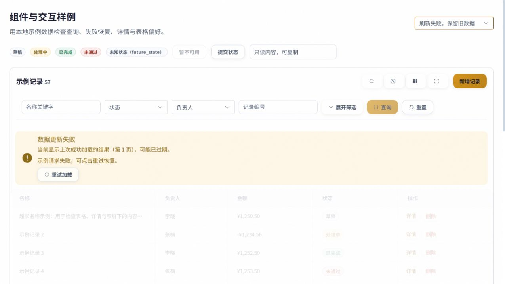
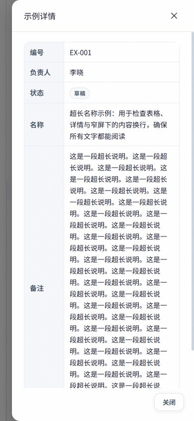

# 组件样例浏览器验收

日期：2026-10-02。实际 Vite 页面：`http://127.0.0.1:3199/tests/fixtures/ui-convergence/`，挂载主站 `ComponentShowcase.vue` 与真实共享组件；数据为本地夹具，无生产写入。验收结果只覆盖该样例的交互与几何，不能替代所有业务页面实机验收。

| 场景 | 实际结果 |
| --- | --- |
| 桌面1280×720 | 草稿输入保持57行，Enter提交后11行，重置恢复57；查询过程中按钮禁用，刷新aria-busy为true |
| 首次读取失败 | 显示错误与“重试加载”；实际点击重试后恢复数据，不显示成功空态 |
| 刷新失败 | 保留20行与最后成功页1，提示数据过期，重试恢复 |
| 成功空结果 | 显示清除筛选恢复入口，与失败状态不同 |
| 列与密度 | 实际点击标签隐藏名称列；刷新后隐藏状态保留；恢复默认后重新显示；compact密度类生效并可恢复 |
| 全屏与Escape | 使用视口铺满卡片；边界准确为0..1280/0..720，无2px溢出；Escape退出，保留业务overlay层 |
| 减少动态 | Emulation减少动态后按钮transition为0.00001秒；关闭动效偏好后恢复 |
| 390×844长详情 | 抽屉366px，5项描述为单列，document scrollWidth=390，无横向溢出 |
| 390×844短表单 | 弹窗366px，输入具有标签；Enter提交夹具记录成功，记录数58并关闭弹窗 |
| 控制台 | 本轮无warn/error；测试后恢复原视口、动效偏好并重载夹具 |

浏览器暴露并修复两项真实问题：Element Plus保留的隐藏`.el-overlay`曾使Escape误认为弹窗打开；现在只判断有可见几何且visibility非hidden的overlay，并有可见/隐藏回归。全屏边框曾额外增加2px；现使用border-box，并实际重新测量。

## 截图

可复现入口：`frontend/tests/fixtures/ui-convergence/README.md`。屏幕操作使用本地测试页，列偏好只影响该测试页面键。
